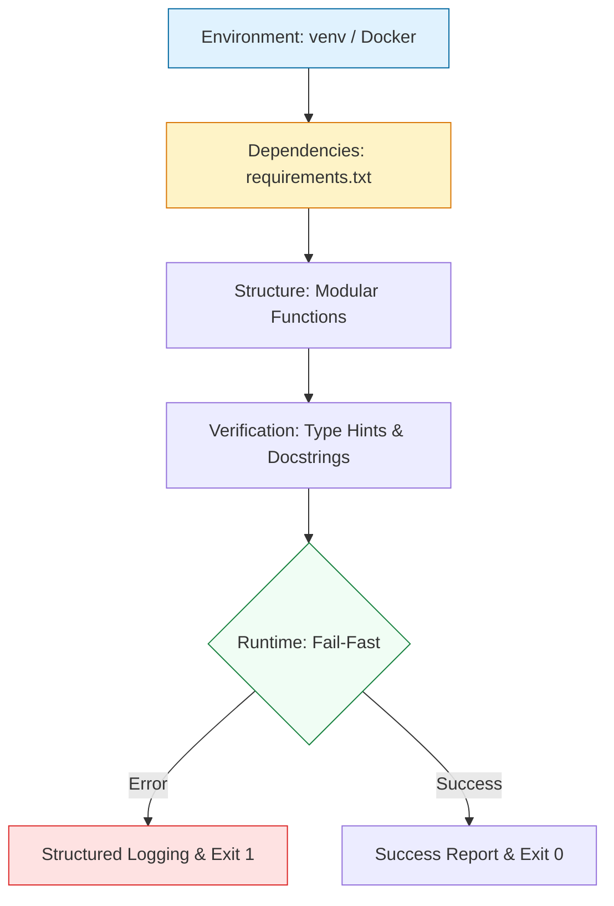

# 🛠️ Python Environment & DevOps Foundations

> **"A production-ready environment is the first line of defense against infrastructure drift. If you can't reproduce your logic's environment, you haven't automated anything."**

Welcome to the foundation of **Python for DevOps**. Before writing a single line of Boto3 or Requests logic, we must master the **Engineering Environment**. This module covers the standards of isolation, package management, and robust coding principles that separate "scripts" from "tools."

**Why This Matters for Junior DevOps Engineers:**
- 🚨 **Production Impact**: 90% of "it works on my machine" problems stem from environment mismanagement
- 💰 **Cost Factor**: One broken dependency can bring down entire deployments
- 🎯 **Interview Weight**: Environment setup questions are standard in DevOps interviews
- 🔧 **Daily Operations**: You'll create and manage Python environments dozens of times per week

---

## 📚 Table of Contents

1. [The Engineering Lifecycle](#-the-engineering-lifecycle)
2. [Understanding Virtual Environments](#-understanding-virtual-environments)
3. [Dependency Management Deep-Dive](#-dependency-management-deep-dive)
4. [Real-World DevOps Scenarios](#-real-world-devops-scenarios)
5. [Professional Code Structure](#-professional-code-structure)
6. [Common Pitfalls & Solutions](#-common-pitfalls--solutions)
7. [Hands-On Exercises](#-hands-on-exercises)
8. [Interview Preparation](#-interview-preparation)
9. [Knowledge Check](#-knowledge-check)

---

## 🏗️ The Engineering Lifecycle

Production Python follows a strict lifecycle of Isolation, Dependency Management, and Structured Execution.



### 🔍 Lifecycle Breakdown for Beginners

**Stage 1: Environment Isolation**
- **What**: Separate Python installations for each project
- **Why**: Prevents version conflicts between projects
- **How**: Using `venv`, `virtualenv`, or Docker containers

**Stage 2: Dependency Management**
- **What**: Tracking and locking library versions
- **Why**: Ensures reproducible builds across all environments
- **How**: `requirements.txt`, `Pipfile`, or `poetry.lock`

**Stage 3: Structured Code**
- **What**: Organized, modular, testable code
- **Why**: Maintainability and team collaboration
- **How**: Functions, classes, proper imports

**Stage 4: Verification**
- **What**: Type hints, docstrings, and validation
- **Why**: Self-documenting code that prevents bugs
- **How**: Python type annotations and comprehensive documentation

**Stage 5: Fail-Fast Pattern**
- **What**: Check requirements before execution
- **Why**: Prevents partial failures and data corruption
- **How**: Guard clauses at the start of your script

---

## 🔐 Understanding Virtual Environments

### What is a Virtual Environment?

A virtual environment is an **isolated Python installation** that contains:
- Its own Python interpreter
- Its own set of installed packages
- Its own package versions (separate from system Python)

**Think of it like**: Each project gets its own toolbox. Project A's hammer doesn't interfere with Project B's hammer.

### Why Virtual Environments Are Critical
❌ BAD: System-level installation
```bash
sudo pip install requests==2.31.0

# Problem 1: Breaks system tools that depend on different versions
# Problem 2: Requires root access (security risk)
# Problem 3: Affects ALL Python projects on the system
# Problem 4: Can't have different versions for different projects
```
 ✅ GOOD: Virtual environment installation
```bash
python3 -m venv .venv
source .venv/bin/activate
pip install requests==2.31.0

# Benefit 1: Isolated from system Python
# Benefit 2: No root access needed
# Benefit 3: Each project has its own dependencies
# Benefit 4: Easy to recreate and share
```
### Creating and Using Virtual Environments

#### Step-by-Step Guide
```bash
# 1. Navigate to your project directory
cd ~/projects/my-devops-tool

# 2. Create a virtual environment (creates .venv directory)
python3 -m venv .venv

# What happened?
# - Created .venv/ directory
# - Installed a fresh Python interpreter
# - Created bin/, lib/, and include/ subdirectories
```

```bash
# 3. Activate the environment
# Linux/Mac:
source .venv/bin/activate

# Windows:
.venv\Scripts\activate

# Your prompt changes to show: (.venv) user@host:~/projects/my-devops-tool$
```

```bash
# 4. Verify you're in the virtual environment
which python
# Should show: ~/projects/my-devops-tool/.venv/bin/python

pip list
# Should show minimal packages (pip, setuptools)
```

```bash
# 5. Install your dependencies
pip install requests boto3 pyyaml

# 6. Save your dependencies
pip freeze > requirements.txt
```

```bash
# 7. Deactivate when done
deactivate

# Your prompt returns to normal
```

### Virtual Environment Best Practices

✅ **DO:**
- Name your venv `.venv` for consistency
- Add `.venv/` to your `.gitignore`
- Create a new venv for each project
- Activate before installing packages
- Document required Python version

❌ **DON'T:**
- Never commit `.venv/` to git (too large, platform-specific)
- Don't use `sudo` with pip when venv is activated
- Don't share venv directories between projects
- Don't install packages without activating venv

---
## 📦 Dependency Management Deep-Dive

### Understanding requirements.txt

A `requirements.txt` file lists all Python packages your project needs.
#### Basic Structure
```txt
# Simple version (any version)
requests

# Exact version (production standard)
requests==2.31.0

# Minimum version
requests>=2.28.0

# Version range
requests>=2.28.0,<3.0.0

# From Git repository
git+https://github.com/user/repo.git@v1.0.0

# With extras (optional features)
boto3[crt]==1.34.0
```
#### Production-Grade requirements.txt
```txt
# Core Dependencies
# ─────────────────────────────────────────────────────

# AWS SDK
boto3==1.34.34
botocore==1.34.34

# HTTP Client
requests==2.31.0
urllib3==2.1.0

# YAML/JSON Processing
PyYAML==6.0.1
python-dotenv==1.0.0

# Development Dependencies (optional)
# ─────────────────────────────────────────────────────
# Uncomment for development
# pytest==8.0.0
# black==24.1.0
# mypy==1.8.0

# Security Note: Always pin to exact versions for production
# Use `pip freeze > requirements.txt` after testing
```
### Installing from requirements.txt
```bash
# Install all dependencies
pip install -r requirements.txt

# Install with upgrade flag (update existing packages)
pip install -r requirements.txt --upgrade

# Install specific versions only (no upgrades)
pip install -r requirements.txt --no-deps
```
### Advanced Dependency Management

#### Using pip-tools for Lock Files
```bash
# Install pip-tools
pip install pip-tools

# Create requirements.in (high-level dependencies)
cat > requirements.in <<EOF
boto3
requests
PyYAML
EOF

# Generate locked requirements.txt with all sub-dependencies
pip-compile requirements.in

# Result: requirements.txt with EXACT versions + hashes
# This ensures deterministic builds!
```
#### Poetry (Modern Alternative)
```bash
# Install Poetry
curl -sSL https://install.python-poetry.org | python3 -

# Initialize project
poetry init

# Add dependencies
poetry add boto3 requests

# Creates poetry.lock automatically (like npm package-lock.json)
# Guarantees exact same versions across all environments
```
### Dependency Conflicts - Troubleshooting

**Problem**: Two packages require different versions of the same dependency
```bash
# Package A needs requests>=2.28.0
# Package B needs requests<2.28.0
# CONFLICT!
```

**Solutions**:
1. **Update packages**: Find newer versions that are compatible
2. **Use separate environments**: Different venv's for incompatible tools
3. **Docker containers**: Ultimate isolation for complex cases

---

## 🎭 Real-World DevOps Scenarios

### 🛡️ Scenario 1: The "Sudo Pip" Disaster

**The Incident:** A senior SRE needed to fix a logging script on a production Jumpbox and ran `sudo pip install requests --upgrade` to get the latest feature.

**The Failure:** The OS (RHEL) used an older version of `requests` for its internal package manager (yum/dnf). The upgrade broke the system's ability to pull new OS updates, essentially partitioning the server from security patches.

**The Impact:**
- ❌ OS package manager broken
- ❌ Security updates disabled
- ❌ 4-hour incident to rebuild server
- ❌ Post-incident review required

**The Fix:** Mandatory transition to **Virtual Environments (`venv`)**. Never install dependencies at the system level.

**The Lesson:**
```bash
# ❌ NEVER DO THIS
sudo pip install <anything>

# ✅ ALWAYS DO THIS
python3 -m venv .venv
source .venv/bin/activate
pip install <anything>
```

### 🔥 Scenario 2: The Docker vs Venv Decision

**The Context:** Writing an AWS inventory script that needs to run on:
- Developer laptops (Mac/Linux/Windows)
- Jenkins CI server (Ubuntu)
- Production cron jobs (RHEL 8)

**Option 1: Virtual Environment**
```bash
# Pros:
# ✅ Fast to set up (<30 seconds)
# ✅ Minimal overhead
# ✅ Good for simple scripts
# ✅ Easy to understand

# Cons:
# ❌ Requires Python pre-installed
# ❌ OS-level dependencies still needed
# ❌ Different behavior on different OS
```

**Option 2: Docker Container**
```bash
# Pros:
# ✅ Complete environment isolation
# ✅ Same behavior everywhere
# ✅ Includes OS-level dependencies
# ✅ Easy to version and distribute

# Cons:
# ❌ Slower startup time
# ❌ Requires Docker installed
# ❌ More complex for simple scripts
# ❌ Larger artifact size
```

**The Decision Matrix:**

| Use Venv When | Use Docker When |
|---------------|-----------------|
| Simple scripts (<500 lines) | Complex applications |
| Pure Python code | Need OS-level tools (curl, jq) |
| Development environment | Production deployments |
| Quick prototyping | Multi-service architectures |

### 🚨 Scenario 3: The Missing Dependency

**The Incident:** Deploy automation script to production. Works on dev machine, fails in production.

**The Error:**
```python
Traceback (most recent call last):
  File "deploy.py", line 3, in <module>
    import boto3
ModuleNotFoundError: No module named 'boto3'
```

**The Problem**: Developer installed `boto3` globally but didn't add it to `requirements.txt`

**The Root Cause**: Manual package installation without documentation

**The Solution - Best Practice Workflow**:
```bash
# 1. Always work in a venv
python3 -m venv .venv
source .venv/bin/activate

# 2. Install packages
pip install boto3

# 3. IMMEDIATELY freeze requirements
pip freeze > requirements.txt

# 4. Commit requirements.txt
git add requirements.txt
git commit -m "Add boto3 dependency"

# 5. Test deployment
deactivate
rm -rf .venv
python3 -m venv .venv
source .venv/bin/activate
pip install -r requirements.txt
python deploy.py  # Should now work
```

---
## 💻 Professional Code Structure

### The Robust Boilerplate

Every production DevOps script should start with this structure:
```python
#!/usr/bin/env python3
"""
AWS Resource Inventory Tool
===========================
Generates inventory of EC2, S3, and RDS resources across regions.

Author: DevOps Team
Version: 1.0.0
Python: 3.8+

Usage:
    python3 inventory.py --region us-east-1 --output report.json
    
Requirements:
    - boto3>=1.34.0
    - Active AWS credentials (AWS_PROFILE or env vars)
"""

import sys
import logging
import argparse
from pathlib import Path
from typing import Optional, Dict, List

# ─────────────────────────────────────────────────────
# LOGGING CONFIGURATION
# ─────────────────────────────────────────────────────
logging.basicConfig(
    level=logging.INFO,
    format='%(asctime)s - %(levelname)s - %(message)s',
    handlers=[
        logging.StreamHandler(sys.stdout),
        logging.FileHandler('inventory.log')
    ]
)
logger = logging.getLogger(__name__)


# ─────────────────────────────────────────────────────
# FAIL-FAST VALIDATION
# ─────────────────────────────────────────────────────
def validate_environment() -> None:
    """
    Validate runtime environment before execution.
    
    Checks:
    - Virtual environment activation
    - Required dependencies
    - AWS credentials
    
    Raises:
        SystemExit: If validation fails
    """
    # Check virtual environment
    if not hasattr(sys, 'real_prefix') and not hasattr(sys, 'base_prefix'):
        logger.error("❌ Virtual environment not activated")
        logger.info("Run: source .venv/bin/activate")
        sys.exit(1)
    
    # Check required dependencies
    try:
        import boto3
    except ImportError:
        logger.error("❌ boto3 not installed")
        logger.info("Run: pip install -r requirements.txt")
        sys.exit(1)
    
    # Check AWS credentials
    try:
        import boto3
        sts = boto3.client('sts')
        identity = sts.get_caller_identity()
        logger.info(f"✅ AWS Identity: {identity['Account']}")
    except Exception as e:
        logger.error(f"❌ AWS credentials not configured: {e}")
        logger.info("Set AWS_PROFILE or configure credentials")
        sys.exit(1)
    
    logger.info("✅ Environment validation passed")


# ─────────────────────────────────────────────────────
# CORE LOGIC
# ─────────────────────────────────────────────────────
def generate_inventory(region: str) -> Dict[str, List]:
    """
    Generate AWS resource inventory for specified region.
    
    Args:
        region: AWS region name (e.g., 'us-east-1')
        
    Returns:
        Dictionary containing resource inventory
        
    Raises:
        boto3.exceptions.BotoCoreError: On AWS API errors
    """
    import boto3
    
    logger.info(f"📊 Scanning region: {region}")
    
    inventory = {
        'region': region,
        'ec2_instances': [],
        's3_buckets': [],
        'rds_databases': []
    }
    
    # EC2 Inventory
    ec2 = boto3.client('ec2', region_name=region)
    response = ec2.describe_instances()
    
    for reservation in response['Reservations']:
        for instance in reservation['Instances']:
            inventory['ec2_instances'].append({
                'id': instance['InstanceId'],
                'type': instance['InstanceType'],
                'state': instance['State']['Name']
            })
    
    logger.info(f"✅ Found {len(inventory['ec2_instances'])} EC2 instances")
    
    return inventory


# ─────────────────────────────────────────────────────
# CLI ARGUMENT PARSING
# ─────────────────────────────────────────────────────
def parse_arguments() -> argparse.Namespace:
    """Parse and validate command-line arguments."""
    parser = argparse.ArgumentParser(
        description='AWS Resource Inventory Tool',
        formatter_class=argparse.RawDescriptionHelpFormatter
    )
    
    parser.add_argument(
        '--region',
        required=True,
        help='AWS region to scan (e.g., us-east-1)'
    )
    
    parser.add_argument(
        '--output',
        default='inventory.json',
        help='Output file path (default: inventory.json)'
    )
    
    parser.add_argument(
        '-v', '--verbose',
        action='store_true',
        help='Enable verbose logging'
    )
    
    return parser.parse_args()


# ─────────────────────────────────────────────────────
# MAIN ENTRY POINT
# ─────────────────────────────────────────────────────
def main() -> None:
    """Main execution flow with comprehensive error handling."""
    try:
        # Parse arguments
        args = parse_arguments()
        
        # Set log level
        if args.verbose:
            logger.setLevel(logging.DEBUG)
        
        # Validate environment (FAIL-FAST)
        validate_environment()
        
        # Execute core logic
        logger.info("🚀 Starting inventory generation...")
        inventory = generate_inventory(args.region)
        
        # Write output
        import json
        output_path = Path(args.output)
        output_path.write_text(json.dumps(inventory, indent=2))
        
        logger.info(f"✅ Inventory saved to: {output_path}")
        logger.info("🎉 Success!")
        
        sys.exit(0)
        
    except KeyboardInterrupt:
        logger.warning("⚠️  Operation cancelled by user")
        sys.exit(130)
        
    except Exception as e:
        logger.critical(f"💥 Fatal error: {e}", exc_info=True)
        sys.exit(1)


if __name__ == "__main__":
    main()
```

### Code Structure Breakdown for Juniors

**1. Shebang Line (`#!/usr/bin/env python3`)**
- Makes script directly executable on Unix systems
- `./script.py` instead of `python3 script.py`

**2. Module Docstring**
- High-level description of what the script does
- Usage examples
- Author and version info

**3. Imports Section**
- Organized by: stdlib → third-party → local
- Type hints for better code documentation

**4. Logging Configuration**
- Always configure logging, never use `print()` in production
- Multiple handlers: console + file
- Timestamps for debugging

**5. Fail-Fast Validation**
- Check all requirements BEFORE doing any work
- Prevents partial failures
- Clear error messages guide users to solutions

**6. Core Logic Functions**
- Single responsibility principle
- Type hints on inputs and outputs
- Comprehensive docstrings

**7. Argument Parsing**
- User-friendly CLI interface
- Help text for every option
- Validation of inputs

**8. Main Function**
- Orchestrates the workflow
- Comprehensive error handling
- Proper exit codes (0 = success, 1 = error, 130 = cancelled)

**9. Name-Main Guard**
- Only runs if script is executed directly
- Allows importing functions without running main()

---

## ⚠️ Common Pitfalls & Solutions

### Pitfall 1: Forgetting to Activate Venv
```bash
# ❌ BAD
cd my-project
pip install boto3  # Installs to system Python!

# ✅ GOOD
cd my-project
source .venv/bin/activate  # Activate first!
pip install boto3
```

**How to Prevent:**
- Create a shell alias: `alias activate='source .venv/bin/activate'`
- Use direnv for auto-activation
- Check `which python` before installing
### Pitfall 2: Hardcoding File Paths
```python
# ❌ BAD - Breaks on different systems
config_file = "/home/john/projects/config.yaml"

# ✅ GOOD - Portable paths
from pathlib import Path

config_file = Path(__file__).parent / "config.yaml"
# Works on Windows, Mac, Linux
```
### Pitfall 3: No Error Handling
```python
# ❌ BAD - Crashes ungracefully
import boto3
s3 = boto3.client('s3')
s3.list_buckets()  # What if no credentials?

# ✅ GOOD - Graceful failure
import boto3
import logging

try:
    s3 = boto3.client('s3')
    response = s3.list_buckets()
except Exception as e:
    logging.error(f"Failed to connect to S3: {e}")
    sys.exit(1)
```
### Pitfall 4: Using Print Instead of Logging
```python
# ❌ BAD
print("Starting deployment...")
print(f"Error: {error}")

# ✅ GOOD
import logging
logger = logging.getLogger(__name__)

logger.info("Starting deployment...")
logger.error(f"Deployment failed: {error}")

# Benefits:
# - Timestamps
# - Log levels (INFO, WARNING, ERROR)
# - Can redirect to files
# - Can filter by severity
```
### Pitfall 5: Not Using Type Hints
```python
# ❌ BAD - Unclear what types are expected
def process_data(data, config):
    return data + config['value']

# ✅ GOOD - Clear expectations
from typing import Dict, Any

def process_data(data: str, config: Dict[str, Any]) -> str:
    """
    Process data with configuration.
    
    Args:
        data: Input string to process
        config: Configuration dictionary with 'value' key
        
    Returns:
        Processed string
    """
    return data + config['value']
```

---
## 🎯 Hands-On Exercises

### Exercise 1: Create a Complete Python Project

**Objective**: Set up a professional Python project structure
```bash
# 1. Create project directory
mkdir ~/exercises/aws-inventory && cd ~/exercises/aws-inventory

# 2. Initialize git
git init

# 3. Create virtual environment
python3 -m venv .venv

# 4. Activate environment
source .venv/bin/activate

# 5. Install dependencies
pip install boto3 requests

# 6. Create requirements.txt
pip freeze > requirements.txt

# 7. Create .gitignore
cat > .gitignore <<EOF
.venv/
__pycache__/
*.pyc
*.log
.env
EOF

# 8. Create project structure
mkdir -p src tests docs
touch src/__init__.py
touch src/inventory.py
touch tests/__init__.py
touch README.md

# 9. Commit initial structure
git add .
git commit -m "Initial project structure"
```
**Verification**:
```bash
# Check structure
tree -L 2 -a

# Expected output:
# .
# ├── .git/
# ├── .gitignore
# ├── .venv/
# ├── README.md
# ├── requirements.txt
# ├── docs/
# ├── src/
# │   ├── __init__.py
# │   └── inventory.py
# └── tests/
#     └── __init__.py
```
### Exercise 2: Write a Production-Ready Script

**Objective**: Create a script that follows all best practices

**Requirements**:
- Use virtual environment
- Include fail-fast validation
- Add comprehensive logging
- Parse command-line arguments
- Handle errors gracefully
- Exit with proper codes

**Template** (Complete the TODOs):
```python
#!/usr/bin/env python3
"""
EC2 Instance Reporter
=====================
Lists all EC2 instances in a specified region with their states.
"""

import sys
import logging
import argparse
from typing import List, Dict

# Configure logging
logging.basicConfig(
    level=logging.INFO,
    format='%(levelname)s: %(message)s'
)
logger = logging.getLogger(__name__)

def validate_environment() -> None:
    """Validate AWS credentials are configured."""
    # TODO: Check if boto3 is installed
    # TODO: Check if AWS credentials exist
    # TODO: Exit with code 1 if validation fails
    pass

def list_ec2_instances(region: str) -> List[Dict]:
    """
    List all EC2 instances in the specified region.
    
    Args:
        region: AWS region name
        
    Returns:
        List of instance dictionaries
    """
    # TODO: Import boto3
    # TODO: Create EC2 client
    # TODO: Call describe_instances()
    # TODO: Extract instance IDs and states
    # TODO: Return formatted list
    pass

def parse_arguments() -> argparse.Namespace:
    """Parse command-line arguments."""
    # TODO: Create argument parser
    # TODO: Add --region argument (required)
    # TODO: Add --verbose flag (optional)
    # TODO: Return parsed arguments
    pass

def main() -> None:
    """Main execution flow."""
    try:
        # TODO: Parse arguments
        # TODO: Validate environment
        # TODO: List EC2 instances
        # TODO: Print results
        # TODO: Exit with code 0
        pass
    except KeyboardInterrupt:
        logger.warning("Operation cancelled")
        sys.exit(130)
    except Exception as e:
        logger.error(f"Fatal error: {e}")
        sys.exit(1)

if __name__ == "__main__":
    main()
```

### Exercise 3: Troubleshoot Dependency Issues

**Scenario**: You've been given a broken project. Fix it!

**Download broken project**:
```bash
# Create broken project
mkdir ~/exercises/broken-project && cd ~/exercises/broken-project

# Create broken requirements.txt
cat > requirements.txt <<EOF
boto3
requests==2.28.0
urllib3==1.26.0  # Incompatible with requests 2.28.0!
EOF

# Try to install
python3 -m venv .venv
source .venv/bin/activate
pip install -r requirements.txt
```

**Tasks**:
1. Identify why the installation fails
2. Find compatible versions
3. Create working requirements.txt
4. Document the solution

**Solution Checklist**:
- [ ] Identified the conflict
- [ ] Used `pip install --dry-run` to check
- [ ] Found compatible versions
- [ ] Tested installation
- [ ] Committed fixed requirements.txt

---

## 🎙️ Interview Preparation

### Foundation Questions

**1. "Why should you never use `sudo pip install` on a Linux server?"**

**Answer**: 
- It ignores the system's package manager and can overwrite libraries critical to the OS itself
- System tools (yum, dnf, apt) may depend on specific Python library versions
- Upgrading these can break OS-level functionality
- **Example**: RHEL's package manager uses python-requests. Running `sudo pip install requests --upgrade` can break yum/dnf
- **Solution**: Always use isolated environments like `venv` or Docker

**Follow-up**: "What happens if you do it anyway?"
- OS package manager may break
- Security updates might fail
- Requires system rebuild in worst case
- Triggered our Scenario 1 incident

---

** 2. "What is the difference between `requirements.txt` and a Lock file?"**

**Answer**: 
- **requirements.txt**: Usually specifies ranges (e.g., `requests>=2.0.0`)
  - Allows flexibility
  - May install different versions on different machines
  - Can lead to "works on my machine" problems

- **Lock file** (like `poetry.lock` or from `pip-compile`): 
  - Specifies EXACT version and hash of every package
  - Includes all sub-dependencies
  - Guarantees identical environment across all machines
  - Required for reproducible production builds

**Example**:
```txt
# requirements.txt
requests>=2.28.0

# Could install 2.28.0 on dev, 2.31.0 on prod (different!)

# requirements.lock (generated by pip-compile)
requests==2.31.0 \
    --hash=sha256:58cd2187c01e70e6e26505bca751777aa9f2ee0b7f4300988b709f44e013003f
urllib3==2.1.0 \
    --hash=sha256:df7aa8afb0148fa78488e0b1b32149c916dfc47f655bc1b4f9b09c0e7f8fb6ad

# Exact same versions guaranteed everywhere!
```

---

**3. "Explain the 'Fail-Fast' principle in the context of Python script headers."**

**Answer**: 
- Fail-Fast means performing ALL critical checks at the very beginning of the `main()` function
- Exit immediately if any check fails, BEFORE any destructive operations
- Prevents partial failures that leave systems in inconsistent states

**What to check**:
```python
def validate_environment():
    # 1. Check dependencies installed
    try:
        import boto3
    except ImportError:
        sys.exit(1)
    
    # 2. Check credentials exist
    if not os.getenv('AWS_ACCESS_KEY_ID'):
        sys.exit(1)
    
    # 3. Check file paths exist
    if not Path('config.yaml').exists():
        sys.exit(1)
    
    # 4. Test connectivity
    try:
        boto3.client('s3').list_buckets()
    except:
        sys.exit(1)
    
    # Only AFTER all checks pass, do actual work
```

**Why it matters**:
- Prevents deploying 50% of infrastructure before failing
- Gives clear error messages for debugging
- Saves time (fast failure vs slow failure after 30 minutes)

---

**4. "What is the benefit of Type Hinting in long-term infrastructure projects?"**

**Answer**: 
- **Living Documentation**: Team members know exact types expected without reading code
- **IDE Support**: Auto-completion and error detection
- **Prevents Bugs**: Catches `None` type errors before production
- **Refactoring Safety**: IDE can track where types are used
- **Onboarding**: New team members understand code faster

**Example**:
```python
# ❌ Without type hints
def deploy(resources, config, region):
    # What types are these? Strings? Lists? Dicts?
    # Could be anything!
    pass

# ✅ With type hints
from typing import List, Dict

def deploy(
    resources: List[str], 
    config: Dict[str, str], 
    regions: str
) -> bool:
    # Crystal clear what's expected
    # IDE warns if you pass wrong type
    # New dev understands immediately
    pass
```

---

**5. "How does `sys.exit(1)` impact a CI/CD pipeline?"**

**Answer**: 
- CI/CD runners (GitHub Actions, GitLab CI, Jenkins) monitor exit codes
- **Exit code 0**: Success - pipeline continues
- **Exit code 1**: Failure - pipeline STOPS immediately
- **Exit code 130**: User cancelled (Ctrl+C)

**Impact on pipeline**:
```yaml
# GitHub Actions example
steps:
  - name: Run deployment script
    run: python3 deploy.py
    # If deploy.py calls sys.exit(1), this step FAILS
    # Entire job stops
    # No subsequent steps run
    # Notifications sent
```
**Real-world scenario**:
```python
# In deploy.py
if not validate_aws_credentials():
    logger.error("AWS credentials not found")
    sys.exit(1)  # Stops CI pipeline here
    
# This code never runs if credentials missing
deploy_to_production()  # Prevented from running
```

**Why it's critical**:
- Prevents broken deployments from reaching production
- Provides clear failure feedback
- Integrates with notification systems
- Required for proper GitOps practices

---
### Advanced Scenario Questions

**6. "You have a script that works locally but fails in Docker. How do you debug it?"**

**Answer**:
```bash
# 1. Check Python version mismatch
docker run -it myimage python3 --version
# vs
python3 --version

# 2. Compare installed packages
docker run -it myimage pip list
# vs
pip list

# 3. Check environment variables
docker run -it myimage env
# vs
env

# 4. Run interactively in container
docker run -it myimage /bin/bash
# Then manually run script with verbose logging

# 5. Check file paths (absolute vs relative)
# Docker may have different working directory
```

**Common causes**:
- Different Python versions
- Missing environment variables
- File path assumptions
- Timezone differences
- User permissions

---

**7. "How would you migrate a project from system Python to virtual environments?"**

**Answer - Step by Step**:
```bash
# 1. Audit current system packages
pip list > old-packages.txt

# 2. Create venv
python3 -m venv .venv
source .venv/bin/activate

# 3. Install only what you need
pip install <package1> <package2>
pip freeze > requirements.txt

# 4. Test your scripts
python3 script1.py
python3 script2.py

# 5. Update documentation
echo "source .venv/bin/activate" > README.md

# 6. Add .venv to .gitignore
echo ".venv/" >> .gitignore

# 7. Communicate to team
# Send email/Slack about activation requirement
```

---

## 🧠 Knowledge Check

### Basic Concepts

**1. Which command creates a virtual environment?**
- [ ] `python -m pip install venv`
- [x] `python -m venv .venv`
- [ ] `pip init env`
- [ ] `virtualenv --create`

**Explanation**: `python -m venv .venv` is the standard library way to create virtual environments in Python 3.3+.

---

**2. True or False: Using `pathlib` is preferred over `os.path` for modern DevOps scripts.**
- [x] True
- [ ] False

**Explanation**: `pathlib` is object-oriented, more readable, and handles cross-platform paths automatically.

Example:
```python
# Old way (os.path)
import os
path = os.path.join(os.path.dirname(__file__), 'config', 'settings.yaml')

# New way (pathlib)
from pathlib import Path
path = Path(__file__).parent / 'config' / 'settings.yaml'
```

---

**3. What does the `if __name__ == "__main__":` block do?**
- [ ] It runs the script as a background service
- [x] It ensures the code only runs if the script is executed directly, not imported
- [ ] It initializes the CPU
- [ ] It activates the virtual environment

**Explanation**: This guard ensures `main()` only runs when the script is executed directly, not when imported as a module.

---

**4. Which logging level is used for "Serious problems where the script may be unable to continue"?**
- [ ] `WARNING`
- [ ] `ERROR`
- [x] `CRITICAL`
- [ ] `FATAL`

**Explanation**: 
- **DEBUG**: Detailed info for debugging
- **INFO**: General information
- **WARNING**: Something unexpected but not breaking
- **ERROR**: A specific function failed
- **CRITICAL**: Entire application may crash

---

**5. What is the purpose of a `.gitignore` file in a Python project?**
- [x] To prevent sensitive files and local environments (`.venv`) from being committed to Git
- [ ] To speed up script execution
- [ ] To document dependencies
- [ ] To configure linting rules

**Explanation**: `.gitignore` prevents committing:
- `.venv/` (large, platform-specific)
- `__pycache__/` (generated files)
- `.env` (secrets)
- `*.log` (runtime files)

### Advanced Scenarios

**6. You activate a venv and install boto3, but `import boto3` still fails. What's wrong?**
- [x] You're running a different Python interpreter than the one in the venv
- [ ] boto3 isn't compatible with your Python version
- [ ] You need to restart your computer
- [ ] AWS credentials are missing

**Debugging steps**:
```bash
# Check which Python you're using
which python3
# Should show: /path/to/project/.venv/bin/python3

# If not, venv isn't properly activated
source .venv/bin/activate

# Verify again
which python3
python3 -c "import boto3; print(boto3.__version__)"
```

---

**7. What's the difference between `pip install boto3` and `pip install boto3==1.34.0`?**

**Answer**:
- `pip install boto3`: Installs latest version (changes over time)
- `pip install boto3==1.34.0`: Installs specific version (deterministic)

**For production**:
- ✅ Always use exact versions (`==`)
- ✅ Lock all dependencies
- ❌ Never use version ranges in production requirements

---

**8. Your CI pipeline fails with "ModuleNotFoundError: No module named 'requests'". What's missing?**
- [ ] AWS credentials
- [x] `pip install -r requirements.txt` in CI config
- [ ] Virtual environment activation
- [ ] Python installation

**Explanation**: CI environments start fresh. You must install dependencies in every pipeline run:
```yaml
# GitHub Actions
- name: Install dependencies
  run: pip install -r requirements.txt

# CI was missing this step!
```

---
## 📖 Additional Resources

### Essential Reading
- [Python Virtual Environments - Real Python](https://realpython.com/python-virtual-environments-a-primer/)
- [pip documentation](https://pip.pypa.io/en/stable/)
- [Python Type Hints - mypy](https://mypy.readthedocs.io/)
- [The Hitchhiker's Guide to Python](https://docs.python-guide.org/)

### Tools to Master
- **venv**: Standard virtual environment tool
- **pip-tools**: For generating lock files
- **Poetry**: Modern dependency management
- **pyenv**: Manage multiple Python versions
- **black**: Code formatter
$$
- **mypy**: Type checker
$$

### Practice Projects
1. **AWS Resource Tagger**: Script to bulk-tag resources
2. **Log Analyzer**: Parse and summarize application logs
3. **Config Manager**: Read YAML configs and deploy settings
4. **Health Checker**: Monitor multiple endpoints and report status

---
## 🎯 Next Steps

After mastering this module, you should be able to:
- ✅ Create isolated Python environments
- ✅ Manage dependencies professionally
- ✅ Write production-ready code structure
- ✅ Debug environment issues
- ✅ Pass environment-related interview questions

**Ready to continue?**

[⬅️ Back to Python for DevOps](../readme.md) | [Next: System Operations](readme.md) ➡️

---

## 🎓 Self-Assessment Checklist

Before moving to the next module, ensure you can:
- [ ] Create and activate a virtual environment
- [ ] Install packages and generate requirements.txt
- [ ] Write a script with fail-fast validation
- [ ] Use type hints and docstrings
- [ ] Configure structured logging
- [ ] Handle errors with proper exit codes
- [ ] Explain why `sudo pip` is dangerous
- [ ] Debug "module not found" errors
- [ ] Create a production-ready project structure
- [ ] Use pathlib for cross-platform paths

**Score yourself**: 8+/10 = Ready to advance | 5-7/10 = Review exercises | <5/10 = Practice more

---

**Remember**: Environment management isn't glamorous, but it's the foundation of reliable DevOps automation. Master this, and you'll prevent 90% of "it works on my machine" problems! 🚀