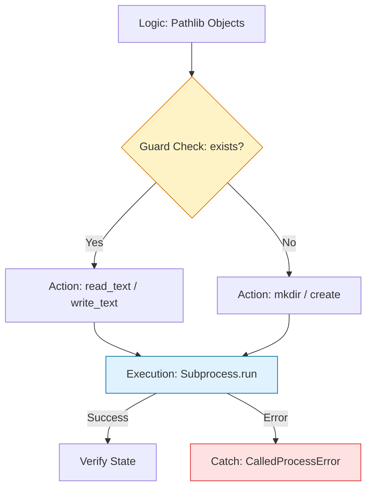

# 📂 System & File Operations: The Modern Orchestrator

> **"Shell commands are a language of the past. Python's `pathlib` and `subprocess` are the language of the future—safer, cross-platform, and object-oriented."**

Welcome to the **System Operations** module. While Bash is great for one-liners, Python is where you build resilient "Industrial Tools." This module focuses on the transition from brittle string-based pathing to robust, object-oriented system management.

**Why This Matters for Junior DevOps Engineers:**
- 🔒 **Security**: 80% of security vulnerabilities in automation come from improper file/process handling
- 🌍 **Cross-Platform**: Write once, run on Linux, Mac, and Windows
- 🎯 **Interview Focus**: Path manipulation and subprocess usage are core interview topics
- 💼 **Daily Work**: You'll interact with filesystems and processes in every automation task

---
## 📚 Table of Contents

1. [The System Interaction Lifecycle](#-the-system-interaction-lifecycle)
2. [Modern Path Operations with Pathlib](#-modern-path-operations-with-pathlib)
3. [Secure Process Execution](#-secure-process-execution)
4. [File Operations Mastery](#-file-operations-mastery)
5. [Real-World DevOps Scenarios](#-real-world-devops-scenarios)
6. [Security Best Practices](#-security-best-practices)
7. [Common Pitfalls & Solutions](#-common-pitfalls--solutions)
8. [Hands-On Exercises](#-hands-on-exercises)
9. [Interview Preparation](#-interview-preparation)
10. [Knowledge Check](#-knowledge-check)

---

## 🏗️ The System Interaction Lifecycle
Interacting with the OS requires **Strict Boundaries**. We move from raw shell execution to **Isolated Processes** and **Atomic File Operations**.



### 🔍 Lifecycle Breakdown

**Stage 1: Path Object Creation**
- **What**: Convert strings to Path objects
- **Why**: Type safety and cross-platform compatibility
- **How**: `Path('/home/user/config.yaml')`

**Stage 2: Guard Checks**
- **What**: Verify existence, permissions, type
- **Why**: Fail-fast before modifications
- **How**: `path.exists()`, `path.is_file()`, `path.is_dir()`

**Stage 3: File Operations**
- **What**: Read, write, copy, move files
- **Why**: Data manipulation for configurations
- **How**: `path.read_text()`, `shutil.copy()`, etc.

**Stage 4: Process Execution**
- **What**: Run external commands safely
- **Why**: Interact with system tools
- **How**: `subprocess.run()`

**Stage 5: State Verification**
- **What**: Confirm operations succeeded
- **Why**: Detect partial failures
- **How**: Check return codes, verify files exist

---
## 🗂️ Modern Path Operations with Pathlib

### Why Pathlib Over os.path?

**The Old Way (os.path)**:
```python
import os

# Ugly string concatenation
config_path = os.path.join(os.path.dirname(__file__), 'config', 'settings.yaml')

# Function-based approach
if os.path.exists(config_path):
    if os.path.isfile(config_path):
        with open(config_path, 'r') as f:
            content = f.read()
```

**The Modern Way (pathlib)**:
```python
from pathlib import Path

# Clean object-oriented approach
config_path = Path(__file__).parent / 'config' / 'settings.yaml'

# Method chaining
if config_path.exists() and config_path.is_file():
    content = config_path.read_text()
```
### Comprehensive Pathlib Operations

#### Creating Path Objects
```python
from pathlib import Path

# From string
path = Path('/var/log/app.log')

# From current file location
script_dir = Path(__file__).parent
config_dir = script_dir / 'config'

# From user home
home = Path.home()  # /home/username
config = home / '.aws' / 'credentials'

# Current working directory
cwd = Path.cwd()

# From environment variable
data_dir = Path(os.getenv('DATA_DIR', '/opt/data'))
```
#### Path Properties and Methods
```python
from pathlib import Path

path = Path('/home/user/projects/myapp/src/main.py')

# Path components
print(path.name)         # main.py
print(path.stem)         # main
print(path.suffix)       # .py
print(path.parent)       # /home/user/projects/myapp/src
print(path.parents[0])   # /home/user/projects/myapp/src
print(path.parents[1])   # /home/user/projects/myapp
print(path.parts)        # ('/', 'home', 'user', 'projects', 'myapp', 'src', 'main.py')

# Absolute vs relative
print(path.is_absolute())  # True
print(path.absolute())     # Full absolute path

# Resolve symlinks
real_path = path.resolve()
```
#### Checking Path States
```python
from pathlib import Path

path = Path('/var/log/app.log')

# Existence checks
path.exists()      # Does path exist?
path.is_file()     # Is it a file?
path.is_dir()      # Is it a directory?
path.is_symlink()  # Is it a symbolic link?

# Permission checks
import os
os.access(path, os.R_OK)  # Readable?
os.access(path, os.W_OK)  # Writable?
os.access(path, os.X_OK)  # Executable?

# Size and timestamps
path.stat().st_size       # File size in bytes
path.stat().st_mtime      # Last modified time
path.stat().st_ctime      # Creation time
```
#### Creating Directories and Files
```python
from pathlib import Path

# Create directory
config_dir = Path('/opt/app/config')

# Simple creation (fails if parent doesn't exist)
config_dir.mkdir()

# Create with parents (like mkdir -p)
config_dir.mkdir(parents=True, exist_ok=True)
# parents=True: Create parent directories
# exist_ok=True: Don't error if already exists

# Create file
log_file = Path('/var/log/app.log')
log_file.touch()  # Create empty file if doesn't exist

# Create with content
log_file.write_text('Application started\n')
```
#### Reading and Writing Files
```python
from pathlib import Path

config_file = Path('config.yaml')

# Read entire file as string
content = config_file.read_text()

# Read as bytes
binary_data = config_file.read_bytes()

# Read lines
lines = config_file.read_text().splitlines()

# Write text (overwrites existing)
config_file.write_text('new content')

# Append to file (traditional way)
with config_file.open('a') as f:
    f.write('appended line\n')

# Safe writing with context manager
with config_file.open('w') as f:
    f.write('line 1\n')
    f.write('line 2\n')
```
#### Listing and Globbing
```python
from pathlib import Path

project_dir = Path('/home/user/projects')

# List all items
for item in project_dir.iterdir():
    print(item)

# List only files
files = [f for f in project_dir.iterdir() if f.is_file()]

# List only directories
dirs = [d for d in project_dir.iterdir() if d.is_dir()]

# Glob pattern matching (non-recursive)
python_files = list(project_dir.glob('*.py'))
config_files = list(project_dir.glob('config.*'))

# Recursive globbing (searches subdirectories)
all_python = list(project_dir.rglob('*.py'))
all_yaml = list(project_dir.rglob('*.yaml'))

# Multiple patterns
for pattern in ['*.py', '*.yaml', '*.json']:
    files = list(project_dir.rglob(pattern))
    print(f"Found {len(files)} {pattern} files")
```
#### Moving, Copying, and Deleting
```python
from pathlib import Path
import shutil

source = Path('/tmp/data.json')
dest = Path('/opt/backup/data.json')

# Move/Rename
source.rename(dest)

# Copy file (simple)
shutil.copy(source, dest)

# Copy file with metadata (timestamps, permissions)
shutil.copy2(source, dest)

# Copy entire directory tree
shutil.copytree('/opt/app', '/backup/app')

# Delete file
config_file = Path('old_config.yaml')
config_file.unlink()  # Remove file
config_file.unlink(missing_ok=True)  # Don't error if doesn't exist

# Delete empty directory
empty_dir = Path('/tmp/empty')
empty_dir.rmdir()

# Delete directory tree (dangerous!)
shutil.rmtree('/tmp/build_cache')
```
### Cross-Platform Path Handling
```python
from pathlib import Path

# ✅ CORRECT - Works on all platforms
# The / operator handles OS differences automatically
config_path = Path.home() / 'config' / 'app.yaml'
# Linux:   /home/user/config/app.yaml
# Mac:     /Users/user/config/app.yaml
# Windows: C:\Users\user\config\app.yaml

# ❌ WRONG - Hardcoded separators break on Windows
config_path = '/home/user/config/app.yaml'  # Fails on Windows!

# Converting to string for subprocess
str(config_path)  # Converts to OS-appropriate string
```

---
## 🔐 Secure Process Execution

### Understanding subprocess.run()

`subprocess.run()` is the modern way to execute external commands in Python.
#### Basic Usage
```python
import subprocess

# Simple command (no shell needed)
result = subprocess.run(['ls', '-la'], capture_output=True, text=True)

print(result.returncode)  # 0 for success, non-zero for failure
print(result.stdout)      # Standard output
print(result.stderr)      # Standard error
```
#### The Danger of shell=True
```python
import subprocess

# ❌ DANGEROUS - Shell injection vulnerability
user_input = "test; rm -rf /"  # Malicious input!
subprocess.run(f"cat {user_input}", shell=True)
# This would execute: cat test; rm -rf /
# DISASTER!

# ✅ SAFE - List-based arguments
subprocess.run(['cat', user_input])
# Even with malicious input, only tries to cat that specific filename
# No command injection possible
```

**Rule of Thumb**: 
- **NEVER** use `shell=True` with user input
- **ALWAYS** pass commands as lists
- **ONLY** use `shell=True` for shell built-ins (pipes, redirects) and only with trusted input
#### Complete subprocess Examples
```python
import subprocess
from pathlib import Path

# Example 1: Run git command
result = subprocess.run(
    ['git', 'status'],
    cwd='/home/user/project',           # Working directory
    capture_output=True,                 # Capture stdout and stderr
    text=True,                           # Return strings (not bytes)
    timeout=30                          # Kill after 30 seconds
)

if result.returncode == 0:
    print("✅ Git status:", result.stdout)
else:
    print("❌ Error:", result.stderr)

# Example 2: With check=True (fail-fast)
try:
    subprocess.run(
        ['terraform', 'apply', '-auto-approve'],
        check=True,                      # Raise exception if fails
        capture_output=True,
        text=True
    )
    print("✅ Terraform applied successfully")
except subprocess.CalledProcessError as e:
    print(f"❌ Terraform failed with code {e.returncode}")
    print(f"Error output: {e.stderr}")
    sys.exit(1)

# Example 3: Piping commands (requires shell)
# Instead of: ps aux | grep python | grep -v grep
# Do this safely:
ps_result = subprocess.run(['ps', 'aux'], capture_output=True, text=True)
python_procs = [line for line in ps_result.stdout.splitlines() 
                if 'python' in line and 'grep' not in line]

# Example 4: Input to command
result = subprocess.run(
    ['mail', '-s', 'Alert', 'admin@example.com'],
    input='Server disk usage > 90%',    # Stdin input
    text=True
)
```
#### Advanced subprocess Patterns
```python
import subprocess
import sys
import logging

def run_command_safe(cmd: list, description: str = "") -> tuple:
    """
    Run a command safely with comprehensive error handling.
    
    Args:
        cmd: Command as list (e.g., ['ls', '-la'])
        description: Human-readable description for logging
        
    Returns:
        Tuple of (success: bool, stdout: str, stderr: str)
    """
    desc = description or ' '.join(cmd)
    logging.info(f"🚀 Running: {desc}")
    
    try:
        result = subprocess.run(
            cmd,
            capture_output=True,
            text=True,
            timeout=60,
            check=False  # We'll handle errors manually
        )
        
        if result.returncode == 0:
            logging.info(f"✅ Success: {desc}")
            return (True, result.stdout, result.stderr)
        else:
            logging.error(f"❌ Failed ({result.returncode}): {desc}")
            logging.error(f"Error: {result.stderr}")
            return (False, result.stdout, result.stderr)
            
    except subprocess.TimeoutExpired:
        logging.error(f"⏱️  Timeout: {desc}")
        return (False, "", "Command timed out after 60s")
        
    except FileNotFoundError:
        logging.error(f"🔍 Command not found: {cmd[0]}")
        return (False, "", f"Command '{cmd[0]}' not found")
        
    except Exception as e:
        logging.error(f"💥 Unexpected error: {e}")
        return (False, "", str(e))
```

---

## 📋 File Operations Mastery

### Safe File Reading Patterns
```python
from pathlib import Path
import json
import yaml
import logging

def read_config_safe(config_path: Path) -> dict:
    """
    Safely read configuration file with comprehensive error handling.
    
    Args:
        config_path: Path to configuration file
        
    Returns:
        Configuration dictionary, or empty dict on error
    """
    # Guard clause: Check existence
    if not config_path.exists():
        logging.error(f"❌ Config not found: {config_path}")
        return {}
    
    # Guard clause: Check it's a file
    if not config_path.is_file():
        logging.error(f"❌ Not a file: {config_path}")
        return {}
    
    # Guard clause: Check readability
    if not os.access(config_path, os.R_OK):
        logging.error(f"❌ Cannot read: {config_path}")
        return {}
    
    try:
        content = config_path.read_text()
        
        if config_path.suffix == '.json':
            return json.loads(content)
        elif config_path.suffix in ['.yaml', '.yml']:
            return yaml.safe_load(content)
        else:
            logging.warning(f"⚠️  Unknown format: {config_path.suffix}")
            return {'raw_content': content}
            
    except json.JSONDecodeError as e:
        logging.error(f"❌ Invalid JSON in {config_path}: {e}")
        return {}
    except yaml.YAMLError as e:
        logging.error(f"❌ Invalid YAML in {config_path}: {e}")
        return {}
    except Exception as e:
        logging.error(f"❌ Error reading {config_path}: {e}")
        return {}
```
### Atomic File Writing
```python
from pathlib import Path
import tempfile
import shutil

def atomic_write(path: Path, content: str) -> bool:
    """
    Write file atomically to prevent partial writes.
    
    How it works:
    1. Write to temporary file
    2. If successful, move to final location
    3. Move is atomic on most filesystems
    
    Args:
        path: Target file path
        content: Content to write
        
    Returns:
        True if successful, False otherwise
    """
    try:
        # Write to temporary file in same directory
        # (ensures same filesystem for atomic move)
        temp_fd, temp_path = tempfile.mkstemp(
            dir=path.parent,
            prefix=f".{path.name}.",
            text=True
        )
        
        with os.fdopen(temp_fd, 'w') as f:
            f.write(content)
        
        # Atomic move (on most filesystems)
        temp = Path(temp_path)
        temp.replace(path)  # replace() is atomic
        
        logging.info(f"✅ Atomically wrote: {path}")
        return True
        
    except Exception as e:
        logging.error(f"❌ Failed to write {path}: {e}")
        # Clean up temp file if it exists
        if 'temp' in locals():
            temp.unlink(missing_ok=True)
        return False
```
### Directory Operations
```python
from pathlib import Path
import shutil
import logging

def ensure_directory(path: Path, mode: int = 0o755) -> bool:
    """
    Ensure directory exists with proper permissions.
    
    Args:
        path: Directory path
        mode: Permission mode (default: 0o755 = rwxr-xr-x)
        
    Returns:
        True if directory exists/created, False on error
    """
    try:
        path.mkdir(parents=True, exist_ok=True, mode=mode)
        logging.debug(f"✅ Directory ready: {path}")
        return True
    except PermissionError:
        logging.error(f"❌ Permission denied: {path}")
        return False
    except Exception as e:
        logging.error(f"❌ Cannot create {path}: {e}")
        return False

def copy_directory_safe(source: Path, dest: Path) -> bool:
    """
    Safely copy entire directory tree.
    
    Args:
        source: Source directory
        dest: Destination directory
        
    Returns:
        True if successful, False otherwise
    """
    # Guard clauses
    if not source.exists():
        logging.error(f"❌ Source doesn't exist: {source}")
        return False
        
    if not source.is_dir():
        logging.error(f"❌ Source not a directory: {source}")
        return False
        
    if dest.exists():
        logging.error(f"❌ Destination already exists: {dest}")
        return False
    
    try:
        shutil.copytree(source, dest)
        logging.info(f"✅ Copied {source} → {dest}")
        return True
    except Exception as e:
        logging.error(f"❌ Copy failed: {e}")
        return False
```

---

## 🎭 Real-World DevOps Scenarios

### 🛡️ Scenario 1: The "Space-in-Path" Catastrophe

**The Incident:** An engineer used a shell script to clean up user directories: `rm -rf /data/users/$USERNAME`.

**The Failure:** A new user was created with the name `john doe`. The shell expanded the command to `rm -rf /data/users/john doe`, causing it to try and delete `/data/users/john` (which failed) and then `doe` (which was a critical system directory in the root).

**The Impact:**
- ❌ Critical system directory deleted
- ❌ Multiple services crashed
- ❌ 6-hour recovery from backups
- ❌ $50,000+ estimated cost

**The Root Cause:**
```bash
# ❌ DANGER: Shell word splitting
USERNAME="john doe"
rm -rf /data/users/$USERNAME
# Expands to: rm -rf /data/users/john doe
# Deletes TWO things: /data/users/john and /doe (if exists)
```

**The Fix:** Mandatory use of **`pathlib`**. Python treats the entire path as a single object, meaning spaces in filenames are handled safely and automatically without complex shell quoting.

```python
# ✅ SAFE: Path object handles spaces automatically
from pathlib import Path
import shutil

username = "john doe"  # Space in name
user_dir = Path("/data/users") / username

if user_dir.exists() and user_dir.is_dir():
    shutil.rmtree(user_dir)
    # Correctly deletes only: /data/users/john doe
    # No word splitting, no dangerous expansion
```

**Lessons Learned:**
1. **Never** use shell expansion with user-controlled data
2. **Always** use Path objects for filesystem operations
3. **Implement** pre-deletion validation (check path depth, confirm parent)
4. **Add** dry-run mode for dangerous operations

---

### 🔥 Scenario 2: The Log Rotation Race Condition

**The Context:** Production application writes to `/var/log/app.log`. Rotation script runs nightly to compress and archive logs.

**The Problem:** Race condition between app writing and script compressing:
1. Script reads log file
2. App writes new log line (file handle still open)
3. Script deletes/moves original file
4. App continues writing into moved file
5. New logs lost!

**The Old (Broken) Approach:**
```bash
#!/bin/bash
# ❌ RACE CONDITION
mv /var/log/app.log /var/log/app.log.$(date +%Y%m%d)
gzip /var/log/app.log.*
# App still has old file handle open!
```

**The Modern Python Solution:**
```python
#!/usr/bin/env python3
"""
Safe log rotation using copytruncate method.
"""
import logging
from pathlib import Path
import gzip
from datetime import datetime
import time

def rotate_log_safe(log_path: Path) -> bool:
    """
    Safely rotate log file using copytruncate method.
    
    Method:
    1. Copy current log to dated backup
    2. Truncate original log (preserves file handles)
    3. Compress backup
    
    This ensures apps with open file handles continue writing
    to the (now empty) original file.
    """
    if not log_path.exists():
        logging.warning(f"Log file doesn't exist: {log_path}")
        return False
    
    try:
        # Generate dated backup name
        timestamp = datetime.now().strftime('%Y%m%d_%H%M%S')
        backup_path = log_path.parent / f"{log_path.stem}.{timestamp}.log"
        
        # 1. Copy current content
        backup_path.write_bytes(log_path.read_bytes())
        logging.info(f"✅ Copied to: {backup_path}")
        
        # 2. Truncate original (clears content but keeps file handle)
        log_path.write_text('')  # Or: log_path.truncate(0) with open()
        logging.info(f"✅ Truncated: {log_path}")
        
        # 3. Compress backup
        compressed = Path(f"{backup_path}.gz")
        with open(backup_path, 'rb') as f_in:
            with gzip.open(compressed, 'wb') as f_out:
                f_out.writelines(f_in)
        
        # 4. Clean up uncompressed backup
        backup_path.unlink()
        logging.info(f"✅ Compressed to: {compressed}")
        
        return True
        
    except Exception as e:
        logging.error(f"❌ Rotation failed: {e}")
        return False

if __name__ == "__main__":
    rotate_log_safe(Path('/var/log/app.log'))
```

**Why This Works:**
- Copying preserves original file and its file descriptors
- Truncating empties file without closing handles
- Apps continue writing to same file descriptor (now empty file)
- No logs are lost during rotation

---

### 🚨 Scenario 3: The Permission Escalation Bug

**The Incident:** Deployment script created config files with wrong permissions, exposing AWS credentials.

**The Vulnerability:**
```python
# ❌ INSECURE: Default umask creates world-readable files
config = Path('/opt/app/config.yaml')
config.write_text(f"aws_key: {secret_key}")  # Created as 644 (readable by all!)

# Anyone on the system can read:
# $ cat /opt/app/config.yaml
# aws_key: AKIA...SECRETKEY...
```

**The Impact:**
- ❌ AWS credentials leaked to all users on server
- ❌ Unauthorized access to S3 buckets
- ❌ Compliance violation (PCI-DSS, SOC2)
- ❌ Emergency key rotation required

**The Secure Solution:**
```python
#!/usr/bin/env python3
"""
Secure configuration file creation with proper permissions.
"""
import os
from pathlib import Path
import logging

def write_config_secure(config_path: Path, content: str, mode: int = 0o600) -> bool:
    """
    Write configuration file with secure permissions.
    
    Args:
        config_path: Path to config file
        content: Configuration content
        mode: File permissions (default: 0o600 = rw-------)
        
    Returns:
        True if successful
    """
    try:
        # Method 1: Set restrictive umask before writing
        old_umask = os.umask(0o077)  # Remove all group/other permissions
        try:
            config_path.write_text(content)
        finally:
            os.umask(old_umask)  # Restore original umask
        
        # Method 2: Explicitly set permissions after writing
        os.chmod(config_path, mode)
        
        # Verify permissions
        actual_mode = config_path.stat().st_mode & 0o777
        if actual_mode != mode:
            logging.error(f"❌ Permission mismatch: expected {oct(mode)}, got {oct(actual_mode)}")
            return False
        
        logging.info(f"✅ Securely wrote {config_path} with mode {oct(mode)}")
        return True
        
    except Exception as e:
        logging.error(f"❌ Failed to write secure config: {e}")
        return False

# Example usage
aws_config = {
    'aws_access_key_id': 'AKIA...',
    'aws_secret_access_key': 'SECRET...'
}

write_config_secure(
    Path('/opt/app/.env'),
    f"AWS_KEY={aws_config['aws_access_key_id']}\n",
    mode=0o600  # Only owner can read/write
)
```

**Permission Mode Reference:**
```
0o600 = rw-------  # Owner read/write only (secrets)
0o644 = rw-r--r--  # Owner write, all read (public configs)
0o755 = rwxr-xr-x  # Owner write, all read/execute (scripts)
0o700 = rwx------  # Owner full access only (private dirs)
```

---

## 🔒 Security Best Practices

### 1. Path Traversal Prevention

```python
from pathlib import Path

def safe_join(base_dir: Path, user_path: str) -> Path:
    """
    Safely join user-provided path to base directory.
    Prevents path traversal attacks (../).
    
    Args:
        base_dir: Trusted base directory
        user_path: User-provided path (untrusted)
        
    Returns:
        Resolved path if safe, None if traversal detected
    """
    # Resolve both paths
    base = base_dir.resolve()
    full_path = (base / user_path).resolve()
    
    # Check if result is still within base directory
    try:
        full_path.relative_to(base)
        return full_path
    except ValueError:
        logging.error(f"❌ Path traversal attempt: {user_path}")
        return None

# Example usage
UPLOADS_DIR = Path('/var/www/uploads').resolve()

# ❌ UNSAFE
user_file = "../../../etc/passwd"  # Attacker input
bad_path = UPLOADS_DIR / user_file  # Could access /etc/passwd!

# ✅ SAFE
safe_path = safe_join(UPLOADS_DIR, user_file)
if safe_path is None:
    print("Attack blocked!")  # Traversal detected
```

### 2. Temporary File Security

```python
import tempfile
from pathlib import Path

# ❌ INSECURE: Predictable names, race conditions
temp_path = Path('/tmp/myapp_temp.txt')
temp_path.write_text(secret_data)  # Others can read!

# ✅ SECURE: Proper temporary files
with tempfile.NamedTemporaryFile(mode='w', delete=True) as tmp:
    tmp.write(secret_data)
    tmp.flush()
    # File automatically deleted when closed
    # Unpredictable name
    # Proper permissions

# For temporary directories
with tempfile.TemporaryDirectory() as tmpdir:
    work_dir = Path(tmpdir)
    # Do work...
    # Directory auto-deleted with all contents
```

### 3. Resource Cleanup with Context Managers

```python
from pathlib import Path
import subprocess

# ❌ UNSAFE: File may not close on error
f = open('config.yaml', 'w')
f.write(content)
# If exception here, file never closes!
f.close()

# ✅ SAFE: Context manager ensures cleanup
with open('config.yaml', 'w') as f:
    f.write(content)
# File always closed, even on exception

# Custom context manager
class WorkingDirectory:
    """Temporarily change working directory."""
    def __init__(self, path):
        self.path = Path(path)
        self.old_path = Path.cwd()
    
    def __enter__(self):
        os.chdir(self.path)
        return self.path
    
    def __exit__(self, exc_type, exc_val, exc_tb):
        os.chdir(self.old_path)

# Usage
with WorkingDirectory('/tmp'):
    # Do work in /tmp
    pass
# Automatically back to original directory
```

---

## ⚠️ Common Pitfalls & Solutions

### Pitfall 1: Not Checking If File Exists Before Reading

```python
# ❌ BAD: Crashes if file doesn't exist
content = Path('config.yaml').read_text()

# ✅ GOOD: Always check first
config_path = Path('config.yaml')
if config_path.exists():
    content = config_path.read_text()
else:
    logging.error(f"Config not found: {config_path}")
    sys.exit(1)

# ✅ BETTER: Use exception handling
try:
    content = config_path.read_text()
except FileNotFoundError:
    logging.error(f"Config not found: {config_path}")
    sys.exit(1)
```

### Pitfall 2: Assuming Current Working Directory

```python
# ❌ BAD: Breaks if script run from different directory
config = Path('config.yaml')  # Looks in CWD!

# ✅ GOOD: Relative to script location
script_dir = Path(__file__).parent
config = script_dir / 'config.yaml'

# ✅ BETTER: Use absolute paths or environment variables
config = Path(os.getenv('APP_CONFIG', '/etc/app/config.yaml'))
```

### Pitfall 3: Forgetting to Handle Encodings

```python
# ❌ BAD: Assumes UTF-8 (may fail with other encodings)
content = Path('data.txt').read_text()

# ✅ GOOD: Explicitly specify encoding
content = Path('data.txt').read_text(encoding='utf-8')

# ✅ BETTER: Handle encoding errors
try:
    content = Path('data.txt').read_text(encoding='utf-8', errors='strict')
except UnicodeDecodeError:
    # Fall back to different encoding
    content = Path('data.txt').read_text(encoding='latin-1')
```

### Pitfall 4: Shell Injection in subprocess

```python
# ❌ DANGEROUS
user_file = input("Enter filename: ")
subprocess.run(f"cat {user_file}", shell=True)
# User enters: "test.txt; rm -rf /"
# Executes both commands!

# ✅ SAFE
subprocess.run(['cat', user_file])
# Even malicious input can't inject commands
```

### Pitfall 5: Not Validating External Command Output

```python
# ❌ BAD: Assumes command succeeds
result = subprocess.run(['git', 'rev-parse', 'HEAD'], capture_output=True, text=True)
commit_hash = result.stdout.strip()  # May be empty if command failed!

# ✅ GOOD: Check return code
result = subprocess.run(['git', 'rev-parse', 'HEAD'], capture_output=True, text=True)
if result.returncode == 0:
    commit_hash = result.stdout.strip()
else:
    logging.error(f"Git command failed: {result.stderr}")
    sys.exit(1)

# ✅ BETTER: Use check=True for automatic error handling
try:
    result = subprocess.run(
        ['git', 'rev-parse', 'HEAD'],
        capture_output=True,
        text=True,
        check=True  # Raises CalledProcessError if fails
    )
    commit_hash = result.stdout.strip()
except subprocess.CalledProcessError as e:
    logging.error(f"Git command failed: {e.stderr}")
    sys.exit(1)
```

---

## 🎯 Hands-On Exercises

### Exercise 1: Build a File Backup Tool

**Objective**: Create a script that backs up files with versioning

**Requirements**:
- Use pathlib for all path operations
- Create timestamped backups
- Handle errors gracefully
- Verify backup success

**Starter Code**:
```python
#!/usr/bin/env python3
"""
File backup tool with versioning.
"""
from pathlib import Path
from datetime import datetime
import shutil
import logging

def backup_file(source: Path, backup_dir: Path) -> bool:
    """
    Create timestamped backup of file.
    
    Args:
        source: File to backup
        backup_dir: Directory to store backups
        
    Returns:
        True if successful
    """
    # TODO: Validate source file exists
    # TODO: Create backup directory if needed
    # TODO: Generate timestamped backup filename
    # TODO: Copy file to backup location
    # TODO: Verify backup file exists and has same size
    # TODO: Return success/failure
    pass

def main():
    source = Path('/etc/nginx/nginx.conf')
    backup_dir = Path('/backup/nginx')
    
    if backup_file(source, backup_dir):
        logging.info("✅ Backup successful")
    else:
        logging.error("❌ Backup failed")
        sys.exit(1)

if __name__ == "__main__":
    main()
```

**Solution Hints**:
1. Use `source.exists()` and `source.is_file()`
2. Use `backup_dir.mkdir(parents=True, exist_ok=True)`
3. Use `datetime.now().strftime('%Y%m%d_%H%M%S')`
4. Use `shutil.copy2()` to preserve metadata
5. Compare `.stat().st_size` for verification

---

### Exercise 2: Safe Directory Cleaner

**Objective**: Create a tool to clean old backup files

**Requirements**:
- Delete files older than N days
- Dry-run mode (show what would be deleted)
- Never delete outside specified directory
- Comprehensive logging

**Template**:
```python
#!/usr/bin/env python3
"""
Safe backup cleaner with dry-run mode.
"""
from pathlib import Path
from datetime import datetime, timedelta
import logging

def clean_old_backups(
    backup_dir: Path,
    days_to_keep: int = 30,
    dry_run: bool = True
) -> dict:
    """
    Delete backup files older than specified days.
    
    Args:
        backup_dir: Directory containing backups
        days_to_keep: Keep files newer than this
        dry_run: If True, only show what would be deleted
        
    Returns:
        Dictionary with statistics
    """
    stats = {
        'scanned': 0,
        'would_delete': 0,
        'deleted': 0,
        'space_freed': 0
    }
    
    # TODO: Validate backup_dir exists and is a directory
    # TODO: Calculate cutoff date
    # TODO: Iterate through files
    # TODO: Check file age
    # TODO: Delete or report based on dry_run flag
    # TODO: Update statistics
    
    return stats

if __name__ == "__main__":
    import argparse
    
    parser = argparse.ArgumentParser()
    parser.add_argument('--dir', required=True, help='Backup directory')
    parser.add_argument('--days', type=int, default=30, help='Days to keep')
    parser.add_argument('--execute', action='store_true', help='Actually delete (default is dry-run)')
    
    args = parser.parse_args()
    
    stats = clean_old_backups(
        Path(args.dir),
        args.days,
        dry_run=not args.execute
    )
    
    print(f"Scanned: {stats['scanned']} files")
    print(f"Would delete: {stats['would_delete']} files")
```

---
### Exercise 3: Log Analyzer with subprocess

**Objective**: Parse system logs using external commands

**Requirements**:
- Use subprocess to run system commands
- Parse command output
- Handle command failures
- Generate summary report

**Challenge**:
```python
#!/usr/bin/env python3
"""
System log analyzer using subprocess.
"""
import subprocess
from pathlib import Path
from collections import Counter

def analyze_auth_logs() -> dict:
    """
    Analyze /var/log/auth.log for failed login attempts.
    
    Returns:
        Dictionary with analysis results
    """
    # TODO: Use subprocess to read auth.log
    # TODO: Parse for "Failed password" lines
    # TODO: Extract IP addresses
    # TODO: Count attempts per IP
    # TODO: Return statistics
    
    pass

def get_disk_usage(path: Path) -> dict:
    """
    Get disk usage statistics using 'du' command.
    
    Returns:
        Dictionary with size information
    """
    # TODO: Run: du -sh <path>
    # TODO: Parse output
    # TODO: Return human-readable size
    
    pass
```

---

## 🎙️ Interview Preparation

### Foundation Questions

**1. "Why is `pathlib` preferred over the legacy `os.path` module?"**

**Answer**: 
- **Object-Oriented**: Instead of passing strings to functions, you call methods on the Path object itself
  - Old: `os.path.exists(path)` → New: `path.exists()`
- **Cross-Platform**: Handles slash differences (`/` vs `\`) between Linux and Windows automatically
  - Can use `/` operator on all platforms
- **More Features**: Built-in methods for common operations
  - `path.read_text()`, `path.write_text()`, `path.glob()`
- **Type Safety**: IDEs can autocomplete and type-check
- **Cleaner Code**: More readable and Pythonic

**Example**:
```python
# os.path (old way)
import os
path = os.path.join(os.path.dirname(__file__), 'config', 'settings.yaml')
if os.path.exists(path) and os.path.isfile(path):
    with open(path) as f:
        content = f.read()

# pathlib (modern way)
from pathlib import Path
path = Path(__file__).parent / 'config' / 'settings.yaml'
if path.exists() and path.is_file():
    content = path.read_text()
```

---

**2. "What is the danger of setting `shell=True` in `subprocess.run()`?"**

**Answer**: 
- Opens a **Shell Injection** security vulnerability
- If any part of the command comes from user input, an attacker can append malicious commands
- The shell will execute multiple commands separated by `;`, `|`, `&&`, etc.

**Attack Example**:
```python
# ❌ VULNERABLE CODE
filename = input("Enter filename: ")
subprocess.run(f"cat {filename}", shell=True)

# Attacker enters: "harmless.txt; rm -rf /"
# Shell executes TWO commands:
# 1. cat harmless.txt
# 2. rm -rf /  (DISASTER!)
```

**Safe Alternative**:
```python
# ✅ SAFE CODE
filename = input("Enter filename: ")
subprocess.run(['cat', filename])  # No shell, no injection possible
```

**When shell=True is needed**:
- Shell built-ins (`cd`, `export`, etc.)
- Pipes and redirects (`cmd1 | cmd2`)
- **Only with fully trusted input, never user input!**

---

**3. "How does `subprocess.run(check=True)` change your error handling?"**

**Answer**: 
- Forces **fail-fast** behavior
- Automatically raises `CalledProcessError` if command returns non-zero exit code
- Without `check=True`, a command could fail silently and script continues
- Prevents operating on corrupt/missing data

**Comparison**:
```python
# ❌ WITHOUT check=True (silent failure)
result = subprocess.run(['terraform', 'apply'])
# Even if terraform fails, script continues!
result = subprocess.run(['kubectl', 'apply', '-f', 'broken_config.yaml'])
# Could deploy to production with partial/broken state!

# ✅ WITH check=True (fail-fast)
try:
    subprocess.run(['terraform', 'apply'], check=True)
    # Only reaches here if terraform succeeded
    subprocess.run(['kubectl', 'apply', '-f', 'config.yaml'], check=True)
except subprocess.CalledProcessError as e:
    logging.error(f"Deployment failed at step with exit code {e.returncode}")
    sys.exit(1)
```

---

**4. "What is the difference between `shutil.copy()` and `shutil.copy2()`?"**

**Answer**: 
- **`shutil.copy(src, dst)`**: Copies file content + basic permissions
- **`shutil.copy2(src, dst)`**: Copies content + permissions + **metadata (timestamps)**

**Why metadata matters**:
- **Audit Trails**: Preserve original creation/modification times
- **Debugging**: Knowing when a file was originally created helps troubleshooting
- **Compliance**: Some regulations require preserving file timestamps
- **Backups**: Restores should maintain original timestamps

**Example**:
```python
import shutil
from pathlib import Path

source = Path('/opt/app/config.yaml')
backup = Path('/backup/config.yaml')

# copy() - loses timestamps
shutil.copy(source, backup)
# backup.yaml shows current time as modification time

# copy2() - preserves timestamps
shutil.copy2(source, backup)
# backup.yaml shows original modification time
```

---

**5. "When should you use `os.environ` instead of hardcoding paths?"**

**Answer**: 
- To ensure **Environment Parity** (Dev/Staging/Prod)
- Hardcoded paths fail when:
  - Running in Docker (different filesystem structure)
  - Running in CI/CD (different home directories)
  - Deploying to different environments

**The 12-Factor App** principle: Configuration should come from environment

**Example**:
```python
# ❌ BAD: Hardcoded paths
config_path = '/home/john/app/config.yaml'
# Fails on: servers, other developers' machines, CI/CD

# ✅ GOOD: Environment variables
config_path = os.getenv('APP_CONFIG', '/etc/app/config.yaml')
# Works everywhere, just set environment variable

# Better yet, use Path
from pathlib import Path
config_dir = Path(os.getenv('APP_CONFIG_DIR', '/etc/app'))
config_path = config_dir / 'config.yaml'
```

**Setting environment variables**:
```bash
# Development
export APP_CONFIG=/home/user/dev/config.yaml

# Production
export APP_CONFIG=/etc/app/config.yaml

# Docker
docker run -e APP_CONFIG=/opt/config.yaml myapp

# Kubernetes
env:
  - name: APP_CONFIG
    value: /etc/config/app.yaml
```

---

### Advanced Scenario Questions

**6. "You need to run a bash script from Python. What's the safest approach?"**

**Answer**:
```python
# Option 1: Call bash with script as argument (safer)
subprocess.run(['bash', '/path/to/script.sh'], check=True)

# Option 2: If script has shebang and is executable
subprocess.run(['/path/to/script.sh'], check=True)

# Option 3: If you must use shell (least safe, avoid user input!)
subprocess.run('cd /opt && ./script.sh', shell=True, executable='/bin/bash')

# Best practice: Pass arguments separately
subprocess.run(['bash', '/path/to/script.sh', arg1, arg2], check=True)
```

---

**7. "How would you safely clean up temporary files after an error?"**

**Answer - Use try/finally or context managers**:
```python
from pathlib import Path
import tempfile

# Method 1: try/finally
temp_dir = Path(tempfile.mkdtemp())
try:
    # Do work with temp_dir
    work_file = temp_dir / 'data.txt'
    work_file.write_text('data')
finally:
    # Always cleanup, even on exception
    if temp_dir.exists():
        shutil.rmtree(temp_dir)

# Method 2: Context manager (better)
with tempfile.TemporaryDirectory() as tmpdir:
    temp_dir = Path(tmpdir)
    work_file = temp_dir / 'data.txt'
    work_file.write_text('data')
# Auto-cleaned up, even on exception
```

---

**8. "Explain how you would implement a safe file deletion with a confirmation prompt."**

**Answer**:
```python
from pathlib import Path
import sys

def safe_delete(path: Path, force: bool = False) -> bool:
    """
    Safely delete file with confirmation.
    
    Args:
        path: File to delete
        force: Skip confirmation if True
        
    Returns:
        True if deleted, False otherwise
    """
    # Guard clauses
    if not path.exists():
        print(f"File doesn't exist: {path}")
        return False
    
    if not path.is_file():
        print(f"Not a file: {path}")
        return False
    
    # Show file info
    size = path.stat().st_size
    print(f"File: {path}")
    print(f"Size: {size} bytes")
    
    # Confirmation
    if not force:
        response = input("Delete this file? [y/N]: ")
        if response.lower() != 'y':
            print("Cancelled")
            return False
    
    # Delete
    try:
        path.unlink()
        print(f"✅ Deleted: {path}")
        return True
    except Exception as e:
        print(f"❌ Error: {e}")
        return False
```

---

## 🧠 Knowledge Check

### Basic Concepts

**1. Which library is the modern standard for filesystem paths?**
- [ ] `os.path`
- [ ] `sys`
- [x] `pathlib`
- [ ] `filesystem`

**Explanation**: `pathlib` is the modern, object-oriented standard introduced in Python 3.4.

---

**2. To run an external command and capture its output, which function do you use?**
- [ ] `os.system()`
- [x] `subprocess.run()`
- [ ] `shutil.exec()`
- [ ] `exec()`

**Explanation**: `subprocess.run()` is the modern way. `os.system()` is deprecated and less secure.

---

**3. True or False: Using `/` as a join operator in pathlib (e.g., `p / "subdir"`) works on Windows.**
- [x] True
- [ ] False

**Explanation**: Pathlib automatically converts `/` to the appropriate separator for the OS (`\` on Windows).

---

**4. What does the `check=True` argument do in a subprocess call?**
- [ ] It checks if the command exists before running
- [x] It raises an exception if the command returns a non-zero exit code
- [ ] It validates the user's permissions
- [ ] It performs a security scan

**Explanation**: `check=True` enables fail-fast behavior by raising `CalledProcessError` on failure.

---

**5. Which method is used to create a directory including all its missing parent folders?**
- [x] `path.mkdir(parents=True)`
- [ ] `path.create_all()`
- [ ] `os.makedirs_only()`
- [ ] `path.mkdirs()`

**Explanation**: `mkdir(parents=True)` is equivalent to `mkdir -p` in bash.

---

### Advanced Scenarios

**6. What's wrong with this code?**
```python
user_input = input("File: ")
subprocess.run(f"cat {user_input}", shell=True)
```

- [x] Shell injection vulnerability
- [ ] Missing error handling
- [ ] Wrong function call
- [ ] No logging

**Explanation**: User can enter `file.txt; rm -rf /` to execute malicious commands. Use list-based arguments instead.

---

**7. Which creates a file with restrictive permissions (owner only)?**
```python
# A
Path('secret.txt').write_text(data)

# B
os.umask(0o077)
Path('secret.txt').write_text(data)

# C
Path('secret.txt').write_text(data)
subprocess.run(['chmod', '644', 'secret.txt'])
```

- [ ] A
- [x] B
- [ ] C
- [ ] None

**Explanation**: B sets umask to remove all group/other permissions before writing. C actually makes it MORE permissive (644 = world-readable).

---

**8. How do you safely iterate through files in a directory?**
```python
path = Path('/opt/backups')

# Which is correct?
```

- [ ] `for f in path.files():`
- [x] `for f in path.iterdir():`
- [ ] `for f in path.list():`
- [ ] `for f in os.listdir(path):`

**Explanation**: `iterdir()` returns an iterator of Path objects. `os.listdir()` returns strings (old way).

---

## 📖 Additional Resources

### Essential Reading
- [Python pathlib documentation](https://docs.python.org/3/library/pathlib.html)
- [subprocess module guide](https://docs.python.org/3/library/subprocess.html)
- [shutil module documentation](https://docs.python.org/3/library/shutil.html)

### Security Resources
- [OWASP Command Injection](https://owasp.org/www-community/attacks/Command_Injection)
- [Python Security Best Practices](https://python.readthedocs.io/en/stable/library/security_warnings.html)

### Practice Projects
1. **Directory Synchronizer**: Sync files between two directories (like rsync)
2. **Log Rotator**: Implement safe log rotation with compression
3. **Backup Manager**: Create incremental backups with cleanup
4. **File Organizer**: Sort files by type/date into directories

---

## 🎯 Next Steps

After mastering this module, you should be able to:
- ✅ Use pathlib for all file operations
- ✅ Execute external commands safely
- ✅ Handle files and directories with proper error handling
- ✅ Understand and prevent security vulnerabilities
- ✅ Write cross-platform filesystem code
- ✅ Implement atomic file operations

**Ready to continue?**

[⬅️ Back to Python Environment](readme.md) | [Next: Data Manipulation](readme.md) ➡️

---

## 🎓 Self-Assessment Checklist

Before moving to the next module, ensure you can:

- [ ] Create and manipulate Path objects
- [ ] Check file/directory existence and properties
- [ ] Read and write files safely
- [ ] List and glob files in directories
- [ ] Run external commands with subprocess.run()
- [ ] Understand the dangers of shell=True
- [ ] Handle subprocess errors with check=True
- [ ] Set proper file permissions
- [ ] Prevent path traversal attacks
- [ ] Clean up resources properly (context managers)

**Score yourself**: 8+/10 = Ready to advance | 5-7/10 = Review exercises | <5/10 = Practice more

---

**Remember**: Mastering file and process operations is fundamental to DevOps automation. These skills form the foundation for configuration management, deployment scripts, and infrastructure tools! 🚀