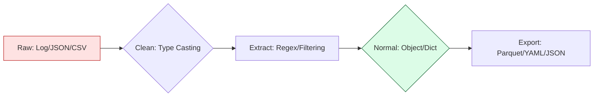

# 📊 02. Data Manipulation: Transforming Chaos into Logic

> **"Data in DevOps is rarely clean. It is a stream of unstructured logs, nested JSONs from Cloud APIs, and messy CSVs from billing reports. Your job is to normalize this chaos into actionable logic."**

This reference covers the tools for parsing, extracting, and aggregating data at scale. As a DevOps engineer, you spend 70% of your coding time transforming data from one format (API output) to another (Infrastructure configuration).

---

## 🏗️ The Data Normalization Pipeline

Professional data processing follows a "Wash, Sift, Store" pattern.



---

## 📄 1. Structured Data (JSON / YAML)

The lingua franca of Cloud Configurations. If you aren't using the `json` or `yaml` libraries, you are probably breaking your configurations.

| Keyword | Library | Use Case | Staff Pattern |
|:---|:---|:---|:---|
| `json.loads()` | `json` | Read API String. | `data = json.loads(resp.text)` |
| `json.dump()` | `json` | State Export. | `json.dump(d, f, indent=4)` |
| `yaml.safe_load()`| `PyYAML` | Config Import. | **Crucial**: Never use `load()`. |
| `dict.get()` | `Standard` | Defensive reading. | `val = d.get('key', 'default')` |

### 🚀 Staff Pattern: Safe Recursive Modification
```python
import json

def update_deep_config(path: str, key: str, value: any):
    """Safely updates a deeply nested JSON file without losing data."""
    with open(path, "r+") as f:
        data = json.load(f)
        # Surgical update logic here
        data['metadata']['tags'][key] = value
        
        f.seek(0)
        json.dump(data, f, indent=4)
        f.truncate()
```

---

## 🐼 2. High-Performance Analysis (Pandas)

Used for **FinOps** (billing analysis) and **Scale Testing** where datasets exceed 100,000 rows.

| Method | Staff Tip | Use Case |
|:---|:---|:---|
| `pd.read_csv()` | Use `chunksize=5000`. | Reading a 1GB billing export without OOM. |
| `df.groupby()` | "Pivot Table" in code. | `df.groupby('Region')['Cost'].sum()` |
| `df.query()` | SQL-like filtering. | `df.query('vulnerability == "CRITICAL"')` |
| `df.to_parquet()`| Compact storage. | Saving data as binary (1/10th size of CSV). |

### 🚀 Staff Pattern: Vectorized Cost Allocation
```python
import pandas as pd

# JUNIOR: Using for loops (10+ seconds for 1M rows)
# for i in df.index: df.at[i, 'total'] = df.at[i, 'price'] * 1.1

# STAFF: Vectorization (0.01 seconds)
df['total_cost'] = df['unit_price'] * 1.10 # C-Speed execution
```

---

## 🔍 3. Text Extraction (Regex `re`)

When the data isn't structured (CloudWatch Logs, unstructured SSH output).

| Pattern | Meaning | Example |
|:---|:---|:---|
| `r'\d{1,3}\.\d+'` | IP/Version digit. | `re.findall(r'...', logs)` |
| `(?P<name>...)` | Named Group. | For self-documenting parsing. |
| `re.VERBOSE` | Multi-line Regex. | Adding comments to complex regex. |
| `re.IGNORECASE` | Case-insensitive. | Handling `ERROR` vs `error`. |

### 🚀 Staff Pattern: The Multi-Line Structured Parser
```python
import re

LOG_PATTERN = re.compile(r"""
    ^\[(?P<timestamp>.*?)\]   # Capture Time
    \s+
    (?P<level>INFO|ERROR)     # Log Level
    \s+
    (?P<message>.*)$          # The message body
""", re.VERBOSE)

def parse_log_line(line: str):
    if match := LOG_PATTERN.search(line):
        return match.groupdict() # Returns a clean Dictionary
```

---

## 🎭 Real-World DevOps Scenarios

### 🛡️ Scenario: The "50GB Billing File" Crash

**The Incident**: A Junior SRE tried to write a Python script to find "Missing Tags" in the monthly cloud billing CSV (50GB). 

**The Crisis**: They used `with open(file) as f: data = f.readlines()`. The script instantly crashed the server because it tried to load 50GB into 16GB of RAM.

**The Fix**: Rewrote using Pandas `chunksize` and Filters.
```python
import pandas as pd

# Load in manageable chunks
for chunk in pd.read_csv("billing.csv", chunksize=10000):
    untagged = chunk[chunk['Tag:Project'].isna()]
    untagged.to_csv("fix_me.csv", mode='a', header=False)
```
**The Lesson**: In Infrastructure, data is often larger than memory. Always process in **Chunks** or **Streams**.

---

## 🎙️ Interview Preparation

### Foundation Questions
1. **"What is the difference between `json.load()` and `json.loads()`?"**
   - **Answer**: `json.load()` reads from a **File Object** (a stream), while `json.loads()` (Load String) reads from a **String variable** (already in memory).

2. **"Why should you use `yaml.safe_load()` instead of `yaml.load()`?"**
   - **Answer**: `yaml.load()` is insecure; it can execute arbitrary Python code embedded in the YAML file (YAML tags). `safe_load()` restricts the parser to simple Python objects, preventing remote code execution.

### Advanced Scenario Questions
3. **"How do you handle a JSON API response where some keys might be missing?"**
   - **Answer**: I use the `.get()` method instead of direct square bracket access. `data.get('status', 'unknown')` allows me to provide a default value and prevents the script from crashing with a `KeyError`.

---

## 🧠 Knowledge Check

1. **Which regex flag allows adding comments inside the pattern string?**
   - [ ] `re.S`
   - [ ] `re.M`
   - [x] `re.VERBOSE`

2. **What is 'Vectorization' in the context of Pandas?**
   - [x] Performing calculations on entire columns simultaneously using optimized C code.
   - [ ] Converting lists into dictionaries.

---
## 🎓 Self-Assessment Checklist
- [ ] I can safely update a nested JSON file.
- [ ] I know how to handle multi-gigabyte files using chunking.
- [ ] I use Named Groups in Regex for readability.
- [ ] I always use `safe_load` for YAML.

---
**Status**: ✅ Staff-Enhanced (2026-02-03)
