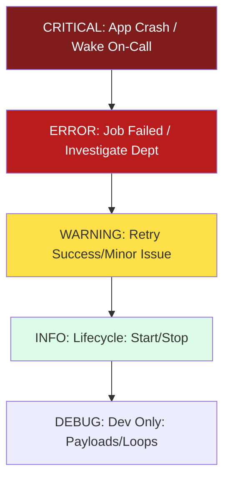

# 🧪 04. Testing & Observability: The Safety Net

> **"If it isn't tested, it's broken. If it isn't logged, it never happened. In the world of production automation, 'Testing' is how you prevent outages, and 'Logging' is how you survive them."**

This reference covers how to prove your code works (`pytest`) and how to debug it when it fails in production (`logging`). In Infrastructure-as-Python, we prioritize **Mocking** (testing without resources) and **Structured Logging** (testing with data).

---

## 🏗️ The Observability Hierarchy

Logging is not just about messages; it's about **Severity** and **Context**.



---

## 🚦 1. Testing Framework (`pytest`)

The industry standard. Pytest eliminates the boilerplate of the legacy `unittest` library and allows for powerful **Fixtures**.

### Fixtures (Setup/Teardown)
Reusable dependency injection. Use this for `db_connections`, `mock_clients`, or `config_data`.
```python
import pytest

@pytest.fixture
def mock_config():
    """Provides a sterile config object for tests."""
    return {"region": "us-east-1", "env": "test"}

def test_region_validation(mock_config):
    assert mock_config["region"] == "us-east-1"
```

### Parametrization (Scale-Testing Logic)
One test logic with an array of inputs.
```python
@pytest.mark.parametrize("ip,expected", [
    ("10.0.0.1", True),   # Private
    ("8.8.8.8", False),    # Public
    ("invalid", False)     # Bad data
])
def test_private_ip_checker(ip, expected):
    assert is_private_ip(ip) == expected
```

---

## 🎭 2. AWS Mocking (`moto`)

Never run tests against a "Live" AWS account. It's slow, expensive, and non-deterministic. Use **Moto** to simulate the entire AWS API in your RAM.

### 🚀 Staff Pattern: The Sterile S3 Test
```python
from moto import mock_aws
import boto3

@mock_aws
def test_bucket_creator():
    # 1. Setup Mock (Empty AWS Reality)
    s3 = boto3.client('s3', region_name='us-east-1')
    
    # 2. Run YOUR code
    create_secure_bucket(name="my-legal-bucket")
    
    # 3. Assert Reality
    buckets = s3.list_buckets()['Buckets']
    assert len(buckets) == 1
    assert buckets[0]['Name'] == "my-legal-bucket"
```

---

## 📝 3. Structured Logging (`logging`)

Don't use `print()`. `print()` doesn't have timestamps, severity levels, or output destinations (like Syslog or Datadog). 

| Level | Goal | Staff Tip |
|:---|:---|:---|
| `DEBUG` | "The Blackbox Data". | Disable this in production to save disk space. |
| `INFO` | "The Audit Trail". | "Started deployment of X". |
| `WARNING` | "The Warning Shot". | "Connection failed, retrying in 5s". |
| `ERROR` | "The Incident Start". | "Failed to update security group". |

### 🚀 Staff Pattern: The Structured JSON Log
Modern log aggregators (Splunk, ELK) hate plain text. They love JSON.
```python
import logging
from pythonjsonlogger import jsonlogger

logger = logging.getLogger()
logHandler = logging.StreamHandler()
formatter = jsonlogger.JsonFormatter()
logHandler.setFormatter(formatter)
logger.addHandler(logHandler)

# Output: {"message": "Access Denied", "user": "bob", "ip": "1.1.1.1", "level": "ERROR"}
logger.error("Access Denied", extra={'user': 'bob', 'ip': '1.1.1.1'})
```

---

## 🛡️ 4. Error Handling (`try/except`)

Catch specific exceptions. Never swallow errors with `except: pass`.

### 🚀 Staff Pattern: The Resilience Block
```python
import requests

try:
    resp = requests.get("https://api.internal/v1/data", timeout=2)
    resp.raise_for_status() # Force error on 4xx/5xx

except requests.exceptions.Timeout:
    logging.warning("API Timed out. Service may be degraded.")

except requests.exceptions.HTTPError as e:
    logging.error(f"API Rejected request with code: {e.response.status_code}")

except Exception as e:
    # Top-level catch-all for UNEXPECTED errors
    logging.critical(f"FATAL SYSTEM ERROR: {str(e)}")
    raise # Re-raise to crash it for on-call notification
```

---

## 🎭 Real-World DevOps Scenarios

### 🛡️ Scenario: The "Silent Logic Failure"

**The Incident**: A script was written to delete "Unused EBS Volumes." It was tested by eye.

**The Crisis**: In production, the "Unused" logic had a typo. Instead of deleting volumes with `state == 'available'`, it deleted anything with `state != 'in-use'`, which included volumes currently in the middle of a snapshot backup.

**The Fix**: Rewrote with Pytest and Mocking.
```python
@mock_aws
def test_ebs_logic():
    # Setup: 1 In-Use, 1 Available, 1 Creating
    # Call cleanup_logic()
    # ASSERT: ONLY the 'available' one is gone.
```
**The Lesson**: If your code modifies production state, it **MUST** have a local mock test. Manual testing is a path to a Saturday night outage.

---

## 🎙️ Interview Preparation

### Foundation Questions
1. **"Why is `mocking` important in DevOps?"**
   - **Answer**: Infrastructure logic often has destructive side effects (deleting instances, modifying VPCs). Mocking allows us to test the **logic** of our script safely in a local sandbox without needing an internet connection, spending money on cloud resources, or risking real data.

2. **"What is the drawback of using `print()` for production logs?"**
   - **Answer**: `print()` doesn't support log levels (differentiation between a minor info and a fatal error), doesn't include metadata like timestamps or line numbers, and is difficult to route to external log management systems like Datadog or Elasticsearch.

### Advanced Scenario Questions
3. **"How do you test a function that depends on a database without actually connecting to one?"**
   - **Answer**: I use **Pytest Fixtures** with **Mocking libraries**. I can replace the database client with a "Mock Object" that returns pre-defined data. This ensures the test is fast, independent, and always produces the same result.

---

## 🧠 Knowledge Check

1. **Which logging level should be used for messages that indicate a severe error that requires immediate attention?**
   - [ ] `INFO`
   - [ ] `WARNING`
   - [x] `CRITICAL`

2. **What does `@pytest.mark.parametrize` do?**
   - [x] It allows running a single test multiple times with different sets of inputs/expected results.
   - [ ] It protects a test from failing.

---
## 🎓 Self-Assessment Checklist
- [ ] I never use `print()` in production scripts.
- [ ] I use `Moto` to test all Boto3 interactions.
- [ ] I always use `raise_for_status()` after an HTTP request.
- [ ] I use specific Exception classes in `try/except` blocks.

---
**Status**: ✅ Staff-Enhanced (2026-02-03)
