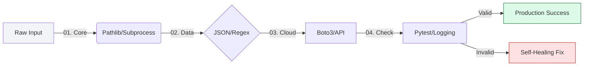

# 🐍 Python for Infrastructure: The Staff Reference Manual

> **"A Junior writes scripts to solve problems. A Staff Engineer writes libraries to build platforms. This reference hub is not just a list of keywords; it is the architectural blueprint for building resilient, high-scale automation."**

Welcome to the **Keyword Encyclopedia**. In the world of Infrastructure-as-Python, your mastery of these libraries determines whether your automation is a fragile script that breaks on the first error, or a robust platform that manages global scale.

## 🏗️ The Curriculum of Mastery
The reference is organized into four core disciplines, each building on the previous to create a complete Infrastructure Engineer's toolbelt.

### [01. 🛠️ Core Automation](./01-core-automation-keywords.md)
**The Foundation**: Object-oriented filesystem handling (`pathlib`), secure process execution (`subprocess`), and structured logic flow.
*   **Junior vs Staff**: Stop using `os.system` and hardcoded strings; start using `check=True` and `Path` objects.

### [02. 📊 Data Manipulation](./02-data-manipulation-keywords.md)
**The Brain**: Normalizing the chaos of cloud outputs. JSON/YAML parsing, high-performance analysis with Pandas, and Regular Expression mastery.
*   **Junior vs Staff**: Stop writing nested `for` loops to filter data; start using list comprehensions and vectorization.

### [03. ☁️ Cloud & Networking](./03-cloud-networking-keywords.md)
**The Reach**: Scripting the global network. Boto3 SDK mastery (Paginators, Waiters), resilient HTTP (`Requests`), and high-scale SSH automation.
*   **Junior vs Staff**: Stop writing `time.sleep()` loops; start using built-in API Waiters and Retry Adapters.

### [04. 🧪 Testing & Observability](./04-testing-observability-keywords.md)
**The Safety Net**: Proving it works before it breaks. Pytest fixtures, AWS mocking with Moto, and structured JSON logging.
*   **Junior vs Staff**: Stop using `print()` for debugging; start using `logging` severity levels and Mocking to prevent side effects.

---

## � The Staff-Level Engineering Bar

In production, Python code is evaluated by its **Predictability**, **Resilience**, and **Portability**.

| Feature | Junior Approach | Principal approach |
|:---|:---|:---|
| **File Paths** | `"C:/logs/log.txt"` (String-heavy) | `Path.home() / "logs" / "log.txt"` (Object-oriented) |
| **System Calls** | `os.system("ls")` (Insecure) | `subprocess.run(["ls"], check=True)` (Safe/Captured) |
| **Data Lists** | `for x in list: new.append(x)` | `[x for x in list if x.active]` (Comprehensions) |
| **API Errors** | Silent failures or generic `try: pass` | `resp.raise_for_status()` with specific exception handling. |
| **Cloud Scale** | Loops that hit API rate limits. | Paginators and Exponential Backoff strategies. |

---

## 🧠 The "Infrastructure-as-Python" Mental Model

---
**Status**: 🏆 Staff-Enhanced (2026-02-03)
