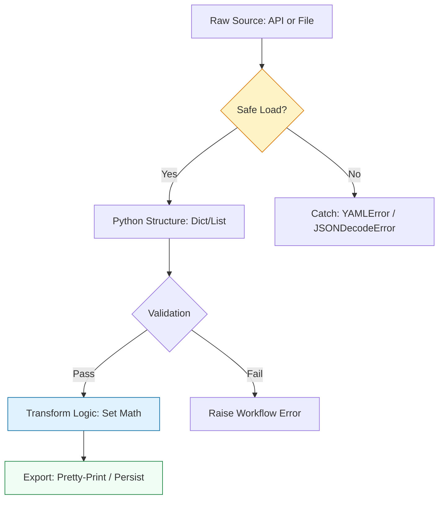

# 🏗️ Data Serialization: Mastering JSON & YAML

> **"Infrastructure is code, and code is data. If you can't parse, validate, and transform JSON and YAML, you aren't managing infrastructure—you're just guessing."**

Welcome to the **Data Serialization** module. In the DevOps ecosystem, YAML and JSON are the languages of truth for Kubernetes, Ansible, CloudFormation, and every modern SaaS API. This module covers the "Staff Standards" for manipulating complex nested data structures safely and efficiently.

**Why This Matters for Junior DevOps Engineers:**
- 🚨 **Production Impact**: A single YAML indentation error can bring down a Kubernetes cluster.
- 💰 **Cost Factor**: Misreading cloud pricing JSON can lead to massive bill surprises.
- 🎯 **Interview Weight**: "Parse this JSON and extract the IP address" is a top interview screening question.
- 🔧 **Daily Operations**: You will convert between JSON/YAML almost daily (e.g., `kubectl get pod -o json`).

---
## 📚 Table of Contents

1. [The Data Interaction Lifecycle](#-the-data-interaction-lifecycle)
2. [JSON: The Language of APIs](#-json-the-language-of-apis)
3. [YAML: The Language of Configuration](#-yaml-the-language-of-configuration)
4. [Advanced Data Transformation](#-advanced-data-transformation)
5. [Real-World DevOps Scenarios](#-real-world-devops-scenarios)
6. [Security Best Practices](#-security-best-practices)
7. [Common Pitfalls & Solutions](#-common-pitfalls--solutions)
8. [Hands-On Exercises](#-hands-on-exercises)
9. [Interview Preparation](#-interview-preparation)
10. [Knowledge Check](#-knowledge-check)

---
## 🏗️ The Data Interaction Lifecycle

DevOps data management is about the **Safe-Parse-Transform** pattern. We move away from brittle index-based access to robust **Getters** and **Set Logic**.



### 🔍 Lifecycle Breakdown

**Stage 1: Safe Loading**
- **What**: converting text (JSON/YAML) into Python objects (Dict/List).
- **Why**: Text is unstructured; Objects represent logic.
- **How**: `json.load()` / `yaml.safe_load()`.

**Stage 2: Validation**
- **What**: Ensuring the data has the required keys and types.
- **Why**: Prevents runtime errors (KeyError) later in the script.
- **How**: Guard clauses using `.get()` or Schema validation.

**Stage 3: Transformation**
- **What**: Modifying, merging, or filtering the data.
- **Why**: To generate new configurations or reports.
- **How**: List comprehensions, Set operations.

---

## 📜 JSON: The Language of APIs

### Core Operations

```python
import json

# 1. Parsing String to Dict (API Response)
api_response = '{"instance_id": "i-123", "state": "running"}'
data = json.loads(api_response)

# 2. Parsing File to Dict (Config File)
with open('config.json', 'r') as f:
    config = json.load(f)

# 3. Dumping Dict to String (Logging)
print(json.dumps(data, indent=2))

# 4. Dumping Dict to File (Saving State)
with open('output.json', 'w') as f:
    json.dump(data, f, indent=2, sort_keys=True)
```

### 💡 Pro Tip: The `default` Argument for Datetime
JSON standard doesn't support datetime objects.
```python
import json
from datetime import datetime

class DateTimeEncoder(json.JSONEncoder):
    def default(self, obj):
        if isinstance(obj, datetime):
            return obj.isoformat()
        return super().default(obj)

data = {'timestamp': datetime.now()}
print(json.dumps(data, cls=DateTimeEncoder))
```

---

## 📜 YAML: The Language of Configuration

### Core Operations

**Note**: Always use `PyYAML` library (`pip install PyYAML`).
```python
import yaml

# 1. Parsing String to Dict
yaml_str = """
apiVersion: v1
kind: Pod
metadata:
  name: nginx
"""
data = yaml.safe_load(yaml_str)  # CRITICAL: Always use safe_load

# 2. Parsing File
with open('pod.yaml', 'r') as f:
    pod = yaml.safe_load(f)

# 3. Dumping Dict to YAML
print(yaml.dump(data, default_flow_style=False))
```

### ⚠️ The `safe_load` Mandate
Never use `yaml.load()` without a loader. It can execute arbitrary code (Remote Code Execution vulnerability).

---

## 🎭 Real-World DevOps Scenarios

### 🛡️ Scenario 1: The "Ghost Resource" Audit

**The Incident:** A financial audit discovered $50,000/year in "Ghost Volumes"—AWS EBS volumes strictly labeled as 'in-use' but attached to terminated instances.

**The Failure:** Manual inspection of the AWS console failed because resources were spread across 20 regions.

**The Fix:** A Python script pulled "Active Inventory" (JSON) and "Billing Reports". Using **Python Sets**, it performed a difference operation to find orphans instantly.

```python
# ✅ The Solution: Set Mathematics
active_volumes = {"vol-123", "vol-456", "vol-789"}  # Data from AWS CLI
billed_volumes = {"vol-123", "vol-456", "vol-789", "vol-000"}  # Data from Bill

# Find what is billed but NOT active
ghosts = billed_volumes - active_volumes
print(f"Ghost Volumes: {ghosts}")
# Output: {'vol-000'}
```

### 🔥 Scenario 2: The Kubernetes Merge Disaster

**The Incident:** A deployment script tried to merge two YAML files (base config + environment overrides). It simply updated the dictionary keys.

**The Failure:** The update overwrote the entire `env` list instead of appending to it, deleting critical database connection variables.

**The Root Cause:**
```python
# ❌ BAD: Dictionary update overwrites lists
base = {'env': ['DB_HOST=localhost']}
prod = {'env': ['LOG_LEVEL=info']}
base.update(prod)
print(base) 
# Output: {'env': ['LOG_LEVEL=info']} -> DB_HOST is GONE!
```

**The Fix:** Deep merging logic.
```python
# ✅ GOOD: Deep Merge Logic
def deep_merge(base, override):
    for key, value in override.items():
        if isinstance(value, dict):
            # Recurse if both are dicts
            node = base.setdefault(key, {})
            deep_merge(node, value)
        elif isinstance(value, list):
             # Strategy decision: Append or Replace? Here we append.
            base[key] = base.get(key, []) + value
        else:
            base[key] = value
    return base
```

---

## 🔒 Security Best Practices

### 1. YAML Deserialization Attacks
**The Risk**: YAML files can define Python objects. If you load untrusted YAML with standard load, an attacker can execute shell commands.

**Mitigation**:
```python
# ❌ VULNERABLE
yaml.load(user_input) 

# ✅ SECURE
yaml.safe_load(user_input)
```

### 2. JSON Bomb (DoS)
**The Risk**: A deeply nested JSON (10,000 layers) can cause a core dump or recursion error (Stack Overflow) when parsed.

**Mitigation**:
```python
# Check/Limit depth logic or use streaming parsers (ijson) for massive files.
# Python's default recursion limit handles typical bad cases by raising RecursionError safely.
import sys
sys.setrecursionlimit(2000) # Only if necessary, otherwise catch the error.
```

---

## ⚠️ Common Pitfalls & Solutions

### Pitfall 1: The KeyError Crash
Accessing deeply nested keys in API responses creates brittle code.

```python
# ❌ BAD
ip = data['networkInterfaces'][0]['privateIpAddress']
# If 'networkInterfaces' is empty -> IndexError
# If key is missing -> KeyError

# ✅ GOOD: Chained .get() or defensive programming
interfaces = data.get('networkInterfaces', [])
if interfaces:
    ip = interfaces[0].get('privateIpAddress')
else:
    ip = None
```

### Pitfall 2: Modifying List while Iterating
```python
# ❌ BAD
for item in server_list:
    if item['status'] == 'stopped':
        server_list.remove(item) # Causes skipping elements!

# ✅ GOOD
# Create a new list (comprehension)
active_servers = [s for s in server_list if s['status'] != 'stopped']
```

---

## 🎯 Hands-On Exercises

### Exercise 1: Log Transformer
**Objective**: Parse a raw log line into a structured JSON object.

**Input**: `2023-10-27 10:00:00 ERROR [auth] User admin failed login from 192.168.1.5`

**Requirements**:
- Extract Timestamp, Level, Service, Message, IP
- Output as JSON

**Starter Code**:
```python
import json
import re

log = "2023-10-27 10:00:00 ERROR [auth] User admin failed login from 192.168.1.5"

pattern = r"(?P<timestamp>[\d\- :]+) (?P<level>\w+) \[(?P<service>\w+)\] (?P<message>.*)"
match = re.match(pattern, log)

if match:
    # TODO: Create dict from match.groupdict()
    # TODO: Print JSON
    pass
```

### Exercise 2: YAML Environment Generator
**Objective**: Read a `base.yaml` and generate `dev.yaml` and `prod.yaml` by applying overrides.

**Requirements**:
- Base has default memory: "512Mi"
- Dev overrides memory to "256Mi"
- Prod overrides memory to "1Gi" and adds a new env var.

---

## 🎙️ Interview Preparation

### Foundation Questions

**1. "What is the difference between `json.load()` and `json.loads()`?"**
- **Answer**: 
  - `json.load()` (no 's') reads directly from a **File object** (stream). Used for `open('data.json')`.
  - `json.loads()` (with 's') reads from a **String**. Used for API responses (text).

**2. "Why do we prefer `json.dumps(indent=4, sort_keys=True)` in Infrastructure as Code?"**
- **Answer**: 
  - `indent=4` makes it human-readable during code reviews.
  - `sort_keys=True` is deterministic. It ensures that if the data hasn't changed, the file order doesn't change. This prevents "phantom diffs" in Git commits where the file looks changed just because keys jumped around.

### Advanced Scenario Questions

**3. "How do you handle parsing a 2GB JSON logs file without running out of RAM?"**
- **Answer**: Do **not** use `json.load()`, which loads the whole file into memory.
- Use **Line Delimited JSON (NDJSON)**: Read line-by-line using `f.readline()` in a loop.
- OR use a streaming library like `ijson` which generates events for parsing (SAX-style) rather than a complete DOM.

---

## 🧠 Knowledge Check

**1. Which library is the de-facto standard for parsing Kubernetes manifests in Python?**
- [ ] `json`
- [x] `PyYAML`
- [ ] `requests`

**2. What does the `get()` method do for a dictionary?**
- [ ] Deletes a key
- [x] Retrieves a value if exists, else returns None/Default (Prevents Crash)
- [ ] Adds a key

**3. Which data structure is best for finding unique items in a list of 1,000,000 server IDs?**
- [ ] List
- [ ] Tuple
- [x] Set

---

## 🎓 Self-Assessment Checklist

Before moving to the next module, ensure you can:
- [ ] Load and Dump JSON/YAML files safely
- [ ] Use `safe_load` for YAML always
- [ ] Use `get()` to safely access nested data
- [ ] Perform list comprehensions for filtering
- [ ] Use Sets for finding differences between two lists
- [ ] Handle `JSONDecodeError` exceptions

**Score yourself**: 5+/6 = Ready to advance | <5 = Review exercises

[⬅️ Back to File Ops](readme.md) | [Next: API Mastery](readme.md) ➡️