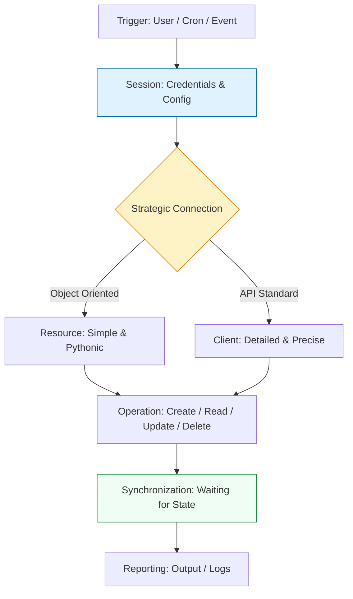

# 🏗️ Boto3 Foundations: The Architecture of Cloud Identity

> **"Identity is the first perimeter. If you are clicking buttons in the AWS Console, you are a guest. If you are using Boto3, you are the architect. The journey to cloud mastery begins with the Session."**

Welcome to the **Foundations of Boto3**. This module is the starting point for your transition from "Manual Operator" to "Automation Architect." You will learn the mechanics of the Boto3 lifecycle, how to manage cloud identity without permanent keys, and the strategic differences between low-level Clients and high-level Resources.

**Why This Matters for Junior DevOps Engineers:**
- 🔐 **Identity Mastery**: Understanding Sessions and IAM Roles is the only way to build secure, production-grade automation.
- 🏗️ **Architectural Choice**: Knowing when to use a Client vs. a Resource saves development time and prevents performance bottlenecks.
- 🎯 **Core Toolset**: Every major AWS automation task (Lambda, CI/CD, Auditing) starts with the foundations you'll learn here.

---

## 📚 Table of Contents

1. [The Cloud Journey Lifecycle](#-the-cloud-journey-lifecycle)
2. [Managing Identity: The Session](#-managing-identity-the-session)
3. [Concurrency: The Thread Safety Guide](#-concurrency-the-thread-safety-guide)
4. [The Hidden Engine: Understanding Botocore](#-the-hidden-engine-understanding-botocore)
5. [The Strategic Choice: Client vs Resource](#-the-strategic-choice-client-vs-resource)
6. [Advanced Identity: Credential Refreshing](#-advanced-identity-credential-refreshing)
7. [Real-World DevOps Scenarios](#-real-world-devops-scenarios)
8. [The Foundation Boilerplate](#-the-foundation-boilerplate)
9. [Hands-On Challenge: The Multi-Region Auditor](#-hands-on-challenge-the-multi-region-auditor)
10. [Knowledge Check](#-knowledge-check)

---

## 🏗️ The Cloud Journey Lifecycle

Every Boto3 script follows a predictable path of discovery and execution.



---

## 🔐 Managing Identity: The Session

The `Session` object is the "Identity Card" of your script. It manages where your credentials come from (IAM Roles, Config files) and which AWS region you are targeting.

### ✅ The Staff Pattern: Explicit Sessions
While `boto3.client()` works by using a default background session, professionals use explicit sessions to handle multi-profile or multi-account tasks safely.

```python
import boto3

# 1. Establish the Session (Who + Where)
session = boto3.Session(
    profile_name='dev-admin',
    region_name='us-east-1'
)

# 2. Use the Session to create clients
s3 = session.client('s3')
```

> **💡 Senior SRE Pro-Tip**: Avoid `boto3.setup_default_session()`. It mutates global state and can cause unpredictable behavior in library code or concurrent environments. If a library you use also calls this, it can overwrite your credentials or region in the middle of a script. **Always pass explicit sessions or create them locally.**

---

## 🧵 Concurrency: The Thread Safety Guide

One of the most common production bugs in AWS automation is sharing Boto3 objects across threads.

### 🛡️ What is Thread-Safe?
- **Clients**: ✅ **YES**. Clients are thread-safe and can be shared across multiple threads.
- **Sessions**: ❌ **NO**. Sessions are **not** thread-safe. You must create a unique session for each thread.
- **Resources**: ❌ **NO**. Resources are **not** thread-safe. They cache internal state and should be created per-thread.

### 🚀 The Multi-Threading Pattern
If you are using `concurrent.futures` to sweep an account, use this pattern:

```python
from concurrent.futures import ThreadPoolExecutor
import boto3

def audit_bucket(bucket_name):
    # CREATE A NEW SESSION PER THREAD
    session = boto3.Session()
    s3_client = session.client('s3')
    return s3_client.head_bucket(Bucket=bucket_name)

with ThreadPoolExecutor(max_workers=5) as executor:
    executor.map(audit_bucket, my_buckets)
```

---

## ⚙️ The Hidden Engine: Understanding Botocore

If Boto3 is the sleek dashboard of a car, **Botocore** is the engine, transmission, and fuel system combined. It is the low-level library that does the heavy lifting for both Boto3 and the AWS CLI.

### 🧩 Why Botocore Exists
AWS has hundreds of services with thousands of API actions. Instead of writing Python code for every single one, the AWS team created **Botocore**. It is **Data-Driven**: it reads JSON "service definitions" to understand how to talk to each service.

### 🛠️ Key Responsibilities of Botocore
- **The Credential Chain**: It searches for your keys in a strict priority order.
- **Request Signing**: It handles the complex **SigV4** authentication process. **Operational Detail**: Botocore calculates the HMAC signature of every request (Headers + Payload) before sending it to ensure integrity.
- **Response Transformation**: It converts raw XML responses from AWS into clean Python dictionaries.
- **Waiters & Paginators**: It provides the logic for "waiting" for a resource to be ready and "paginating" results.
- **The Event System**: This is the "God Mode" of Boto3. You can register handlers to intercept and modify requests before they leave your machine.

#### 🎣 Operational Example: Compliance Injection
Security teams often use Botocore hooks to inject custom User-Agents or headers for auditing.

```python
import boto3

def inject_audit_header(params, **kwargs):
    # Inject a compliance ID into every request
    params['headers']['X-Audit-ID'] = 'CR-9999-Audit'

# 1. Access the underlying Botocore event emitter
s3 = boto3.client('s3')
event_system = s3.meta.events

# 2. Register the hook for 'before-call'
event_system.register('before-call.s3', inject_audit_header)

# All subsequent calls now include the audit header
s3.list_buckets()
```

### 🛡️ Production Pattern: Handling `ClientError`
You cannot catch a specific Boto3 exception like `S3.NoSuchBucket` directly because these exceptions are dynamically generated by Botocore. Instead, you use the `ClientError` pattern.

```python
import boto3
from botocore.exceptions import ClientError

s3 = boto3.client('s3')

try:
    s3.head_bucket(Bucket='non-existent-bucket')
except ClientError as e:
    # Extract the error code (e.g., '404' or 'NoSuchBucket')
    error_code = e.response['Error']['Code']
    if error_code == '404':
        print("Bucket does not exist!")
    else:
        print(f"An unexpected error occurred: {e}")
```

### ⚡ Custom Configuration (The `Config` Object)
SREs use Botocore's `Config` to harden their automation against network instability.

```python
from botocore.config import Config

# Create a hardened configuration
my_config = Config(
    region_name='us-east-1',
    signature_version='v4',
    retries={
        'max_attempts': 10,
        'mode': 'standard' # Better handling of throttling than 'legacy'
    }
)

s3 = boto3.client('s3', config=my_config)
```

### 🧠 Deep Dive: The Data-Driven Model
The most powerful aspect of Botocore is that it is **codeless**. It doesn't contain the logic of AWS services; it contains **definitions**. 
- **Serialization**: When you call `s3.list_buckets()`, Botocore looks at a JSON definition, translates your Python call into a `POST` or `GET` request, and signs it.
- **Service Models**: You can find these definitions in your environment at `site-packages/botocore/data/<service>/<date>/service-2.json`. Reading these files is the ultimate way to understand what an API *actually* supports, beyond the documentation.

---

## ⚔️ The Strategic Choice: Client vs Resource

Boto3 provides two interfaces. Choosing correctly is the first hallmark of a Senior DevOps Engineer.

| Feature | The Client | The Resource |
| :--- | :--- | :--- |
| **Philosophy** | "Talk to the API" | "Interact with Objects" |
| **Response** | 📖 Dictionaries (Dict/JSON) | 📦 Objects (`bucket.id`) |
| **Speed** | ⚡ Fast (Low overhead) | 🐢 Slower (Object instantiation) |
| **Thread Safety** | ✅ Highly Thread Safe | ❌ Not Thread Safe |
| **Maintenance** | ✅ Always updated (API-driven) | ⚠️ Deprioritized by AWS team |
| **Recommendation** | **MANDATORY** for production. | **AVOID** in high-concurrency apps. |

> **⚠️ Critical Warning**: The AWS Python team has shifted focus to the `Client` interface. The `Resource` interface for many newer services does not exist, and existing ones (like S3/EC2) are often missing newer features. **Train your brain to use the Client.**

### 🔍 Client Example (Precise)
```python
client = boto3.client('s3')
response = client.list_buckets()
# Accessing data involves key-based lookups
for b in response['Buckets']:
    print(b['Name'])
```

### 🔍 Resource Example (Pythonic)
```python
s3 = boto3.resource('s3')
# Accessing data involves object attributes
for b in s3.buckets.all():
    print(b.name)
```

---

## 🛠️ Advanced Identity: Credential Refreshing

When using IAM Roles (the standard for EC2, Lambda, or Kubernetes), credentials are **temporary**. 

### 🔄 How Botocore Refreshes
Botocore manages this lifecycle automatically:
1. It requests tokens from the Metadata Service (`169.254.169.254`).
2. It caches them in memory.
3. It checks the `Expiration` timestamp of the token.
4. It **automatically refreshes** the token (~15 minutes before expiry) without interrupting your script.

### 📜 The Strict Resolution Order (The "Credential Chain")
If you don't provide a profile or keys, Botocore searches in this exact order:
1. **Developer Arguments**: `boto3.client(aws_access_key_id=...)`
2. **Environment Variables**: `AWS_ACCESS_KEY_ID`, `AWS_SECRET_ACCESS_KEY`
3. **SSO/Config**: `~/.aws/config` (SSO sessions)
4. **Credentials File**: `~/.aws/credentials`
5. **IAM Role**: Metadata for EC2/ECS/Lambda.

> **Staff Engineer Note**: If you manually pass `aws_access_key_id` to a client, you are responsible for refreshing it. If you use a `Session`, Botocore does it for you. This is why hardcoding keys is not just insecure, it's technically inferior.

> **💡 Senior SRE Pro-Tip**: For massive S3 uploads/downloads, don't use standard `put_object`. Use the **S3 Transfer Manager** (higher-level abstraction in Boto3) which handles multi-part uploads and concurrency automatically.

---

## 🎭 Real-World DevOps Scenarios

### 🛡️ Scenario 1: The "Production Accident"
**The Incident**: A developer had their "Default" AWS profile set to `Production`. They ran a cleanup script on their laptop, thinking it would target their `Dev` profile.
**The Fix**: Rewrote all scripts to **require** an explicit `profile_name` in the Session or use Environment Variables, preventing "Default Account" accidents.
**The Lesson**: The global default session is a trap. **Be explicit.**

### 🔥 Scenario 2: The "Multi-Account Audit"
**The Incident**: A security team needed to check IAM password policies across 20 different AWS accounts. 
**The Fix**: A script that iterated through a list of account profiles, creating a new **Session** for each and then a Client to perform the check.
**The Lesson**: Sessions are the lifeblood of multi-account governance.

---

## 💻 The Foundation Boilerplate

This template sets up a professional, session-based Boto3 environment.

```python
import sys
import boto3
import logging

# Configure professional logging
logging.basicConfig(level=logging.INFO, format='%(levelname)s: %(message)s')
logger = logging.getLogger(__name__)

def run_foundation_check(profile: str):
    # 1. Identity Initialization
    try:
        session = boto3.Session(profile_name=profile)
        logger.info(f"✅ Identity established using profile: {profile}")
    except Exception as e:
        logger.error(f"❌ Failed to find profile '{profile}': {e}")
        sys.exit(1)

    # 2. Connection Initialization
    s3 = session.client('s3')
    
    # 3. Simple Discovery
    try:
        buckets = s3.list_buckets()
        count = len(buckets['Buckets'])
        logger.info(f"📊 Found {count} S3 buckets in this account.")
    except Exception as e:
        logger.error(f"🚨 API access denied: {e}")

if __name__ == "__main__":
    run_foundation_check("dev-sandbox")
```

---

## 🏗️ Hands-On Challenge: The Multi-Region Auditor

**Goal**: Create a script that connects to two different regions (`us-east-1` and `eu-west-1`) simultaneously using explicit sessions and lists the S3 buckets in each.

### 🛠️ The Challenge Requirements:
1. Initialize two separate `boto3.Session` objects.
2. Create an S3 client from each session.
3. Handle a `ClientError` if the account doesn't have permissions in one of the regions.
4. Use a Botocore `Config` object to set a custom retry limit of 5.

### 💡 Hint for the Win:
```python
from botocore.config import Config

secure_config = Config(retries={'max_attempts': 5})

session_us = boto3.Session(region_name='us-east-1')
client_us = session_us.client('s3', config=secure_config)
```

---

## 🎙️ Interview Preparation

### Foundation Questions
1. **"What is a Boto3 Session, and why is it useful?"**
   - *Answer*: A Session manages the connection state, including credentials and default configuration. It is useful for managing multiple AWS profiles or regions in the same script without relying on global defaults.
2. **"Which authentication method is the most secure for code running on AWS (EC2/Lambda)?"**
   - *Answer*: **IAM Roles.** By attaching a role to the resource, Boto3 automatically retrieves temporary credentials via the metadata service, eliminating the need for hardcoded keys.
3. **"Why can't you catch `S3.NoSuchBucket` directly in a standard Python try-except block?"**
   - *Answer*: Because Boto3/Botocore generates service exceptions **dynamically** at runtime. The standard way to handle this is to catch `botocore.exceptions.ClientError` and check the `Error.Code` in the response dictionary.

---

## 🧠 Knowledge Check

1. **How do you create an S3 client for the 'us-west-2' region?**
   - [ ] `boto3.s3(region='us-west-2')`
   - [x] `boto3.client('s3', region_name='us-west-2')`
   - [ ] `boto3.resource('s3').location('us-west-2')`

2. **True or False: A `Resource` returns a Python dictionary when calling an action.**
   - [ ] True.
   - [x] False (Clients return dictionaries; Resources return Objects).

3. **What happens if you don't provide a `profile_name` or `ACCESS_KEY` to Boto3?**
   - [ ] It fails immediately.
   - [x] It searches for credentials in environment variables, then local config files, then IAM Roles.

---
## 🎓 Self-Assessment Checklist

- [ ] I can explain the difference between a Session and a Client.
- [ ] I understand that **Botocore** is the data-driven engine beneath Boto3.
- [ ] I have configured my local `~/.aws/credentials` file.
- [ ] I can create both a Client and a Resource in Python.
- [ ] I understand the **Credential Chain** priority order.
- [ ] I can handle `ClientError` exceptions using Botocore.
- [ ] I can describe the 5 stages of the Cloud Journey Lifecycle.

**Ready to handle Scale and Resilience?**

[⬅️ Back to Cloud Overview](../../readme.md) | [Next: Scale & Resilience →](../02-scale-and-resilience/readme.md)
