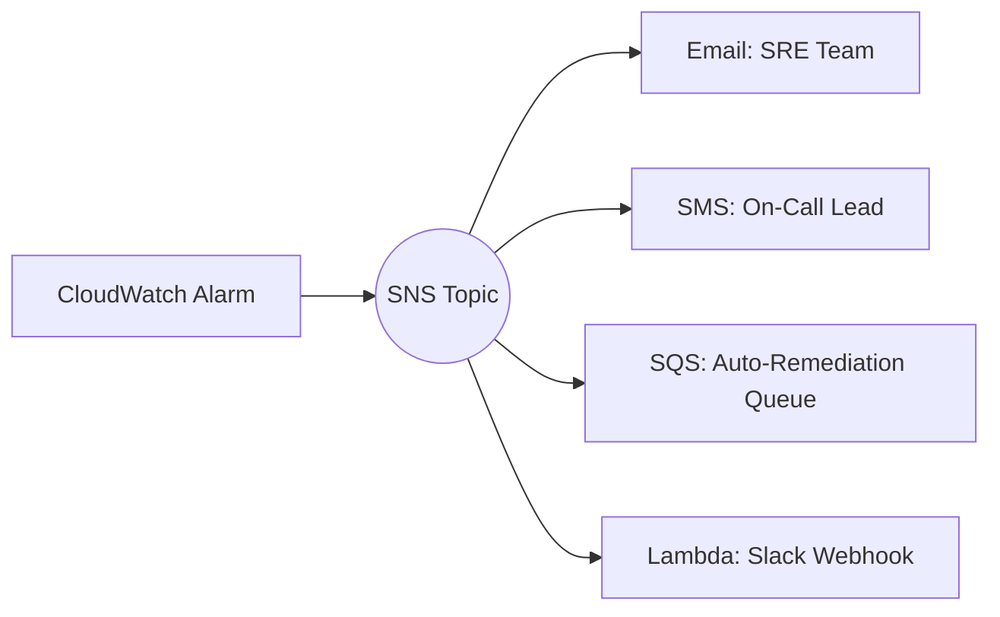
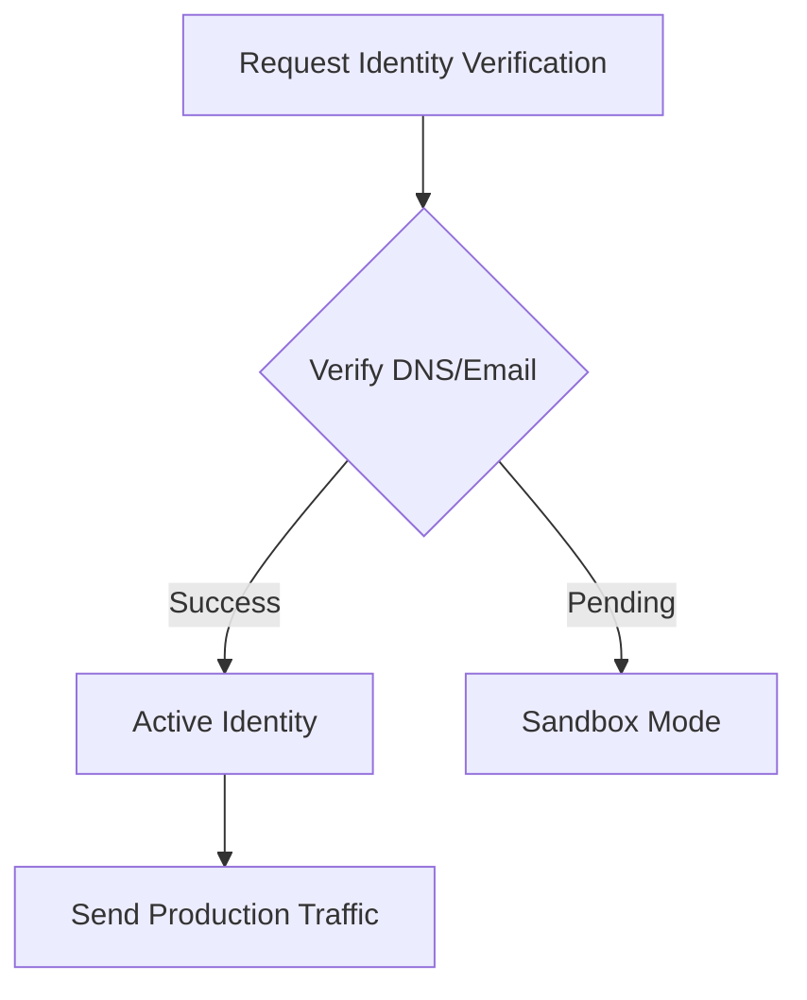

# 📢 Messaging & Notifications: The Voice of Automation

> **"If an automation script runs in a forest and no one is there to receive the alert, did it ever really run? In DevOps, if you can't notify the team, the automation didn't happen."**

Welcome to the **Communication Hub**. As a DevOps engineer, your job is to bridge the gap between "Code" and "Humans." Whether it's an urgent SMS for a site-down incident, a weekly audit report via email, or a push notification to an SRE's mobile app, this module covers the programmatic voice of the cloud.

---

## 📚 Table of Contents
1. [The Junior's Mission](#-the-juniors-mission)
2. [The Communication Analogy](#-the-communication-analogy)
3. [Service Comparison](#-service-comparison)
4. [Visual Architecture](#-visual-architecture)
5. [Sub-Modules](#-sub-modules)
6. [Challenges](#-challenges)

---

## 🎯 The Junior's Mission
Your mission is to master **Programmatic Communication**. You will move beyond manual console clicks and build systems that talk to users and other services automatically. You are responsible for ensuring that the right message reaches the right person at the right time.

---

## 📻 The Communication Analogy

Understanding the difference between AWS messaging services can be tricky. Use these mental models:

*   **SNS (Simple Notification Service)** is like a **Radio Station**. It broadcasts a message to anyone who is "tuned in" (subscribed). It's designed for **One-to-Many** communication.
*   **SES (Simple Email Service)** is like a **Certified Letter**. It's a professional, highly deliverable way to send a message to a specific inbox. It's designed for **One-to-One** (or transactional) communication.
*   **SQS (Simple Queue Service)** is like a **P.O. Box**. Messages aren't delivered directly to a person; they sit in a box waiting for a worker to come and pick them up. It's designed for **Asynchronous Storage** and decoupling.

---

## 📊 Service Comparison

| Feature | SES (Simple Email Service) | SNS (Simple Notification Service) | Pinpoint |
| :--- | :--- | :--- | :--- |
| **Primary Use-Case** | Marketing & Transactional Email | System Alerts & Pub/Sub | Cross-Channel Engagement |
| **Communication Type** | One-to-One (Email) | One-to-Many (SMS, Email, Push, HTTP) | Targeted Campaigns |
| **Cost Efficiency** | Extremely High for Bulk Email | High for Pub/Sub; SMS costs vary | Medium (Premium features) |
| **Target Audience** | Humans (Inboxes) | Humans (SMS/Email) & Apps (SQS/Lambda) | End-Users (Marketing) |

---

## 🏗️ Visual Architecture

### 🔄 The "Fan-Out" Pattern
This is a core architectural pattern where a single message (SNS) is "fanned out" to multiple destinations (SQS, Email, SMS) simultaneously.

### 🔐 Auth & Identity Flow
Before sending communication, you must prove you own the identity (Domain or Email).

---

## 📁 Sub-Modules

1.  **[01-SMS-Alerts-SNS](./01-sms-alerts-sns/readme.md)**: Master the broadcast.
2.  **[02-Email-Automation-SES](./02-email-automation-ses/readme.md)**: Professional identity and delivery.
3.  **[03-Application-PubSub-SQS](./03-application-pubsub-sqs/readme.md)**: Building decoupled, fanned-out architectures.
4.  **[04-Mobile-Push-Pinpoint](./04-mobile-push-pinpoint/readme.md)**: Reaching users where they are (Mobile).

---

## 🏆 Ready for the Challenge?
Check out **[CHALLENGES.md](./challenges.md)** to put your skills to the test with real-world scenarios.
