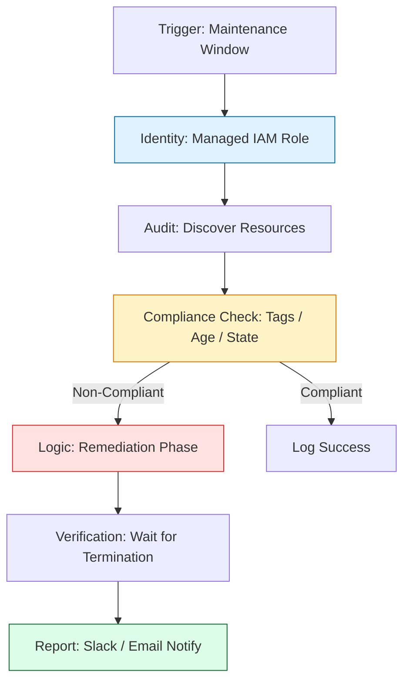

# 🏆 Secure Cloud Orchestration

> **"A script in a lab is code; a script in production is a liability. Master-level Boto3 is about identity governance, security guardrails, and cost-aware execution. If you handle keys, you failed; if you manage Roles, you architect."**

Welcome to the **Endgame of Boto3 Mastery**. In this final module, we bridge the gap between "Logic" and "Compliance." We focus on **Security First**—moving from static keys to IAM Roles—and explore complex production patterns like **FinOps Automation**, **Multi-Region Disaster Recovery**, and **Defensive Multi-Account Handling**.

**Why This Matters for Junior DevOps Engineers:**
- 🛡️ **Zero-Credential Risk**: You'll learn to never touch an Access Key, eliminating the chance of a career-ending credential leak.
- 💰 **Economic Engineering**: You'll lead FinOps initiatives by automating the cleanup of "Ghost Costs" (unattached disks and orphaned IP's).
- 🌍 **Global Orchestration**: You'll build tools that span 20+ AWS regions without hard-coding a single name.

---

## 📚 Table of Contents

1. [The Governance Lifecycle](#-the-governance-lifecycle)
2. [The "Zero-Key" Principle: IAM Roles](#-the-zero-key-principle-iam-roles)
3. [Multi-Region & Multi-Account Patterns](#-multi-region--multi-account-patterns)
4. [FinOps: Automating Waste Removal](#-finops-automating-waste-removal)
5. [Real-World DevOps Scenarios](#-real-world-devops-scenarios)
6. [The "Staff Level" Operations Boilerplate](#-the-staff-level-operations-boilerplate)
7. [Common Pitfalls & Solutions](#-common-pitfalls--solutions)
8. [Hands-On Exercises](#-hands-on-exercises)
9. [Interview Preparation (Staff Level)](#-interview-preparation-staff-level)
10. [Knowledge Check](#-knowledge-check)

---

## 🏗️ The Governance Lifecycle
Orchestrating production requires balancing **Speed** and **Safety**.



---

## 🔐 The "Zero-Key" Principle: IAM Roles
In production, **Static Credentials (`AWS_ACCESS_KEY_ID`) are the #1 Security Risk.** If a laptop is stolen or a repo leaked, the blast radius is infinite.
### The Staff Standard: IAM Instance Profiles
Boto3 is designed to find credentials automatically. When running on an EC2 instance, Lambda, or ECS task, **attach an IAM Role** to the compute resource. Boto3 will pull temporary, rotating credentials from the Metadata Service.
### ✅ The Professional Approach
```python
import boto3

# No hardcoded keys. No environment variables.
# Boto3 implicitly finds the Role assigned to the EC2/Lambda
s3 = boto3.client('s3')

# Verification for debugging
sts = boto3.client('sts')
print(sts.get_caller_identity()) # Reports the execution ROLE name
```
---
## 🌍 Multi-Region & Multi-Account Patterns
A Staff Engineer never hard-codes a region. They treat the cloud as a map.
### 🚀 Pattern: The All-Region Auditor
```python
ec2_global = boto3.client('ec2', region_name='us-east-1')
# Dynamically fetch every region in the partition
all_regions = [r['RegionName'] for r in ec2_global.describe_regions()['Regions']]

for region in all_regions:
    print(f"🌍 Auditing Region: {region}")
    reg_client = boto3.client('ec2', region_name=region)
    # Check instances, VPCs, etc. in THIS region...
```
---
## 💰 FinOps: Automating Waste Removal
Automation is the primary tool for **FinOps (Financial Operations)**. You will use Boto3 to hunt for "Orphaned" costs.
### The "Available Disk" reaper
Unattached EBS volumes (Status: `available`) cost money even when they are idle.
```python
ec2 = boto3.client('ec2')
# Filter for volumes that are NOT attached to any VM
resp = ec2.describe_volumes(Filters=[{'Name': 'status', 'Values': ['available']}])

for vol in resp['Volumes']:
    print(f"💰 Found orphaned volume {vol['VolumeId']}. Deleting...")
    # ec2.delete_volume(VolumeId=vol['VolumeId'])
```
---
## 🎭 Real-World DevOps Scenarios

### 🛡️ Scenario 1: The "Public Bucket" Incident
**The Incident**: A developer accidentally changed an S3 bucket with customer PII to "Public" while troubleshooting.
**The Fix**: A Boto3 script running as a Lambda function (triggered by CloudWatch Events) immediately detects the change and reverts it, while sending a Slack alert to the Security team.
**The Lesson**: Reactive automation is the only way to ensure **24/7 Compliance.**
### 🔥 Scenario 2: The $10,000 "Forgotten" Cluster
**The Incident**: A temp project involved spinning up 50 large instances for a data crunch. The project ended, but the instances remained "Running" for 2 weeks.
**The Fix**: A Boto3 script that runs every night at 8 PM, checks for the tag `Lifecycle: Temporary`, and stops any instance that has been running longer than 12 hours.
**The Lesson**: Automation is the **Police of the Cloud.**

---
## 💻 The "Staff Level" Operations Boilerplate
This boilerplate is designed for multi-region security audits.

```python
import sys
import boto3
import logging
from botocore.exceptions import ClientError

logging.basicConfig(level=logging.INFO)
logger = logging.getLogger("CloudGov")

class CloudAuditor:
    def __init__(self, region="us-east-1"):
        self.region = region
        # No keys. Uses Instance/Task Identity
        self.ec2 = boto3.client('ec2', region_name=region)

    def get_orphaned_ips(self):
        """Find Elastic IPs not attached to anything."""
        try:
            ips = self.ec2.describe_addresses()
            orphans = [ip['PublicIp'] for ip in ips['Addresses'] if 'InstanceId' not in ip]
            return orphans
        except ClientError as e:
            logger.error(f"Failed to fetch IPs in {self.region}: {e}")
            return []

def main():
    # 1. Discover all regions
    global_ec2 = boto3.client('ec2', region_name='us-east-1')
    regions = [r['RegionName'] for r in global_ec2.describe_regions()['Regions']]
    
    # 2. Audit across the map
    total_waste = 0
    for reg in regions:
        auditor = CloudAuditor(reg)
        ips = auditor.get_orphaned_ips()
        if ips:
            logger.warning(f"🚨 Region {reg} has {len(ips)} orphaned IPs: {ips}")
            total_waste += len(ips)
    
    logger.info(f"Audit Complete. Total Waste Points: {total_waste}")

if __name__ == "__main__":
    main()
```

---

## 🎙️ Interview Preparation (Staff Level)

### Advanced Scenario Questions
1. **"How do you securely give a script running in Account A access to resources in Account B?"**
   - *Answer*: I use **Cross-Account Roles**. The script in Account A assumes a Role in Account B using the `sts.assume_role()` API. This provides temporary credentials for Account B without any permanent keys or password sharing.
2. **"What is the 'Instance Metadata Service' (IMDSv2) and why does Boto3 use it?"**
   - *Answer*: IMDSv2 is a local endpoint (169.254.169.254) on AWS compute resources. Boto3 queries it to retrieve temporary security tokens. Using IMDSv2 (over v1) ensures defense against SSRF attacks by requiring a session token for every metadata request.

---

## 🧠 Knowledge Check

1. **What is the most secure way for a Lambda to access S3?**
   - [ ] Hardcoded secret in code.
   - [ ] Environment variable `AWS_ACCESS_KEY_ID`.
   - [x] IAM Execution Role.

2. **To iterate all regions, which client's `describe_regions` do you call first?**
   - [ ] S3.
   - [ ] IAM.
   - [x] EC2.

3. **True or False: An Elastic IP is free even if it is not attached to an instance.**
   - [ ] True.
   - [x] False (AWS charges for unattached EIPs to discourage IP waste).

---
## 🎓 Self-Assessment Checklist

- [ ] I can explain the security risk of `AWS_ACCESS_KEY_ID`.
- [ ] I can write a script that queries STS caller identity.
- [ ] I have executed a multi-region resource loop.
- [ ] I understand how cross-account `assume_role` works.
- [ ] I can find and delete orphaned EBS volumes programmatically.

**Congratulations! You have mastered the Production Engine of Boto3.**

[⬅️ Back to Scale & Resilience](../02-scale-and-resilience/readme.md) | [Home: Python for Infrastructure](../../readme.md)
