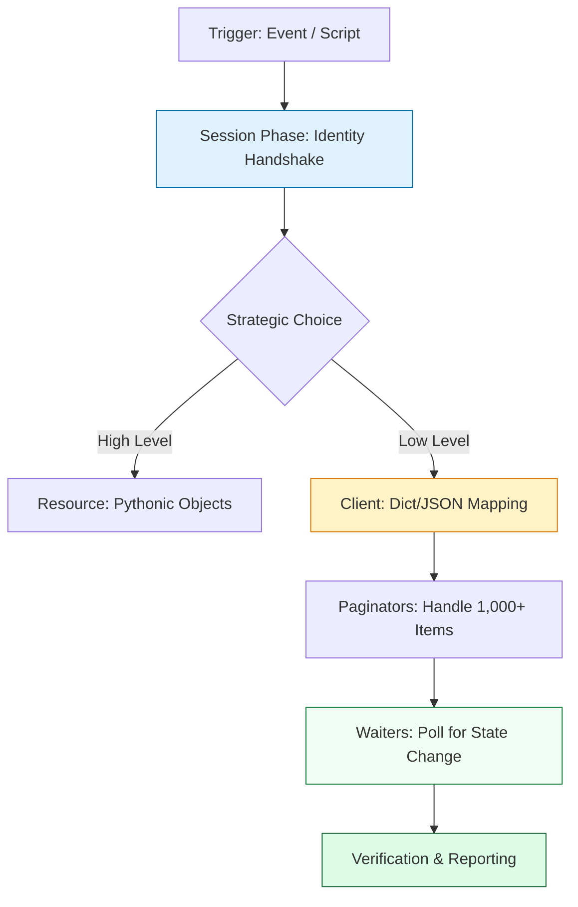

# ☁️ Cloud Automation: Boto3 Mastery (The AWS Controller)

> **"If you are clicking buttons in the AWS Console, you are a guest. If you are using Boto3, you are the architect. In the world of cloud automation, identity is the first perimeter, and logic is the engine of scale."**

Welcome to **Boto3 Mastery**. Boto3 is the official AWS SDK for Python and the central nervous system of modern Cloud Engineering. Whether you are building self-healing infrastructure, auditing security drift, or managing multi-region server fleets, Boto3 is the tool that transforms Python code into cloud reality.

---

## 📚 Table of Contents

1. [The Junior's Mission](#-the-juniors-mission)
2. [Operational Reality: The AWS Perimeters](#-operational-reality-the-aws-perimeters)
3. [The Cloud Automation Lifecycle](#-the-cloud-automation-lifecycle)
4. [The Development Lifecycle Breakdown](#-the-development-lifecycle-breakdown)
5. [Identity & Authentication (Sessions)](#-identity--authentication-sessions)
6. [Client vs Resource: The Strategic Choice](#-client-vs-resource-the-strategic-choice)
7. [Handling Scale: Paginators](#-handling-scale-paginators)
8. [Handling State: Waiters](#-handling-state-waiters)
9. [Senior SRE Pro-Tips](#-senior-sre-pro-tips)
10. [Hands-On Challenge: The "EBS Encryption Auditor"](#-hands-on-challenge-the-ebs-encryption-auditor)
11. [Interview Preparation](#-interview-preparation)

---

## 🎯 The Junior's Mission
Your mission is to transition from a "Console User" to a **"Cloud Orchestrator."** You will learn to move beyond clicking in the GUI and build automation that manages thousands of resources across **Global AWS Regions**, leveraging the "Zero-Key" identity model to eliminate security risks while ensuring 100% compliance at scale.

---

## 🌩️ Operational Reality: The AWS Perimeters
In a large production environment, automation is a double-edged sword.
*   **The Win**: Automated cleanup of $10,000/mo in orphaned snapshots and instant multi-region recovery.
*   **The Hazard**: **The API Throttling Trap.** If 1,000 instances of your script call `describe_instances` every second, AWS will shut you down (429 Too Many Requests). **Intelligent retry policies and pagination are not features—they are requirements.**

---

## 🏗️ The Cloud Automation Lifecycle

Building for the cloud requires **State Awareness** and **Scalability**. We move beyond simple API calls to a structured lifecycle of identity, connection, and synchronization.



---

## 🔄 The Development Lifecycle Breakdown

Reliable Cloud automation requires strict environmental discipline to handle multi-region scaling.

**Stage 1: Environment Isolation**
- **What**: Creating a dedicated `venv` for your automation tools.
- **Why**: Prevents "Library Drift." AWS releases Boto3 updates multiple times a week. A script coded against a 2023 version might miss new parameters added in a 2024 version.
- **How**: Using `pipenv` or `poetry` to manage and lock your cloud SDK dependencies.

**Stage 2: Dependency Management**
- **What**: Pinning `boto3` and `botocore` explicitly.
- **Why**: Ensures **Reproducible Builds**. If you use `boto3` in a Lambda Layer, not pinning the version can lead to silent failures when the Lambda runtime environment updates its global libraries.
- **How**: Using `requirements.txt` with specific pins (e.g., `boto3==1.34.0`).

**Stage 3: Structured Code**
- **What**: Separating **Identity Plumbing** (Sessions) from **Business Logic**.
- **Why**: Improves **Testability**. You should be able to mock the Boto3 client to test your logic without actually hitting the AWS API (saving time and money).
- **How**: Passing the `client` or `resource` object into your functions as an argument rather than creating it inside the function.

**Stage 4: Verification**
- **What**: Implementing **Dry Runs** and **Permission Audits**.
- **Why**: Prevents accidental "Mass Deletions." AWS APIs like `delete_buckets` are permanent. Before executing, your script should verify it has the correct target list.
- **How**: Using the `--dry-run` flag pattern in your scripts or the `dry_run=True` parameter in many EC2 API calls.

**Stage 5: Fail-Fast Pattern**
- **What**: Validating the **Session Identity** and **Region** at startup.
- **Why**: Protects against **Cross-Account Mishaps**. You don't want to run a "Cleanup" script in Production when you thought you were in Staging.
- **How**: Calling `sts.get_caller_identity()` and verifying the `Account` ID matches your expectations before running any management logic.

---

## 🔐 Identity & Authentication: The "Zero-Key" Principle

The staff-standard for AWS identity: **Zero hardcoded credentials.**

### The Staff Standard: Credential Chain
1. **Local**: `aws sso login` (Short-lived tokens).
2. **Production**: **IAM Roles** (No access keys involved).
3. **Internal Code**: `boto3.Session()` (Zero arguments).

---

## ⚔️ Client vs Resource: The Strategic Choice

| Feature          | The Client (Low-Level)      | The Resource (High-Level)     |
| :--------------- | :-------------------------- | :---------------------------- |
| **Philosophy**   | Modular (JSON Dicts)        | Object-Oriented (Pythonic)    |
| **Velocity**     | High (Fast execution)       | Medium (Object overhead)      |
| **Staff Choice** | **Production Core Logic**   | Quick Lab/Admin Scripts       |

---

## 📈 Handling Scale: The "1,000 Item" Trap

Always assume you have 100,000 items. **Never** use naked `list_` or `describe_` calls for enterprise inventory.

### ✅ The Paginator Pattern
```python
client = boto3.client('s3')
paginator = client.get_paginator('list_objects_v2')

for page in paginator.paginate(Bucket='prod-data-lake'):
    # This handles tokens automatically
    for obj in page.get('Contents', []):
        process(obj['Key'])
```

---

## ⏳ Handling State: Waiters

Cloud actions are asynchronous. **Never** use `time.sleep()`.

### ✅ The Staff Pattern: Waiters
```python
ec2.start_instances(InstanceIds=[id])
waiter = ec2.get_waiter('instance_running')
# Blocks accurately until the state is 'running'
waiter.wait(InstanceIds=[id])
```

---

## 💡 Senior SRE Pro-Tips

*   **Custom Retries**: For heavy auditing, configure `botocore.config.Config(retries={'max_attempts': 10, 'mode': 'adaptive'})`. This enables progressive backoff that respects AWS throttling signals.
*   **The STS Check**: Start every script with a call to `sts.get_caller_identity()`. Log the account ID and role ARN immediately to ensure audit trails are clear.
*   **Error Mapping**: Use `from botocore.exceptions import ClientError` and catch errors by code: `if e.response['Error']['Code'] == 'EntityAlreadyExists':`.

---

## 🏗️ Hands-On Challenge: The "EBS Encryption Auditor"

**Goal**: Build a Python script that iterates through a list of AWS Regions, finds any EBS Volume that is not encrypted, and tags it with `SecurityReview: Mandatory`.

### 🛠️ The Challenge Requirements:
1.  **Discovery**: Dynamically fetch all available regions via `ec2.describe_regions()`.
2.  **Scale**: Use an S3 Paginator or EC2 Paginator to handle high volume.
3.  **Governance**: Log the Account ID and the total number of unencrypted volumes found.
4.  **Reporting**: Export the list of insecure volumes to a **JSON file** named `ebs_security_report_[account_id].json`.

---

## 🎙️ Interview Preparation

1.  **"What is the risk of using Boto3 `Resource` in a production-grade automation script?"**
    *   *A*: Incompleteness and speed. Resources lag behind Clients in new feature support and have higher overhead due to object instantiation. Most production systems use Clients for 100% reliability.
2.  **"How do you handle AWS Throttling in a script that manages 10,000 EC2 instances?"**
    *   *A*: I implement **Paginators** for retrieval and a **Custom Retry Config** with `adaptive` mode. I also break the operations into batches and use `time.sleep` with Jitter if the adaptive retries are still being throttled.

---

**Status**: ☁️ Staff-Enhanced (2026-02-04)

---
## 🧭 Additional Modules
- [01 Boto3 Foundations](01-boto3-foundations/readme.md)
- [02 Scale and Resilience](02-scale-and-resilience/readme.md)
- [03 Messaging and Notifications](03-messaging-and-notifications/readme.md)
- [04 Production Patterns](04-production-patterns/readme.md)
