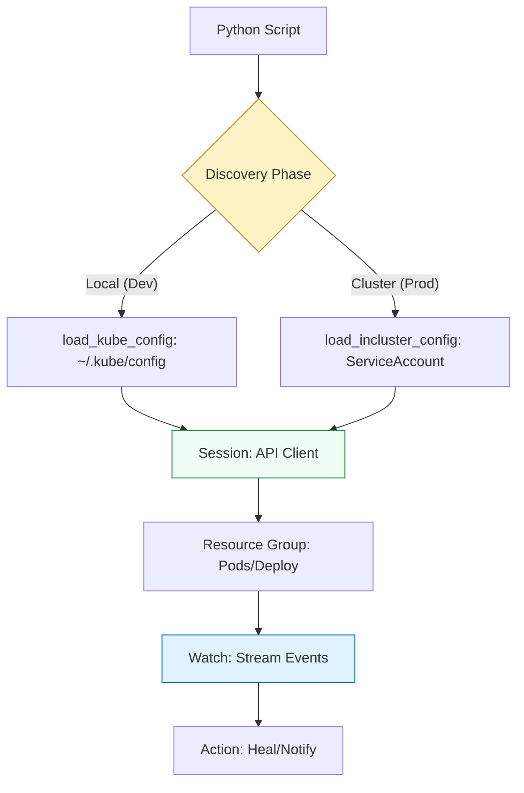

# 🎡 Orchestration: Docker & Kubernetes SDKs

> **"YAML is a static declaration of intent. Python is a dynamic execution of will. When your architecture needs to make decisions—wait for a DB, check a port, then scale—you need the SDK."**

Welcome to the **Container Orchestration** module. While YAML manifests (`kubectl apply -f`) are standard for deployment, Python is the **"Brain"** of the control plane. Using the official Docker and Kubernetes SDKs, you can build custom controllers, automated image pruners, and self-healing infrastructure that reacts to real-time cluster state.

---

## 📚 Table of Contents

1. [The Junior's Mission](#-the-juniors-mission)
2. [Operational Reality: The API Burden](#-operational-reality-the-api-burden)
3. [Architecture: The Control Plane Lifecycle](#-architecture-the-control-plane-lifecycle)
4. [The Development Lifecycle Breakdown](#-the-development-lifecycle-breakdown)
5. [The Docker SDK (`docker-py`)](#-the-docker-sdk-docker-py)
6. [The Kubernetes SDK (`kubernetes`)](#-the-kubernetes-sdk-kubernetes)
7. [Staff Patterns: Efficiency & Watched Events](#-staff-patterns-efficiency--watched-events)
8. [Senior SRE Pro-Tips](#-senior-sre-pro-tips)
9. [Hands-On Challenge: The "OOM-Kill Sentinel"](#-hands-on-challenge-the-oom-kill-sentinel)
10. [Interview Preparation](#-interview-preparation)

---

## 🎯 The Junior's Mission
Your mission is to stop being a "Consumer" of Kubernetes and start being a **"Builder"** of the platform. You will learn to write Python code that "lives" inside a cluster, monitors its surroundings, and takes corrective action when things go wrong—migrating from static YAML to dynamic, decision-making automation.

---

## 🌩️ Operational Reality: The API Burden
In a large cluster, every Python script you write is a potential "DDoS" attack on your own Master Node.
*   **The Win**: Automated cleanup of 10,000+ "Zombie" Pods and instant auto-scaling.
*   **The Hazard**: **API Throttling.** If 1,000 instances of your script poll the K8s API every second, the control plane will crash. **Event-driven Watched streams are the only professional way to scale.**

---

## 🏗️ Architecture: The Control Plane Lifecycle

Scripts don't just "run commands". They talk to the API Server via REST-over-HTTP.



---

## 🔄 The Development Lifecycle Breakdown

Reliable Orchestration requires a disciplined engineering approach.

**Stage 1: Environment Isolation**
- **What**: Sanitizing the local development workspace using `venv` or Docker.
- **Why**: Prevents "SDK Mismatch." Every K8s version has a corresponding Python SDK version. Using the wrong one can lead to silent failures when accessing new API fields.
- **How**: Using a `Dockerfile` for your automation script that bases itself on the official Python-Slim image to keep the footprint low.

**Stage 2: Dependency Management**
- **What**: Explicitly locking `kubernetes` and `docker` library versions.
- **Why**: Kubernetes APIs deprecate rapidly. A script that works on K8s 1.25 might break on 1.28 if your library is not pinned.
- **How**: Using `requirements.txt` with specific pins (e.g., `kubernetes==28.1.0`).

**Stage 3: Structured Code**
- **What**: Separating **API Authentication** from **Orchestration Logic**.
- **Why**: Improves **Portability**. Your script should be able to run on your laptop (Dev) and inside EKS (Prod) without changing the core logic.
- **How**: Creating a `get_api_client()` wrapper that intelligently chooses between `load_kube_config` and `load_incluster_config`.

**Stage 4: Verification**
- **What**: Implementing **Dry Runs** and **Label Validation**.
- **Why**: Prevents accidental "Mass Deletions." Before deleting a Pod, verify it has the specific labels your script is targeted for.
- **How**: Using the `dry_run='All'` flag in K8s API calls to see the result without making the change.

**Stage 5: Fail-Fast Pattern**
- **What**: Validating RBAC and Connectivity at the start.
- **Why**: Prevents "Permission Denied" crashes in the middle of a critical operation.
- **How**: Attempting a simple "List Namespaces" call at the start of the script to verify that the **ServiceAccount** has the required permissions.

---

## 🐋 The Docker SDK (`docker-py`)

Excellent for local development automation and CI runners.

### Managing Containers (The Pythonic Way)
```python
import docker

client = docker.from_env()

# ✅ STAFF PATTERN: Use 'detach=True' and named containers
container = client.containers.run(
    "nginx:alpine",
    detach=True,
    name="automation-proxy",
    environment={"STAGE": "PROD"}
)
```

---

## ☸️ The Kubernetes SDK (`kubernetes`)

The standard for production orchestration.

### Initializing the Intelligently Authenticated Client
```python
from kubernetes import client, config
import os

def get_k8s_v1_client():
    if os.getenv('KUBERNETES_SERVICE_HOST'):
        config.load_incluster_config() # Prod
    else:
        config.load_kube_config()      # local
    return client.CoreV1Api()
```

---

## 💡 Senior SRE Pro-Tips

*   **Informers vs. Watches**: For high-scale scripts, use an **Informer**. It maintains a local cache of the cluster state so you don't have to keep hitting the API server.
*   **Label Selectors (Server Side)**: Never list ALL pods and then filter in Python. Use `label_selector='app=web'` in your API call to make the K8s Master do the filtering for you.
*   **The "Termination Grace Period"**: When deleting pods via SDK, always respect the `grace_period_seconds`. Forcing a `kill -9` (0 seconds) can corrupt databases or leave orphaned file locks.

---

## 🏗️ Hands-On Challenge: The "OOM-Kill Sentinel"

**Goal**: Build a Python-based "Sentinel" that watches all Pods in the `default` namespace. If any Pod experiences an `OOMKilled` event, the Sentinel must log the event, capture the failed Pod's final logs, and send a message to a mock Slack API.

### 🛠️ The Challenge Requirements:
1.  **Event Stream**: Use `watch.Watch().stream()`—do NOT use a `while True` loop with `list_pods`.
2.  **Logic**: Inspect the `status.container_statuses` for a `terminated` state with reason `OOMKilled`.
3.  **Atomicity**: Ensure that your Sentinel doesn't alert multiple times for the same event (Idempotency).
4.  **Logging**: Use structured JSON logging to output the Pod name, memory limit, and exit code.

---

## 🎙️ Interview Preparation

1.  **"What is the risk of using `load_kube_config` in a production script?"**
    *   *A*: Security. `kubeconfig` files often have wide-reaching permissions. Production scripts should always use `load_incluster_config()` and run with a **ServiceAccount** that follows **Least Privilege** via RBAC.
2.  **"How do you handle API Server timeouts in a long-running Watch?"**
    *   *A*: I use the `timeout_seconds` parameter in the stream and wrap the Watch in a loop that reconnects using a **ResourceVersion**. This ensures the Watch recovers from network hiccups without missing events.

---

**Status**: 🎡 Staff-Enhanced (2026-02-04)
