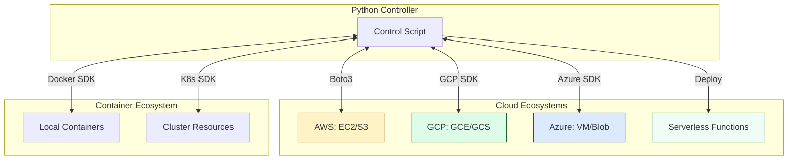

# 🧩 Part 3: The Building Blocks (Cloud Automation)

> **"Infrastructure is code. Python is the hammer. SDKs are the nails. Stop clicking buttons and start building ecosystems across the Multi-Cloud landscape."**

Welcome to **The Building Blocks**. In this section, we apply everything we've learned to the ultimate target: **The Cloud**. We move from general system management to orchestrating the complex, distributed world of AWS, GCP, Azure, and Containers.

---

## 🧠 The Mental Model: The Lego Set

If **Part 1** was the blueprint and **Part 2** was the engine, **Part 3** is the Lego set. You now have the skills to:
- Connect to all major cloud providers (using Boto3, Google Cloud, and Azure SDKs).
- Build logic that lives in the cloud (Lambda/Cloud Functions).
- Control the container fleet (Docker/K8s SDKs).

Your job is no longer to "write a script"; it is to **construct infrastructure** from these powerful, modular blocks.

---

## 🎯 The Junior's Mission
Your mission is to graduate from a "Cloud User" who clicks buttons in the Console to a **"Cloud Architect"** who builds reactive, self-healing ecosystems. You will learn to manipulate the global fleets of AWS, GCP, and Azure as if they were a single local script, ensuring your code is secure, idempotent, and scalable.

---

## 🌩️ Operational Reality: The Infrastructure Burden
In a professional setting, manual clicks are "Technical Debt."
*   **The Win**: 100% visibility into your infrastructure and zero-touch operations.
*   **The Hazard**: **API Throttling and Identity sprawl.** Managing 1,000 resources requires more than just code; it requires a deep understanding of rate limits, pagination, and "Zero-Trust" identity governance across the multi-cloud.

---

## 🎯 Learning Objectives

By the end of Part 3, you will:

- ✅ **Master AWS Boto3**: Use Clients and Resources to automate AWS at scale.
- ✅ **Navigate GCP & Azure**: Handle authentication and resource management in Google Cloud and Azure.
- ✅ **Go Serverless**: Write, test, and deploy AWS Lambda functions in Python.
- ✅ **Control Containers**: Automate Docker images and K8s deployments via their respective SDKs.
- ✅ **Implement Idempotency**: Ensure your cloud scripts don't create duplicate resources when run twice.

---

## 🏗️ Architecture: The Multi-Cloud Control Plane

---

## 📂 What's Covered in Part 3

### 📖 Table of Contents

1. **[AWS Automation: Boto3](./01-aws-automation-boto3/)**: The foundation of cloud automation.
2. **[Serverless and Lambda](./02-serverless-and-lambda/)**: Code that triggers on events.
3. **[Container and K8s SDKs](./03-container-and-k8s-sdks/)**: Python-native orchestration.
4. **[GCP Automation SDK](./04-gcp-automation-sdk/)**: Navigating the Google Cloud landscape.
5. **[Azure Automation SDK](./05-azure-automation-sdk/)**: Orchestrating Azure resources at scale.

---

## 🎓 Junior's Reality Check

### "Should I use Terraform or Python SDKs?"
**The Choice**: Use **Terraform** to build the base infrastructure (VPCs, Clusters). Use **Python SDKs** for dynamic operations, audit scripts, and "event-driven" automation. If the task requires complex branching logic, real-time reaction to events, or data processing, the SDK is your best friend.

### The Power of Managed Identity
**Crucial Tip**: 
Whether you're in AWS, GCP, or Azure, avoid hardcoding keys. Always use **Managed Identities** (IAM Roles, Service Accounts, or Managed Identities) to grant your Python scripts secure access to cloud resources.

---

## ❓ Interview Preparation (Part 3)

### 🎯 Screening Questions

1. **Q: What is the equivalent of Boto3 for Google Cloud or Azure?**
   * **Answer**: Google Cloud uses specific client libraries (e.g., `google-cloud-storage`), while Azure uses management clients (e.g., `ComputeManagementClient`). Both emphasize "Identity Classes" (like ADC in GCP or `DefaultAzureCredential` in Azure) for secure authentication.

2. **Q: How do you handle AWS credentials safely in a Lambda function?**
   * **Answer**: You don't! You assign an **IAM Role** to the Lambda. Boto3 will automatically pick up the temporary credentials from the execution environment. This "Zero-Key" principle applies across all major clouds.

3. **Q: Can you manage Kubernetes resources without using YAML in Python?**
   * **Answer**: Yes. The `kubernetes` Python client allows you to create Python dictionaries or use dedicated classes to manifest resources, bypassing the need for `.yaml` files in certain automated workflows.

---

## 📝 Knowledge Check

1. **Which AWS SDK for Python is named after a pink dolphin?**
   - [ ] PythonAWS
   - [ ] PinkSDK
   - [x] Boto3

2. **What is the standard authentication method for GCP Python SDKs?**
   - [ ] Hardcoded JSON keys.
   - [x] Application Default Credentials (ADC).
   - [ ] Manual browser login.

3. **Which Azure library is used for "Zero-Config" authentication?**
   - [ ] `azure-auth`
   - [x] `azure-identity` (DefaultAzureCredential)
   - [ ] `azure-login`

---

## 🔗 Next Steps

You can now build and control the multi-cloud. But how do you know it's working properly?

**Proceed to**: [Part 4: The Safety Net (Testing & Reliability) →](readme.md)
