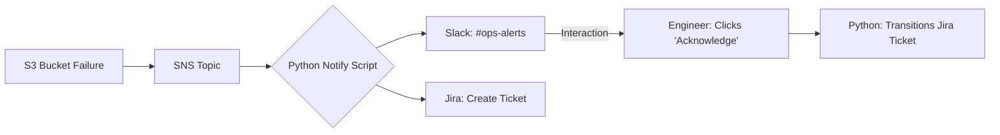

# 🤖 Ticket Handling & ChatOps: Connecting Humans to Infrastructure

> **"The DevOps bottleneck isn't the code; it's the notification. If an engineer has to manually copy-paste an error into a Jira ticket, the system is broken. The system should update the ticket, not the human."**

Welcome to the **ChatOps & Ticket Automation** module. In this phase, you learn to build the "Connective Tissue" of DevOps. You will turn infrastructure events into actionable human data using Python as your primary orchestration engine.

---

## 📚 Table of Contents
1. [The ChatOps Philosophy](#-the-chatops-philosophy)
2. [The Dispatcher Analogy](#-the-dispatcher-analogy)
3. [Cloud-Agnostic Triggers](#-cloud-agnostic-triggers)
4. [Visual Architecture](#-visual-architecture)
5. [Sub-Modules](#-sub-modules)
6. [The Unified Dispatcher Library](#-the-unified-dispatcher-library)
7. [Staff Standards](#-staff-standards)
8. [Challenges](#-challenges)

---

## 🎯 The ChatOps Philosophy
Manual ticket updates and "Slack-ping dependency" are **Anti-Patterns**. They slow down Recovery Time (MTTR) and introduce human error. True DevOps maturity means:
*   🔑 **Tickets are opened automatically** by the system that detected the failure.
*   💬 **Notifications are rich**, containing context (logs, metrics) rather than just "Something is broken."
*   ✅ **Transitions are programmatic**: When code is deployed, the ticket moves to "Done" automatically.

---

## 📻 The Dispatcher Analogy

To build effective ChatOps, keep these roles in mind:

*   **Jira** is the **Registry of Truth**. It is the permanent record where work is tracked and audited.
*   **Slack** is the **Emergency Radio**. It is for real-time collaboration, immediate awareness, and high-frequency updates.
*   **Python** is the **Dispatcher**. It sits in the middle, listening to the Cloud, talking to the Radio, and writing in the Registry.

---

## 📊 Cloud-Agnostic Triggers

Different clouds, same objective: Notify the Dispatcher.

| Feature | AWS | Microsoft Azure | Google Cloud (GCP) |
| :--- | :--- | :--- | :--- |
| **Event Source** | CloudWatch Alarms | Azure Monitor | Cloud Monitoring / Uptime |
| **Messaging Bus** | SNS / EventBridge | Event Grid | Cloud Pub/Sub |
| **Compute Trigger** | Lambda (Python) | Azure Functions | Cloud Functions |

---

## 🏗️ Visual Architecture

### 🔄 Data Flow: Failure to Chat
This diagram shows how a production failure becomes a rich notification.

---

## 📁 Sub-Modules

1.  **[01-Slack-ChatOps-Webhooks](./01-slack-chatops-webhooks/readme.md)**: Master the "Push" notification flow using Webhooks and Rich Blocks.
2.  **[02-Jira-Automation-API](./02-jira-automation-api/readme.md)**: Programmatic ticket creation, searching, and transitions.
3.  **[03-MultiCloud-Notifiers](./03-multicloud-notifiers/readme.md)**: Building environment-aware scripts for hybrid-cloud setups.
4.  **[04-The-Unified-Dispatcher](./04-the-unified-dispatcher/readme.md)**: Building a reusable `notify.py` library for all your projects.

---

## 🛡️ Staff Standards: The DevOps Way
To move from Junior to Senior, your code must follow these rules:
1.  **Zero Hardcoded Secrets**: Use `os.getenv()` or secret managers.
2.  **Idempotency**: Check if a ticket exists before opening another one. No one wants 100 tickets for the same 5-minute outage.
3.  **Service Accounts**: Always use **Bot Users** or **Service Accounts**. Never use your personal API token.

---

## 🏆 Ready for the Challenge?
Check out **[CHALLENGES.md](./challenges.md)** to build your first Auto-Responder and Health Check Bot.
