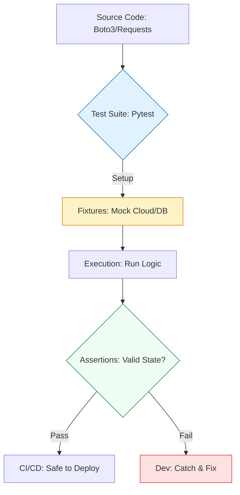

# 🧪 Fail-Fast Engineering: Pytest & Verification

> **"Untested infrastructure code is just a legacy outage waiting to happen. If you aren't testing your automation, you aren't an engineer—you're a gambler. In DevOps, the 'Safety Net' is not a luxury; it is the foundation of velocity."**

Welcome to the **Testing & Verification** module. In the high-stakes world of DevOps, a single script error can delete a production database or partition a network. `Pytest` is the industry-standard framework that allows you to verify your logic, mock cloud providers, and catch errors *before* they hit your servers. This module transforms your scripts from "scripts" into "verified tools."

**Why This Matters for Junior DevOps Engineers:**
- 🛡️ **Operational Safety**: You can run `delete_resources.py` with confidence because the logic was verified in a sandbox.
- ⚡ **Debugging Velocity**: Debugging a test locally takes seconds. Debugging a failed production deployment takes hours of log-diving.
- 🎯 **Career Differentiator**: "How do you test your code?" is the standard question that separates Junior from Senior DevOps candidates.
- 🔧 **CI/CD Integration**: Your pipeline *is* a series of tests. If tests fail, bad code never reaches production.

---

## 📚 Table of Contents
1. [The Testing Lifecycle](#-the-testing-lifecycle)
2. [Pytest Fundamentals](#-pytest-fundamentals)
3. [The Power of Fixtures](#-the-power-of-fixtures)
4. [Mocking & Patching (The Art of Faking)](#-mocking--patching-the-art-of-faking)
5. [Cloud Testing with Moto](#-cloud-testing-with-moto)
6. [Real-World DevOps Scenarios](#-real-world-devops-scenarios)
7. [The Professional Test Boilerplate](#-the-professional-test-boilerplate)
8. [Common Pitfalls & Solutions](#-common-pitfalls--solutions)
9. [Hands-On Exercises](#-hands-on-exercises)
10. [Interview Preparation](#-interview-preparation)
11. [Knowledge Check](#-knowledge-check)

---

## 🏗️ The Testing Lifecycle
Testing for DevOps is about the **Mock-Execute-Verify** pattern. We move from "Test-on-Prod" to **Isolated Unit Testing**.



### 🔍 Lifecycle Breakdown

**Stage 1: Environment Isolation (Fixtures)**
- **What**: Preparing a "clean room" for the test (fake S3 buckets, temporary directories, environment variables).
- **Why**: Tests must be reproducible and must not leave "junk" behind.
- **How**: `@pytest.fixture`.

**Stage 2: Execution & Mocking**
- **What**: Replacing real external calls (AWS, Slack, REST APIs) with "Mocks."
- **Why**: To prevent accidental deletion of real production data and enable offline testing.
- **How**: `unittest.mock` or `moto`.

**Stage 3: Assertive Verification**
- **What**: Checking if the output or side-effect matches the expectation.
- **Why**: To prove the code handles "Edge Cases" (like empty lists or 500 errors) correctly.
- **How**: `assert result == expected`.

---

## 🧪 Pytest Fundamentals
Pytest is an "Auto-Discovery" framework. It finds any file starting with `test_` and runs every function starting with `test_`.
### The Basic Assert Pattern
```python
# logic.py
def calculate_uptime(days_up, total_days):
    if total_days == 0:
        return 0.0
    return round((days_up / total_days) * 100, 2)

# test_logic.py
import pytest
from logic import calculate_uptime

def test_uptime_standard():
    assert calculate_uptime(99, 100) == 99.0

def test_uptime_zero_division():
    # Verification that we don't crash
    assert calculate_uptime(10, 0) == 0.0
```

---
## 🔌 The Power of Fixtures
Fixtures are reusable components that "fix" your environment into a known state. They are the **Building Blocks** of modular tests.
### Implementation: The "Context Management" Fixture
```python
import pytest
import os

@pytest.fixture
def mock_env():
    """Sets up temporary environment variables for a test."""
    os.environ['AWS_REGION'] = 'us-east-1'
    yield # The test runs here
    del os.environ['AWS_REGION'] # Setup cleanup (Teardown)

def test_config_loader(mock_env):
    # The fixture is automatically injected
    from my_app import get_region
    assert get_region() == 'us-east-1'
```

---

## 🎭 Mocking & Patching (The Art of Faking)

In DevOps, we rarely test math; we test **Calls**. We use `patch` to intercept a call to a library (like `os` or `requests`) and return a fake result.

### Scenario: The Slack Notifier
We want to test if our script *tries* to send a Slack alert, without actually spamming the channel.

```python
from unittest.mock import patch
import my_script

@patch('requests.post')
def test_slack_alert(mock_post):
    # Simulate a successful HTTP response
    mock_post.return_value.status_code = 200
    
    my_script.send_alert("High CPU!")
    
    # Verification: Was the API actually called with the right data?
    mock_post.assert_called_once()
    args, kwargs = mock_post.call_args
    assert "High CPU!" in kwargs['json']['text']
```

---

## ☁️ Cloud Testing with Moto

For AWS automation, manual mocking is too complex. **Moto** is a library that simulates the entire AWS infrastructure in your local RAM.

```python
import boto3
import pytest
from moto import mock_aws

@pytest.fixture
def s3_setup():
    with mock_aws():
        s3 = boto3.client('s3', region_name='us-east-1')
        s3.create_bucket(Bucket='audit-logs')
        yield s3

def test_log_archiver(s3_setup):
    from archiver import move_to_s3
    # This code interacts with the MOCKED S3 bucket
    move_to_s3('test.log', 'audit-logs')
    
    objects = s3_setup.list_objects(Bucket='audit-logs')['Contents']
    assert objects[0]['Key'] == 'test.log'
```

---

## 🎭 Real-World DevOps Scenarios

### 🛡️ Scenario 1: The "Production Deleter" Bug
**The Incident**: An engineer wrote a script to delete snapshots older than 30 days. Logic: `if snap_date > 30`. They accidentally compared Strings ("9" > "30"), causing the script to delete RECENT snapshots (9 days old).
**The Fix**: A Unit Test with **Moto** and **Freezegun**. 
**The Lesson**: Never trust Date/Time logic without a test that "frozen" time at a specific point to verify the calculation.

### 🔥 Scenario 2: The API Rate Limit Crash
**The Incident**: A deployment script crashed mid-way because an external API returned a `429 Too Many Requests`. It had no error handling.
**The Fix**: Use `mock_aws` or `patch` to simulate a `ClientError` and verify that your script **retries** or **fails gracefully** instead of crashing.

---

## 💻 The Professional Test Boilerplate

Every DevOps project should have a `tests/` directory with this structure.

```python
# conftest.py (Shared fixtures across all tests)
import pytest
import os

@pytest.fixture(autouse=True)
def aws_env():
    """Prevent tests from ever hitting real AWS."""
    os.environ['AWS_ACCESS_KEY_ID'] = 'testing'
    os.environ['AWS_SECRET_ACCESS_KEY'] = 'testing'
    os.environ['AWS_SECURITY_TOKEN'] = 'testing'
    os.environ['AWS_SESSION_TOKEN'] = 'testing'
    os.environ['AWS_DEFAULT_REGION'] = 'us-east-1'

# test_iam_auditor.py (Specific test file)
import boto3
from moto import mock_aws
from src.auditor import check_iam_users

@mock_aws
def test_check_iam_users_empty():
    """Verify script handles an account with 0 users."""
    # Setup
    iam = boto3.client('iam')
    
    # Act
    users = check_iam_users()
    
    # Assert
    assert users == []
```

---

## ⚠️ Common Pitfalls & Solutions

### Pitfall 1: Leaking to Production
**Symptom**: A test accidentally deletes a real resource because `mock_aws` wasn't activated.
**Solution**: Always use a `conftest.py` with mock credentials and verify `sts.get_caller_identity()` returns a fake ID.

### Pitfall 2: Logic in Tests
**Symptom**: A test that contains `if` statements and `for` loops.
**The Problem**: If your test has logic, it needs its own tests.
**Solution**: Keep tests "Linear." One path, one set of assertions.

---

## 🎯 Hands-On Exercises

### Exercise 1: The Security Group Auditor
**Objective**: Write a test for a function that flags "Wide Open" (0.0.0.0/0) security groups.
**Skills**: Use `moto` to create a mock VPC and Security Group, then run your audit logic.

### Exercise 2: Mocking the API 500
**Objective**: Test your script's behavior when a `requests.get()` call fails with a server error.
**Skills**: Use `@patch` and `side_effect` to trigger an exception.

---

## 🎙️ Interview Preparation

### Foundation Questions
1. **"What is the difference between a Unit Test and an Integration Test in DevOps?"**
   - *Answer*: A Unit Test resets the environment and mocks all external dependencies (AWS, APIs) to test core logic. An Integration Test uses "Real-ish" resources (like Docker or LocalStack) to test how components talk to each other.
2. **"What is 'Idempotency' and how do you test for it?"**
   - *Answer*: Idempotency means running the same script twice results in the same state. I test this by calling the function twice in a row and asserting that the second call doesn't create duplicate resources.

### Advanced Scenario Questions
3. **"How do you test code that depends on the current date (e.g., deleting objects older than 7 days)?"**
   - *Answer*: I use a library like `freezegun` to intercept the system clock. I "freeze" time at a specific date, create my mock resources, and then verify the math without having to wait a week for the test to pass.

---

## 🧠 Knowledge Check

1. **Which command is used to run all discovery-based tests in a project?**
   - [ ] `python run_tests.py`
   - [x] `pytest`
   - [ ] `test-runner`

2. **What is a 'Fixture' in Pytest?**
   - [ ] A permanent test script.
   - [x] A reusable setup/teardown function injected into tests.
   - [ ] A hardware component.

3. **True or False: Moto interacts with the real AWS API over the internet.**
   - [ ] True.
   - [x] False (It simulates the API in local memory).

---

## 🎓 Self-Assessment Checklist

- [ ] I can write a test that catches a `ValueError`.
- [ ] I have used a Fixture to provide sample data to multiple tests.
- [ ] I can use `@patch` to stop a script from hitting a real URL.
- [ ] I have executed a test suite using `mock_aws`.
- [ ] I understand how a failed test stops a CI/CD pipeline.

**Score yourself**: 8+/10 = Safety Net Master | <8 = Review "Mocking & Patching."

---

[⬅️ Back to Serverless Automation](../../03-part-3-the-building-blocks/02-serverless-and-lambda/readme.md) | [Next: Infrastructure as Code (Terraform) →](readme.md)
