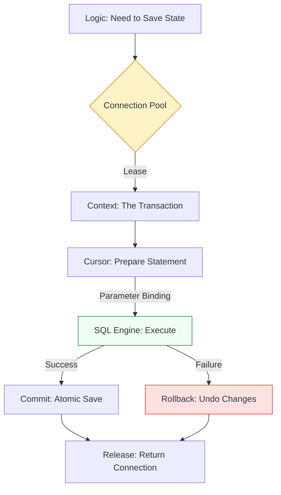

# 🗄️ Database Operations: Orchestrating Persistent State

> **"Infrastructure is code, but business is data. A DevOps engineer who can't safely manipulate a database at scale is a script-runner; one who can orchestrate state is a Platform Architect. Mastery of persistence is the threshold of seniority."**

Welcome to **Database Operations**. In the world of high-velocity automation, the database is your "Long-Term Memory." Whether you are auditing 10,000 AWS tags, tracking deployment metadata across 50 regions, or building a self-healing inventory, you must move beyond fragile JSON files to the atomic, reliable world of SQL. This module covers the **Python DB-API 2.0** standard and **SQLAlchemy**—the industry-standard engine for building resilient, database-agnostic automation.

**Why This Matters for Junior DevOps Engineers:**
- 🛡️ **Atomic Integrity**: Using transactions (`commit`/`rollback`) ensures that if a script crashes, your data remains in a consistent state—not "half-written."
- ⚡ **Scalability**: Python lists live in RAM; SQL lives on disk. Databases allow you to manage millions of records without "Out of Memory" (OOM) failures.
- 🎯 **Career Differentiator**: "How do you prevent SQL Injection in a multi-tenant pipeline?" is a core Staff-level security question.
- 🔧 **State Management**: Using SQLite for local CLI state is the professional standard for avoiding `json.decoder.JSONDecodeError` corrupted files.

---

## 📚 Table of Contents

1. [The Persistence Lifecycle](#-the-persistence-lifecycle)
2. [Interface Choice: Raw SQL vs ORM](#-interface-choice-raw-sql-vs-orm)
3. [The Engineering Bar: Transactions & Context](#-the-engineering-bar-transactions--context)
4. [Real-World DevOps Scenarios](#-real-world-devops-scenarios)
5. [The Professional Persistence Boilerplate](#-the-professional-persistence-boilerplate)
6. [Common Pitfalls & Solutions](#-common-pitfalls--solutions)
7. [Hands-On Exercises](#-hands-on-exercises)
8. [Interview Preparation](#-interview-preparation)
9. [Knowledge Check](#-knowledge-check)

---

## 🏗️ The Persistence Lifecycle

Interacting with data requires a strict lifecycle to prevent "Connection Leaks" and "Deadlocks."



### 🔍 Architectural Breakdown

1.  **The Connection Pool**: Instead of opening/closing TCP sockets (slow), we "lease" a connection from a pool.
2.  **The Transaction**: A logical unit of work. Every action in DevOps should be "Atomic"—either the whole operation succeeds, or none of it happens.
3.  **Parameter Binding**: Separate the SQL *Command* from the *Data* to prevent the #1 security flaw: SQL Injection.

---

## 🐍 Interface Choice: Raw SQL vs ORM

As a Staff Engineer, you must know when to use the "Raw Blade" vs. the "Swiss Army Knife."

| Feature | Raw SQL (`sqlite3`, `psycopg2`) | SQLAlchemy (The ORM) |
| :--- | :--- | :--- |
| **Speed** | ⚡ Fastest (No abstraction overhead) | 🐢 Slower (Object Mapping) |
| **Logic** | Manual string management | Object-Oriented (`server.status = 'UP'`) |
| **Strategy** | Best for high-speed migrations / bulk logs | Best for long-term platform maintenance |
| **Standard** | Senior / Individual Contributor | Staff / Platform Architect |

### 🔍 The Raw Pattern (Speed & Simplicity)
```python
import sqlite3

# Context Manager ensures connection closing
with sqlite3.connect('inventory.db') as conn:
    # 🛡️ Parameterized Query: No f-strings!
    conn.execute("INSERT INTO servers (ip, role) VALUES (?, ?)", ('10.0.1.5', 'web'))
    conn.commit()
```

### 🔍 The ORM Pattern (The Global Inventory)
```python
from sqlalchemy import create_engine, Column, Integer, String
from sqlalchemy.orm import declarative_base, Session

Base = declarative_base()

class Server(Base):
    __tablename__ = 'inventory'
    id = Column(Integer, primary_key=True)
    hostname = Column(String)

# Database-agnostic: Change URL to Postgres/MySQL/Oracle without changing logic
engine = create_engine('sqlite:///prod.db')
with Session(engine) as session:
    srv = Server(hostname="prod-api-01")
    session.add(srv)
    session.commit()
```

---

## 🎭 Real-World DevOps Scenarios

### 🛡️ Scenario 1: The "Hanging Transaction" Outage
**The Incident**: A deployment script updated a "Lock" table in the DB but crashed before calling `commit()`.
**The Failure**: The database held a write-lock on that row. Every other deployment across the entire global team was blocked for 4 hours until the DB timeout kicked in.
**The Fix**: Rewrote the script using a **Context Manager** (`with`) that automatically triggers a `rollback()` on any exception.
**The Lesson**: In persistence code, **Uncaught Exceptions = Global Lockups.**

### 🔥 Scenario 2: The f-string "Security Breach"
**The Incident**: A Jenkins job allowed developers to search for server owners. The Python code used: `f"SELECT * FROM hosts WHERE name='{user_input}'"`.
**The Failure**: A malicious actor entered: `'; DROP TABLE hosts; --`. The entire production inventory was deleted.
**The Fix**: Enforced **Mandatory Parameterized Queries** across all modules.

### ☁️ Scenario 3: The "Inventory Drift" Sync
**The Task**: Build a script that compares 50,000 AWS instances against a "Compliance Database" and flags unauthorized servers.
**The Solution**: Used a **Batch Transaction**—inserting the 50,000 AWS IDs into a temporary SQL table and performing a single `JOIN` query to find the drift. 
**Performance**: 3 seconds with SQL vs. 20 minutes with nested Python loops.

---

## 💻 The Professional Persistence Boilerplate

This "Production-Grade" structure handles secrets, connection leaks, and transactional safety.

```python
import os
import sys
import logging
from contextlib import contextmanager
import sqlite3

# Professional logging
logging.basicConfig(level=logging.INFO)
logger = logging.getLogger("InventoryEngine")

class DBManager:
    def __init__(self, db_path: str):
        self.db_path = db_path
        self._initialize_schema()

    def _initialize_schema(self):
        """Idempotent schema creation."""
        with self.get_connection() as conn:
            conn.execute("""
                CREATE TABLE IF NOT EXISTS inventory (
                    id INTEGER PRIMARY KEY,
                    hostname TEXT UNIQUE,
                    status TEXT,
                    last_seen TIMESTAMP DEFAULT CURRENT_TIMESTAMP
                )
            """)

    @contextmanager
    def get_connection(self):
        """Managed connection with automatic rollback."""
        conn = sqlite3.connect(self.db_path)
        try:
            yield conn
            conn.commit()
        except Exception as e:
            conn.rollback()
            logger.error(f"Transaction failed, changes reverted: {e}")
            raise
        finally:
            conn.close()

    def update_server_status(self, hostname: str, status: str):
        """Parameterized update with error handling."""
        try:
            with self.get_connection() as conn:
                conn.execute(
                    "INSERT INTO inventory (hostname, status) VALUES (?, ?) "
                    "ON CONFLICT(hostname) DO UPDATE SET status=excluded.status",
                    (hostname, status)
                )
                logger.info(f"✅ Updated {hostname} to {status}")
        except Exception as e:
            logger.critical(f"💥 Critical Failure updating {hostname}")
```

---

## 🎙️ Interview Preparation

### Foundation Questions
1. **"What is 'SQL Injection' and how does Python's DB-API prevent it?"**
   - *Answer*: SQL Injection is when user data is executed as code. The DB-API uses **Placeholder Binding** (`?` or `%s`), where the SQL engine treats the input strictly as data, making malicious payloads harmless.
2. **"Difference between Commit and Rollback?"**
   - *Answer*: `Commit` tells the database to permanently save the changes made in the transaction. `Rollback` tells it to discard all pending changes—essential for recovering from script errors without corrupting data.

### Advanced Scenario Questions
3. **"Why use Connection Pooling instead of opening a new connection for every API request?"**
   - *Answer*: Opening a connection involves a TCP 3-way handshake and authentication, which adds 50-200ms of latency per call. A pool keeps a set of "warm" connections ready, reducing latency to <1ms and preventing the database from crashing under the weight of too many concurrent login requests.

---

## 🧠 Knowledge Check

1. **Which character acts as a positional placeholder in the `sqlite3` driver?**
   - [ ] `%s`
   - [x] `?`
   - [ ] `:`

2. **True or False: SQLAlchemy allows you to switch from SQLite to PostgreSQL by changing only the connection string.**
   - [x] True (The power of Dialect Abstraction).

3. **What happens if a script crashes inside a `with sqlite3.connect(...) as conn:` block without a manual commit?**
   - [ ] Changes are saved automatically.
   - [x] Changes are NOT saved (Implicit rollback/close).

---
## 🎓 Self-Assessment Checklist

- [ ] I can explain why "Little Bobby Tables" is a DevOps security warning.
- [ ] I have executed a script that uses `?` placeholders for safety.
- [ ] I can describe the benefit of using an ORM for long-term maintenance.
- [ ] I have built a local SQLite database for tracking small script states.
- [ ] I understand how to use a `finally` block to ensure connections are closed.

**Score yourself**: 5+/5 = Reliability Engineer | <5 = Review "Transaction Lifecycle."

---

[⬅️ Back to Pytest Verification](../01-testing-automation-with-pytest/readme.md) | [Next: Web Scraping for Monitoring →](../03-web-scraping-for-monitoring/readme.md)
