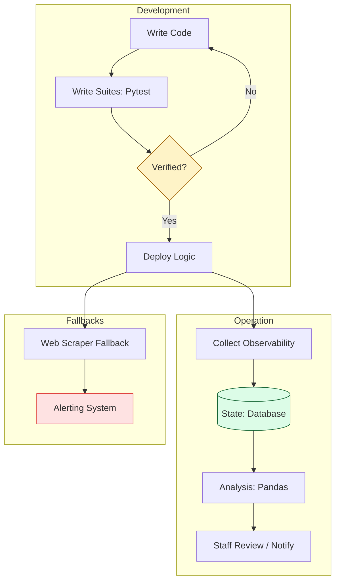

# 🛡️ Part 4: The Safety Net (Reliability & Performance)

> **"Un-tested automation is just a faster way to create an outage. Real power comes from scripts you can trust to run while you sleep. Engineering is the art of building systems that survive the unexpected."**

Welcome to **The Safety Net**. In this final phase of the Python for Infrastructure curriculum, we move from "writing logic" to "governing reliability." As a DevOps or SRE professional, your reputation is built not on the code you write, but on the **stability** of the environment it manages.

---

## 🧠 The Mental Model: The High-Wire Act

In the early stages, writing Python is like walking a tightrope. You're focused on getting from point A to point B. **The Safety Net** represents the engineering guardrails that allow you to perform complex maneuvers with absolute confidence.

- **Verification**: Ensuring logic handles edge cases before deployment.
- **Persistence**: Moving beyond ephemeral scripts to state-aware automation.
- **Insight**: Processing raw metrics into high-level business intelligence.
- **Fallbacks**: Building defensive systems that work when APIs fail.

---

## 🎯 Why This Part Matters for Juniors

**Before this section**, you might:
- Run a script and "hope" it doesn't crash on the 501st resource.
- Manually scrub logs to verify if a deployment was truly successful.
- Fear refactoring your own code because of the unknown side effects.

**After this section**, you'll understand:
- **Test-Driven Logic**: Writing verification suites that prove your script's correctness.
- **State-Aware Automation**: Leveraging SQL databases to track resource lifecycles over time.
- **Data Engineering for SRE**: Using Pandas to analyze infrastructure trends and memory leaks.
- **Defensive Orchestration**: Building scrapers and fallbacks for legacy systems without APIs.

**The Difference**: You stop being a "scripter" and start being an **Automation Engineer**.

---

## 🏗️ Architecture: The Reliable Automation Pipeline

---

## 📂 What's Covered in Part 4

### 📖 Table of Contents

1.  **[Testing Automation with Pytest](./01-testing-automation-with-pytest/)**: Implementing the "Safety Net" for your logic.
2.  **[Database Operations](./02-database-operations/)**: Moving beyond flat files to structured, persistent state.
3.  **[Web Scraping for Monitoring](./03-web-scraping-for-monitoring/)**: Defensive data collection for legacy endpoints.
4.  **[Data Processing with Pandas](./04-data-processing-with-pandas/)**: Turning infrastructure logs into actionable data.
5.  **[Capstone: S3 Auditor](./05-capstone-project-s3-auditor/)**: Building a production-grade resource controller.

---

## 🎓 Junior's Reality Check

### "Testing takes too long..."
**The Myth**: Writing tests doubles development time.
**The Reality**: In production, the "Broken Automation" incident is the most expensive type of outage. A 1-hour test suite is insurance against a 10-hour post-mortem at 3:00 AM.

### Why Databases are Mandatory
**Crucial Tip**: Don't use Python lists to store inventory for 10,000 servers. A database (SQLite/PostgreSQL) provides transactional integrity. If your script crashes, the state is preserved; if you use a list, your data dies with the process.

---

## 🎙️ Interview Preparation (Part 4)

### 🎯 Screening Questions

1. **Q: Why is `pytest` preferred over simple `print` statement verification?**
   * **Answer**: `pytest` allows for **repeatable, regression-proof** verification. It handles setup/teardown (fixtures), verifies specific exceptions, and integrates directly into CI/CD pipelines to block bad code from reaching production.

2. **Q: What is the benefit of a Context Manager (`with` statement) for persistence?**
   * **Answer**: It ensures that database connections and file handles are automatically closed and committed, even if the script encounters an error, preventing connection leaks and data corruption.

3. **Q: How does Pandas help an SRE or Platform Engineer?**
   * **Answer**: SREs manage massive metric sets. Pandas allows us to perform "Vectorized Operations"—filtering 1 million log entries for memory leaks or cost spikes in milliseconds, identifying patterns that are impossible to see in raw text.

---

## 📝 Part 4 Knowledge Check

1. **Which command is the industry standard for running Python test discovery?**
   - [x] `pytest`
   - [ ] `check-code`
   - [ ] `verify-all`

2. **Where is the safest place to store DB credentials for a script?**
   - [ ] Hardcoded in the script.
   - [ ] In a hidden `.env` file (local only).
   - [x] As an Environment Variable (passed via Secrets Manager).

3. **True or False: Web Scraping is a reliable primary strategy for automation.**
   - [ ] True.
   - [x] False (It is a fallback "Safety Net" when APIs are missing).

---

## 🔗 Next Steps

You have mastered the language, the cloud engine, and the building blocks. Now, implement the **Safety Net** to ensure your infrastructure code is bulletproof.

**Proceed to**: [01-Testing-Automation-with-Pytest/README.md](./01-testing-automation-with-pytest/readme.md)
