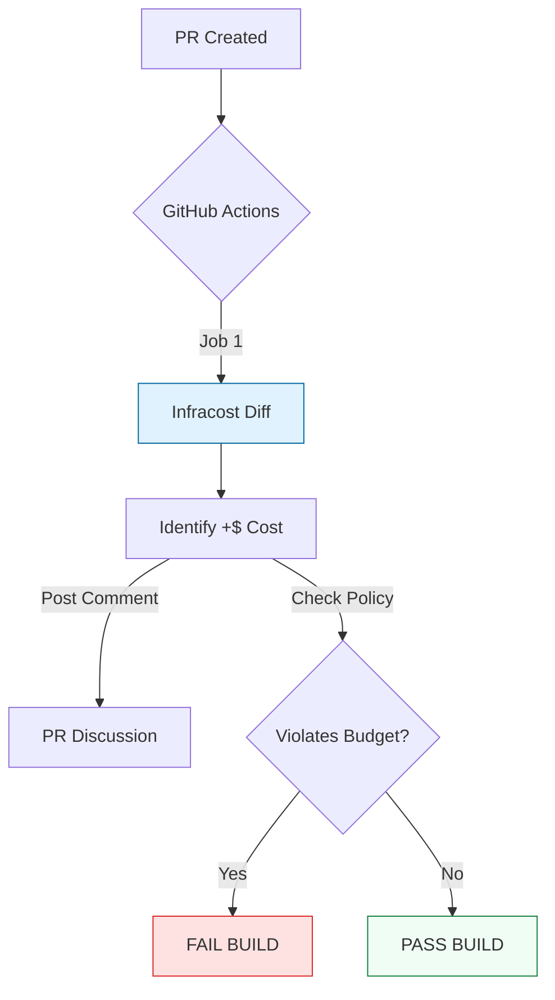

# 🤖 GitHub Actions Integration: The FinOps Gatekeeper

> **"Visibility is the first step. Enforcement is the second. If you don't block expensive builds, you're just watching your budget burn in real-time."**

Welcome to the **GitHub Actions Integration** module. In the SRE workflow, cost analysis must be automated. We don't just want a report; we want to **Block Pull Requests** that violate our budget.

**Why This Matters for Junior DevOps Engineers:**
- 🛡️ **Guardrails**: Preventing a junior dev from accidentally spinning up a $10k/month database.
- 💬 **Collaboration**: Automatic comments on PRs mean no "surprise" discussions later.
- ⚡ **Velocity**: Finance approvals happen asynchronously via code review, not meetings.

---

## 📚 Table of Contents

1. [Pipeline Architecture](#-pipeline-architecture)
2. [Standard Workflow (Visibility)](#-standard-workflow-visibility)
3. [Guardrail Workflow (Blocking)](#-guardrail-workflow-blocking)
4. [Real-World DevOps Scenarios](#-real-world-devops-scenarios)
5. [Common Pitfalls & Solutions](#-common-pitfalls--solutions)
6. [Hands-On Exercises](#-hands-on-exercises)
7. [Interview Preparation](#-interview-preparation)

---

## 🏗️ Pipeline Architecture

This automation sits between "Code Push" and "Merge".



---

## 👁️ Standard Workflow (Visibility)

This workflow posts the cost breakdown as a comment. It is **Passive**.

```yaml
name: FinOps Check

on: [pull_request]

jobs:
  infracost:
    runs-on: ubuntu-latest
    permissions:
      contents: read
      pull-requests: write # Required to post comments
      
    steps:
      - uses: actions/checkout@v3
      
      - name: Setup Infracost
        uses: infracost/actions/setup@v2
        with:
          api-key: ${{ secrets.INFRACOST_API_KEY }}
          
      - name: Generate Cost Diff
        run: |
          infracost breakdown --path . \
            --format json \
            --out-file infracost.json
            
      - name: Post PR Comment
        uses: infracost/actions/comment@v2
        with:
          path: infracost.json
          behavior: update # Don't spam, update existing comment
```

**Result**: A bot comment appears on the PR:
> **Infracost Estimate**:
> Monthly cost will increase by **+$50.00**.
> Total monthly cost: **$1,200.00**.

---

## 🛡️ Guardrail Workflow (Blocking)

This workflow **Fails the pipeline** if the cost increase is "To Damn High".

```yaml
      - name: Check Budget Guardrail
        run: |
          # Parse the monthly increase from the JSON output
          DIFF=$(jq ' .diffTotalMonthlyCost | tonumber' infracost.json)
          
          # Policy: Fail if increase is > $100
          if (( $(echo "$DIFF > 100" | bc -l) )); then
            echo "❌ COST INCREASE TOO HIGH: $DIFF"
            echo "Threshold is $100."
            echo "Please downgrade resources or get Manager Approval."
            exit 1
          fi
```

---

## 🎭 Real-World DevOps Scenarios

### 🧱 Scenario 1: The "Auto-Scaling" Surprise

**The Incident:** A dev changed the `max_capacity` of an AutoScaling Group from 10 to 1000.
**The Catch:** Infracost detected this as a potential +$50,000/month liability.
**The Block:** The Guardrail workflow failed the PR immediately. The dev realized they meant `100`, not `1000` (typo).
**Savings:** $50,000/month.

### 🔥 Scenario 2: The "Test" GPU

**The Incident:** Validating a ML model requires a `p3.2xlarge` (GPU). A dev added it to the Terraform code.
**The Visibility:** The bot posted "+$3,000/mo".
**The Manager Action:** The manager saw the PR comment and asked: "Do we need this continuously, or just for one run?"
**The Fix:** They decided to launch it manually for 2 hours (Spot Instance) instead of committing it to Terraform as a permanent resource.

---

## ⚠️ Common Pitfalls

### Pitfall 1: Ignoring Secrets
**Issue**: Hardcoding the `INFRACOST_API_KEY` in `main.yml`.
**Fix**: Use GitHub Secrets (`${{ secrets.INFRACOST_API_KEY }}`).

### Pitfall 2: Comment Spam
**Issue**: Every `git push` creates a *new* cost comment. After 20 pushes, the PR is unreadable.
**Fix**: Use `behavior: update` in the Action config.

---

## 🎯 Hands-On Exercises

### Exercise 1: Setup the Action
**Objective**: Get visibility.
**Task**:
1. Create `.github/workflows/infracost.yml`.
2. Add the "Visibility" workflow code.
3. Open a PR that changes an instance type.
4. Verify the Bot Comment appears.

### Exercise 2: The Block
**Objective**: Enforce budget.
**Task**:
1. Add the `jq` script step.
2. Set threshold to $10.
3. Try to add a Resource that costs $20.
4. Verify the PR Check turns **Red** (Failure).

---

## 🎙️ Interview Preparation

### Foundation Questions

**1. "Why use `pull-requests: write` permission?"**
- **Answer**: The GitHub Action runs as a bot. It needs permission to write comments onto the PR timeline. Without this, the step fails with 403 Forbidden.

**2. "What is 'Behavior: Update'?"**
- **Answer**: It tells the action to search for its previous comment and edit it, keeping the conversation history clean.

### Advanced Scenario Questions

**3. "How do you handle 'False Positives' where a high cost is actually approved?"**
- **Answer**:
    - Option A: Add a label `budget-approved` to the PR, and update the workflow to skip the check if that label exists (`if: !contains(github.event.pull_request.labels.*.name, 'budget-approved')`).
    - Option B: Manually override the failure.

---

## 🧠 Knowledge Check

**1. Which command generates the JSON needed for the Github Action?**
- [ ] `infracost diff`
- [x] `infracost breakdown --format json`
- [ ] `terraform plan`

**2. How do you prevent comment spam?**
- [ ] Use `behavior: new`
- [x] Use `behavior: update`
- [ ] Delete the workflow

**3. If the Infracost API Key is invalid, what happens?**
- [x] The workflow fails.
- [ ] It guesses the cost.
- [ ] It bypasses the check.

---

## 🎓 Self-Assessment Checklist

Before moving to the next module, ensure you can:
- [ ] Create a GitHub Actions workflow file.
- [ ] Configure `pull-requests: write` permissions.
- [ ] Explain how to "Block" a PR based on JSON output.
- [ ] Identify where to store API keys.

**Score yourself**: 5+/5 = Ready to advance | <5 = Review exercises

[⬅️ Back to CLI](../01-cli-automation/readme.md) | [Next: Policy as Code](../03-policy-as-code-guardrails/readme.md) ➡️
