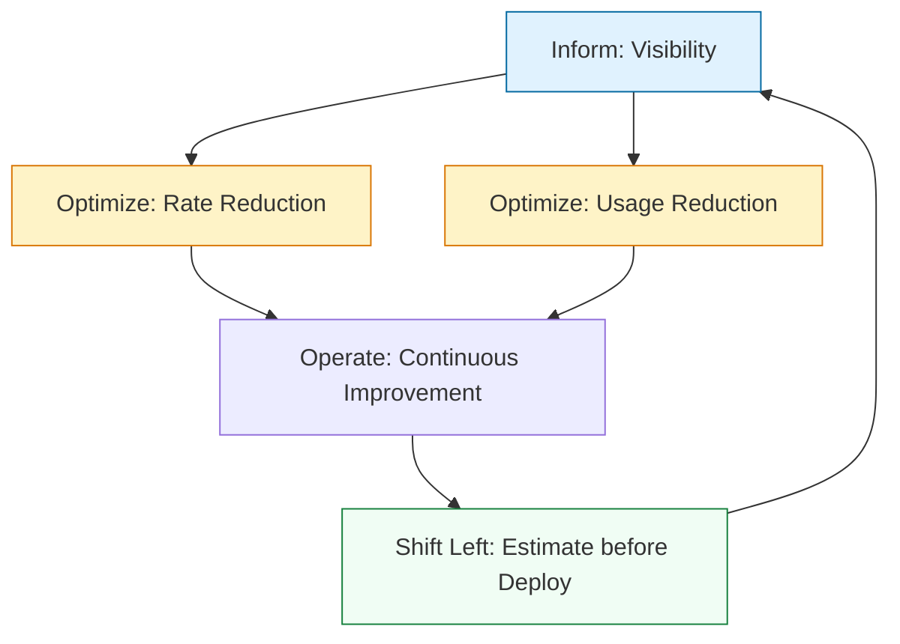

# 💰 Cost Estimation & FinOps: The Economics of Cloud

> **"Any engineer can build a bridge that stands, but it takes an engineer to build a bridge that barely stands." — Structural Engineering Maxim. In Cloud, replace 'stands' with 'costs zero'."**

Welcome to the **FinOps** module. **FinOps** is the operating model for the cloud—bringing financial accountability to the variable spend model.

**Why This Matters for DevOps Engineers:**
- 🚨 **Job Security**: "I reduced our AWS bill by 40%" is the single most powerful bullet point on a resume.
- 🔧 **Architecture**: Understanding Spot Instances vs Reserved Instances influences how you build apps.
- 🛑 **Governance**: Stopping a Junior Dev from spinning up a `p3.24xlarge` (GPU instance) just to test a "Hello World" app.

---

## 📚 Module Index

This section is divided into three practical levels:

### 1. [CLI Automation (The Engine)](./01-cli-automation/readme.md)
Master the tools used to predict and analyze costs.
- **Infracost**: Predictive analysis (Pre-Deploy).
- **AWS CLI**: Historical analysis (Post-Deploy).
- **Usage Files**: Estimating "Usage-Based" costs like Lambda.

### 2. [GitHub Actions Integration (Visiblity)](./02-github-actions-integration/readme.md)
Bring cost data into the developer's workflow.
- **PR Comments**: Automated feedback loops.
- **Secrets Management**: Securely storing API keys.
- **Pipeline Architecture**: Where FinOps fits in CI/CD.

### 3. [Policy-as-Code (Guardrails)](./03-policy-as-code-guardrails/readme.md)
Stop bad deploys before they happen.
- **Enforcement**: Blocking builds that exceed budget.
- **OPA/Rego**: The industry standard for policy.
- **Python Guardrails**: Simple, effective blocking scripts.

---

## 🔄 The FinOps Lifecycle

FinOps is an iterative loop: **Inform**, **Optimize**, **Operate**.

---

## 🎭 Real-World DevOps Scenarios

### 🛡️ Scenario 1: The "Zombie Volume" Graveyard
**The Incident:** Paying $2,000/month for EBS storage on terminated instances.
**The Fix:** A Python script (Lambda) finding and deleting "Available" volumes > 7 days old.

### 🔥 Scenario 2: The Data Transfer Surprise
**The Incident:** $5,000 bill for cross-region traffic.
**The Fix:** Using VPC Endpoints and keeping Compute/Storage in the same AZ.

---

## 🎓 Self-Assessment Checklist

Before skipping any modules, ensure you can:
- [ ] Run `infracost diff` locally.
- [ ] Explain **Shift-Left Cost** to a manager.
- [ ] Differentiate between **CapEx** and **OpEx**.

[⬅️ Back to Scripting Automation](../readme.md)

---
## 🧭 Additional Modules
- [REFERENCE](reference/readme.md)
