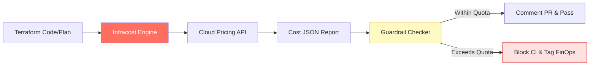

# 💰 Infracost Reference: FinOps Automation Hub

Welcome to the comprehensive reference for **Infracost & Cost Governance**. This guide is designed to move your engineering culture from "Pay-and-Pray" to **"Architectural Cost Control."**

---

## 🏗️ Reference Manuals

Explore the technical blueprints of automated cost management:

### 1. [🛡️ Core Keywords](./infracost-keywords.md)
The terminology of Shift-Left FinOps: Breakdowns, Diffs, Usage files, and Guardrails.

### 2. [📊 Automation Samples](./samples/readme.md)
Production-grade scripts for CLI automation, Python-based guardrails, and CI/CD integration.

---

## 🛠️ The "Staff Level" FinOps Bar

In a production organization, cost management is judged by its **Frictionless Integration** and **Preventative Nature.**

| Junior Level | Staff Engineer Level |
| :--- | :--- |
| Runs `infracost breakdown` manually. | Integrates `infracost diff` into Every Pull Request. |
| Ignores variable usage costs (S3/Lambda). | Uses automated `usage.yml` files for accurate pricing. |
| Deletes expensive resources *after* billing. | Blocks expensive resources *before* deployment via Guardrails. |
| Treats cost as a "Finance problem." | Treats cost as an "Engineering constraint" like latency or security. |
| Explains overages in post-mortems. | Prevents overages using **Policy-as-Code (Rego/OPA).** |

---

## 🏗️ Cost Logic Flow

---

[⬅️ Back to Infracost Index](../readme.md)
