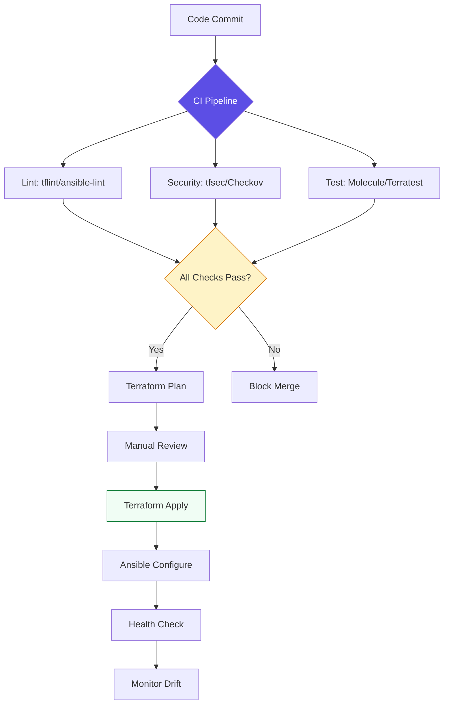

# 📔 Configuration Management Reference Hub

> **"Reference materials are not documentation. They are the technical dictionary that turns confusion into clarity."**

Welcome to the **Configuration Management Knowledge Base** - your technical foundation for building production-grade infrastructure.

---

## 🎯 Purpose

This reference hub provides:
- **Keyword Definitions**: Technical terms with context
- **Architecture Patterns**: Design decisions and trade-offs
- **Best Practices**: Battle-tested patterns from production
- **Decision Matrices**: Tool selection guidance
- **Troubleshooting**: Common errors and solutions

---

## 📚 Core References

### 1. [🛠️ Architecture Patterns](./iac-architecture-patterns-ref.md)
**Topics:** Provisioning vs Configuration, Mutable vs Immutable, Push vs Pull, Module Pattern

**When to Read:** Before designing infrastructure architecture

### 2. [🔐 Provisioning & IaC Keywords](./provisioning-iac-keywords.md)
**Topics:** Terraform lifecycle, HCL syntax, State management, Meta-arguments

**When to Read:** When writing Terraform code

### 3. [📟 Config Management Keywords](./config-management-keywords.md)
**Topics:** Ansible architecture, Idempotency, Roles, Jinja2, Vault, Facts

**When to Read:** When writing Ansible playbooks

### 4. [🛡️ Immutable Infrastructure](./immutable-infrastructure-governance-ref.md)
**Topics:** Packer, Golden Images, Drift detection, Governance

**When to Read:** When implementing immutable deployments

### 5. [🔒 Secrets Management](./secrets-management-ref.md)
**Topics:** Ansible Vault, AWS Secrets Manager, HashiCorp Vault, SOPS

**When to Read:** Before storing any credentials

### 6. [🧪 Testing & Validation](./testing-validation-ref.md)
**Topics:** Molecule, Terratest, Kitchen, Pre-commit hooks

**When to Read:** Before deploying to production

### 7. [🔄 CI/CD Integration](./cicd-integration-ref.md)
**Topics:** GitLab CI, GitHub Actions, Jenkins, Pipeline patterns

**When to Read:** When automating deployments

### 8. [🚨 Troubleshooting Guide](./troubleshooting-ref.md)
**Topics:** Common errors, Debug strategies, Recovery procedures

**When to Read:** When things break

---

## 🎓 Skill Level Progression

### Junior → Professional Transition

| Concept | Junior Approach | Professional Approach |
| :------ | :-------------- | :-------------------- |
| **Infrastructure** | Hardcoded IPs and IDs | Dynamic lookups with data sources |
| **State** | Local terraform.tfstate | Remote backend with locking |
| **Organization** | One giant main.tf | Modular libraries |
| **Deployment** | Manual apply on laptop | GitOps with PR reviews |
| **Updates** | SSH and manual fixes | Immutable replacements |
| **Secrets** | Hardcoded in code | Vault/Secrets Manager |
| **Testing** | "Hope it works" | Automated validation |
| **Monitoring** | Manual checks | Drift detection automation |

---

## 🔍 Quick Lookup Tables

### Tool Selection Matrix

| Use Case | Recommended Tool | Alternative | Why |
| :------- | :--------------- | :---------- | :-- |
| **Multi-cloud provisioning** | Terraform | Pulumi | Industry standard, declarative |
| **Server configuration** | Ansible | Chef/Puppet | Agentless, easy learning curve |
| **Immutable images** | Packer | Docker | Multi-platform support |
| **Container config** | Helm | Kustomize | Templating power |
| **Secrets management** | AWS Secrets Manager | Vault | Cloud-native integration |
| **Testing** | Molecule | Terratest | Role-level validation |
| **Drift detection** | Terraform plan | Cloud Custodian | Built-in capability |

### Idempotency Quick Reference

| Operation | Idempotent? | Safe Module |
| :-------- | :---------- | :---------- |
| Install package | ✅ Yes | `apt`, `yum`, `package` |
| Start service | ✅ Yes | `service`, `systemd` |
| Create file | ✅ Yes | `file`, `copy`, `template` |
| Run shell command | ❌ No | Use `creates` or `changed_when` |
| Append to file | ❌ No | Use `lineinfile` instead |
| Download file | ⚠️ Maybe | Use `get_url` with checksum |

---

## 🏗️ The Configuration Management Flow



---

## 📖 Sample Code Library

The [samples/](./samples/) directory contains production-ready examples:

- **modular-vpc.tf**: Reusable VPC module
- **ha-web-stack.yml**: High-availability Ansible playbook
- **golden-image.pkr.hcl**: Packer template for AMI
- **cloud-init-bootstrap.yaml**: Server initialization

---

## 🎯 Learning Path

### Week 1: Foundations
1. Read [Architecture Patterns](./iac-architecture-patterns-ref.md)
2. Study [Provisioning Keywords](./provisioning-iac-keywords.md)
3. Review [Config Management Keywords](./config-management-keywords.md)

### Week 2: Security & Testing
1. Master [Secrets Management](./secrets-management-ref.md)
2. Learn [Testing & Validation](./testing-validation-ref.md)
3. Practice with sample code

### Week 3: Automation
1. Implement [CI/CD Integration](./cicd-integration-ref.md)
2. Set up drift detection
3. Build immutable images

### Week 4: Production Readiness
1. Study [Troubleshooting Guide](./troubleshooting-ref.md)
2. Review [Immutable Infrastructure](./immutable-infrastructure-governance-ref.md)
3. Conduct code review

---

## 🚀 Quick Start Commands

### Terraform
```bash
# Initialize and validate
terraform init
terraform validate
terraform fmt -check

# Plan and apply
terraform plan -out=tfplan
terraform apply tfplan

# State operations
terraform state list
terraform state show aws_instance.web
```

### Ansible
```bash
# Syntax check
ansible-playbook site.yml --syntax-check

# Dry run
ansible-playbook site.yml --check --diff

# Execute with vault
ansible-playbook site.yml --ask-vault-pass

# List inventory
ansible-inventory -i aws_ec2.yml --graph
```

### Packer
```bash
# Validate template
packer validate template.pkr.hcl

# Build image
packer build template.pkr.hcl

# Debug mode
packer build -debug template.pkr.hcl
```

---

## 💡 Pro Tips

### 1. Always Use Remote State
```hcl
terraform {
  backend "s3" {
    bucket         = "company-tf-state"
    key            = "prod/terraform.tfstate"
    region         = "us-east-1"
    dynamodb_table = "terraform-locks"
    encrypt        = true
  }
}
```

### 2. Never Hardcode Secrets
```yaml
# BAD
db_password: SuperSecret123

# GOOD
db_password: "{{ lookup('aws_secret', 'prod/db/password') }}"
```

### 3. Use Dynamic Inventory
```yaml
# aws_ec2.yml
plugin: aws_ec2
regions:
  - us-east-1
filters:
  tag:Environment: production
  instance-state-name: running
```

### 4. Test Before Production
```bash
# Molecule test
cd roles/nginx && molecule test

# Terraform plan
terraform plan -detailed-exitcode
```

---

[⬅️ Back to Config Management](../readme.md)
