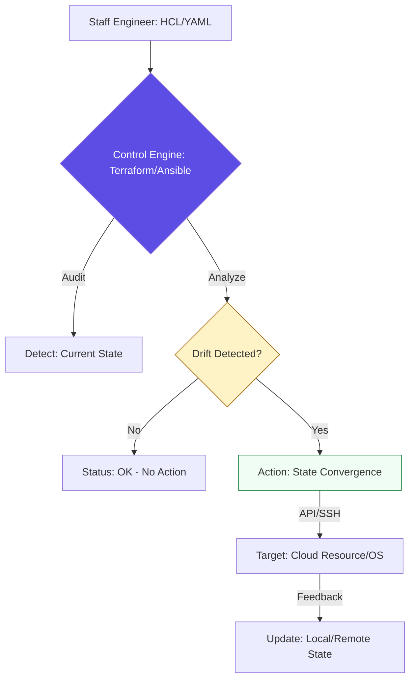

# 🏗️ Introduction to Config Management & IaC

> **"In the physical world, hardware is slow to change. In the cloud world, hardware is just a variable in a YAML file. If you treat your servers like pets, you will fail; if you treat them like cattle, you will scale."**

---

## 🧠 The Mental Model: The Convergence Engine

**The Junior Struggle**: "I'll just write a bash script that runs 20 `instance create` commands. It's safe as long as I don't run it twice!" (The "Snowflake" fear).

**The Engineer Solution**: Use a **Convergence Engine**.
You don't write "steps"; you define "Realities." The tool (Terraform/Ansible) constantly compares reality with your code and "converges" them. If a server dies, the engine notices and brings it back. This is **Self-Healing Infrastructure**.

### 🏗️ The Infrastructure Analogy
Think of Config Management like a **Thermostat**:

| Concept | Manual Heater | Thermostat (IaC) |
|:--------|:--------------|:------------------|
| **Goal** | "Turn on for 1 hour" | "Keep temp at 72°F" |
| **Philosophy** | Imperative (Procedural) | Declarative (Desired State) |
| **Logic** | Do X then Y | X must always equal Y |
| **Drift** | House gets too hot/cold | Auto-adjusts to match goal |

---

## 📚 Why This Module Matters for Juniors

**Before this module**, you might think:
- "Documentation is how we remember what we built"
- "Scripts are fine for cloud setup"
- "Manual changes are necessary for 'quick' fixes"

**After this module**, you'll understand:
- **Code IS the documentation**.
- **Idempotency** is the superpower that makes automation safe.
- **Drift** is the enemy of stability.
- **The Cattle vs Pets** mindset is the foundation of high-scale engineering.

**The Difference**: You move from "Setting up servers" to **"Engineering Systems."**

---

## 🎯 Learning Objectives

By the end of this module, you will:

- ✅ **Understand Declarative Logic**: "What" vs "How."
- ✅ **Identify Configuration Drift**: Detecting the "Snowflake" effect.
- ✅ **Master Idempotency**: Building safe, repeatable automation.
- ✅ **Adopt Cattle vs Pets**: Scaling to thousands of nodes.
- ✅ **Strategize IaC Choice**: When to use Terraform vs Ansible.

---

## 🏗️ The Declarative Architecture

Modern infrastructure relies on the **Desired State Configuration (DSC)** model.

---

## 🏆 Real-World DevOps Story: The "Snowflake" Meltdown

**The Incident**: A high-traffic app began failing only on 3 out of 10 nodes.
**The Failure**: Engineers spent 6 hours comparing logs. They found that a consultant had manually updated Java on just those 3 nodes months ago and never told anyone.
**The Force Multiplier**: By adopting **Ansible**, the team enforced a single "Java Standard." On the first run, Ansible detected the mismatch (Drift) and automatically synchronized all 10 nodes to the standard.
**The Result**: Zero snowflakes. Detection of future drift happened in seconds, not hours.

---

## ❓ Interview Preparation (Foundations)

### 🎯 Core Concepts

1. **Q: Imperative vs Declarative?**
        

        
Answer

        Imperative tells the computer 'How' (step-by-step scripts). Declarative tells the computer 'What' (Desired State). DevOps tools like Terraform/Ansible are Declarative.
        

1. **Q: What is 'Configuration Drift'?**
    *   *Answer: The decay of systems where the actual state deviates from the code due to manual changes.*
2. **Q: Why is 'Idempotency' required for automation?**
    *   *Answer: It ensures that running a tool twice doesn't cause duplicate resources or errors. It makes it safe to run on a schedule.*
3. **Q: Explain 'Cattle vs Pets'.**
    *   *Answer: Pets are unique servers you manually nurse. Cattle are identical, replaceable resources. If cattle is sick (unhealthy), you replace it; you don't 'fix' it.*

---

## 📝 Knowledge Check

1. **Which keyword describes a tool that only makes changes if needed?**
    * [ ] a) Mutable
    * [x] b) Idempotent
    * [ ] c) Sequential
2. **True or False: Declarative code defines 'How' to build a server.**
    * [ ] a) True
    * [x] b) False (It defines 'What' it should look like).
3. **Where should secrets NEVER be stored?**
    * [x] a) Plain-text Git repositories.
    * [ ] b) AWS Secrets Manager.
    * [ ] c) HashiCorp Vault.

---

## 🔗 Next Steps

You've bridged the gap. Now let's start provisioning the foundation of the cloud.

**Proceed to**: [IaC Foundations & Terraform →](readme.md)
