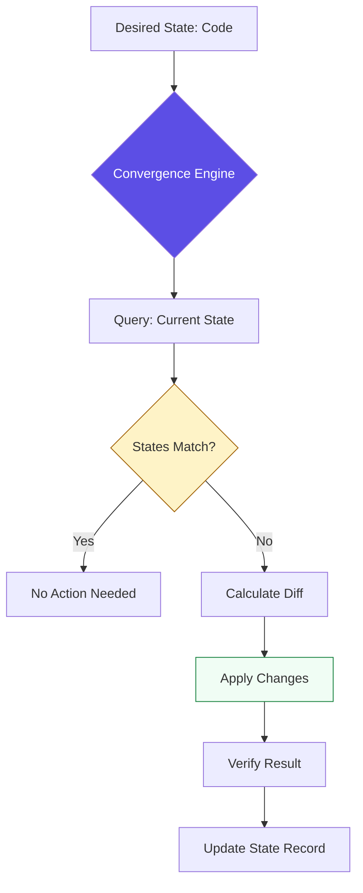
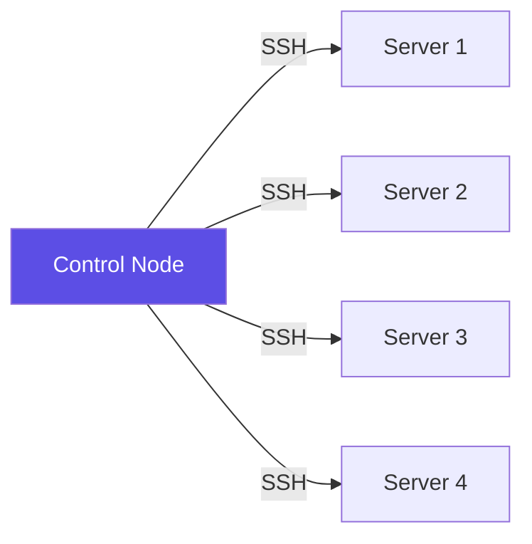
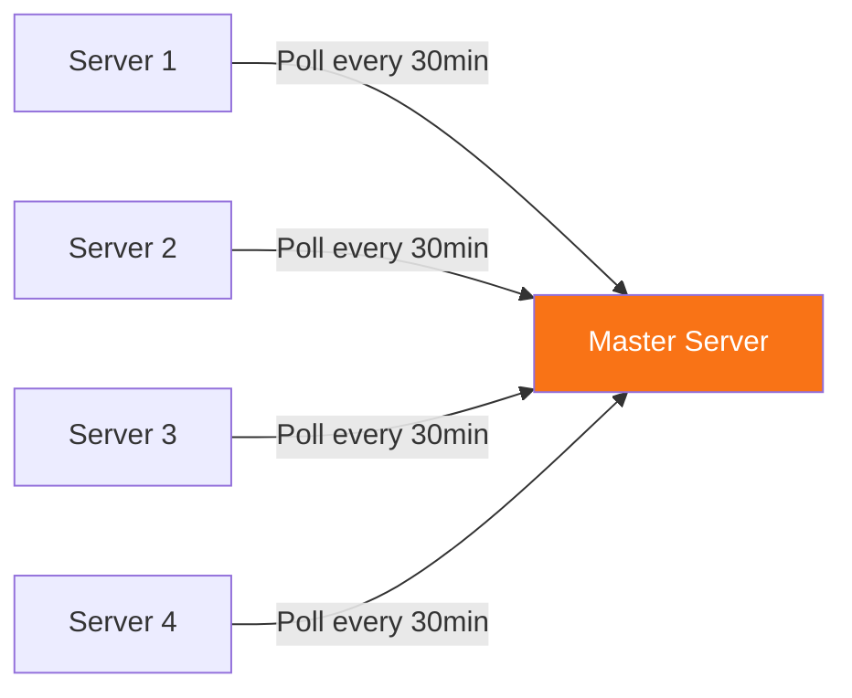

# 🏗️ Introduction to Configuration Management Philosophy

> **"Infrastructure is not about servers anymore. It's about code that describes reality, and engines that enforce it. The shift from imperative to declarative is the difference between a junior and a professional."**


---

## 🧠 The Paradigm Shift: From Scripts to Systems

### The Junior's Approach: Imperative Scripts

```bash
#!/bin/bash
# The "Hope and Pray" method
apt-get update
apt-get install -y nginx
cp nginx.conf /etc/nginx/
systemctl start nginx
systemctl enable nginx
echo "Done! (I think...)"

# What happens if I run this twice?
# What if nginx is already installed?
# What if the config file changed?
# How do I know what state the server is in?
```

**Problems with this approach:**
- ❌ **Not idempotent** - Running twice causes errors or unexpected behavior
- ❌ **No state tracking** - Can't detect what changed or why
- ❌ **Procedural logic** - Tells "how" to do something, not "what" should exist
- ❌ **No rollback** - If something breaks, manual recovery required
- ❌ **No drift detection** - Manual changes go unnoticed
- ❌ **Not auditable** - No clear record of intent

### The Professional's Approach: Declarative Configuration

```yaml
---
# The "Describe Reality" method
- name: Ensure nginx is configured and running
  hosts: webservers
  become: yes
  
  tasks:
    - name: Nginx package must be present
      apt:
        name: nginx
        state: present
        update_cache: yes
    
    - name: Nginx configuration must match template
      template:
        src: nginx.conf.j2
        dest: /etc/nginx/nginx.conf
        validate: 'nginx -t -c %s'
      notify: reload nginx
    
    - name: Nginx service must be running and enabled
      service:
        name: nginx
        state: started
        enabled: yes
  
  handlers:
    - name: reload nginx
      service:
        name: nginx
        state: reloaded
```

**Advantages of this approach:**
- ✅ **Idempotent** - Safe to run 100 times, only changes what's needed
- ✅ **Declarative** - Describes desired state, not steps
- ✅ **Self-healing** - Detects and corrects drift automatically
- ✅ **Auditable** - Clear intent and change history
- ✅ **Testable** - Can validate before applying
- ✅ **Rollback-friendly** - Version control enables easy rollback

---

## 🎯 The Core Philosophy: Convergence

### What is a Convergence Engine?

A convergence engine continuously compares **desired state** (your code) with **actual state** (reality) and takes action to make them match.



**Key Insight:** You don't write "steps" - you define "reality." The engine enforces that reality.

---

## 📚 Core Pillars of Configuration Management

### 1. Idempotency: The Safety Net

**Definition:** An operation that produces the same result whether executed once or 100 times.

**Why it matters:**
```yaml
# BAD: Not idempotent
- name: Add NTP server
  shell: echo "server 10.0.1.5" >> /etc/ntp.conf
  # Running twice adds duplicate lines!
  # Running 10 times adds 10 duplicate lines!

# GOOD: Idempotent
- name: Ensure NTP server is configured
  lineinfile:
    path: /etc/ntp.conf
    line: "server 10.0.1.5"
    state: present
  # Running 100 times = same result
  # Only changes if line is missing
```

**Real-world impact:**
- Production automation runs on schedules (cron, CI/CD)
- Without idempotency, your 3 AM job could create 30 duplicate database entries
- Idempotency enables safe retries after failures

### 2. Configuration Drift: The Silent Killer

**What is drift?**
When actual infrastructure diverges from the code that describes it.

**How drift happens:**
```bash
# Day 1: Deploy with Ansible
ansible-playbook site.yml
# Result: All 10 servers identical

# Day 30: Someone SSHs in for "quick fix"
ssh server-03
apt-get install java-11  # Manual change!

# Day 60: Mystery bug only on server-03
# 6 hours of debugging to find the drift
```

**The solution:**
```yaml
# Run Ansible regularly to detect and correct drift
- name: Scheduled drift correction
  cron:
    name: "Ansible drift check"
    minute: "0"
    hour: "*/6"
    job: "ansible-playbook site.yml --check --diff | mail -s 'Drift Report' ops@company.com"
```

### 3. Cattle vs Pets: The Scaling Mindset

| Concept | Pets | Cattle |
| :------ | :--- | :----- |
| **Naming** | server-prod-web-01 | auto-generated IDs |
| **Care** | Manual SSH, custom fixes | Automated, identical |
| **Failure** | Debug and repair | Terminate and replace |
| **Updates** | SSH and patch | Rebuild from image |
| **Scale** | Dozens | Thousands |

**Pet mentality:**
```bash
# Server is sick? Nurse it back to health
ssh prod-web-01
systemctl restart nginx
tail -f /var/log/nginx/error.log
# Spend hours debugging
```

**Cattle mentality:**
```bash
# Server is sick? Replace it
aws autoscaling terminate-instance-in-auto-scaling-group \
  --instance-id i-1234567890abcdef0 \
  --should-decrement-desired-capacity false
# Auto Scaling Group launches replacement automatically
```

### 4. Push vs Pull: Execution Models

**Push Model (Ansible):**


**Characteristics:**
- Control node initiates changes
- No agent required on targets
- Immediate execution
- Good for: Small-medium fleets, ad-hoc tasks

**Pull Model (Puppet/Chef):**


**Characteristics:**
- Agents poll master for changes
- Continuous enforcement
- Self-healing by default
- Good for: Large fleets (1000+ nodes), compliance

**Decision matrix:**
| Factor | Push (Ansible) | Pull (Puppet/Chef) |
| :----- | :------------- | :----------------- |
| **Fleet size** | < 500 nodes | > 1000 nodes |
| **Execution** | On-demand | Continuous |
| **Agent** | Not required | Required |
| **Network** | Outbound SSH | Inbound polling |
| **Complexity** | Lower | Higher |

### 5. Dynamic Inventory: Auto-Discovery

**The old way (static):**
```ini
# /etc/ansible/hosts - Manual maintenance nightmare
[webservers]
10.0.1.10
10.0.1.11
10.0.1.12

[databases]
10.0.2.10
10.0.2.11

# What happens when:
# - Instances are terminated?
# - Auto Scaling adds new instances?
# - IPs change?
```

**The modern way (dynamic):**
```yaml
# aws_ec2.yml - Queries AWS API in real-time
plugin: aws_ec2
regions:
  - us-east-1
filters:
  tag:Environment: production
  tag:Role: webserver
  instance-state-name: running
keyed_groups:
  - key: tags.Role
    prefix: role
  - key: tags.Environment
    prefix: env
```

**Benefits:**
- ✅ Auto-discovery of new instances
- ✅ Automatic removal of terminated instances
- ✅ Tag-based grouping
- ✅ Multi-cloud support (AWS, Azure, GCP)
- ✅ Always up-to-date

**Usage:**
```bash
# List discovered hosts
ansible-inventory -i aws_ec2.yml --graph

# Run against dynamic inventory
ansible-playbook -i aws_ec2.yml site.yml

# Target specific groups
ansible-playbook -i aws_ec2.yml site.yml --limit role_webserver
```

---

## 📚 Why This Module Transforms Juniors into Professionals

### The Mindset Shift

| Concept | Junior Thinking | Professional Thinking |
| :------ | :-------------- | :-------------------- |
| **Approach** | "I'll SSH and run commands" | "I'll write code that describes reality" |
| **Logic** | "Install this package" | "Ensure package is present at version X" |
| **Secrets** | Hardcoded in scripts | Ansible Vault / AWS Secrets Manager |
| **Organization** | One 500-line script | Modular roles with clear separation |
| **Infrastructure** | Manual IP lists | Dynamic inventory from cloud tags |
| **Testing** | "Hope it works" | Molecule tests in Docker containers |
| **Rollback** | Manual SSH fixes | Version-controlled playbooks |
| **Monitoring** | Manual checks | Automated drift detection |

### What You'll Learn

**Before this module:**
- "Documentation is how we remember what we built"
- "Scripts are fine for cloud setup"
- "Manual changes are necessary for 'quick' fixes"
- "Configuration management is just automation"

**After this module:**
- **Code IS the documentation** - Infrastructure as Code is self-documenting
- **Idempotency** is the superpower that makes automation safe
- **Drift** is the enemy of stability and must be detected automatically
- **Cattle vs Pets** mindset is the foundation of high-scale engineering
- **Declarative > Imperative** - Describe "what" not "how"

**The transformation:** You move from "Setting up servers" to **"Engineering Systems."**

---

## 🎯 Learning Objectives

By the end of this module, you will:

- ✅ **Understand Declarative vs Imperative**: Why "what" beats "how"
- ✅ **Master Idempotency**: Write safe, repeatable automation
- ✅ **Detect Configuration Drift**: Identify the "Snowflake" effect
- ✅ **Adopt Cattle vs Pets**: Scale to thousands of nodes
- ✅ **Choose the Right Tool**: Terraform vs Ansible vs Puppet
- ✅ **Implement Dynamic Inventory**: Auto-discover infrastructure
- ✅ **Secure Secrets**: Use Vault and Secrets Manager
- ✅ **Test Infrastructure Code**: Validate before production

---

## 🔥 Real-World Scenario: The Snowflake Meltdown

**The Incident:**
A high-traffic e-commerce application began experiencing intermittent 500 errors. Only 3 out of 10 web servers were affected.

**The Investigation:**
- Engineers spent 6 hours comparing logs
- Checked application code - identical across all servers
- Compared configurations - appeared identical
- Finally discovered: Java version mismatch

**The Root Cause:**
A consultant had manually updated Java on 3 servers months ago during a "quick fix" and never documented it. Those servers had Java 11, while others had Java 8.

**The Traditional Fix:**
```bash
# SSH into each server and manually update
for server in web-01 web-02 web-03; do
  ssh $server "apt-get install -y openjdk-11-jdk"
done
# Hope nothing breaks
# Pray it doesn't happen again
```

**The Configuration Management Solution:**
```yaml
# ansible/roles/java/tasks/main.yml
- name: Ensure Java 11 is installed
  apt:
    name: openjdk-11-jdk
    state: present
    update_cache: yes

- name: Ensure Java 8 is removed
  apt:
    name: openjdk-8-jdk
    state: absent

# Run once
ansible-playbook site.yml
# Result: All 10 servers synchronized in 2 minutes
# Drift detected and corrected automatically
```

**The Outcome:**
- ✅ All servers synchronized in 2 minutes
- ✅ Drift detected and corrected automatically
- ✅ Future drift detected in seconds (scheduled runs)
- ✅ Zero snowflakes - all servers identical
- ✅ Changes documented in version control

**The Lesson:**
Manual changes create snowflakes. Configuration management creates cattle.

---

## ❓ Interview Preparation

### Core Concepts

1. **Q: Explain the difference between imperative and declarative configuration.**
   - **Answer:** Imperative tells the system HOW to achieve a state through step-by-step commands (bash scripts). Declarative tells the system WHAT the desired state should be, and the tool figures out how to achieve it (Ansible, Terraform). Declarative is idempotent and self-healing.

2. **Q: What is configuration drift and why is it dangerous?**
   - **Answer:** Configuration drift occurs when the actual state of infrastructure diverges from the code that describes it, usually due to manual changes. It's dangerous because it creates "snowflake" servers that behave differently, making debugging difficult and deployments unpredictable.

3. **Q: Why is idempotency critical for automation?**
   - **Answer:** Idempotency ensures that running an operation multiple times produces the same result as running it once. This makes automation safe to run on schedules, enables retries after failures, and prevents duplicate resources or configuration errors.

4. **Q: Explain the "Cattle vs Pets" philosophy.**
   - **Answer:** Pets are servers you manually configure and nurse when sick. Cattle are identical, disposable servers managed by code. When cattle is sick, you replace it rather than fix it. This mindset enables scaling to thousands of nodes and eliminates snowflakes.

5. **Q: When would you choose push (Ansible) vs pull (Puppet) configuration management?**
   - **Answer:** Push (Ansible) is better for smaller fleets (<500 nodes), immediate execution, and when you can't install agents. Pull (Puppet/Chef) is better for large fleets (1000+ nodes), continuous compliance enforcement, and when network segmentation prevents outbound SSH.

6. **Q: What are the advantages of dynamic inventory over static inventory?**
   - **Answer:** Dynamic inventory automatically discovers infrastructure from cloud APIs using tags, eliminating manual maintenance. It auto-updates when instances are added/removed, supports multi-cloud, and ensures inventory is always current.

7. **Q: How do you detect and prevent configuration drift?**
   - **Answer:** Run configuration management tools in check mode regularly (e.g., `ansible-playbook --check --diff`), schedule automated drift detection, use immutable infrastructure where possible, and enforce policy that all changes must go through code/CI/CD.

8. **Q: What's the difference between provisioning and configuration management?**
   - **Answer:** Provisioning (Terraform) creates the infrastructure resources (VPC, EC2, RDS). Configuration management (Ansible) configures the OS and applications on those resources. They work together: Terraform builds the foundation, Ansible configures what runs on it.

---

## 📝 Knowledge Check

1. **Which keyword describes a tool that only makes changes if needed?**
   - [ ] a) Mutable
   - [x] b) Idempotent
   - [ ] c) Sequential
   - [ ] d) Declarative
   
   **Answer:** b) Idempotent - An idempotent operation produces the same result whether run once or multiple times.

2. **True or False: Declarative code defines 'How' to build a server.**
   - [ ] a) True
   - [x] b) False
   
   **Answer:** b) False - Declarative code defines WHAT the desired state should be, not HOW to achieve it.

3. **Where should secrets NEVER be stored?**
   - [x] a) Plain-text Git repositories
   - [ ] b) AWS Secrets Manager
   - [ ] c) HashiCorp Vault
   - [ ] d) Ansible Vault
   
   **Answer:** a) Plain-text Git repositories - Secrets in Git are exposed to anyone with repository access.

4. **What is the main advantage of dynamic inventory?**
   - [ ] a) Faster execution
   - [x] b) Automatic discovery of infrastructure
   - [ ] c) Better security
   - [ ] d) Easier to read
   
   **Answer:** b) Automatic discovery - Dynamic inventory queries cloud APIs to discover infrastructure automatically.

5. **In the "Cattle vs Pets" philosophy, what do you do when a cattle server fails?**
   - [ ] a) SSH in and debug
   - [ ] b) Restore from backup
   - [x] c) Terminate and replace
   - [ ] d) Manually patch
   
   **Answer:** c) Terminate and replace - Cattle are disposable and identical, so you replace rather than repair.

---

## 🚀 Next Steps

You've learned the philosophy. Now it's time to put it into practice.

**Continue to:**
- [IaC Foundations & Terraform →](../02-iac-foundations-and-terraform/) - Learn infrastructure provisioning
- [Server Configuration & Ansible →](../03-server-configuration-and-ansible/) - Master configuration management
- [Reference Materials →](../00-reference-and-metadata/) - Deep-dive into keywords and patterns

**Key Takeaways:**
1. Declarative > Imperative
2. Idempotency = Safety
3. Drift = Enemy
4. Cattle > Pets
5. Code = Documentation

---

[⬅️ Back to Config Management](../readme.md)
