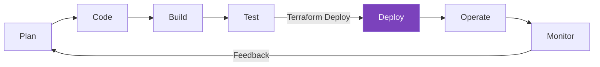

Terraform is an open-source Infrastructure as Code (IaC) tool created by HashiCorp that allows you to define and provision infrastructure using a declarative configuration language.

## Key Benefits

- **Infrastructure as Code**: Version control your infrastructure.
- **Multi-Cloud**: Support for 1000+ providers (AWS, Azure, GCP, etc.).
- **Declarative**: Describe the desired state, not the steps to get there.
- **Plan and Apply**: Preview changes before execution to avoid surprises.
- **State Management**: Track resource relationships and metadata.
- **Modular**: Build reusable infrastructure components.

## Use Cases

- **Cloud Infrastructure**: Managing AWS, Azure, GCP resources.
- **Multi-Cloud Deployments**: Consistent infrastructure across multiple clouds.
- **Application Infrastructure**: Managing Kubernetes, Docker, and databases.
- **Network Infrastructure**: Provisioning VPCs, load balancers, and DNS.
- **Security Infrastructure**: Configuring IAM, security groups, and certificates.

## Terraform in the DevOps Lifecycle

---

## 🏗️ Real-Life Scenario: The Manual Setup Trap

**Problem**: A startup needs to deploy their web app to AWS. The lead engineer manually creates the VPC, 3 EC2 instances, and an RDS database. When it's time to create a "staging" environment, they realize they can't remember all the manual settings, leading to "Environment Drift."
**Solution**: By using Terraform, the engineer defines the entire infrastructure in a `main.tf` file. They can now deploy identical copies of the environment (Dev, Staging, Prod) in minutes, ensuring consistency and version control.

---

## ❓ Interview Questions

1. **What is Infrastructure as Code (IaC)?**
   - *Answer*: IaC is the process of managing and provisioning computer data centers through machine-readable definition files, rather than physical hardware configuration or interactive configuration tools.

2. **How does Terraform differ from Ansible?**
   - *Answer*: Terraform is primarily an orchestration tool (Focuses on *Infrastructure*), while Ansible is a configuration management tool (Focuses on *Apps/OS*). Terraform is declarative, whereas Ansible can be procedural.

3. **What are the main advantages of using Terraform over manual infrastructure provisioning?**
   - *Answer*: Version control, reproducibility, consistency across environments, faster deployment, reduced human error, better documentation (code as documentation), and easier disaster recovery.

4. **Can Terraform manage existing infrastructure that wasn't created by Terraform?**
   - *Answer*: Yes, using the `terraform import` command to bring existing resources under Terraform management.

5. **What is the difference between declarative and imperative approaches?**
   - *Answer*: Declarative (Terraform) specifies the desired end state and the tool figures out how to achieve it. Imperative specifies step-by-step instructions on how to reach the end state.

---

## 🧠 Comprehensive Quiz (20 Questions)

<b>1. Who created Terraform?</b>

Show Answer

Answer: C

<b>2. What language does Terraform use for configuration?</b>

Show Answer

Answer: B

<b>3. Is Terraform Declarative or Imperative?</b>

Show Answer

Answer: B

<b>4. Name one advantage of using IaC.</b>

Show Answer

Answer: B

<b>5. Can Terraform manage on-premise infrastructure?</b>

Show Answer

Answer: B

<b>6. What does IaC stand for?</b>

Show Answer

Answer: C

<b>7. Which of these is NOT a primary benefit of Terraform?</b>

Show Answer

Answer: C

<b>8. How many providers does Terraform support?</b>

Show Answer

Answer: C

<b>9. What approach does Terraform use?</b>

Show Answer

Answer: B

<b>10. Terraform is best suited for:</b>

Show Answer

Answer: B

<b>11. What is a key difference between Terraform and CloudFormation?</b>

Show Answer

Answer: B

<b>12. Can Terraform manage Kubernetes resources?</b>

Show Answer

Answer: B

<b>13. What does "immutable infrastructure" mean in Terraform context?</b>

Show Answer

Answer: B

<b>14. Terraform was released in:</b>

Show Answer

Answer: B

<b>15. Which is a valid Terraform use case?</b>

Show Answer

Answer: B

<b>16. Terraform can manage:</b>

Show Answer

Answer: B

<b>17. What makes Terraform "cloud-agnostic"?</b>

Show Answer

Answer: B

<b>18. Terraform is:</b>

Show Answer

Answer: B

<b>19. What is Terraform LEAST suitable for?</b>

Show Answer

Answer: B

<b>20. The main benefit of "Plan before Apply" is:</b>

Show Answer

Answer: B

