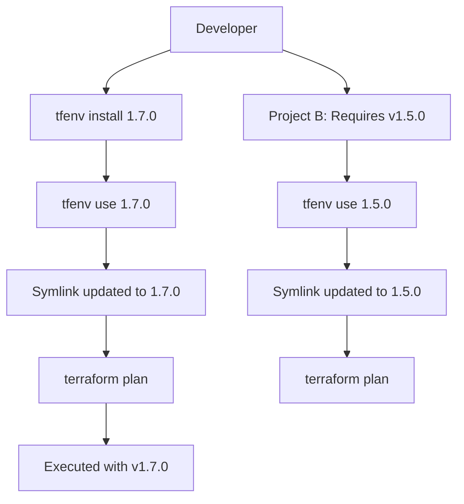

# 🛠️ Installation and Setup

Getting Terraform up and running on your local machine is the first step toward professional infrastructure management. This module covers installation across multiple platforms, version management best practices, and IDE configuration to streamline your workflow.

---

## 📚 Learning Path & Comparison

| Method | Recommendation | Use Case | Links |
| :--- | :--- | :--- | :--- |
| **tfenv (Version Manager)** | ⭐ **Industry Standard** | SREs managing multiple projects/versions. | [GitHub - tfutils/tfenv](https://github.com/tfutils/tfenv) |
| **tfswitch (Terraform Switcher)** | ⚡ **Fast & Cross-platform** | Developers who switch versions frequently. | [GitHub - warrensbox/tfswitch](https://github.com/warrensbox/terraform-switcher) |
| **Package Manager** | ✅ **Standard Desktop** | Single-version users (Ubuntu/Homebrew/Choco). | [Official Install Guide](https://developer.hashicorp.com/terraform/downloads) |
| **Direct Binary** | ⚠️ **Minimalist** | CI/CD runners or air-gapped systems. | [Releases](https://releases.hashicorp.com/terraform/) |

---

## 🏗️ Version Manager Workflow

A version manager allows you to switch between Terraform versions seamlessly. In a professional environment, different projects often require different versions.



---

## 🚀 Detailed Installation Guides

### 1. The Professional Choice: `tfenv` (macOS/Linux)
`tfenv` is the go-to tool for DevOps engineers. It manages multiple binaries and symlinks them as needed.

*   **Installation**:
    ```bash
    git clone --depth=1 https://github.com/tfutils/tfenv.git ~/.tfenv
    echo 'export PATH="$HOME/.tfenv/bin:$PATH"' >> ~/.bashrc # or ~/.zshrc
    source ~/.bashrc
    ```
*   **Usage**:
    ```bash
    tfenv install 1.7.0
    tfenv use 1.7.0
    ```

### 2. Windows Installation (Chocolatey/Winget)
Engineers on Windows typically use package managers to keep binaries updated.

*   **Chocolatey**:
    ```powershell
    choco install terraform
    ```
*   **Winget**:
    ```powershell
    winget install HashiCorp.Terraform
    ```

### 3. Linux (Apt - Ubuntu/Debian)
HashiCorp maintains official repositories for most Linux distributions.

```bash
sudo apt-get update && sudo apt-get install -y gnupg software-properties-common
wget -O- https://apt.releases.hashicorp.com/gpg | gpg --dearmor | sudo tee /usr/share/keyrings/hashicorp-archive-keyring.gpg
echo "deb [signed-by=/usr/share/keyrings/hashicorp-archive-keyring.gpg] https://apt.releases.hashicorp.com $(lsb_release -cs) main" | sudo tee /etc/apt/sources.list.d/hashicorp.list
sudo apt update && sudo apt install terraform
```

---

## 🛠️ IDE Configuration (VS Code)

To be productive, your IDE must understand HCL (HashiCorp Configuration Language).

1.  **Extension**: Install the [HashiCorp Terraform Extension](https://marketplace.visualstudio.com/items?itemName=HashiCorp.terraform).
2.  **Formatter**: Enable "Format on Save" to automatically run `terraform fmt`.
    *   Open `settings.json` and add:
        ```json
        "[terraform]": {
            "editor.defaultFormatter": "hashicorp.terraform",
            "editor.formatOnSave": true,
            "editor.formatOnSaveMode": "file"
        }
        ```
3.  **Language Server**: Ensure the Language Server is enabled for advanced features like module completion and variables hover-info.

---

## 🏗️ Real-Life Scenarios

### Scenario 1: The "Legacy State" Trap
**Context**: A new engineer joined a team managing a 3-year-old AWS infrastructure.
**The Mistake**: The engineer ran `terraform apply` using the latest version (v1.7) from their machine. The project was pinned to v0.14 in the documentation, but not in the code.
**The Crisis**: Terraform v1.7 automatically upgraded the remote state file format. When the CI/CD pipeline (using v0.14) triggered a deployment an hour later, it failed with a critical "State file version incompatible" error.
**The Outcome**: Production deployments were blocked for 6 hours.
**The Professional Solution**: 
1.  Enforce `required_version` in the `terraform {}` block.
2.  Commit a `.terraform-version` file for `tfenv` to use.
3.  Use **Terragrunt** or a wrapper to ensure version consistency.

### Scenario 2: The "Air-Gapped" Security Breach
**Context**: A government contractor's build servers have zero internet access.
**The Problem**: Running `terraform init` failed because it couldn't reach `registry.terraform.io` to download the `azurerm` provider.
**The Solution**: The team implemented a **Provider Mirror**. They used a "seed" machine to download specific provider versions, verified their SHA256 hashes, and uploaded them to an internal Nexus repository. They configured every developer machine's `.terraformrc` to point to this internal mirror.
**The Result**: Not only was security maintained, but `terraform init` time dropped from 45 seconds to 3 seconds.

### Scenario 3: The "M1/M2 Mac" Architecture Conflict
**Context**: A team switched from Intel-based Macs to Apple Silicon (M2).
**The Problem**: Developers copying their old binaries found that Terraform would crash or throw "exec format error".
**The Solution**: Use `tfenv` or `Homebrew` which correctly detects the `darwin_arm64` architecture. They also had to ensure their `.terraform` directories (containing provider binaries) were cleared and re-initialized to download the ARM versions of the providers.

---

## ❓ Interview Questions (Junior to Senior)

### Junior Level
1.  **What is the simplest way to install Terraform on a new machine?**
    *   *Answer*: Downloading the static binary from the HashiCorp website and moving it to a directory in your system's PATH (like `/usr/local/bin` or `C:\windows\system32`).
2.  **Why should the `.terraform` directory be in `.gitignore`?**
    *   *Answer*: It contains downloaded provider binaries and modules which are platform-specific and can be several hundred MBs. They should be re-downloaded via `terraform init` rather than stored in version control.

### Mid Level
3.  **Explain how `tfenv` works under the hood.**
    *   *Answer*: `tfenv` manages multiple versions in a hidden directory (usually `~/.tfenv/versions`). When you "use" a version, it creates a symlink from the `terraform` command in your PATH to the specific versioned binary.
4.  **What is the purpose of the `.terraformrc` file?**
    *   *Answer*: It's a global configuration file for the Terraform CLI. It's used for advanced settings like `plugin_cache_dir` (to avoid re-downloading providers), `credentials` for Terraform Cloud/Enterprise, and `provider_installation` for mirrors.

<b>5. </b>
<details>
<summary>Show Answer</summary>
Answer: B** (Go allows for a single static binary distribution)
</details>


<b>2. True/False: 'tfenv' is an official product produced by HashiCorp.</b>
<details>
<summary>Show Answer</summary>
Answer: B** (It is a community-driven tool, though widely used)
</details>


<b>3. Which command is used to see where Terraform is installed on Linux?</b>
<details>
<summary>Show Answer</summary>
Answer: C
</details>


<b>4. What happens if you run terraform init without an internet connection and no cache?</b>
<details>
<summary>Show Answer</summary>
Answer: B
</details>


<b>5. Which file can be used to set a global plugin cache?</b>
<details>
<summary>Show Answer</summary>
Answer: B
</details>


<b>6. On Windows, where are binaries usually stored if installed via Chocolatey?</b>
<details>
<summary>Show Answer</summary>
Answer: B
</details>


<b>7. Why is 'terraform fmt' important after installation?</b>
<details>
<summary>Show Answer</summary>
Answer: C
</details>


<b>8. Which environment variable can point to a custom `.terraformrc` file?</b>
<details>
<summary>Show Answer</summary>
Answer: B
</details>


<b>9. When using tfenv, where is the `.terraform-version` file usually placed?</b>
<details>
<summary>Show Answer</summary>
Answer: B
</details>


<b>10. How do you verify the integrity of a downloaded Terraform binary?</b>
<details>
<summary>Show Answer</summary>
Answer: B
</details>


<b>11. True/False: You can use Homebrew to install Terraform on Linux.</b>
<details>
<summary>Show Answer</summary>
Answer: A** (Linuxbrew supports Terraform)
</details>


<b>12. What is the architecture name for Apple Silicon (M1/M2) in Terraform downloads?</b>
<details>
<summary>Show Answer</summary>
Answer: B
</details>


<b>13. Which command installs the latest version of Terraform using tfswitch?</b>
<details>
<summary>Show Answer</summary>
Answer: D
</details>


<b>14. In VS Code, what feature provides "Autocompletion" for Terraform?</b>
<details>
<summary>Show Answer</summary>
Answer: B
</details>


<b>15. 'terraform -v' and 'terraform version' are:</b>
<details>
<summary>Show Answer</summary>
Answer: B
</details>


<b>16. Does Terraform require a resident background service (daemon) to run?</b>
<details>
<summary>Show Answer</summary>
Answer: B
</details>


<b>17. Which directory is created by 'terraform init'?</b>
<details>
<summary>Show Answer</summary>
Answer: B
</details>


<b>18. Can you install multiple versions of Terraform via the official Ubuntu 'apt' repo at once?</b>
<details>
<summary>Show Answer</summary>
Answer: B** (Use tfenv for multiple versions)
</details>


<b>19. What does the `plugin_cache_dir` setting prevent?</b>
<details>
<summary>Show Answer</summary>
Answer: B
</details>


<b>20. True/False: Terraform can be run as a Docker container.</b>
<details>
<summary>Show Answer</summary>
Answer: A** (Official images are available on Docker Hub)
</details>


<b>21. Which command is used to upgrade the Terraform binary when installed via Homebrew?</b>
<details>
<summary>Show Answer</summary>
Answer: A
</details>


<b>22. What is the default location for `.terraformrc` on Windows?</b>
<details>
<summary>Show Answer</summary>
Answer: D
</details>


<b>23. Why is version pinning important in the 'terraform {}' block?</b>
<details>
<summary>Show Answer</summary>
Answer: B
</details>


<b>24. Which tool is best for purely switching (not managing) existing binaries?</b>
<details>
<summary>Show Answer</summary>
Answer: B
</details>


<b>25. Setup is the first stage of the:</b>
<details>
<summary>Show Answer</summary>
Answer: B
</details>
