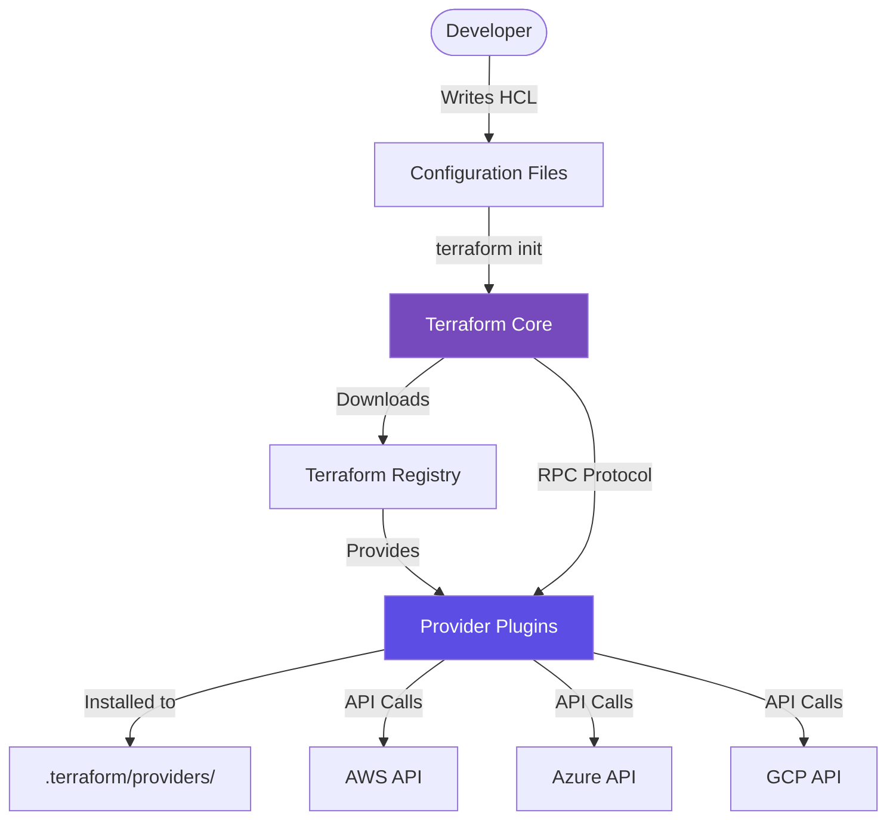

Providers are the heart of Terraform's extensibility. They translate HCL commands into API calls.

## How Providers Work
When you run `terraform init`, Terraform downloads a binary plugin for the providers specified in your code.

## Provider Configuration
```hcl
terraform {
  required_providers {
    aws = {
      source  = "hashicorp/aws"
      version = "~> 5.0"
    }
  }
}

provider "aws" {
  region = "us-east-1"
}
```

## Common Providers
- **Cloud**: AWS, Azure, GCP, DigitalOcean.
- **SaaS**: GitHub, Cloudflare, PagerDuty.
- **On-Prem**: VMware, OpenStack.
- **Logical**: Local, Random, TLS.

## Provider Plugin Architecture



---

## 🏗️ Real-Life Scenario: The Multi-Region Deployment
**Problem**: You need to create some resources in `us-east-1` and others in `eu-west-1`.
**Solution**: Use **Provider Aliases**.
```hcl
provider "aws" {
  alias  = "ireland"
  region = "eu-west-1"
}

resource "aws_instance" "euro_server" {
  provider = aws.ireland
  ...
}
```

---
## ❓ Interview Questions

1. **What happens during `terraform init` regarding providers?**
   - *Answer*: Terraform scans the configuration for provider blocks, goes to the Terraform Registry (by default), and downloads the required binaries into the `.terraform/` directory.

2. **What is a "Provider Alias"?**
   - *Answer*: It allows a single provider (like AWS) to be initialized with multiple configurations (like different regions or credentials) in the same project.

3. **How does Terraform know which provider version to download?**
   - *Answer*: It reads the `required_providers` block in the `terraform` configuration. The `version` constraint specifies which versions are acceptable (e.g., `~> 5.0` means `>= 5.0` and `< 6.0`).

4. **What is the difference between a provider source and a provider block?**
   - *Answer*: The `source` in `required_providers` specifies where to download the provider from (e.g., `hashicorp/aws` from Terraform Registry). The `provider` block configures the provider with authentication and settings.

5. **Can you use different versions of the same provider in one configuration?**
   - *Answer*: No, you can only specify one version constraint per provider. However, you can use different providers (e.g., `aws` and `google`) with their own versions.

6. **What is the provider lock file (.terraform.lock.hcl)?**
   - *Answer*: It records the exact provider versions and checksums used, ensuring consistent provider versions across team members and CI/CD pipelines.

7. **How do providers authenticate with cloud APIs?**
   - *Answer*: Through various methods: environment variables, credential files, instance profiles/managed identities, or explicitly configured authentication in the provider block.

8. **What happens if you don't specify a provider version?**
   - *Answer*: Terraform will download the latest version available, which could introduce breaking changes in future runs. It's best practice to always pin provider versions.

---

## 🧠 Comprehensive Quiz (25 Questions)

<b>1. Where can you find official Terraform providers?</b>
<details>
<summary>Show Answer</summary>
Answer: B
</details>


<b>2. Which block specifies the provider version constraint?</b>
<details>
<summary>Show Answer</summary>
Answer: C
</details>


<b>3. Do you need to download provider binaries from GitHub manually?</b>
<details>
<summary>Show Answer</summary>
Answer: B
</details>


<b>4. Can you use multiple providers in one configuration?</b>
<details>
<summary>Show Answer</summary>
Answer: B
</details>


<b>5. What is the default provider source namespace?</b>
<details>
<summary>Show Answer</summary>
Answer: C
</details>


<b>6. Where are provider plugins stored after `terraform init`?</b>
<details>
<summary>Show Answer</summary>
Answer: B
</details>


<b>7. What does the `~>` version constraint mean?</b>
<details>
<summary>Show Answer</summary>
Answer: C
</details>


<b>8. How do you specify a provider alias?</b>
<details>
<summary>Show Answer</summary>
Answer: B
</details>


<b>9. What file locks provider versions?</b>
<details>
<summary>Show Answer</summary>
Answer: B
</details>


<b>10. Can you configure a provider without specifying it in required_providers?</b>
<details>
<summary>Show Answer</summary>
Answer: A
</details>


<b>11. How do you use a provider alias in a resource?</b>
<details>
<summary>Show Answer</summary>
Answer: B
</details>


<b>12. What protocol do providers use to communicate with Terraform Core?</b>
<details>
<summary>Show Answer</summary>
Answer: B
</details>


<b>13. Which environment variable prefix is used for provider authentication in AWS?</b>
<details>
<summary>Show Answer</summary>
Answer: C
</details>


<b>14. Can a provider configuration reference variables?</b>
<details>
<summary>Show Answer</summary>
Answer: C
</details>


<b>15. What is a "community provider"?</b>
<details>
<summary>Show Answer</summary>
Answer: B
</details>


<b>16. How many provider configurations can you have for the same provider type?</b>
<details>
<summary>Show Answer</summary>
Answer: C
</details>


<b>17. What happens if the provider version constraint can't be satisfied?</b>
<details>
<summary>Show Answer</summary>
Answer: B
</details>


<b>18. Where should you typically configure provider credentials?</b>
<details>
<summary>Show Answer</summary>
Answer: C
</details>


<b>19. What is the purpose of the provider source attribute?</b>
<details>
<summary>Show Answer</summary>
Answer: B
</details>


<b>20. Can you skip the provider block if using required_providers?</b>
<details>
<summary>Show Answer</summary>
Answer: B
</details>


<b>21. What format are provider plugins distributed in?</b>
<details>
<summary>Show Answer</summary>
Answer: B
</details>


<b>22. Which command updates the provider lock file?</b>
<details>
<summary>Show Answer</summary>
Answer: B
</details>


<b>23. Can you create a custom provider?</b>
<details>
<summary>Show Answer</summary>
Answer: B
</details>


<b>24. What does a provider do?</b>
<details>
<summary>Show Answer</summary>
Answer: B
</details>


<b>25. What happens if you remove a provider that's still in use?</b>
<details>
<summary>Show Answer</summary>
Answer: B
</details>


