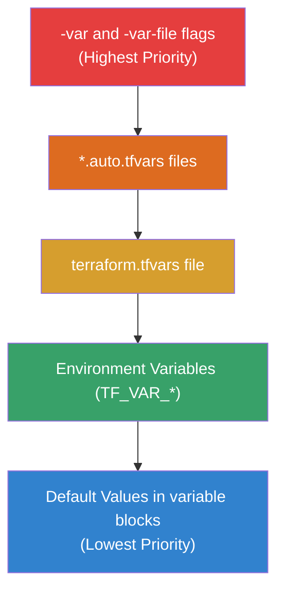

Variables allow you to parameterize your configurations, while Outputs let you extract information about your infrastructure.

## Input Variables
```hcl
variable "instance_type" {
  description = "Size of EC2"
  type        = string
  default     = "t3.micro"
}
```
## Output Values
```hcl
output "public_ip" {
  value = aws_instance.web.public_ip
}
```
## Variable Validation
You can enforce rules on your variables to prevent invalid configurations.
```hcl
variable "env" {
  validation {
    condition     = contains(["dev", "prod"], var.env)
    error_message = "Environment must be dev or prod."
  }
}
```

## Variable Precedence Order

When the same variable is defined in multiple places, Terraform uses this precedence (highest to lowest):



---
## 🏗️ Real-Life Scenario: The Secret Leak
**Problem**: A developer outputs a database password in the CLI, and it's visible in the logs.
**Solution**: Use the `sensitive = true` flag in your variables and outputs.
```hcl
variable "db_pass" {
  sensitive = true
}
output "db_pass" {
  value     = var.db_pass
  sensitive = true
}
```
Terraform will mask the value with `<sensitive>` in the console output.

---

## ❓ Interview Questions

1. **List three ways to pass variables to Terraform.**
   - *Answer*: 1. `-var` CLI flag. 2. `terraform.tfvars` file. 3. Environment variables (prefixed with `TF_VAR_`).

2. **What is the priority of variable sources?**
   - *Answer*: CLI flags (highest) > `*.auto.tfvars` > `terraform.tfvars` > Environment variables > Default values (lowest).

3. **What variable types does Terraform support?**
   - *Answer*: Primitive types (`string`, `number`, `bool`) and complex types (`list`, `map`, `set`, `object`, `tuple`).

4. **How does the `sensitive` flag affect variables and outputs?**
   - *Answer*: It masks the value in CLI output and logs, replacing it with `<sensitive>`. However, the value is still stored in plain text in the state file.

5. **Can you reference an output from a module?**
   - *Answer*: Yes, using the syntax `module.module_name.output_name`.

6. **What is the purpose of variable validation?**
   - *Answer*: To enforce business rules and constraints on input values before Terraform executes, preventing invalid configurations and providing clear error messages.

7. **Can outputs be used as inputs to other modules?**
   - *Answer*: Yes, this is a common pattern for module composition where one module's output becomes another module's input.

8. **What happens if you don't provide a value for a variable with no default?**
   - *Answer*: Terraform will prompt you interactively for the value, or error in non-interactive mode (like CI/CD pipelines).

---

## 🧠 Comprehensive Quiz (27 Questions)

<b>1. Which flag masks output values in console?</b>
<details>
<summary>Show Answer</summary>
Answer: B
</details>


<b>2. How do you define a default value for a variable?</b>
<details>
<summary>Show Answer</summary>
Answer: B
</details>


<b>3. Can an output value be used by other resources in the same configuration?</b>
<details>
<summary>Show Answer</summary>
Answer: B
</details>


<b>4. What is the file extension for variable value files?</b>
<details>
<summary>Show Answer</summary>
Answer: B
</details>


<b>5. Which environment variable prefix does Terraform use for variables?</b>
<details>
<summary>Show Answer</summary>
Answer: C
</details>


<b>6. Which variable type would you use for a list of strings?</b>
<details>
<summary>Show Answer</summary>
Answer: B
</details>


<b>7. How do you mark a variable as required (no default)?</b>
<details>
<summary>Show Answer</summary>
Answer: B
</details>


<b>8. What is the syntax for accessing a variable in your code?</b>
<details>
<summary>Show Answer</summary>
Answer: B
</details>


<b>9. Which has HIGHEST precedence for variable values?</b>
<details>
<summary>Show Answer</summary>
Answer: C
</details>


<b>10. Can you use expressions in variable default values?</b>
<details>
<summary>Show Answer</summary>
Answer: B
</details>


<b>11. What attribute provides documentation for a variable?</b>
<details>
<summary>Show Answer</summary>
Answer: B
</details>


<b>12. How do you validate a variable value?</b>
<details>
<summary>Show Answer</summary>
Answer: B
</details>


<b>13. Can you change a variable's value during apply?</b>
<details>
<summary>Show Answer</summary>
Answer: B
</details>


<b>14. What type would you use for a key-value pair structure?</b>
<details>
<summary>Show Answer</summary>
Answer: D
</details>


<b>15. Where can you define variables?</b>
<details>
<summary>Show Answer</summary>
Answer: B
</details>


<b>16. How do you pass a complex object as a variable?</b>
<details>
<summary>Show Answer</summary>
Answer: B
</details>


<b>17. What files are automatically loaded for variable values?</b>
<details>
<summary>Show Answer</summary>
Answer: B
</details>


<b>18. Can output values be sensitive?</b>
<details>
<summary>Show Answer</summary>
Answer: B
</details>


<b>19. What is the difference between `list` and `set` types?</b>
<details>
<summary>Show Answer</summary>
Answer: B
</details>


<b>20. How do you provide a `.tfvars` file that's not auto-loaded?</b>
<details>
<summary>Show Answer</summary>
Answer: B
</details>


<b>21. Can you reference one variable in another variable's default?</b>
<details>
<summary>Show Answer</summary>
Answer: B
</details>


<b>22. What is the primitive type for true/false values?</b>
<details>
<summary>Show Answer</summary>
Answer: B
</details>


<b>23. How do you make an output available to the parent module?</b>
<details>
<summary>Show Answer</summary>
Answer: C
</details>


<b>24. What happens if validation condition returns false?</b>
<details>
<summary>Show Answer</summary>
Answer: B
</details>


<b>25. Can you use functions in variable validation conditions?</b>
<details>
<summary>Show Answer</summary>
Answer: B
</details>


<b>26. Where are variable values stored?</b>
<details>
<summary>Show Answer</summary>
Answer: D
</details>


<b>27. What is `nullable` in a variable block?</b>
<details>
<summary>Show Answer</summary>
Answer: B
</details>


