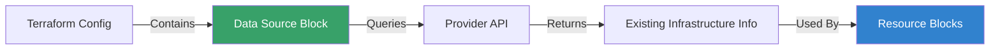

Data sources allow Terraform to use information defined outside of Terraform, or defined by another separate Terraform configuration.

## Basic Syntax
```hcl
data "aws_ami" "latest" {
  most_recent = true
  owners      = ["amazon"]
  filter {
    name   = "name"
    values = ["amzn2-ami-hvm-*"]
  }
}

resource "aws_instance" "app" {
  ami = data.aws_ami.latest.id
  ...
}
```

## Common Use Cases
- Querying the list of available Availability Zones.
- Fetching the ID of an existing VPC.
- Retrieving the latest OS image (AMI).
- Reading secrets from AWS Secrets Manager.

## Data Source Workflow



---
## 🏗️ Real-Life Scenario: Scaling to a New Region
**Problem**: You have a hardcoded AMI ID in your code. When you try to deploy to a different region, the AMI doesn't exist, and the deployment fails.
**Solution**: Use an `aws_ami` **Data Source**. This will dynamically search for the correct AMI ID in whatever region you are targeting, making your code portable.

---
## ❓ Interview Questions

1. **What is the main difference between a Data Source and a Resource?**
   - *Answer*: A Resource creates/manages infrastructure (Write); a Data Source fetches information from existing infrastructure (Read).

2. **Can you use data from one Terraform project in another?**
   - *Answer*: Yes, using the `terraform_remote_state` data source.

3. **When would you use a data source instead of hardcoding a value?**
   - *Answer*: When the value might change across environments (regions, accounts), when you need to query dynamic information (latest AMI), or when referencing resources managed outside your Terraform configuration.

4. **What happens if a data source query returns multiple results?**
   - *Answer*: It depends on the provider. Some data sources require filters to ensure a single result, others might support most_recent or similar attributes. If ambiguous, Terraform will error.

5. **Can you depend on a data source in a resource?**
   - *Answer*: Yes, Terraform automatically creates an implicit dependency when you reference a data source attribute in a resource.

---

## 🧠 Comprehensive Quiz (22 Questions)

<b>1. Does a data source block create infrastructure?</b>
<details>
<summary>Show Answer</summary>
Answer: B
</details>


<b>2. What keyword starts a data block?</b>
<details>
<summary>Show Answer</summary>
Answer: C
</details>


<b>3. If a data source fails to find a match, what happens?</b>
<details>
<summary>Show Answer</summary>
Answer: C
</details>


<b>4. True/False: Data sources are read-only.</b>
<details>
<summary>Show Answer</summary>
Answer: B
</details>


<b>5. How do you filter results in a data source?</b>
<details>
<summary>Show Answer</summary>
Answer: B
</details>


<b>6. What is the syntax to reference a data source?</b>
<details>
<summary>Show Answer</summary>
Answer: B
</details>


<b>7. Which data source can read state from another Terraform project?</b>
<details>
<summary>Show Answer</summary>
Answer: B
</details>


<b>8. Can you use data sources in modules?</b>
<details>
<summary>Show Answer</summary>
Answer: B
</details>


<b>9. What is a common use case for data sources?</b>
<details>
<summary>Show Answer</summary>
Answer: B
</details>


<b>10. How do data sources affect the dependency graph?</b>
<details>
<summary>Show Answer</summary>
Answer: B
</details>


<b>11. Can a data source depend on a resource?</b>
<details>
<summary>Show Answer</summary>
Answer: B
</details>


<b>12. What happens during `terraform plan` with data sources?</b>
<details>
<summary>Show Answer</summary>
Answer: B
</details>


<b>13. Are data source values stored in the state file?</b>
<details>
<summary>Show Answer</summary>
Answer: B
</details>


<b>14. Can you use filters to narrow down data source results?</b>
<details>
<summary>Show Answer</summary>
Answer: B
</details>


<b>15. What attribute typically selects the most recent result?</b>
<details>
<summary>Show Answer</summary>
Answer: B
</details>


<b>16. Can data sources query resources in different AWS accounts?</b>
<details>
<summary>Show Answer</summary>
Answer: B
</details>


<b>17. What is the `terraform_remote_state` data source used for?</b>
<details>
<summary>Show Answer</summary>
Answer: B
</details>


<b>18. Can you use a data source before `terraform init`?</b>
<details>
<summary>Show Answer</summary>
Answer: B
</details>


<b>19. Which is NOT a valid use case for data sources?</b>
<details>
<summary>Show Answer</summary>
Answer: B
</details>


<b>20. How do you query the current AWS region?</b>
<details>
<summary>Show Answer</summary>
Answer: A
</details>


<b>21. Can data sources have count or for_each?</b>
<details>
<summary>Show Answer</summary>
Answer: B
</details>


<b>22. What happens if you reference a data source that hasn't been evaluated yet?</b>
<details>
<summary>Show Answer</summary>
Answer: B
</details>


