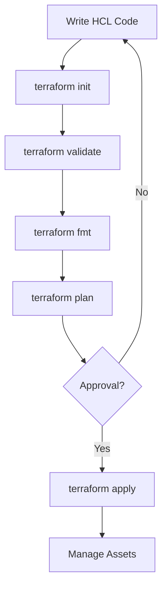
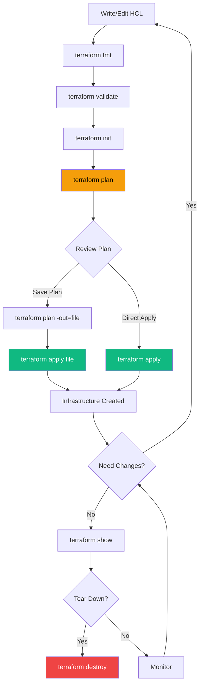

The standard workflow for any Terraform project consists of four main stages: Write, Init, Plan, and Apply.

## The Standard Workflow
1. **Write**: Define your infrastructure in HCL (`.tf` files).
2. **Init**: Prepare the working directory (`terraform init`).
3. **Plan**: Preview the changes (`terraform plan`).
4. **Apply**: Provision the infrastructure (`terraform apply`).

## Workflow Diagram


## Core Commands
- **fmt**: Rewrites config files to canonical format.
- **validate**: Checks for syntax errors and consistency.
- **destroy**: Tears down all managed infrastructure.
- **refresh**: Updates state with real-world infrastructure.
- **show**: Human-readable output of state or plan.
- **output**: Display output values.
- **graph**: Generate a visual dependency graph.

## Enhanced Workflow with State Management



---

## 🏗️ Real-Life Scenario: The Fat Finger Apply
**Problem**: An administrator intended to update 1 resource but didn't run a plan. The apply destroyed a critical database instead.
**Solution**: Always redirect your plan to a file:
```bash
terraform plan -out=mypowerfulplan
terraform apply "mypowerfulplan"
```
This ensures that the *exact* changes you reviewed in the plan are the one being applied.

---

## ❓ Interview Questions

1. **What does `terraform init` do?**
   - *Answer*: It initializes the working directory, downloads provider plugins, and sets up the backend for state storage.

2. **What is the difference between `plan` and `apply`?**
   - *Answer*: `plan` is a dry-run that shows what will happen without making changes. `apply` actually executes the changes.

3. **Why is it recommended to save the plan to a file?**
   - *Answer*: Saving the plan ensures that the exact changes reviewed during planning are the ones applied, preventing drift between plan and apply operations.

4. **What does `terraform refresh` do and when should you use it?**
   - *Answer*: It updates the state file to match the real-world infrastructure. Use it when you suspect drift or after manual changes. Note: It's often better to use `terraform plan -refresh-only` in modern Terraform.

5. **What is the purpose of `terraform fmt`?**
   - *Answer*: It automatically formats Terraform configuration files to a canonical style, ensuring consistency across the codebase and making code reviews easier.

6. **How does `terraform validate` differ from `terraform plan`?**
   - *Answer*: `validate` checks syntax and internal consistency of configuration without accessing remote services. `plan` requires provider authentication and checks against actual infrastructure.

7. **What happens if you run `terraform destroy` accidentally?**
   - *Answer*: Resources will be destroyed. Without state file backups or versioning, recovery is difficult. Always use version control for code and remote backends with versioning for state.

---

## 🧠 Comprehensive Quiz (28 Questions)

<b>1. Which command downloads providers?</b>
<details>
<summary>Show Answer</summary>
Answer: C
</details>


<b>2. Which command checks for syntax errors?</b>
<details>
<summary>Show Answer</summary>
Answer: B
</details>


<b>3. Which command deletes all resources?</b>
<details>
<summary>Show Answer</summary>
Answer: C
</details>


<b>4. Is approval required for `terraform apply` by default?</b>
<details>
<summary>Show Answer</summary>
Answer: B
</details>


<b>5. Which command applies a saved plan file?</b>
<details>
<summary>Show Answer</summary>
Answer: C
</details>


<b>6. What does `terraform fmt` do?</b>
<details>
<summary>Show Answer</summary>
Answer: B
</details>


<b>7. How do you skip the approval prompt during apply?</b>
<details>
<summary>Show Answer</summary>
Answer: C
</details>


<b>8. Which command shows the current state?</b>
<details>
<summary>Show Answer</summary>
Answer: B
</details>


<b>9. What does `terraform output` do?</b>
<details>
<summary>Show Answer</summary>
Answer: B
</details>


<b>10. How do you preview destroy operation?</b>
<details>
<summary>Show Answer</summary>
Answer: B
</details>


<b>11. Which command generates a dependency graph?</b>
<details>
<summary>Show Answer</summary>
Answer: A
</details>


<b>12. What does `terraform refresh` update?</b>
<details>
<summary>Show Answer</summary>
Answer: B
</details>


<b>13. Can you run `terraform plan` without `terraform init`?</b>
<details>
<summary>Show Answer</summary>
Answer: B
</details>


<b>14. What flag saves a plan to a file?</b>
<details>
<summary>Show Answer</summary>
Answer: C
</details>


<b>15. Which command is purely local (doesn't contact providers)?</b>
<details>
<summary>Show Answer</summary>
Answer: C
</details>


<b>16. What does `terraform init -upgrade` do?</b>
<details>
<summary>Show Answer</summary>
Answer: B
</details>


<b>17. How do you target a specific resource during apply?</b>
<details>
<summary>Show Answer</summary>
Answer: B
</details>


<b>18. What happens during `terraform init` if you already ran it?</b>
<details>
<summary>Show Answer</summary>
Answer: B
</details>


<b>19. Which command would you run first in a new Terraform project?</b>
<details>
<summary>Show Answer</summary>
Answer: C
</details>


<b>20. Can `terraform validate` detect logical errors in your infrastructure design?</b>
<details>
<summary>Show Answer</summary>
Answer: B
</details>


<b>21. What does `terraform workspace list` show?</b>
<details>
<summary>Show Answer</summary>
Answer: B
</details>


<b>22. How do you format all `.tf` files in a directory recursively?</b>
<details>
<summary>Show Answer</summary>
Answer: B
</details>


<b>23. What is the recommended practice before running apply?</b>
<details>
<summary>Show Answer</summary>
Answer: B
</details>


<b>24. Can you pipe `terraform plan` output to `terraform apply`?</b>
<details>
<summary>Show Answer</summary>
Answer: B
</details>


<b>25. What does the `-var` flag do?</b>
<details>
<summary>Show Answer</summary>
Answer: B
</details>


<b>26. Which command would you use to see the execution plan in a saved file?</b>
<details>
<summary>Show Answer</summary>
Answer: A
</details>


<b>27. What does `terraform apply -refresh=false` do?</b>
<details>
<summary>Show Answer</summary>
Answer: B
</details>


<b>28. Can you undo a `terraform apply` automatically?</b>
<details>
<summary>Show Answer</summary>
Answer: C
</details>


