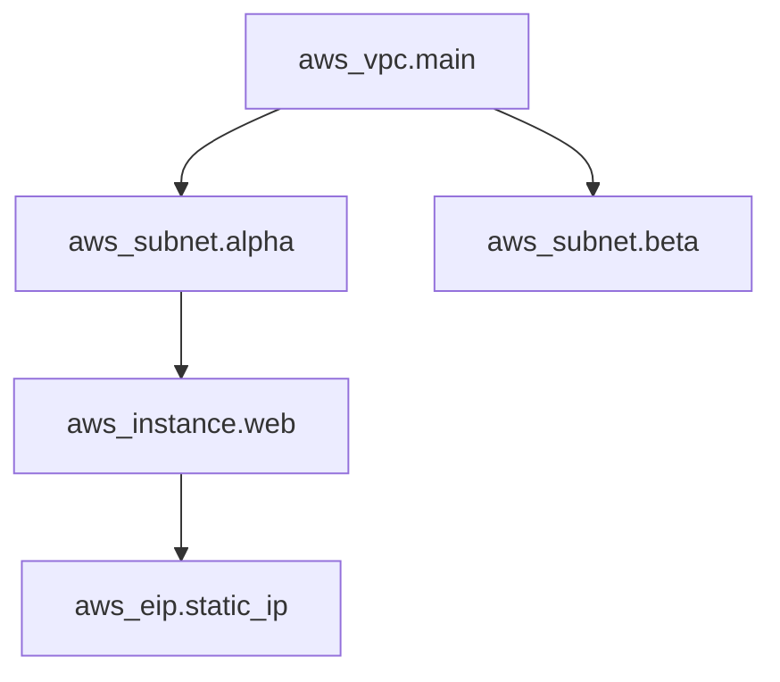
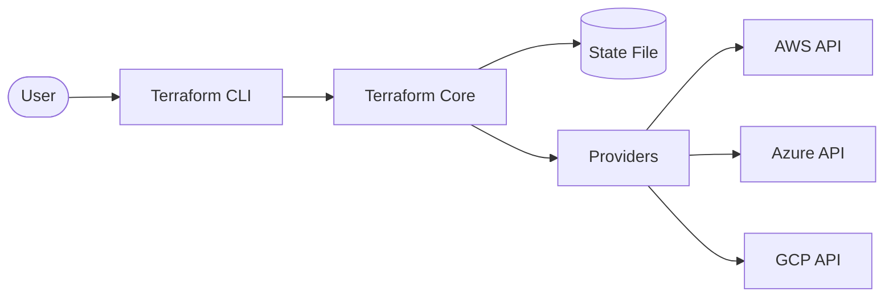

Understanding the architecture and main building blocks of Terraform.

## Terraform Architecture
Terraform consists of two main parts:
1. **Terraform Core**: The CLI tool that handles the logic, state, and planning.
2. **Providers**: Plugins that interface with remote APIs (AWS, Azure, GitHub, etc.).
## Main Building Blocks
- **Configuration Files**: `.tf` files defining the infrastructure.
- **State File**: A JSON file (`terraform.tfstate`) that tracks the current state of infrastructure.
- **Providers**: Plugins that bridge HCL to cloud APIs.
- **Resources**: The actual objects you want to manage (EC2, S3, etc.).
- **Modules**: Reusable packages of configurations.
- **Dependency Graph**: A mathematical structure (Directed Acyclic Graph) used to determine resource order.

## The Terraform Dependency Graph (DAG)
Terraform builds a map of all resources in your configuration to understand their relationships. This is called a **Directed Acyclic Graph (DAG)**.

### Why it matters:
1. **Parallelization**: Resources with no dependencies are created simultaneously to save time.
2. **Order of Operations**: It ensures a VPC exists before a Subnet is created within it.
3. **Efficiency**: Only changes the parts of the graph that are modified.

---

## 🏗️ Real-Life Scenario: The Lost State File
**Problem**: An engineer deletes the `terraform.tfstate` file by accident.
**Solution**: Terraform now thinks no infrastructure exists. If they run `terraform apply`, it will try to recreate everything, leading to errors (e.g., "Bucket already exists").
**Lesson**: Always use a remote backend (like S3 with DynamoDB locking) to store your state file safely and enable team collaboration.

---

## ❓ Interview Questions

1. **What is the purpose of the Terraform State file?**
   - *Answer*: It maps real-world resources to your configuration, keeps track of metadata, and improves performance for large infrastructures.

2. **What is the difference between a Provider and a Resource?**
   - *Answer*: A Provider is a plugin that makes an API reachable; a Resource is an object *within* that provider that you are creating/managing.

3. **How does Terraform's Dependency Graph (DAG) optimize resource creation?**
   - *Answer*: The DAG allows Terraform to parallelize the creation of independent resources while respecting dependencies. Resources without dependencies are created simultaneously, significantly reducing deployment time.

4. **What happens if there's a circular dependency in your Terraform configuration?**
   - *Answer*: Terraform will detect the circular dependency during the planning phase and return an error, preventing the apply operation. You must refactor your code to break the circular reference.

5. **Explain the difference between Terraform Core and Terraform Providers.**
   - *Answer*: Terraform Core is the main engine that handles parsing configurations, building the dependency graph, and managing state. Providers are plugins that translate Terraform's API calls into cloud-specific API calls (AWS, Azure, GCP, etc.).

6. **Why is Terraform considered "cloud-agnostic"?**
   - *Answer*: Terraform uses a plugin-based architecture where providers handle cloud-specific logic. The core language (HCL) and workflow remain the same regardless of the cloud provider, enabling multi-cloud deployments.

7. **What role does the state file play in the dependency graph?**
   - *Answer*: The state file stores the current state of resources including IDs, attributes, and metadata. Terraform uses this to calculate the difference between desired state (configuration) and current state (reality) when building the dependency graph for updates.

---

## 🧠 Comprehensive Quiz (25 Questions)

<b>1. What is the name of the Terraform state file?</b>

Show Answer

Answer: C

<b>2. Where does Terraform Core look for providers by default?</b>

Show Answer

Answer: B

<b>3. What happens if the state file is out of sync with reality?</b>

Show Answer

Answer: B

<b>4. Is it recommended to store state files in Git?</b>

Show Answer

Answer: B

<b>5. What is the 'Declarative' approach in Terraform?</b>

Show Answer

Answer: B

<b>6. What data structure does Terraform use to determine resource order?</b>

Show Answer

Answer: C

<b>7. What are the two main components of Terraform architecture?</b>

Show Answer

Answer: B

<b>8. What file extension is used for Terraform configuration files?</b>

Show Answer

Answer: C

<b>9. Which component handles the actual API calls to cloud providers?</b>

Show Answer

Answer: D

<b>10. What is the primary benefit of the DAG in Terraform?</b>

Show Answer

Answer: B

<b>11. Can Terraform's DAG contain cycles (circular dependencies)?</b>

Show Answer

Answer: C

<b>12. What information does the state file contain?</b>

Show Answer

Answer: B

<b>13. How does Terraform determine which resources can be created in parallel?</b>

Show Answer

Answer: B

<b>14. What happens when you reference one resource attribute in another resource?</b>

Show Answer

Answer: B

<b>15. Where is the Terraform state file stored by default?</b>

Show Answer

Answer: C

<b>16. What is the role of Terraform Core?</b>

Show Answer

Answer: B

<b>17. What language does Terraform use for configuration?</b>

Show Answer

Answer: C

<b>18. If a VPC must exist before creating a subnet, what ensures proper order?</b>

Show Answer

Answer: B

<b>19. How many providers can a single Terraform configuration use?</b>

Show Answer

Answer: C

<b>20. What type of graph structure does Terraform use?</b>

Show Answer

Answer: C

<b>21. What is stored in the `.terraform` directory after `terraform init`?</b>

Show Answer

Answer: C

<b>22. Can Terraform manage resources across multiple cloud providers simultaneously?</b>

Show Answer

Answer: B

<b>23. What happens if Terraform Core cannot reach a provider plugin?</b>

Show Answer

Answer: B

<b>24. What is the relationship between Terraform configuration files and the state file?</b>

Show Answer

Answer: B

<b>25. Why is the DAG described as "Acyclic"?</b>

Show Answer

Answer: B

