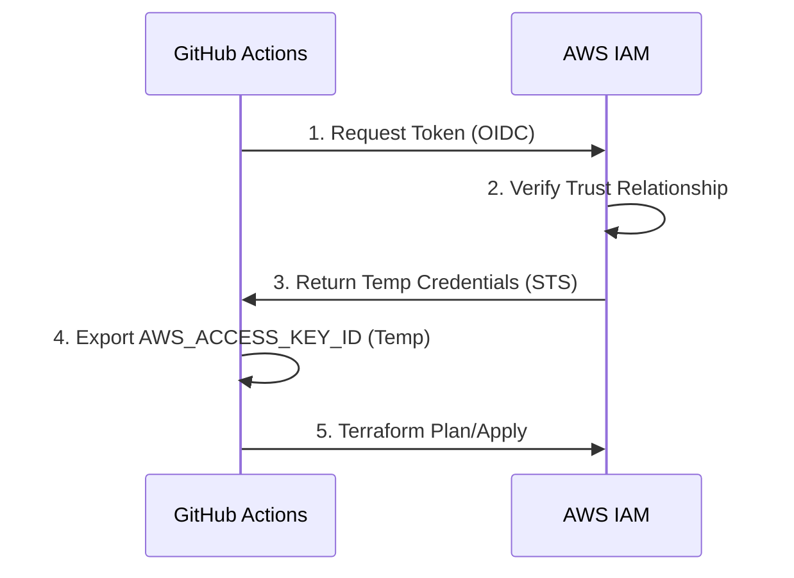

Security in Terraform is about protecting your state, your credentials, and your cloud resources.

## Core Security Pillars

## Core Security Pillars

### 1. State Security (The Crown Jewels)
The `.tfstate` file contains secrets in plaintext (database passwords, private keys). You must treat it like a password database.

**Best Practice Configuration (AWS S3 + DynamoDB):**
```hcl
terraform {
  backend "s3" {
    bucket         = "my-org-tfstate-secure"
    key            = "prod/app.tfstate"
    region         = "us-east-1"
    
    # 1. Encryption at Rest
    encrypt        = true
    
    # 2. Locking (Prevent race conditions)
    dynamodb_table = "terraform-locks"
  }
}
```
*   **Access Control**: The S3 bucket policy should deny all access except to the specific IAM Roles used by your CI/CD runners.
*   **Versioning**: Enable S3 Versioning to recover from accidental state corruptions.
### 2. Credential Management (OIDC vs Keys)
**Anti-Pattern**: Hardcoding AWS keys in `provider` blocks or storing long-lived `AWS_ACCESS_KEY_ID` in GitLab/GitHub variables.
**Best Practice**: OpenID Connect (OIDC). Your CI provider authenticates with AWS directly to assume a role.



### 3. Handling Secrets
Never commit secrets to Git. Instead, inject them or fetch them.

**Method A: Sensitive Variables**
Mark variables as sensitive to prevent them from showing up in CLI output.
```hcl
variable "db_password" {
  type      = string
  sensitive = true # Masks output in "terraform apply"
}

output "db_connect_string" {
  value     = "mysql://${aws_db_instance.main.endpoint}"
  sensitive = true # Required because it depends on a sensitive variable
}
```

**Method B: Data Sources (Runtime Fetching)**
Fetch the secret from AWS Secrets Manager *during* the apply.
```hcl
data "aws_secretsmanager_secret_version" "creds" {
  secret_id = "prod/db/password"
}

resource "aws_db_instance" "main" {
  password = jsondecode(data.aws_secretsmanager_secret_version.creds.secret_string)["password"]
}
```
### 4. Least Privilege
Your CI runner should not have `AdministratorAccess`. It should only have permissions to manage the specific resources in your stack.

**Example IAM Policy Snippet**:
```json
{
    "Version": "2012-10-17",
    "Statement": [
        {
            "Effect": "Allow",
            "Action": [
                "s3:CreateBucket",
                "s3:PutBucketVersioning"
            ],
            "Resource": "arn:aws:s3:::my-app-*"
        }
    ]
}
```

---

## 🏗️ Real-Life Scenarios

### Scenario 1: The Exposed Database
**Problem**: An engineer created a database and forgot to set the `publicly_accessible` flag to false.
**Solution**: Use a security scanner like **tfsec** in the CI pipeline. It will automatically detect the "High" severity risk and block the deployment until the flag is fixed.

### Scenario 2: The Plaintext State Breach
**Problem**: A developer downloaded the production `.tfstate` file to their local machine for debugging. Their laptop was stolen, and the database root password was found in the plaintext state file.
**Solution**: Enforce **Remote State with Encryption**. Use the `encrypt = true` flag in the S3 backend and restrict S3 bucket access to only the CI/CD Role. Use **KMS** to encrypt the state file so that even if the file is stolen, it cannot be read without specific IAM permissions.

### Scenario 3: The Over-Privileged CI Pipeline
**Problem**: A CI pipeline was configured with `AdministratorAccess`. A malicious Pull Request was submitted that successfully executed a `terraform destroy` on the entire production environment.
**Solution**: Implement **Least Privilege** and **OIDC**. Create an IAM role specifically for the CI pipeline that only has permissions to `Modify` the resources defined in the code (e.g., EC2, S3) but lacks permission to `Delete` core platform components or IAM roles themselves.

---

## ❓ Interview Questions

1.  **How do you securely handle secrets in Terraform?**
    - *Answer*: Use a secret manager (AWS Secrets Manager, Vault) and fetch them at runtime via data sources. Use the `sensitive = true` flag to mask values in the CLI. Never commit `.tfvars` files with secrets to Git.
2.  **Why is OIDC better than IAM user keys for CI/CD?**
    - *Answer*: OIDC provides temporary, short-lived credentials via STS. It eliminates the need to store long-lived "Access Keys" in GitHub/GitLab, which can be leaked or stolen.
3.  **Explain the significance of `sensitive = true`.**
    - *Answer*: This attribute prevents the value of a variable or output from being printed in the `terraform plan` or `apply` console output. Note: The value is still stored in plaintext in the `.tfstate` file.
4.  **How do you protect the Terraform State file?**
    - *Answer*: Use a remote backend (like S3) with `encrypt = true`, enable S3 Versioning, and use a strict Bucket Policy to limit access to only authorized CI/CD runners and senior admins.
5.  **What is "Static Analysis" for security in IaC?**
    - *Answer*: It's the process of scanning HCL code before deployment (using tools like Checkov or Tfsec) to find misconfigurations like open firewall ports, unencrypted volumes, or public buckets.
6.  **Can you encrypt the State file locally?**
    - *Answer*: Not natively with the local backend. This is why using a remote backend with built-in encryption (like S3 or Terraform Cloud) is a critical security requirement for production.

---

## 🧠 Comprehensive Quiz (25 Questions)

<b>1. Which attribute is used to prevent secrets from being printed in the console?</b>
<details>
<summary>Show Answer</summary>
Answer: C** - `sensitive = true` masks the value in CLI output.
</details>


<b>2. True/False: If a variable is marked 'sensitive', it is encrypted in the .tfstate file.</b>
<details>
<summary>Show Answer</summary>
Answer: B** - The state file still contains the plaintext value; you must protect the state file itself.
</details>


<b>3. What is the most secure way for GitHub Actions to authenticate with AWS?</b>
<details>
<summary>Show Answer</summary>
Answer: C
</details>


<b>4. Why should you enable S3 Versioning on your state bucket?</b>
<details>
<summary>Show Answer</summary>
Answer: B
</details>


<b>5. Which tool is specifically designed to scan HCL for security vulnerabilities?</b>
<details>
<summary>Show Answer</summary>
Answer: B
</details>


<b>6. "Least Privilege" for a Terraform CI runner means:</b>
<details>
<summary>Show Answer</summary>
Answer: B
</details>


<b>7. In the S3 backend, what does `encrypt = true` do?</b>
<details>
<summary>Show Answer</summary>
Answer: B
</details>


<b>8. Where is the most dangerous place to store a database password?</b>
<details>
<summary>Show Answer</summary>
Answer: C
</details>


<b>9. What is the benefit of using a DynamoDB table with the S3 backend?</b>
<details>
<summary>Show Answer</summary>
Answer: B
</details>


<b>10. Which command displays the full state, including sensitive values?</b>
<details>
<summary>Show Answer</summary>
Answer: B
</details>


<b>11. "OIDC" stands for:</b>
<details>
<summary>Show Answer</summary>
Answer: B
</details>


<b>12. When using `jsondecode(data.aws_secretsmanager_secret_version.creds.secret_string)`, where does the data come from?</b>
<details>
<summary>Show Answer</summary>
Answer: B
</details>


<b>13. A "Publicly Accessible" S3 bucket for state is:</b>
<details>
<summary>Show Answer</summary>
Answer: B
</details>


<b>14. Which flag in an `output` block is required if it references a sensitive variable?</b>
<details>
<summary>Show Answer</summary>
Answer: B
</details>


<b>15. Static analysis tools (tfsec/Checkov) should ideally run:</b>
<details>
<summary>Show Answer</summary>
Answer: C
</details>


<b>16. If your state file is compromised, you should:</b>
<details>
<summary>Show Answer</summary>
Answer: B
</details>


<b>17. "Credential Rotation" is easier with Terraform because:</b>
<details>
<summary>Show Answer</summary>
Answer: B
</details>


<b>18. Why use a "Service Principal" (Azure) or "IAM Role" (AWS) for CI?</b>
<details>
<summary>Show Answer</summary>
Answer: A
</details>


<b>19. What is the risk of "Long-lived" access keys?</b>
<details>
<summary>Show Answer</summary>
Answer: B
</details>


<b>20. A "Backend" in Terraform is:</b>
<details>
<summary>Show Answer</summary>
Answer: B
</details>


<b>21. "IAM Policies" should be:</b>
<details>
<summary>Show Answer</summary>
Answer: B
</details>


<b>22. "Data Encryption at Rest" applies to:</b>
<details>
<summary>Show Answer</summary>
Answer: B
</details>


<b>23. Which tool can help you manage secrets across multiple tools including Terraform?</b>
<details>
<summary>Show Answer</summary>
Answer: A
</details>


<b>24. "Drift Detection" can also be a security feature because:</b>
<details>
<summary>Show Answer</summary>
Answer: B
</details>


<b>25. Security should be considered as:</b>
<details>
<summary>Show Answer</summary>
Answer: B
</details>


