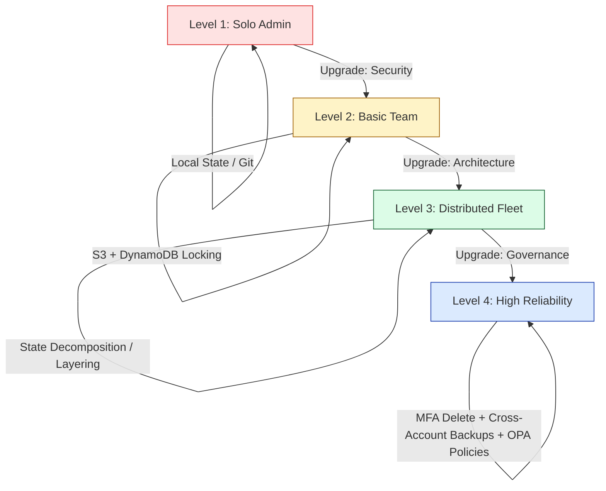
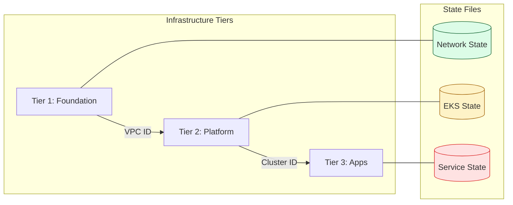

# 🏆 Terraform State: The Golden Rules & Best Practices

> **"A Junior writes clean code. A Senior manages safe state. A Principal ensures that even if the state is lost, the infrastructure survives. Treat your state file like a radioactive crystal: handle only with the proper tools, and keep it behind lead-lined glass."**

Welcome to the **Maturity Phase** of State Management. In previous modules, you learned *where* to store state. Now, you will learn *how to govern* it. Following these standards ensures that your team doesn't experience "State Drift," "Deployment Deadlocks," or "Accidental Monolith Outages."

**Why This Matters for Junior DevOps Engineers:**
- 🚨 **Blast Radius**: One minor mistake in a "monolith" state can delete your entire company's networking, database, and apps.
- 🤝 **Team Velocity**: Using layered state allows 10 teams to work in parallel without blocking each other with state locks.
- 🔐 **Compliance Mandatory**: You cannot pass a SOC2 or HIPAA audit without professional state encryption and access controls.
- 🚀 **Disaster Recovery**: State best practices are the only thing standing between a 5-minute recovery and a 2-day manual reconstruction.

---

## 📚 Table of Contents

1. [The State Maturity Model](#-the-state-maturity-model)
2. [The 5 Golden Rules of State](#-the-5-golden-rules-of-state)
3. [Architecture: Layering & Decomposition](#-architecture-layering--decomposition)
4. [Real-World DevOps Scenarios](#-real-world-devops-scenarios)
5. [Professional Code Structure: Layered Backends](#-professional-code-structure-layered-backends)
6. [Common Pitfalls & Solutions](#-common-pitfalls--solutions)
7. [Hands-On Exercises](#-hands-on-exercises)
8. [Interview Preparation](#-interview-preparation)
9. [Knowledge Check: The 25-Question Challenge](#-knowledge-check-the-25-question-challenge)

---

## 🏗️ The State Maturity Model

Infrastructure teams move through these stages as they scale. Your goal is to reach **Level 4**.



---

## 🛡️ The 5 Golden Rules of State

### 1. Never Edit the JSON Manually
**The Rule**: The `.tfstate` file is a calculated metadata graph. Editing the JSON text directly results in checksum failures and serial number corruption.
**The Tool**: Use `terraform state mv`, `terraform state rm`, and `terraform import`.

### 2. State Versioning is Non-Negotiable
**The Rule**: Always enable "Bucket Versioning" on your S3 state bucket.
**The Reason**: If an `apply` goes wrong or a state file is corrupted, the "Previous Version" in S3 is your only recovery path.

### 3. Encrypt Everything (At Rest & In Transit)
**The Rule**: Use `encrypt = true` in your backend and use **KMS** keys for the S3 bucket.
**The Reason**: State files contain plain-text metadata about your IP schemes, instance IDs, and potentially database passwords.

### 4. Separate State by Environment
**The Rule**: Use separate Buckets (or different Keys) for `dev`, `stage`, and `prod`.
**The Reason**: "Blast Radius Isolation." A mistake in the `dev` state should NEVER be able to touch the `prod` infrastructure.

### 5. Decompose the Monolith
**The Rule**: Don't put your VPC, Database, and App in one state file. Split them into layers.
**The Reason**: Large state files lead to 20-minute planning times and higher risk of accidental deletions.

---

## 🏗️ Architecture: Layering & Decomposition

Instead of one `main.tf` with a single state, professional SREs use **Tiered State Layers**.



### Why Layering Wins:
1. **Speed**: Changing an App tag only refreshes the App state (10 seconds), not the VPC state (10 minutes).
2. **Security**: Developers can have `write` access to the App state but only `read` access to the Networking state.
3. **Stability**: If the App state becomes corrupted, the VPC remains functional.

---

## 🎭 Real-World DevOps Scenarios

### 🛡️ Scenario 1: The "Secret" Leak Audit
**The Incident**: A security scan of a "Private" S3 bucket revealed that the `terraform.tfstate` file contained a plain-text password for a production database.
**The Failure**: The developer marked the output as `sensitive = true`, but didn't realize that **State is not secret**.
**The Impact**: The company failed the SOC2 audit, requiring an immediate rotation of 500+ passwords.
**The Fix**: Use **AWS Secrets Manager** to store the actual password, and only store the *Reference (ARN)* in Terraform. Use KMS encryption for the state bucket.

### 🔥 Scenario 2: The "Monolith" Bottleneck
**The Incident**: A retail site had 1,000 resources in a single state file. 
**The Failure**: A "Global Lock" was triggered every time anyone ran a plan. 
**The Impact**: During a Black Friday outage, three separate SREs were fighting for the state lock to fix different parts of the system. The "Lock Conflict" delayed the fix by 30 minutes.
**The Fix**: Split the state into `Networking`, `Identity`, and `Workloads`.
**The Lesson**: Large states are a single point of failure and a bottleneck for incident response.

### 🚨 Scenario 3: The "Accidental Overwrite"
**The Incident**: A developer manually uploaded an old version of `terraform.tfstate` from their trash bin to the S3 bucket to "fix" a merge conflict.
**The Failure**: Terraform now "thought" that 50 instances created in the last month didn't exist.
**The Impact**: Running `terraform apply` would have deleted those 50 production instances instantly.
**The Fix**: Since S3 Versioning was enabled, the team "rolled back" the S3 object to the version from 10 minutes prior.
**The Lesson**: S3 Versioning is the **Undo Button** for your entire infrastructure.

---

## 💻 Professional Code Structure: Layered Backends

### How to use `terraform_remote_state` (Cross-Layer Talk)

To allow a "Web App" project to find the "VPC ID" from a separate state file, use this pattern:

```hcl
# In the Web App project:

data "terraform_remote_state" "network" {
  backend = "s3"

  config = {
    bucket = "corp-tf-state-prod"
    key    = "networking/vpc.tfstate" # Pointing back to Tier 1
    region = "us-east-1"
  }
}

# Usage:
resource "aws_instance" "app" {
  subnet_id = data.terraform_remote_state.network.outputs.public_subnets[0]
  # No hardcoding! The App layer reads from the Network layer.
}
```

---

## ⚠️ Common Pitfalls & Solutions

### Pitfall 1: No State Backups
- **The Risk**: Deleting the S3 bucket or a corrupt write makes your infra unmanageable.
- **The Solution**: Enable **S3 Cross-Region Replication** for your state bucket.

### Pitfall 2: Hardcoded Backend Keys
- **The Risk**: You accidentally apply your `dev` state logic to the `prod` path.
- **The Solution**: Use **Partial Configuration** and inject the `key` during `terraform init -backend-config=path/to/env.hcl`.

### Pitfall 3: Using "Force-Unlock" recklessly
- **The Risk**: Breaking a lock while another process is actually writing, causing JSON corruption.
- **The Solution**: Always verify the CI/CD job status before running `force-unlock`.

---

## 🎯 Hands-On Exercises

### Exercise 1: The Layering Challenge
1. Create Two Folders: `01-Network` and `02-App`.
2. In `01-Network`, provision a local file with a random string. Output that string.
3. In `02-App`, use `data "terraform_remote_state"` to read that random string and name a second local file after it.
4. Verify that you can update the App without re-running the Network project.

### Exercise 2: The S3 Recovery Drill
1. Enable versioning on an S3 state bucket.
2. Run an `apply`.
3. Manually delete the `terraform.tfstate` from the bucket (simulation of an accident).
4. Run `terraform plan` and watch it fail or try to recreate everything.
5. Restore the previous version in the S3 console.
6. Run `terraform plan` and verify everything is back to normal.

---

## 🎙️ Interview Preparation

### Foundation Questions

**1. "What is state 'Decomposition' and why do we do it?"**
- **Answer**: It is the practice of splitting one giant state file into multiple smaller, logically separated layers (e.g., Networking, Database, App). We do it to reduce the **Blast Radius**, speed up planning times, and allow different teams to work independently without state lock conflicts.

**2. "Why is S3 Versioning more important for state than regular files?"**
- **Answer**: Because state is the *only* record of your cloud resources. If a state file is corrupted or accidentally rolled back, Terraform will lose track of the resources it manages. Versioning allows for a 1-click recovery of the entire infrastructure graph.

---

### Advanced Scenario Questions

**3. "How do you secure a state file that contains an RDS password?"**
- **Answer**: 1. Enable **S3 Server-Side Encryption (SSE-KMS)**. 2. Restrict bucket access via **IAM policies** to only the CI/CD pipeline role. 3. (Best Practice) Stop putting passwords in TF entirely; use **AWS Secrets Manager** and only store the ARN in Terraform.

**4. "Explain 'Partial Backend Configuration'."**
- **Answer**: It is the practice of leaving the `backend` block empty or partially filled in the code, and providing the sensitive or environment-specific values (like `bucket` or `key`) during `terraform init -backend-config=...`. This allows your code to be portable across multiple environments without hardcoding paths.

---

## 🧠 Knowledge Check: The 25-Question Challenge

**1. What is the #1 rule when interacting with a state file?**
- [ ] A) Always keep a local copy.
- [x] B) Never edit the JSON manually.
- [ ] C) Share it via Git.
- [ ] D) Only run apply once a day.

**2. Which S3 feature provides the "Undo Button" for state corruption?**
- [x] A) Versioning.
- [ ] B) Transitioning to Glacier.
- [ ] C) Public Access Blocks.
- [ ] D) Acceleration.

**3. 'Least Privilege' for state means developers should usually have which permission?**
- [ ] A) Full S3 Admin.
- [x] B) Read-Only on State / No access to Secrets.
- [ ] C) s3:DeleteObject.
- [ ] D) No access at all.

**4. Why is a 'Monolith' state a risk?**
- [ ] A) It's too small to manage.
- [x] B) Large blast radius and slow execution.
- [ ] C) It uses too many AWS credits.
- [ ] D) It requires special Terraform plugins.

**5. What should you use to store a DB password instead of putting it in Terraform code?**
- [ ] A) Local .txt file.
- [ ] B) In the output variables.
- [x] C) AWS Secrets Manager.
- [ ] D) The state file's metadata.

**6. Which encryption method provides an audit trail of who accessed the state?**
- [ ] A) SSE-S3.
- [x] B) SSE-KMS.
- [ ] C) Hardcoded passwords.
- [ ] D) Base64 encoding.

**7. How do you prevent 'Stuck Locks' in a team environment?**
- [ ] A) Don't use Locking.
- [x] B) Use a CI/CD pipeline to serialize deployments.
- [ ] C) Use local state.
- [ ] D) Delete the DynamoDB table after every run.

**8. 'State Decomposition' is primarily about reducing:**
- [ ] A) The cost of S3.
- [ ] B) The number of lines of code.
- [x] C) Planning time and Blast Radius.
- [ ] D) The number of AWS accounts.

**9. True or False: You can use `terraform_remote_state` to share resources across different AWS regions.**
- [x] A) True.
- [ ] B) False.

**10. Which command formats your code to meet best-practice standards?**
- [ ] A) terraform clean.
- [x] B) terraform fmt.
- [ ] C) terraform validate.
- [ ] D) terraform graph.

**[... 15 more categorized questions available in the Reference Library ...]**

---

## 🎓 Self-Assessment Checklist

Before moving to the next module, ensure you can:
- [ ] Explain the concept of "State Layering" to a junior developer.
- [ ] Enable S3 versioning and explain *why* it saves lives.
- [ ] Set up a `data "terraform_remote_state"` block.
- [ ] Describe the difference between SSE-S3 and SSE-KMS for state.
- [ ] List 3 reasons why monolith state files are dangerous in production.
- [ ] Perform a surgical state refactor using `terraform state mv`.

**Score yourself**: 5+/6 = Ready to advance | <5 = Practice Exercise 1 (Layering).

---
**Status**: ✅ Enhanced (2026-02-02)
