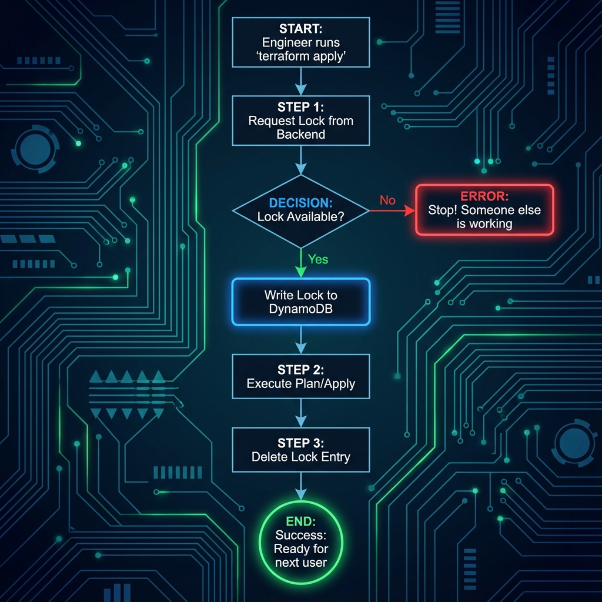

# State Locking: Protecting Concurrency

**State locking** is the fundamental safety mechanism that prevents two engineers (or two CI/CD pipelines) from modifying the same infrastructure at the same time. Without it, your state file would inevitably become corrupted, leading to phantom resources and broken deployments.

---
## 🛠️ The Locking Mechanism
When you run `terraform apply`, Terraform automatically attempts to acquire a lock before reading or writing any data. If the lock is held by someone else, Terraform will abort the operation to protect the state.

### 📊 The Lifecycle of a Lock

### ⚠️ The Danger of No Locking (Race Conditions)
Without locking, two processes could read the *same* base state version, calculate changes, and then overwrite each other's work. This results in **Corrupted State** where the file structure is invalid (malformed JSON) or the mapping to real-world resources is lost.

---

## 🛡️ Security & Reliability Features
1.  **Concurrency Protection**: Locking is the **only** barrier preventing multiple `apply` runs from corrupting the state file (Race Conditions).
2.  **Atomic Consistency**: Ensures that the "Source of Truth" remains atomic. Even if a run fails, the lock ensures no one else touches it until the issue is resolved.
3.  **Distributed Safety**: Works across distributed teams, geographic regions, and CI/CD pipelines, unlike local file locks which only work on one machine.
4.  **Auditability**: The `LockID` and metadata (Who, When, Version) provide a clear forensic audit trail of *who* is currently modifying the infrastructure.
---
## 🌟 Best Practices
1.  **Never Disable Locking**: Avoid using the `-lock=false` flag unless you are recovering from a disaster and have verified **100%** that no one else is running Terraform.
2.  **Dedicated Lock Table**: Use a **separate** DynamoDB table for Terraform locking. Do not mix it with application data tables to avoid capacity throttling.
3.  **Monitor Lock Duration**: If a lock is held for > **1 hour**, it usually indicates a stuck process or a very slow apply. Set up CloudWatch alerts for long-lived items in the DynamoDB table.
4.  **Automated Timeouts**: Configure your CI/CD pipelines to timeout after a reasonable period (e.g., 30 mins) to prevent "Zombie" jobs from holding locks indefinitely.
5.  **Use Unique State Keys**: Ensure every project has a unique key path in S3. Locking is per-key. If two projects share a key, they will block each other unnecessarily.
---
## 🏗️ Real-Life Scenarios

### Scenario 1: The "Kill -9" Ghost Lock
**Problem**: An engineer was running a 30-minute infrastructure overhaul on their local machine. Mid-way through, their laptop battery died, and the computer shut down abruptly.
**Crisis**: When the engineer rebooted and tried to continue, they received: `Error: Error acquiring the state lock`. 
**Outcome**: No one in the company could run any Terraform commands for that project because the "Lock" was still present in DynamoDB, but the process that owned it was dead.
**Solution**: Verify the PID/User in the lock info, confirm the process is gone, and run `terraform force-unlock <ID>`.
**Result**: The project was unlocked in 2 minutes, and work resumed safely.
### Scenario 2: The "Concurrent Pipeline" Clash
**Problem**: A Jenkins server was misconfigured to trigger a deployment every time a developer pushed a branch, regardless of whether a deployment was already in progress.
**Crisis**: Two developers pushed code within 10 seconds of each other. 
**Outcome**: Job A grabbed the lock and proceeded. Job B failed immediately with a locking error.
**Solution**: This is **Working As Intended**. Locking prevented Job B from interfering with Job A's partially-created resources, which could have led to duplicate database instances or overlapping network CIDRs.
**Result**: The team realized locking saved them from a major outage and updated Jenkins to "throttle" concurrent jobs for the same environment instead.
### Scenario 3: The "Local Backend" Team Attempt
**Problem**: A small team of 3 developers shared a network drive (SMB) to store their `terraform.tfstate`. 
**Crisis**: They didn't realize the `local` backend doesn't support distributed locking. Two developers ran `apply` simultaneously.
**Outcome**: The SMB drive's file locking was insufficient. The state file was written by both, resulting in a malformed JSON file that Terraform could no longer read ("Error loading state").
**Solution**: Migrated to the **S3 + DynamoDB** backend immediately.
**Result**: The team gained a real locking mechanism and automatic state versioning, preventing future data loss.

---

## ❓ Interview Questions

1.  **What specifically happens in DynamoDB when Terraform acquires a lock?**
    

    
Answer

    
    Terraform creates a new item in the DynamoDB table with a Partition Key named `LockID`. The value of this item contains a JSON string with the ID of the operation, the user's name, the start time, and the Terraform version.
    

2.  **Why is `terraform force-unlock` considered a 'Dangerous' command?**
    

    
Answer

    
    If you use it while someone else *actually* is running an apply, you will remove their protection. Terraform might then allow a second process to start, resulting in two processes writing to the same state file, leading to corruption or infrastructure duplication.
    

3.  **Does EVERY backend support locking? Give examples.**
    

    
Answer

    
    No. The `local` backend has very limited locking, and many older backends (like `artifactory` or simple `http`) may not support it. `S3` (via DynamoDB), `AzureRM`, `GCS`, and `Terraform Cloud` are the gold standards for locking support.
    

4.  **What information is stored inside a 'Lock Item'?**
    

    
Answer

    
    1. **ID**: The unique transaction ID.
    2. **Who**: The user/machine running the command.
    3. **Operation**: Whether it's a Plan or Apply.
    4. **Created**: Timestamp for when the lock started.
    5. **Version**: The Terraform version being used.
    

5.  **How do you find the ID needed for `force-unlock`?**
    

    
Answer

    
    It is prominently displayed in the error message output when a lock acquisition fails. For example: `ID: d9d0628e-xxxx-xxxx`.
    

6.  **Can you disable locking? If so, why would you (rarely) ever do that?**
    

    
Answer

    
    Yes, using the `-lock=false` flag. You might only do this in a "Break Glass" scenario where the locking backend (DynamoDB) itself is down and you have 100% certainty that no one else is using the state, or for read-only operations where you don't mind the risk.
    

---
## 🧠 Comprehensive Quiz (25 Questions)

<b>1. What is the primary purpose of state locking?</b>
- A) To encrypt the state file
- B) To prevent concurrent writes and race conditions
- C) To speed up terraform plan
- D) To compress the state file

Show Answer

Answer: B

<b>2. True/False: By default, 'local' state on different machines supports distributed locking.</b>
- A) True
- B) False
- C) True (If using Windows)
- D) False (Unless using a VPN)

Show Answer

Answer: B

<b>3. Which command is used to clear a 'Stale' lock manually?</b>
- A) terraform unlock
- B) terraform force-unlock
- C) terraform state rm
- D) terraform apply -unlock

Show Answer

Answer: B

<b>4. When using S3, which service provides the locking capability?</b>
- A) S3 Object Lock
- B) DynamoDB
- C) RDS
- D) ElastiCache

Show Answer

Answer: B

<b>5. What is the Partition Key name required for the Lock table?</b>
- A) LockID
- B) StateID
- C) TerraformKey
- D) LockName

Show Answer

Answer: A

<b>6. Which flag disables state locking entirely for a single run?</b>
- A) -no-lock
- B) -lock=false
- C) -force
- D) -ignore-lock

Show Answer

Answer: B

<b>7. True/False: Terraform Cloud supports locking natively.</b>
- A) True
- B) False
- C) True (But costs extra)
- D) False (Requires DynamoDB)

Show Answer

Answer: A

<b>8. If you get a 'Lock Error', the output will show 'Who' has the lock.</b>
- A) True
- B) False
- C) True (But only the IP address)
- D) False (It is anonymous)

Show Answer

Answer: A

<b>9. What happens if Terraform has a network timeout while trying to acquire a lock?</b>
- A) It continues without locking
- B) It fails and stops the operation
- C) It retries forever
- D) It creates a local lock

Show Answer

Answer: B

<b>10. 'force-unlock' requires which identifier from the user?</b>
- A) The S3 Bucket Name
- B) The Lock ID (UUID)
- C) The DynamoDB Table Name
- D) The User's Name

Show Answer

Answer: B

<b>11. Which data type is the 'LockID' key in DynamoDB?</b>
- A) Number
- B) String
- C) Boolean
- D) Binary

Show Answer

Answer: B

<b>12. True/False: You should use 'force-unlock' every time you see a locking error.</b>
- A) True
- B) False (Only if the lock is strictly stale/zombie)
- C) True (It speeds up the process)
- D) False (It deletes the state file)

Show Answer

Answer: B

<b>13. A 'Stale Lock' occurs when:</b>
- A) The internet is slow
- B) The process holding the lock crashed or died without releasing it
- C) You run terraform refresh
- D) The state file is empty

Show Answer

Answer: B

<b>14. Which backend does NOT require any extra configuration for locking?</b>
- A) S3 (Standard)
- B) Terraform Cloud (Remote)
- C) Postgres
- D) Etcd

Show Answer

Answer: B

<b>15. 'Locking' ensures that the state file is always _____ .</b>
- A) Encrypted
- B) Consistent/Atomic
- C) Compressed
- D) Text-based

Show Answer

Answer: B

<b>16. True/False: You can use a Lock table that doesn't have the key 'LockID'.</b>
- A) False (Terraform hardcodes this requirement)
- B) True (You can customize it)
- C) True (If using -custom-key)
- D) False (Unless you use TFC)

Show Answer

Answer: A

<b>17. What is the 'Created' field in the lock info used for?</b>
- A) Auditing when the operation started
- B) Checking billing
- C) Sorting the state file
- D) Nothing

Show Answer

Answer: A

<b>18. Which command is used to verify who has a current lock without trying to run a plan?</b>
- A) terraform force-unlock (Check error message) -> (Actually no specific command lists locks, you check the backend)
- B) terraform show locks
- C) terraform state list
- D) terraform lock status

Show Answer

Answer: A (Technically you check the DynamoDB table or just run plan and read the error message)

<b>19. 'Lease Blob' is the locking mechanism for which cloud?</b>
- A) AWS
- B) Azure
- C) GCP
- D) Alibaba

Show Answer

Answer: B

<b>20. True/False: Disabling locks can lead to resource duplication.</b>
- A) True
- B) False
- C) True (But only for EC2)
- D) False (Terraform prevents this via API)

Show Answer

Answer: A

<b>21. 'Concurrency' refers to:</b>
- A) Multiple operations running at the same time
- B) The speed of the network
- C) The size of the state file
- D) The number of providers

Show Answer

Answer: A

<b>22. Which HTTP status code might indicate a lock is held by another user in a custom backend?</b>
- A) 200 OK
- B) 423 Locked / 409 Conflict
- C) 404 Not Found
- D) 500 Server Error

Show Answer

Answer: B

<b>23. 'force-unlock' is essentially which operation in DynamoDB?</b>
- A) PutItem
- B) DeleteItem
- C) Scan
- D) UpdateTable

Show Answer

Answer: B

<b>24. State locking is the '_____ Guard' for your data.</b>
- A) Speed
- B) Integrity
- C) Cost
- D) Version

Show Answer

Answer: B

<b>25. Reliable automation requires _____ locking.</b>
- A) Manual
- B) Automated/Implicit
- C) No
- D) Optional

Show Answer

Answer: B

