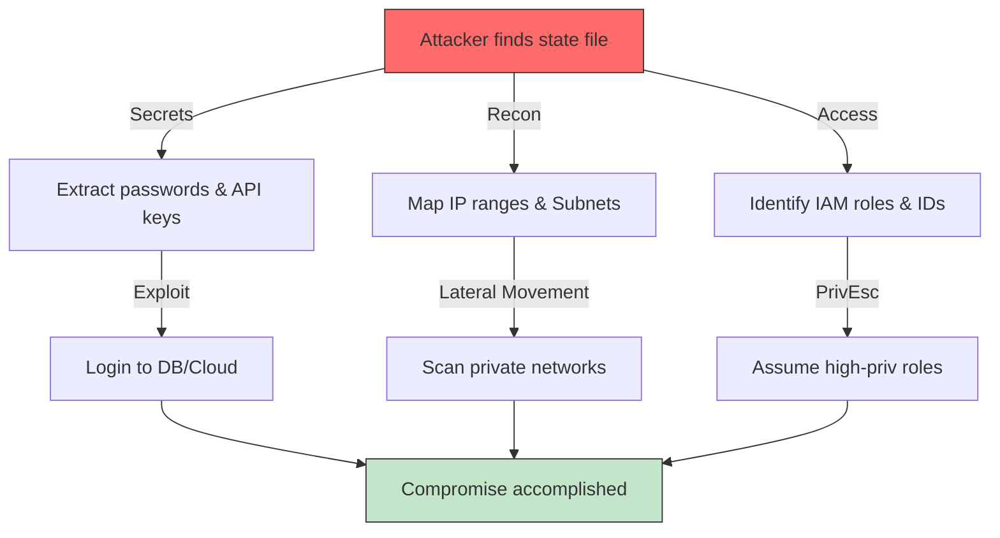

# Protecting the Source of Truth
The Terraform state file is arguably the most sensitive file in your entire infrastructure codebase. It acts as the source of truth for your resources but effectively stores a "plaintext" representation of your environment, often including secrets, keys, and metadata that attackers crave.

---
## 🛡️ The Threat Model: Attack Workflow
Attackers target state files because they are high-value targets containing everything needed to compromise a cloud environment.

---

## 🏗️ Real-Life Scenarios

### Scenario 1: The "Git-Committed" Disaster
**Problem**: A junior engineer accidentally committed `terraform.tfstate` to a public GitHub repo.
**Crisis**: The state contained a root database password and an AWS IAM Access Key. 
**Outcome**: Within 10 minutes, a bot discovered the key, logged in, and started mining Bitcoin, costing the company $30,000 in one hour.
**Solution**: Rotate credentials immediately! Use **Remote Backends** and a strict `.gitignore`. Run tools like `trufflehog` to scan Git history for leaks.
**Result**: The company implemented an "Air-Gapped" CI/CD pipeline where local state files are never created.
### Scenario 2: The "Shadow IT" Reconnaissance 
**Problem**: An attacker breached a developer's machine and found a local state file for a "Legacy" project.
**Crisis**: Even though the credentials were old, the state file contained a full list of all private IP addresses and subnets in the production VPC.
**Outcome**: The attacker used this "Map" to bypass discovery phases and directly target the most sensitive internal servers via a VPN bridge.
**Solution**: Use **Encryption at Rest (KMS)**. Even if the state file is downloaded, it remains encrypted and useless without access to the KMS key.
**Result**: The team moved all legacy states to an encrypted S3 bucket with least-privilege IAM policies.
### Scenario 3: The "Accidental Public" Bucket
**Problem**: An S3 bucket used for Terraform state was misconfigured with "Public Read" access during a migration.
**Crisis**: A security researcher found the bucket and demonstrated they could read the AWS configuration of the entire company.
**Outcome**: A major PR crisis and a failed compliance audit.
**Solution**: Enable **S3 Block Public Access** at the account level and use **Bucket Policies** to deny any requests that don't originate from a specific IAM Role or VPC Endpoint.
**Result**: The company passed its SOC2 audit by proving that state access is physically impossible from the public internet.

---
## 🛡️ Security & Reliability Features

### 1. Encryption at Rest
*   **Mechanism**: All state files must be encrypted where they are stored.
*   **Standard**: **SSE-S3** (Server-Side Encryption with S3-managed keys) provides basic protection.
*   **Advanced**: **SSE-KMS** (AWS Key Management Service) is the gold standard. It allows you to use Customer Managed Keys (CMKs), enabling you to rotate keys, audit usage in CloudTrail, and revoke access instantly without deleting the file.
*   **Why**: If a hard drive in an AWS datacenter fails or is decommissioned, or if a snapshot is leaked, the data remains unreadable.
### 2. Encryption in Transit (TLS)
*   **Mechanism**: Enforce HTTPS for all data moving between your local machine (or CI/CD runner) and the S3 backend.
*   **Implementation**: Use an S3 Bucket Policy with a Condition that denies s3:PutObject if aws:SecureTransport is false.
*   **Why**: Prevents **Man-in-the-Middle (MITM)** attacks where an attacker on the same network intercepts your state file upload containing secrets.
### 3. State Locking (Reliability)
*   **Mechanism**: Uses a lock entry (typically in **DynamoDB** for S3 backends) to track active operations.
*   **Process**: When you run terraform apply, Terraform writes a "Lock ID" to the table. If another user attempts to run apply, Terraform sees the lock and aborts.
*   **Why**: Prevents **Race Conditions** and **corruption**. Without locking, two concurrent writes would destroy the JSON structure, leading to total data loss.
### 4. Versioning & Recovery
*   **Mechanism**: Enable **S3 Bucket Versioning**.
*   **Benefit**: Every time the state is updated, S3 keeps the old copy.
*   **Why**: This is your "Undo" button. If a corrupted state file is pushed, or if ransomware deletes the file, you can restore the precise version from 5 minutes ago.
### 5. Access Control (RBAC)
*   **Mechanism**: Apply **Least Privilege** principles using IAM Policies.
*   **Policy**:
    *   **Developers**: `s3:GetObject` (Read-only) or `Deny` (Blind execution via CI/CD).
    *   **CI/CD Pipeline**: `s3:PutObject`, `dynamodb:PutItem`.
    *   **Admins**: Full control.
*   **Why**: Minimizes the "Insider Threat" and accidental modifications.

---
## 🏆 Best Practices
### 1. 🚫 **NEVER Store Secrets in State** (If possible)
While Terraform encrypts the state *file*, the *content* inside is JSON plaintext.
*   **Bad**: `variable "db_password" { default = "Hunter2" }`
*   **Good**: Use `data "aws_secretsmanager_secret_version"` to fetch secrets at runtime. Terraform still sees the value, but it minimizes the exposure footprint in your code.
*   **Best**: Provision resources that generate their own credentials (e.g., IAM Roles for EC2) so static keys never exist.
### 2. 📡 **Remote Backend is Mandatory**
Never store `terraform.tfstate` on a developer's laptop.
*   **Risk**: Laptops are lost, stolen, or broken. Local state has no locking and no versioning.
*   **Solution**: Use Terraform Cloud, S3+Dynamo, or Azure Blob Storage immediately.
### 3. 💣 **Limit Blast Radius**
Do not have one giant state file for your entire company.
*   **Strategy**: Split state files by **Environment** (Dev, Prod) and **Layer** (Network, App, Data).
*   **Benefit**: If the "Dev-App" state is compromised/corrupted, the "Prod-Network" remains safe.
### 4. 👁️ **Audit Logging**
Enable **AWS CloudTrail** for S3 Data Events.
*   **Goal**: You should be able to answer: "Who downloaded the production state file last Tuesday at 4:00 PM?"
*   **Compliance**: Required for SOC2, HIPAA, and ISO 27001.
### 5. 🎭 **Use Terraform Cloud/Enterprise (TFC)**
For large teams, TFC offers "State Encryption at Rest" where even HashiCorp cannot see your data (with private agents), and it handles RBAC natively.

---
## ❓ Interview Questions

1.  **If I mark an output as 'sensitive', is it encrypted in the state file?**
    

    
Answer

    No. `sensitive = true` only hides the value from the terminal output during a `plan` or `apply`. In the `terraform.tfstate` JSON file, the value is stored in plain text. This is why state file access control is critical.
    

2.  **Explain the 'Least Privilege' concept for a Terraform backend.**
    

    
Answer

    The IAM Role running Terraform should have `List/Get/Put` permissions *only* for its specific state bucket and `Encrypt/Decrypt` for its specific KMS key. It should NOT have permissions to manage the bucket itself or access other projects' states.
    

3.  **Why should you use SSE-KMS instead of SSE-S3 for state files?**
    

    
Answer

    SSE-KMS allows for Customer Managed Keys (CMKs). This provides a separate audit trail in CloudTrail (allowing you to audit *decryption* events specifically) and gives you the ability to revoke access to the key independently of the bucket permissions.
    

4.  **What is 'Man-in-the-middle' (MITM) in state management?**
    

    
Answer

    This occurs when state data is intercepted while being sent to the remote backend over the network. To prevent this, always enforce TLS (HTTPS) via S3 bucket policies (`aws:SecureTransport`) or transport-layer security in your CI/CD runners.
    

5.  **How do you handle 'Secrets' properly so they never enter the state file?**
    

    
Answer

    Use **Dynamic Secrets** or **Vault Providers**. Instead of passing a password variable, have Terraform create a resource (like an RDS instance) and store its password directly in **AWS Secrets Manager**. Ideally, use IAM Authentication so no passwords exist at all. Note that `data` sources fetching secrets *will* often persist them to state, so treat state as a secret.
    

---

## 🧠 Comprehensive Quiz (25 Questions)

<b>1. Where are 'sensitive' values stored in a local state file?</b>
- A) Encrypted Vault
- B) Plain Text (JSON)
- C) Environment Variables
- D) Hidden shadow file

Show Answer

Answer: B

<b>2. True/False: 'terraform.tfstate' should always be in your .gitignore.</b>
- A) True
- B) False

Show Answer

Answer: A

<b>3. Which AWS service is best for encrypting state files with a custom key?</b>
- A) IAM
- B) KMS (Key Management Service)
- C) EC2
- D) WAF

Show Answer

Answer: B

<b>4. 'Least Privilege' means an IAM user only has permissions to:</b>
- A) All S3 Buckets
- B) Only the specific state bucket required
- C) Root Access
- D) Read-only on the entire account

Show Answer

Answer: B

<b>5. Which tool can be used to scan for secrets in Git history?</b>
- A) Terraform Graph
- B) TruffleHog / GitLeaks
- C) AWS Inspector
- D) Docker

Show Answer

Answer: B

<b>6. 'SSE-S3' encryption is managed by:</b>
- A) You (Manually rotating keys)
- B) AWS (Amazon S3)
- C) Terraform
- D) The client

Show Answer

Answer: B

<b>7. True/False: You can audit who decrypted your state file using CloudTrail logs.</b>
- A) True (If using KMS)
- B) False (S3 logs don't show decryption users)

Show Answer

Answer: A

<b>8. Which S3 feature prevents accidental deletion by requiring a code?</b>
- A) Versioning
- B) MFA Delete
- C) Encryption
- D) Replication

Show Answer

Answer: B

<b>9. Storing state in S3 with Public access is a:</b>
- A) Best Practice
- B) Critical Security Vulnerability
- C) Performance Optimization
- D) Required setting for TFC

Show Answer

Answer: B

<b>10. 'Transport Encryption' (TLS) protects data in:</b>
- A) Rest (Disk)
- B) Transit (Network)
- C) Memory
- D) Database

Show Answer

Answer: B

<b>11. Which data source should be used to fetch secrets at runtime?</b>
- A) local_file
- B) aws_secretsmanager_secret_version
- C) external
- D) null_resource

Show Answer

Answer: B

<b>12. Which feature ensures state integrity and prevents race conditions?</b>
- A) State Locking
- B) State Encryption
- C) State Versioning
- D) State Backup

Show Answer

Answer: A

<b>13. A 'KMS Key Policy' controls:</b>
- A) Who can access the S3 bucket
- B) Who can use the key to Encrypt/Decrypt data
- C) The size of the key
- D) The region of the key

Show Answer

Answer: B

<b>14. True/False: Terraform Cloud automatically encrypts state at rest.</b>
- A) True
- B) False

Show Answer

Answer: A

<b>15. Which character string often marks a leaked AWS IAM Access Key?</b>
- A) AKIA...
- B) S3://...
- C) sg-...
- D) vpc-...

Show Answer

Answer: A

<b>16. 'Bucket Policies' are used to:</b>
- A) Encrypt the data
- B) Define access rules for the S3 bucket itself
- C) Compress the state file
- D) Version the state file

Show Answer

Answer: B

<b>17. What is the risk of an attacker seeing 'VPC ID' and 'Subnet IDs' in state?</b>
- A) None
- B) Lateral Movement / Network Reconnaissance
- C) It crashes the VPC
- D) It changes the IP

Show Answer

Answer: B

<b>18. True/False: You should use different KMS keys for Dev and Prod states.</b>
- A) True
- B) False

Show Answer

Answer: A

<b>19. Which AWS Service records API calls like 'GetObject' for auditing?</b>
- A) CloudWatch
- B) CloudTrail
- C) Config
- D) Inspector

Show Answer

Answer: B

<b>20. 'Secret Redaction in CLI output' is achieved using:</b>
- A) sensitive = true
- B) private = true
- C) hidden = true
- D) secret = true

Show Answer

Answer: A

<b>21. A 'Pre-commit' hook can help security by:</b>
- A) Running 'terraform apply'
- B) Scanning for secrets before they are committed to Git
- C) Deleting the repo
- D) Encrypting the hard drive

Show Answer

Answer: B

<b>22. Which storage is best for State in 'Air-Gapped' environments?</b>
- A) Public S3
- B) On-Premises Artifactory / Enterprise Object Store
- C) Google Drive
- D) GitHub

Show Answer

Answer: B

<b>23. 'Rotating Credentials' means:</b>
- A) Sharing them
- B) Regularly changing passwords/keys to limit exposure time
- C) Deleting them forever
- D) Encrypting them twice

Show Answer

Answer: B

<b>24. State security is the _____ priority for an SRE.</b>
- A) Lowest
- B) Highest / Critical
- C) Optional
- D) Temporary

Show Answer

Answer: B

<b>25. What is the 'Blast Radius'?</b>
- A) The range of a wifi signal
- B) The amount of infrastructure damaged if a specific state file/change fails
- C) The size of the EC2 instance
- D) The cost of the deployment

Show Answer

Answer: B

