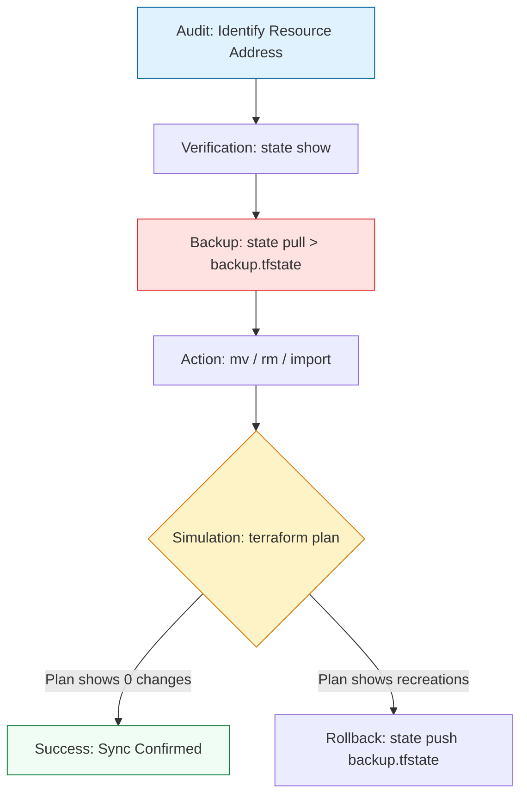

# 🔪 Terraform State Operations: The Surgical Toolbelt

> **"A production-ready infrastructure is a living organism. If you can't surgically modify the brain (the state file) without killing the patient (the cloud resources), you haven't mastered DevOps yet."**

Welcome to the **Surgical Operations** module. While your HCL code describes your "Plan," and `terraform apply` executes it, the **State CLI** is how you perform precise, manual adjustments to the connection between them. This module covers the standards of refactoring, legacy resource adoption (importing), and the "fail-fast" principles that prevent accidental production downtime during state surgery.

**Why This Matters for Junior DevOps Engineers:**
- 🚨 **The "Destroy-Create" Trap**: Renaming a resource in code without a corresponding state move will trigger a total deletion of that resource and its data.
- 🩹 **Legacy Adoption**: Most of your career will involve "brownfield" projects where you must bring manual, messy cloud resources into Terraform's controlled lifecycle.
- 🧹 **Refactoring Excellence**: As projects grow, you'll move VPCs, Clusters, and Databases into modules. Without `state mv`, you cannot restructure your code without destroying everything.
- 🎯 **Audit & Compliance**: You'll use `state list` and `state show` to prove to auditors exactly what is running in the cloud.

---

## 📚 Table of Contents

1. [The State Operations Lifecycle](#-the-state-operations-lifecycle)
2. [Mastering Inspection: list and show](#-mastering-inspection-list-and-show)
3. [Renaming & Refactoring: state mv](#-renaming--refactoring-state-mv)
4. [The Decoupling Pattern: state rm](#-the-decoupling-pattern-state-rm)
5. [Adopting Reality: The Import Pattern](#-adopting-reality-the-import-pattern)
6. [Real-World DevOps Scenarios](#-real-world-devops-scenarios)
7. [Common Pitfalls & Solutions](#-common-pitfalls--solutions)
8. [Hands-On Exercises](#-hands-on-exercises)
9. [Interview Preparation](#-interview-preparation)
10. [Knowledge Check](#-knowledge-check)

---

## 🏗️ The State Operations Lifecycle

State surgery follows a strict protocol of **Audit, Backup, Simulate, and Execute**.



### 🔍 Lifecycle Breakdown for Beginners

**Stage 1: Auditing (Discovery)**
- **Goal**: Find the exact "address" Terraform uses to track a resource.
- **Command**: `terraform state list`
- **Why**: You cannot move what you cannot name.

**Stage 2: Precision Inspection**
- **Goal**: See the "inner thoughts" of Terraform regarding a resource.
- **Command**: `terraform state show <address>`
- **Why**: To verify the unique Cloud ID (ARN, InstanceID) matches what you think it is.

**Stage 3: The Surgical Act**
- **Goal**: Modify the JSON mapping without touching the real-world server.
- **Commands**: `mv` (Move), `rm` (Remove), `import` (Adopt).

**Stage 4: Validation (The Plan)**
- **Goal**: Confirm your "Surgery" and your "New Code" are perfectly aligned.
- **Why**: If they aren't, the next `apply` will try to "correct" the reality by deleting resources.

---

## 🔐 Mastering Inspection: list and show

### What is a Resource Address?
Every resource in Terraform has a unique "postal address."
- `aws_instance.web` (Root level)
- `module.network.aws_vpc.main` (Inside a module)
- `aws_subnet.private[0]` (Inside a list or count)

### 🧐 Command Depth: `list` vs `show`

| Command | Output | Use Case |
|:---|:---|:---|
| `terraform state list` | A list of all managed resource addresses. | Quick inventory check or finding an address for a "move". |
| `terraform state show <addr>` | Every attribute of that specific resource (IDs, IPs, Tags). | Deep-dive debugging. Finding the "Real" IP of an instance. |
| `terraform show` | A human-readable summary of the ENTIRE state. | Looking for global outputs or a bird's-eye view. |

**Think of it like**: `list` is the table of contents, `show` is a single chapter, and `terraform show` is the whole book.

---

## 📦 Renaming & Refactoring: state mv

### The Scenario: Changing your Architecture
You realize that `aws_instance.main` should be named `aws_instance.production` to follow team standards. If you just change your `.tf` file:
1. Terraform sees `aws_instance.main` is GONE from code -> **Destroys it**.
2. Terraform sees `aws_instance.production` is NEW in code -> **Creates it**.

**Solution**: The `state mv` surgery.

```bash
# Workflow:
# 1. Update your .tf code (rename main to production)
# 2. Run the surgery:
terraform state mv aws_instance.main aws_instance.production

# 3. Verify:
terraform plan
# Should show: "No changes. Your infrastructure matches the configuration."
```

### Moving into Modules
When you refactor code into modules, the address changes from `aws_iam_user.bob` to `module.users.aws_iam_user.bob`.
```bash
terraform state mv aws_iam_user.bob module.users.aws_iam_user.bob
```

---

## 🧹 The Decoupling Pattern: state rm

### Why "Forget" a Resource?
Sometimes you want a resource to keep existing in the cloud, but you want Terraform to stop managing it.
- **Migration**: You're moving the VPC into a separate "Foundation" repository.
- **Abandonment**: You're handing off a server to be managed manually by another team.

```bash
# Command:
terraform state rm aws_security_group.allow_ssh

# Result:
# 1. The record is deleted from YOUR terraform.tfstate.
# 2. The Security Group REMAINS in AWS.
```

**Warning**: If you run `state rm` but leave the code in your `.tf` file, the next `plan` will try to **Re-create** the resource because it thinks it's missing!

---

## 🚜 Adopting Reality: The Import Pattern

### The Scenario: "Shadow IT" Discovery
A developer created 5 S3 buckets manually via the Amazon Console. You need to bring them under Terraform control so they are versioned and audited.

### The Modern Way (Terraform 1.5+) - "Declarative Import"
Professional engineers now use the `import` block because it is version-controlled in the code.

```hcl
# 1. Add this to your main.tf
import {
  to = aws_s3_bucket.legacy_data
  id = "my-manual-bucket-name-in-aws"
}

# 2. Run the plan to generate the code for you!
terraform plan -generate-config-out=generated_buckets.tf
```

### The Classic Way (CLI) - "Imperative Import"
Still useful for quick fixes or older projects.
```bash
# 1. Write the resource block manually FIRST:
# resource "aws_s3_bucket" "legacy_data" {}

# 2. Run the CLI command:
terraform import aws_s3_bucket.legacy_data my-manual-bucket-name-in-aws
```

---

## 🎭 Real-World DevOps Scenarios

### 🛡️ Scenario 1: The "Production Rename" Panic

**The Incident**: A project needed to move from a single-server setup to a modular architecture. The developer moved the `aws_instance.web` resource into `module.web_v2`.

**The Failure**: They ran `terraform apply` immediately. Terraform started **terminating** the production web server because the "address" had changed, and it didn't know the new module address pointed to the old server.

**The Impact**: 20 minutes of production downtime while the "new" (but identical) server spun up.

**The Fix**:
```bash
# BEFORE APPLYING:
terraform state mv aws_instance.web module.web_v2.aws_instance.web
```
**The Lesson**: The address in the state file IS the resource's identity. If you change the address in HCL, you must move the identity in state.

### 🔥 Scenario 2: The "Split-Repo" Migration

**The Context**: A monolithic state file with 500 resources was taking 15 minutes to run. The team decided to move all Networking resources into a dedicated `infrastructure-network` repo.

**The Strategy**:
1. **Repo A (Old)**: Run `terraform state rm aws_vpc.main`. (VPC stays alive in AWS).
2. **Repo B (New)**: Define `resource "aws_vpc" "main" {}`.
3. **Repo B (New)**: Run `terraform import aws_vpc.main vpc-0abcdef12345`.
4. **Verification**: Run `terraform plan` in Repo B. It should show 0 changes.

**The Lesson**: `state rm` + `import` is the primary way to decompose monolithic infrastructure into micro-services.

---

## ⚠️ Common Pitfalls & Solutions

### Pitfall 1: Forgetting Terminal Quotes
```bash
# ❌ BAD - Shell might interpret brackets as glob patterns
terraform state rm aws_instance.web[0]

# ✅ GOOD - Always wrap in single quotes
terraform state rm 'aws_instance.web[0]'
```

### Pitfall 2: Logic/State Mismatch
If you `state rm` a resource but leave the code in `main.tf`, Terraform will see a "New" resource in code that is missing from state and will try to CREATE a duplicate. If it's something like an S3 bucket or IAM user, the Cloud API will fail with "Already Exists."

### Pitfall 3: Manual JSON Editing
**Problem**: "I'll just search and replace in the `.tfstate` file."
**The Result**: The `serial` number won't increment, and the internal checksums will fail. Terraform will refuse to read the file, and your CI/CD pipeline will crash.

---

## 🎯 Hands-On Exercises

### Exercise 1: The Precision Move
1. Create a `null_resource` named `stage_one`.
2. Apply it.
3. Rename the resource in your code to `stage_two`.
4. Run `terraform plan` and notice the **Destroy/Create** message.
5. Use `terraform state mv null_resource.stage_one null_resource.stage_two`.
6. Run `plan` again. Verify it says **"No changes"**.

### Exercise 2: Legacy Import Challenge
1. Create a local file manually on your disk named `legacy.txt`.
2. Write a `resource "local_file" "manual"` block in your TF code.
3. Use `terraform import local_file.manual legacy.txt`.
4. Run `terraform show`. Verify Terraform now "owns" your manual file.

### Exercise 3: Surgical Decoupling
1. Create two `null_resource` blocks.
2. Apply them.
3. Use `state rm` on one of them.
4. Verify using `state list` that only one remains, but notice (by checking logs/outputs) that the first was never destroyed.

---

## 🎙️ Interview Preparation

### Foundation Questions

**1. "What is the difference between `terraform state rm` and `terraform destroy`?"**
- **Answer**: `terraform destroy` makes an API call to the cloud to **physically delete** the resource. `terraform state rm` only removes the resource from the **State File's inventory**. The resource continues to exist and run in the cloud, but Terraform no longer manages it.

**2. "Explain when you would use `terraform state mv`."**
- **Answer**: I use `state mv` whenever I change a resource's address in the HCL code. This happens if I rename the resource, move it into a module, or shift it into a `count` or `for_each` loop. It prevents Terraform from performing a destructive delete/recreate operation.

---

### Advanced Scenario Questions

**3. "How do you adopt 100 manual servers into Terraform without writing all the HCL by hand?"**
- **Answer**: I would use Terraform 1.5's **Declarative Import** feature. I'd create an `import` block for each server and run `terraform plan -generate-config-out`. This allows Terraform to generate the compliant HCL code for me, which I can then review and incorporate into my codebase.

**4. "You ran `state rm` on a production VPC by mistake. How do you fix it?"**
- **Answer**: Since I follow the SRE Golden Rule, I ran `terraform state pull > backup.tfstate` before I started. I can immediately run `terraform state push backup.tfstate` to restore the "memory" of that VPC. Alternatively, I could use `terraform import` to manually reconnect the VPC.

---

## 🧠 Knowledge Check

1. **Which command is used to rename a resource address in the state file?**
   - [ ] `terraform rename`
   - [ ] `terraform state rename`
   - [x] `terraform state mv`
   - [ ] `terraform move`

2. **True or False: `terraform import` requires you to have the resource already defined in your code (HCL).**
   - [x] True (In classic CLI mode) / Indirectly True (In 1.5+ declarative mode as it generates it).

3. **What is the risk of Running `terraform state push` without a recent backup?**
   - [x] You can overwrite production state with an older or corrupted version, causing massive drift.

---
## 📖 Additional Resources
- [Terraform CLI: state command docs](https://developer.hashicorp.com/terraform/cli/commands/state)
- [Module Refactoring Tutorial](https://developer.hashicorp.com/terraform/tutorials/modules/module-refactor)

---
## 🎯 Next Steps

After mastering the surgical CLI, you are ready to learn how to move the entire "Mind" of the project across boundaries.

**Proceed to**: [Part 2: State Migration & Versioning](../readme.md)

---
## 🎓 Self-Assessment Checklist

Before moving to the next module, ensure you can:
- [ ] Find a resource address using `state list`.
- [ ] View resource attributes using `state show`.
- [ ] Successfully rename a resource without a destruction plan.
- [ ] Import a manual resource into code.
- [ ] Explain why manual JSON editing is dangerous.
- [ ] Perform a state backup and restore.

**Score yourself**: 8+/10 = Ready to advance | <8 = Practice Exercise 1 (The Rename Drill).

---
**Status**: ✅ Exhaustively Enhanced (2026-02-03)
