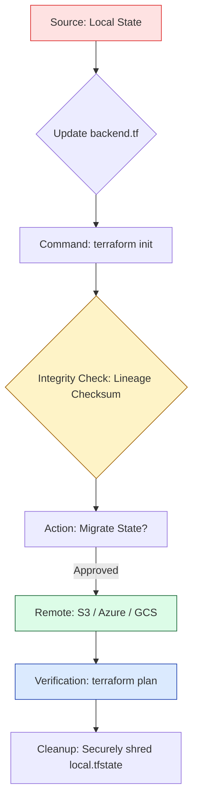

# 🔄 State Migration & Versioning: Evolution Without Loss

> **"A project that can't migrate is a project that can't grow. A project that doesn't version is a project that won't survive. Migration is your evolutionary path; Versioning is your genetic insurance."**

Welcome to **State Migration & Resilience**. As your DevOps career progresses, you will move beyond single-server setups to massive, distributed architectures. This requires moving your "Source of Truth" from local laptops to the cloud, shifting between cloud providers, or splitting monolithic states into micro-services. This module covers the standards of **Checksum Validation**, **Atomic Migration**, and **Point-in-Time Recovery** (Versioning).

**Why This Matters for Junior DevOps Engineers:**
- 🚨 **The "Split-Brain" Disaster**: If you migrate state incorrectly, you might end up with two people managing different versions of the same server, leading to silent overwrites and outages.
- 🩹 **Point-in-Time Recovery**: Running a "Bad Apply" can happen to anyone. **Versioning** is the literal "Ctrl+Z" for your production infrastructure.
- 🏗️ **Architectural Scaling**: You'll be tasked with moving projects from "Local" testing to "Remote" team production.
- 🔐 **Compliance Shifts**: Enterprises often migrate state to newer, more secure vaults (e.g., from S3 to KMS-encrypted cross-account buckets).

---

## 📚 Table of Contents

1. [The Migration Lifecycle](#-the-migration-lifecycle)
2. [Mastering the Handshake: init -migrate-state](#-mastering-the-handshake-init--migrate-state)
3. [Versioning: Your SRE "Safety Net"](#-versioning-your-sre-safety-net)
4. [Cross-Account & Architectural Migrations](#-cross-account--architectural-migrations)
5. [Real-World DevOps Scenarios](#-real-world-devops-scenarios)
6. [Common Pitfalls & Solutions](#-common-pitfalls--solutions)
7. [Hands-On Exercises](#-hands-on-exercises)
8. [Interview Preparation](#-interview-preparation)
9. [Knowledge Check](#-knowledge-check)

---

## 🏗️ The Migration Lifecycle

Migration is the process of moving the "Mind" of your infrastructure without losing the "Body" (the cloud resources).



### 🔍 Lifecycle Breakdown for Beginners

**Stage 1: Intent (The Code Shift)**
- **What**: You add the `backend "s3" {}` block to your code.
- **Why**: This defines the "Desired Destination."

**Stage 2: Validation (Lineage & Checksum)**
- **What**: Terraform compares the "Lineage UUID" of the local file and the existing remote file.
- **Goal**: To ensure you aren't accidentally migrating **Project A** over **Project B**.

**Stage 3: The Atomic Copy**
- **What**: Terraform streams the state to the cloud.
- **Mechanism**: It uses an **MD5/SHA Checksum** during the transfer. If a single bit is dropped, the migration fails.

**Stage 4: Post-Migration Cleanup**
- **What**: Deleting the local `terraform.tfstate`.
- **Reason**: To prevent a future engineer from accidentally running a local apply and creating a "Split-Brain" reality.

---

## 🔐 Mastering the Handshake: init -migrate-state

### `-migrate-state` vs `-reconfigure`

These two flags are the most important nuance in backend management.

| Flag | Technical Action | Use Case |
|:---|:---|:---|
| **`-migrate-state`** | Attempts to **copy** the existing state data from the old backend to the new one. | Moving from local to S3, or S3 to Terraform Cloud. |
| **`-reconfigure`** | **Discards** the old mapping and just resets the project to use the new backend (empty). | Troubleshooting a broken connection or initializing a fresh workspace from scratch. |

**The "Principal" Rule**: Always try `-migrate-state` first. Only use `-reconfigure` if you know you want to start with a blank slate in the new location.

---

## 🛡️ Versioning: Your SRE "Safety Net"

### What is State Versioning?
State versioning is a feature of the **Storage Provider** (like S3 or GCS), not the Terraform binary itself. It keeps a history of every single change ever made to your state file.

### 🆘 Scenario: The "State Surgery" Gone Wrong
1. You ran `terraform state rm module.vpc` by mistake.
2. Terraform now thinks 50 core networking resources don't exist.
3. Your local `backup.tfstate` was deleted by a cleanup script.

### 🩹 The Recovery Walkthrough (S3 Example):
1. Navigate to **S3 Console** -> Your State Bucket.
2. Search for your `terraform.tfstate` and click **"Show Versions"**.
3. Identify the version timestamped *before* your mistake.
4. **Download** that version.
5. **Restore** it to Terraform's primary "Truth":
   ```bash
   terraform state push downloaded_version_from_s3.tfstate
   ```
6. Run `terraform plan` and sigh in relief as it shows "No Changes."

---

## 🏗️ Cross-Account & Architectural Migrations

### The "Layered" Migration (Splitting the Monolith)
As your architecture grows, you might move from one massive `infrastructure` state to multiple smaller ones: `network.tfstate`, `database.tfstate`, `app.tfstate`.

**The Migration Step-by-Step**:
1. **Identify**: Use `state list` to find all database resources.
2. **Evict**: Run `state rm <db_addresses>` in the main project.
3. **Migrate**: Create the new `database` project and use `terraform import` to adopt those specific resources.
4. **Connect**: Use `terraform_remote_state` data source so the old project can still "read" settings from the new database state.

---

## 🎭 Real-World DevOps Scenarios

### 🛡️ Scenario 1: The "Split-Brain" Sync
**The Context**: A developer successfully migrated to S3 but forgot to delete the local `terraform.tfstate` file.
**The Failure**: A week later, another developer (who had a bad AWS token) accidentally ran `terraform apply` locally.
**The Impact**: The local state diverged from the S3 state. The infrastructure was in an inconsistent "In-Between" reality.
**The Lesson**: The local state file is like a "live bomb" after migration. **Securely shred it** or move it to a `.gitignore` deep archive once the migration is confirmed.

### 🔥 Scenario 2: The Monolithic Outage
**The Incident**: A single state file managed 3 regions (US, EU, ASIA). 
**The Crisis**: A corrupted state upload in the US region rendered the EU and ASIA teams unable to perform emergency patches during an outage.
**The Fix**: Standardized migration to **One State File Per Region**.
**The Lesson**: Regional isolation isn't just for resources; it's for the **Management Layer** (State).

### 🚨 Scenario 3: The "Accidental Cleanup" Recovery
**The Context**: A "Bucket Lifecycle Policy" was set too aggressively and deleted state files older than 30 days.
**The Save**: Because **Versioning** was enabled, the "deletion markers" were removed, and the files were restored instantly.
**The Lesson**: Use S3 Versioning with **MFA Delete** for the ultimate production safety rail.

---

## ⚠️ Common Pitfalls & Solutions

### Pitfall 1: Init without Migration
**Problem**: You update the backend and run `init`, but when asked "Do you want to copy state?", you type `no`.
**Result**: Terraform creates a blank state in S3. It doesn't find your 100 servers. It thinks it needs to create them all.
**Solution**: Always approve the migration (`yes`) unless you are intentionally "abandoning" the old state.

### Pitfall 2: Different TF Versions during Migration
**Problem**: Migrating state from a machine running TF `v0.12` to a machine running `v1.5`.
**Result**: The v1.5 machine will upgrade the state JSON format automatically. The v0.12 team can no longer read it.
**Solution**: Ensure the entire team is on the same version *before* performing a migration.

### Pitfall 3: Not Versioning the Bucket
**Problem**: You migrate to S3 but forget to enable Versioning.
**The Risk**: If the upload is interrupted halfway, you might end up with a truncated/corrupted state file and NO way to roll back.

---

## 🎯 Hands-On Exercises

### Exercise 1: The Local-to-S3 Handshake
1. Create a `null_resource` project locally.
2. Initialize an S3 bucket (or use a separate project to create it).
3. Update your `backend.tf`.
4. Run `terraform init`. Observe the migration prompt.
5. Verify the state is now in the cloud and your local file is replaced by a backup.

### Exercise 2: The "Undo Button" Drill
1. Use your S3-backed project.
2. Manually `state rm` a resource.
3. Access the S3 bucket via the console.
4. Download the penultimate version (the one before your `rm`).
5. Use `terraform state push` to restore it.

### Exercise 3: Partitioning State
1. Take a project with two resources.
2. "Move" one into a different state file (in a different directory/key) using only `rm` and `import`.
3. Prove that both resources are still managed, but now in two different state files.

---

## 🎙️ Interview Preparation

### Foundation Questions

**1. "What is the specific command to transition a project from local state to an S3 backend?"**
- **Answer**: I would define the `backend "s3"` block in the configuration and run `terraform init`. Terraform will detect the change in backend and prompt me to migrate the existing local state to the new S3 bucket.

**2. "Explain when you would use `-reconfigure` vs `-migrate-state`."**
- **Answer**: `-migrate-state` is used when I want to copy the data from the old backend to the new one. `-reconfigure` is used when I want to discard the old configuration mapping entirely and just start fresh with the new backend settings, which is often used during troubleshooting or starting a new workspace.

---

### Advanced Scenario Questions

**3. "How do you restore a corrupted state file if your local backup is also lost?"**
- **Answer**: I would go to the Remote Backend storage (e.g., the S3 bucket), enable "Show Versions," and find the most recent version that was healthy. I would download that version and use `terraform state push` to restore it as the primary "Truth" for the project.

**4. "Why is 'State Lineage' important during a migration?"**
- **Answer**: The Lineage is a unique UUID assigned to the state when it is created. During migration, Terraform checks that the lineage of the source and destination match. This prevents me from accidentally migrating **Project Network**'s state into the storage path for **Project Database**, which would cause a catastrophic overlap.

---

## 🧠 Knowledge Check

1. **Which command is used to transition to a new backend without migrating old data?**
   - [ ] `terraform init -migrate-state`
   - [x] `terraform init -reconfigure`
   - [ ] `terraform state push`
   - [ ] `terraform get`

2. **True or False: State migration updates your cloud resources (like EC2 IPs).**
   - [ ] True.
   - [x] False (It only moves the metadata JSON).

3. **What is the risk of having two state files managing the same cloud resource?**
   - [x] "Split-Brain" management where one configuration overwrites the changes of another, leading to instability and outages.

---
## 📖 Additional Resources
- [HashiCorp: Changing Backend Configuration](https://developer.hashicorp.com/terraform/language/settings/backends/configuration#changing-configuration)
- [S3 Object Versioning Best Practices](https://docs.aws.amazon.com/AmazonS3/latest/userguide/Versioning.html)

---
## 🎯 Next Steps

Now that you've mastered the movement of state, it's time to learn how to lock it down and ensure only the right people (and robots) can access it.

**Proceed to**: [Part 4: The Safety Net (Security & Governance)](../readme.md)

---
## 🎓 Self-Assessment Checklist

Before moving to the next module, ensure you can:
- [ ] Perform a successful local-to-remote migration.
- [ ] Restore a previous version of a state file from S3.
- [ ] Explain the difference between `-migrate-state` and `-reconfigure`.
- [ ] Define "Lineage" and its role in migration safety.
- [ ] Describe the risk of "Split-Brain" state management.
- [ ] Shred local state files safely after migration.

**Score yourself**: 8+/10 = Ready to advance | <8 = Practice Exercise 2 (Undo Button Drill).

---
**Status**: ✅ Exhaustively Enhanced (2026-02-03)
