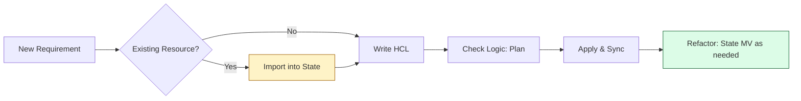

# 🧩 Part 3: The Building Blocks (Operations & Migration)

> **"Infrastructure is not a statue; it's a living organism. It needs to grow, move, and occasionally undergo surgery. Mastering the building blocks of state management is what allows you to evolve without breaking the world."**

Welcome to **Part 3**. This is where we move beyond "Storing State" and start "Operating State." This phase focuses on the day-to-day lifecycle of an Infrastructure Engineer: refactoring code, migrating backends, and adopting legacy resources.

## 🛣️ The Curriculum

### [01-State-Operations](readme.md)
**The Objective**: Mastering the surgical tools of state (mv, rm, import).
*   **Key Concepts**: Precision refactoring, adopting "Shadow IT," and surgical resource decoupling.

### [02-State-Migration](readme.md)
**The Objective**: Evolving your storage architecture without data loss.
*   **Key Concepts**: The `terraform init` handshake, state versioning as an "Undo Button," and architectural decomposition.

---

## 🚀 The Operational Mindset: Junior vs. Senior

| Feature | Junior Approach | Principal approach |
|:---|:---|:---|
| **Renaming** | Renames in code and lets `apply` destroy/create. | Uses `state mv` to ensure zero downtime and data preservation. |
| **Old Servers** | Ignores manually created resources. | Uses `import` to bring every resource under the "Single Source of Truth." |
| **Disasters** | Panics when a state file is deleted. | Instantly restores from S3 Versioning history. |
| **Structure** | Keeps everything in one giant state file. | Migrates resources into layered, isolated state files. |

---

## 🏗️ The Building Block Workflow

---

## 🛠️ The Surgeon's Rule
"Measure twice, backup once, move once." Never run a `state` command without a `terraform state pull` backup in your local directory.

---
**Status**: ✅ Organized (2026-02-03)
