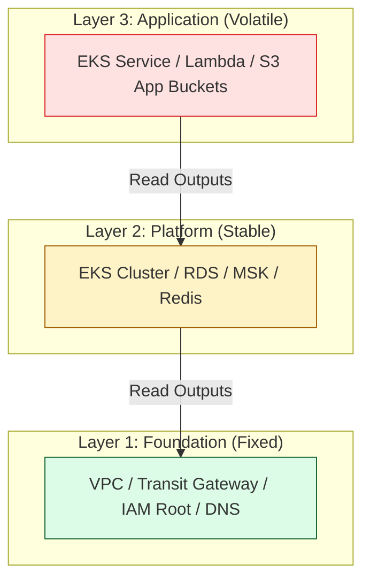

# 🏗️ Advanced State Patterns: Scaling to the Enterprise

> **"Infrastructure that doesn't scale is just another form of technical debt. Advanced state patterns are the difference between a system that crashes under its own weight and one that enables hundred-person teams to deploy in parallel with zero friction."**

Welcome to **The Enterprise Standard**. As infrastructure grows from a single app to a global fleet, "Basic" state management (one file, one backend) becomes a liability. This module covers the architectural patterns used by elite SRE teams to manage multi-layered complexity, reduce **Blast Radius**, and ensure organizational isolation.

**Why This Matters for Junior DevOps Engineers:**
- 🛡️ **Blast Radius Isolation**: You'll learn how to ensure that an error in a "Web App" state cannot take down the "Core Network" state.
- 🚀 **Deployment Velocity**: Large state files lead to 20-minute planning times. Layered state reduces this to seconds.
- 🤝 **Team Autonomy**: Proper patterns allow the Networking, DBA, and App teams to work in their own "Micro-States" without blocking each other.
- 🔐 **Hardened Security**: You'll learn how to enforce "Physical Separation" by mapping state files to different AWS accounts and IAM roles.

---

## 📚 Table of Contents

1. [Architectural Pattern: Multi-Layer (The Golden Record)](#-architectural-pattern-multi-layer-the-golden-record)
2. [Data Flow: remote_state vs. SSM Parameters](#-data-flow-remote_state-vs-ssm-parameters)
3. [Environment Strategy: Directories vs. Workspaces](#-environment-strategy-directories-vs-workspaces)
4. [The "Micro-State" Pattern (Scale 100+)](#-the-micro-state-pattern-scale-100)
5. [Real-World DevOps Scenarios](#-real-world-devops-scenarios)
6. [Decision Matrix: When to Split?](#-decision-matrix-when-to-split)
7. [Hands-On Exercises](#-hands-on-exercises)
8. [Interview Preparation](#-interview-preparation)
9. [Knowledge Check](#-knowledge-check)

---

## 🏗️ Architectural Pattern: Multi-Layer (The Golden Record)

Instead of a "Monolith" (one state for everything), professional SREs split infrastructure into **Layers** based on change frequency and risk.



### The Layer Hierarchy

| Layer | Responsibility | Change Frequency | Risk Level |
|:---|:---|:---|:---|
| **Foundation** | Networking, VPC, IAM, Transit Gateway | Yearly/Quarterly | **Critical** (High Blast Radius) |
| **Platform** | EKS, RDS, Databases, Shared Services | Monthly | **High** |
| **Application** | Microservices, Lambdas, Deployments | Daily | **Medium/Low** |

---

## 📡 Data Flow: remote_state vs. SSM Parameters

How does the **App Layer** find the **VPC ID** created in the **Foundation Layer**?

### Option A: `terraform_remote_state` (Direct)
This is the native "Handshake." The App project reads the Foundation project's state file directly (Read-Only).

```hcl
# In app-layer/main.tf
data "terraform_remote_state" "network" {
  backend = "s3"
  config = {
    bucket = "corp-state-prod"
    key    = "foundation/vpc.tfstate"
    region = "us-east-1"
  }
}

# Usage
vpc_id = data.terraform_remote_state.network.outputs.vpc_id
```

### Option B: The "Middleman" (SSM/Vault)
Foundation writes the VPC ID to a generic service (AWS SSM Parameter Store). The App layer reads from SSM.
- **Benefit**: Projects are **Decoupled**. Project B doesn't need to know Project A's S3 bucket name.

---

## 📂 Environment Strategy: Directories vs. Workspaces

This is the most common architectural debate for Junior engineers.

### 🏠 The Directory Pattern (Production Standard)
Each environment has its own folder (`env/prod`, `env/dev`) and its own **Backend Configuration**.
- ✅ **Pros**: Total isolation, different AWS accounts per env, clear context in the shell.
- ❌ **Cons**: Code duplication (mitigated by using Modules).

### 🛠️ The Workspace Pattern (Testing Standard)
One directory with multiple contexts (`dev`, `staging`, `prod`) using the same backend bucket.
- ✅ **Pros**: Dry (one set of code), built-in CLI support.
- ❌ **Cons**: **High Risk.** Switching to the wrong workspace can destroy production. Shared backend means a security leak in `dev` exposes `prod`.

**The Staff Rule**: Use **Directories** for long-lived environments (Prod/Staging/Dev). Use **Workspaces** only for short-lived feature testing or developer sandboxes.

---

## 🎭 Real-World DevOps Scenarios

### 🛡️ Scenario 1: The "Micro-State" Migration (Performance)
**The Incident**: A fintech platform had 2,000 resources in a single `prod.tfstate`.
**The Failure**: `terraform plan` took 18 minutes. AWS API rate limits were triggered daily, blocking all deployments.
**The Fix**: Split into 5 layers. 
- **The Impact**: Plan time dropped to 30 seconds. Reliability increased from 60% to 100%.
**The Lesson**: Large state files are "Technical Debt" that eventually halts engineering velocity.

### 🔥 Scenario 2: The "Workspace Disaster" (Risk)
**The Incident**: A Senior Engineer thought they were in the `dev` workspace, but the previous `workspace select` command had failed silently.
**The Failure**: They ran `terraform destroy -auto-approve` to save costs on dev.
**The Impact**: **Production was wiped.** The engineer was accidentally in the `default` (prod) workspace.
**The Fix**: Migrated to **Directory Isolation** immediately. No more shared backends.
**The Lesson**: Rely on **Physical Barriers** (folders/accounts), not CLI context, for Production safety.

### 🚨 Scenario 3: The "Cross-Account Handshake"
**The Incident**: A Security team managed DNS in Account A, while an App team needed to create records from Account B.
**The Fix**: Security Team exported the `zone_id` via `remote_state`. They granted the App team's IAM role **Read-Only S3 Access** to the state file.
**The Impact**: The App team could self-service DNS records without needing Admin access to the Security account.
**The Lesson**: State data sharing is the foundation of "Least Privilege" cross-team collaboration.

---

## ⚖️ Decision Matrix: When to Split?

| Question | If No | If YES |
|:---|:---|:---|
| Does `terraform plan` take > 5 minutes? | Keep it together. | **SPLIT** (Performance issue). |
| Do changes to the App risk the VPC? | Keep it together. | **SPLIT** (Safety/Blast Radius). |
| Do two different teams own the resources? | Keep it together. | **SPLIT** (Ownership boundary). |
| Is the project managing < 100 resources? | **Keep it together.** | Monitor for growth. |

---

## 🎯 Hands-On Exercises

### Exercise 1: The Layered Handshake
1. Folder A (`network`): Create a VPC and output the ID. Use a remote S3 backend.
2. Folder B (`app`): Use `data "terraform_remote_state"` to read Folder A's S3 bucket.
3. Provision a Security Group in Folder B using the VPC ID from Folder A.
4. Verify that you can change the App without refreshing the Network resources.

### Exercise 2: Workspace vs. Directory Comparison
1. Create a project and initialize it with three workspaces (`dev`, `stage`, `prod`).
2. Create a second project with three folders and three different S3 bucket configurations.
3. Contrast the security: Delete the `dev` folder in the second project. Observe that `prod` metadata is physically nowhere near you.

---

## 🎙️ Interview Preparation

### Foundation Questions

**1. "When would you prefer Directory Isolation over Workspaces?"**
- **Answer**: I use Directory Isolation for top-level environments like Dev, Staging, and Production. This ensures total isolation of state files, allow for different AWS accounts per environment, and prevents the risk of 'workspace select' errors destroying production.

**2. "What is the primary technical benefit of 'Layered State'?"**
- **Answer**: It significantly reduces the **Blast Radius** and improves **Performance**. By splitting stable resources (Networking) from volatile resources (Apps), we ensure that a mistake in an app deployment cannot corrupt the core network foundation. It also makes `terraform plan` much faster.

---

### Advanced Scenario Questions

**3. "How do you solve a circular dependency between two state layers?"**
- **Answer**: Circular dependencies (e.g., Network needs App ID, App needs Network ID) are an architectural anti-pattern. I would solve this by creating a **Third Layer** (a "Platform" or "Service Discovery" layer) or using a decoupled store like **AWS SSM Parameter Store** to hold shared metadata.

**4. "How do you manage IAM least-privilege for `terraform_remote_state`?"**
- **Answer**: The consumer project's IAM role only needs `s3:GetObject` on the specific `.tfstate` file path of the producer project. It should **not** have `s3:PutObject` or delete permissions. This ensures the connection is strictly read-only and safe.

---

## 🧠 Knowledge Check

1. **Which pattern is recommended by HashiCorp for separating Dev, Staging, and Prod?**
   - [ ] Workspaces
   - [x] Directories
   - [ ] Naming prefixes in code
   - [ ] Symbolic links

2. **True or False: `terraform_remote_state` can modify the resources in the remote file.**
   - [ ] True.
   - [x] False (It is Read-Only).

3. **What is the 'Default' workspace used for in professional environments?**
   - [ ] Production.
   - [ ] Backups.
   - [x] Usually left empty to force engineers to select a named workspace or directory.

---
## 🎓 Self-Assessment Checklist

Before moving to the next module, ensure you can:
- [ ] Explain the "Blast Radius" difference between a monolith and layers.
- [ ] Implement `terraform_remote_state` across two projects.
- [ ] Compare and contrast Workspaces vs. Directories.
- [ ] Diagram a multi-layered infrastructure data flow.
- [ ] Define "Unidirectional Data Flow."
- [ ] Explain how to securely share state access across AWS accounts.

**Score yourself**: 5+/6 = Ready to advance | <5 = Practice Exercise 1 (The Handshake).

---
**Status**: ✅ Enhanced (2026-02-03)
