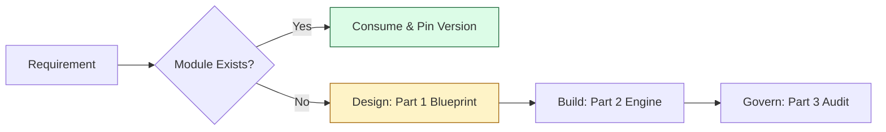

# 📐 Part 1: The Blueprint (Module Fundamentals)

> **"In the world of Infrastructure-as-Software, modules are your LEGO bricks. You don't build a castle by carving it out of a single rock; you snap together verified, secure, and reusable components. This is the blueprint for those bricks."**

Welcome to **Part 1**. This phase is about the **Philosophy of Composition**. Before we build complex multi-cloud platforms, we must master the art of the "Black Box"—how to encapsulate infrastructure logic so it can be safely reused by hundreds of engineers.

## 🛣️ The Curriculum

### [01. 🏗️ Module Fundamentals](./01-module-fundamentals/readme.md)
**The Objective**: Transitioning from "Scripting" to "Packaging."
*   **Key Concepts**: The Black Box mental model, Abstraction, Encapsulation, and Source Taxonomy.

### [02. 📁 Module Structure](./02-module-structure/readme.md)
**The Objective**: Designing the "API" of your infrastructure.
*   **Key Concepts**: The Big Three (`main.tf`, `variables.tf`, `outputs.tf`), `versions.tf` safety belts, and executable examples.

### [03. 🏆 Best Practices](./03-best-practices/readme.md)
**The Objective**: Governance and Staff-Level Standards.
*   **Key Concepts**: SOLID principles for IaC, Naming Taxonomies, and the Secure Module Lifecycle.

---

## 🚀 The Modular Mindset: Junior vs. Senior

| Feature | Junior Approach | Principal approach |
|:---|:---|:---|
| **Logic** | Giant `main.tf` files with hardcoded values. | Small, surgical modules with clearly defined inputs. |
| **Updates** | Manually editing 10 different projects. | Updating a single module version and rolling out via CI/CD. |
| **Interfaces** | Vague variables without types or descriptions. | Strict type constraints, validations, and auto-generated docs. |
| **Architecture** | Circular dependencies and tightly coupled repos. | Unidirectional data flow and decoupled "Service-Layer" design. |

---

## 🏗️ The Composable Workflow

---
**Status**: ✅ Organized & Enhanced (2026-02-03)
