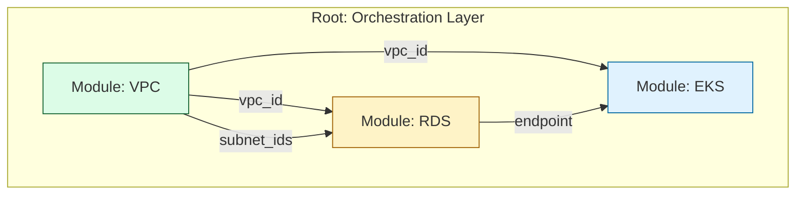

# 🧩 Module Composition: Orchestrating the Lego Architecture

> **"Composition is the art of assembling small, reusable modules into larger, complex systems. It is the transition from writing 'Infrastructure Code' to designing 'Infrastructure Platforms.' A project is a script; a platform is a composition."**

Welcome to the **Architecture of Orchestration**. In this module, we move beyond the "Internal Logic" of a single module and focus on how modules talk to each other. We study the patterns of **Implicit Dependencies**, **Layered Architecture**, and the high-stakes world of **Circular Dependency Resolution**.

---

## 🏗️ Composition Patterns

The way you connect your modules determines how easily your platform can scale.

### Pattern A: The "Flat" Orchestra (Standard)
The Root Module calls Child Modules side-by-side and passes outputs from one as inputs to another. This is the **Explicit Data Flow** pattern.



**Benefites**:
- ✅ **Observability**: You can see exactly how data moves in one single `main.tf` file.
- ✅ **Decoupling**: You can upgrade the `RDS` module version without affecting the `VPC`.

### Pattern B: The "Wrapper" (High Standardization)
A "Service Module" that bundles multiple child modules inside it to enforce a "Golden Path."
- **Example**: An `internal-service` module that always bundles an ECS Task, a Sidecar for logs, and a strictly defined IAM role.

---

## 📡 Managing Dependencies: Implicit vs. Explicit

Terraform is intelligent enough to know that you can't build a Database before you have a Network.

### 1. The Implicit Handshake (Native)
When you reference `module.network.vpc_id`, Terraform automatically maps the dependency.
```hcl
module "rds" {
  vpc_id = module.network.vpc_id # Terraform handles the "Wait" for you
}
```

### 2. The Explicit Barrier (`depends_on`)
Use this only when a dependency exists that is **invisible** to Terraform's data flow.
- **Example**: Waiting for an IAM Policy to propagate through AWS eventually-consistent systems before creating an EKS node group.

---

## 🎭 Real-World DevOps Scenarios

### 🛡️ Scenario 1: The "Variable Bucket Brigade" (Refactoring)
**The Incident**: A company used deeply nested modules: `Root -> Env -> App -> Service -> Resource`.
**The Crisis**: To change the `instance_type` for the Resource, the engineer had to add that variable to **4 separate files** and pass it down "bucket-brigade" style.
**The Fix**: Flattened the architecture. The `Root` now calls the `App` and `Service` modules directly as siblings. 
**The Lesson**: Favor **Depth < 2**. If you are passing a variable through a module that doesn't use it, your architecture is too deep.

### 🔥 Scenario 2: The "Circular Dependency" Deadlock
**The Incident**: 
- Module A (App) needed the DB Endpoint (from Module B).
- Module B (DB) needed the App Security Group ID (from Module A) to allow traffic.
**The Crisis**: **Cycle Error.** Terraform couldn't decide which to build first.
**The Fix**: Extracted the **Shared Dependency**. Created the Security Group in the Root module, then passed the ID to both A and B.
**The Lesson**: Break the cycle by extracting the "mediator" resource to a higher layer.

---

## 🎙️ Interview Preparation

### Foundation Questions

**1. "What is the primary way data is shared between modules?"**
- **Answer**: Through **Inputs** and **Outputs**. A parent module receives an `output` from one child module and passes it as an input `variable` to another. This creates an **Implicit Dependency**, ensuring Terraform builds them in the correct order.

**2. "Why is Flat Composition preferred over Deep Nesting?"**
- **Answer**: Flat composition makes the "Data Flow" visible in the root module. Deep nesting hides complexity, makes debugging significantly harder, and leads to the "Propagating Variables" problem (having to update multiple files just to change one setting at the bottom).

---

### Advanced Scenario Questions

**3. "How do you solve a circular dependency between a Load Balancer and a Security Group?"**
- **Answer**: I would refactor the code to create the "Identity" first. Instead of creating the Security Group *inside* the module, I create it externally (in the root or a shared module) and pass the ID into both. This "Dependency Inversion" breaks the cycle.

**4. "Explain the 'Barrier' effect of `depends_on` in a module block."**
- **Answer**: When you use `depends_on` on an entire module, Terraform will not even **plan** the resources inside that module until every resource in the dependency has reached its final state. This is a powerful but heavy-duty tool that should only be used when data-references aren't enough.

---

## 🧠 Knowledge Check

1. **How do you access an output named 'db_id' from a module named 'database'?**
   - [ ] `database.db_id`
   - [ ] `var.database.db_id`
   - [x] `module.database.db_id`

2. **True or False: If Module A depends on Module B, Module A is destroyed FIRST during a cleanup.**
   - [x] True (Terraform reverses the order for destruction to ensure dependencies are removed gracefully).

3. **What is 'Propagating Variables'?**
   - [x] The tedious process of adding the same variable to multiple layers of nested modules just to reach a child resource.

---
## 🎓 Self-Assessment Checklist

- [ ] I can diagram the data flow between sibling modules.
- [ ] I understand the difference between Implicit and Explicit dependencies.
- [ ] I have identified a "Variable Bucket Brigade" in my own work.
- [ ] I can explain how to break a "Circular Dependency."
- [ ] I follow the "Flat Composed" architecture whenever possible.

---
**Status**: ✅ Staff-Enhanced (2026-02-03)