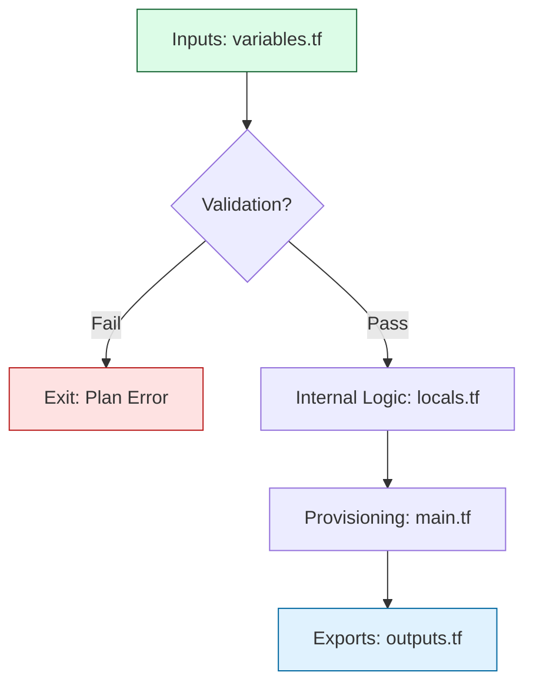

# ⚙️ Part 2: The Engine (Module Implementation)

> **"A blueprint is just a dream; the engine is where reality happens. In Part 2, we move from the philosophy of modules to the surgical precision of building them. We don't just write code; we build resilient, self-validating infrastructure units."**

Welcome to **Part 2**. This phase is the "Workshop". You will learn how to build modules that are not just containers for resources, but intelligent units that validate inputs, handle complex logic with `locals`, and expose precise data via `outputs`. We move from "Static HCL" to "Dynamic Logic."

## 🛣️ The Curriculum

### [01. 🏗️ Creating Modules](./01-creating-modules/readme.md)
**The Objective**: Building your first production-grade component.
*   **Key Concepts**: The Variable-Logic-Output lifecycle, `validation` logic, and "Shift Left" testing.

### [02. 🧩 Module Composition](./02-module-composition/readme.md)
**The Objective**: Orchestration and the "Service Layer" design.
*   **Key Concepts**: Passing outputs as inputs, circular dependency resolution, and logical layering.

### [03. 🌍 Real-World Examples](./03-real-world-examples/readme.md)
**The Objective**: Learning from the "Battlefield."
*   **Key Concepts**: Industry-standard module patterns for EKS, VPCs, and serverless stacks.

---

## 🚀 The implementation Bar: Junior vs. Senior

| Feature | Junior Approach | Principal approach |
|:---|:---|:---|
| **Validation** | Lets the Cloud API throw errors. | Blocks invalid inputs at `terraform plan` with `validation` logic. |
| **Logic** | Repeated code blocks for environment tweaks. | Centralized `locals` and `merge()` strategies for clean resources. |
| **Repetition** | Uses `count` for lists, risking resource destruction. | Uses `for_each` and stable keys for resilient resource growth. |
| **Visibility** | Outputs nothing or "too much." | Categorical outputs (ID, ARN, Endpoints) for easy orchestration. |

---

## 🏗️ The Implementation Workflow

---
**Status**: ✅ Organized & Enhanced (2026-02-03)
