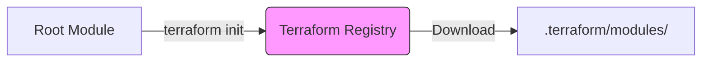

# Module Registry

The Terraform Registry is a centralized repository for sharing and discovering Terraform modules. It is the ecosystem that allows you to stop reinventing the wheel.

## 1. Registry Types

### Public Registry (registry.terraform.io)
The default, open ecosystem.
- **Community Modules**: Maintained by open-source contributors.
- **Verified Modules** (Blue Badge): Maintained by HashiCorp or a specific partner (e.g., AWS, Azure, Google). **Always prefer these.**



### Private Registry
Available in **Terraform Cloud (TFC)** and **Terraform Enterprise (TFE)**.
- **Internal Sharing**: Share modules strictly within your organization.
- **Security**: Modules are encrypted and require authentication (`terraform login`).
- **Governance**: Administrators can restrict which public modules are allowed.

---

## 2. Using Registry Modules

### The `source` Address
The syntax is: `<NAMESPACE>/<NAME>/<PROVIDER>`

```hcl
module "vpc" {
  source  = "terraform-aws-modules/vpc/aws"
  version = "5.1.0"  # CRITICAL: Always Pin This!

# Inputs
  name = "my-vpc"
  cidr = "10.0.0.0/16"
}
```

### Versioning Strategy
Registry modules use Semantic Versioning (`x.y.z`).
- `version = "1.0.0"`: Exact match (Safest).
- `version = "~> 1.0"`: Any version `1.x` but not `2.0`.
- `version = ">= 1.0"`: Dangerous. Might download v5.0 automatically and break your code.

---

## 3. Publishing Modules

To publish a module to the registry, your Git repository must follow strictly defined conventions:

1.  **Repo Name**: Must be `terraform-<PROVIDER>-<NAME>`.
    *   Example: `terraform-aws-webserver`.
2.  **File Structure**: Must contain `main.tf`, `variables.tf`, and `outputs.tf` at the root.
3.  **Release Tags**: You must push a tag like `v1.0.0` or `v0.1.0` to GitHub/GitLab. The registry watches for these tags to create versions.

---

## 4. Real-Life Scenarios

### Scenario 1: The "Not Invented Here" Syndrome
**Problem**: A team spends 4 weeks writing a custom VPC module. It has bugs, misses edge cases (like DHCP options), and requires constant maintenance.
**Reality Check**: `terraform-aws-modules/vpc/aws` exists. It has 100+ million downloads, is maintained by AWS experts, and covers every edge case.
**Lesson**: Always check the registry before writing code. Use "Make vs Buy" logic.

### Scenario 2: The "Broken Build" Friday
**Event**: A developer uses `version = ">= 1.0"` for an RDS module.
**The Crash**: On Friday afternoon, the module author releases `v2.0` (Breaking Change: removed `password` variable). The developer runs `terraform init`, gets v2.0, and the `apply` fails in production.
**Fix**: Always pin versions (`version = "1.2.5"`). Upgrade manually and intentionally.

### Scenario 3: The "Internal IP" Leak (Private Registry)
**Problem**: Your company has a module `custom-app` that hardcodes internal LDAP IPs and API keys. The developer pushes it to public GitHub.
**Risk**: Security breach.
**Solution**: Use Private Registry. Publish the module to Terraform Cloud. It remains accessible to your team via `app.terraform.io/my-org/custom-app` but is invisible to the world.

---

## 5. ❓ Interview Questions

1.  **What is the required naming convention for a GitHub repo to be published to the Terraform Registry?**
    *   **Answer**: `terraform-<PROVIDER>-<NAME>` (e.g., `terraform-google-network`).

2.  **What is the difference between specific version pinning vs using `~>`?**
    *   **Answer**: `version = "1.2.0"` locks to that exact release. `version = "~> 1.2"` allows 1.3, 1.4, etc., but stops before 2.0. `~>` is a balance between receiving bug fixes and avoiding breaking changes.

3.  **How do you authenticate to a private registry?**
    *   **Answer**: Usage of `terraform login` which generates an API token stored in `~/.terraform.d/credentials.tfrc.json`.

4.  **What does the "Verified" badge mean?**
    *   **Answer**: The module is maintained by a HashiCorp partner (like AWS, Azure, Oracle) and meets high standards for documentation and stability.

5.  **Does Terraform Registry store the code?**
    *   **Answer**: No. It stores metadata (inputs, outputs, README). The code lives in the underlying VCS provider (GitHub, GitLab, BitBucket).

6.  **Can you publish a module located in a subdirectory of a repo?**
    *   **Answer**: Not easily in the standard public registry. The standard expectation is that the module is at the root. For private registries or direct Git sources, subdirectories are fine (`//subdir`).

7.  **How does Terraform know a new version of a module is available?**
    *   **Answer**: During `terraform init`, it queries the registry API. If a newer version matching your constraint exists, it might upgrade (depending on flags).

8.  **What is a "Module Source" address?**
    *   **Answer**: The string that tells Terraform where to download the code. E.g., `hashicorp/consul/aws` (Registry) or `git::https://...` (Git).

9.  **Why might a company enforce a policy to ONLY use Private Registry modules?**
    *   **Answer**: To ensure all infrastructure complies with internal security standards (e.g., "All buckets must be encrypted") and to prevent usage of unvetted community code.

10. **What happens if you delete a release tag (e.g., v1.0) from GitHub after publishing?**
    *   **Answer**: The registry reference breaks. Users referencing that version will fail to download it. **Never** delete tags for published modules.

---

## 6. 🧠 Knowledge Check (Quiz)

### Registry Mechanics
1.  **Which command authorizes you to access private modules?**
    *   [ ] `terraform auth`
    *   [x] `terraform login`
    *   [ ] `terraform init --login`
    *   [ ] `aws configure`

2.  **The default public registry URL is:**
    *   [ ] `hub.docker.com`
    *   [ ] `github.com`
    *   [x] `registry.terraform.io`
    *   [ ] `hashicorp.com`

3.  **To publish a module, what kind of Git tag is required?**
    *   [ ] Any string.
    *   [ ] `release-latest`
    *   [x] Semantic Version (e.g., `v1.0.0` or `1.0.0`).
    *   [ ] `prod`

4.  **A "Verified" module is indicated by:**
    *   [ ] A Star.
    *   [x] A Blue Badge / Checkmark.
    *   [ ] A Green Lock.

5.  **Where does Terraform download registry modules to?**
    *   [x] `.terraform/modules`
    *   [ ] `node_modules`
    *   [ ] `/var/lib/terraform`

### Versioning & Source
6.  **What does `version = "~> 2.1.0"` mean?**
    *   [ ] Exactly 2.1.0.
    *   [x] Any version >= 2.1.0 and < 2.2.0.
    *   [ ] Any version >= 2.1.0 and < 3.0.0.

7.  **The syntax `terraform-aws-modules/vpc/aws` refers to:**
    *   [ ] `GitHubUser/Repo/Path`
    *   [x] `Namespace/Name/Provider`
    *   [ ] `Provider/Name/Version`

8.  **Can you pull modules directly from GitHub without the Registry?**
    *   [x] Yes, using `git::https://...` source.
    *   [ ] No.

9.  **Why pin module versions?**
    *   [x] To ensure reproducibility and prevent breaking changes.
    *   [ ] To speed up download.
    *   [ ] It's required by law.

10. **If you don't specify a `version`, what does Terraform do?**
    *   [ ] Fails.
    *   [x] Downloads the latest available stable version.
    *   [ ] prompting the user.

### Scenarios
11. **You want to force a re-download of modules.**
    *   [ ] `terraform apply`
    *   [x] `terraform init -upgrade`
    *   [ ] `rm -rf .terraform` (Also works, but is the "nuclear option").

12. **Your module repo is named `my-cool-module`. Can you publish it to the public registry?**
    *   [ ] Yes.
    *   [x] No, it must match `terraform-<provider>-<name>`.

13. **Private Registry modules usually start with:**
    *   [ ] `registry.terraform.io/...`
    *   [x] `app.terraform.io/<ORGANIZATION>/...` (for TFC).

14. **How do you view the documentation (inputs/outputs) of a registry module?**
    *   [x] View the "Inputs" and "Outputs" tabs on the Registry website.
    *   [ ] Read the source code manually.

15. **A module has a "Partner" badge. This means:**
    *   [x] It is verified and maintained by a HashiCorp partner (e.g., Datadog, F5).
    *   [ ] It is a paid module.

### General
16. **Is it possible to use a local directory as a registry source?**
    *   [ ] Yes, by mocking the API.
    *   [x] No, local directories are just local sources (`./`), not registry sources.

17. **Does the registry modify your code?**
    *   [x] No.
    *   [ ] Yes, it formats it.

18. **Can you deprecate a specific version of a module in the registry?**
    *   [x] Yes, helping users avoid broken versions.
    *   [ ] No.

19. **What file in your repo provides the "Readme" content on the registry page?**
    *   [x] `README.md`
    *   [ ] `DOCUMENTATION.txt`

20. **Is the registry available for CLI-only Terraform users?**
    *   [x] Yes, absolutely.
    *   [ ] No, only for Enterprise users.