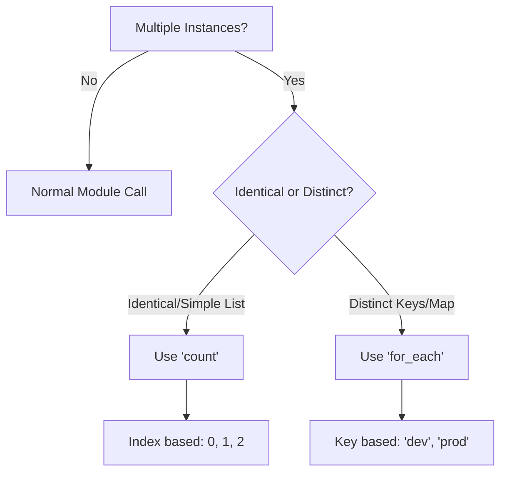

# Advanced Module Patterns

Once you master the basics, you can write modules that are dynamic, flexible, and DRY. This section covers loops, conditionals, and advanced logic.

## 1. Loops: `count` vs `for_each`

You can call a module multiple times using a single block.

### Decision Tree



### The `for_each` (Recommended)
Best for creating non-identical resources where keys matter.
```hcl
module "s3_buckets" {
  source   = "./modules/s3"
  for_each = toset(["assets", "logs", "backups"])

name = "${each.key}-bucket-v1"
}
```

### The `count` (Legacy/Simple)
Best for simple flags or identical copies.
```hcl
module "workers" {
  source = "./modules/ec2"
  count  = 3

name = "worker-${count.index}"
}
```

---

## 2. Dynamic Blocks
Sometimes you need to generate nested blocks (like `ingress` rules in a Security Group) based on a list variable.

```hcl
resource "aws_security_group" "this" {
  name = "dynamic-sg"

# The Iterator
  dynamic "ingress" {
    for_each = var.ingress_rules # List of objects
    content {
      from_port   = ingress.value.port
      to_port     = ingress.value.port
      protocol    = "tcp"
      cidr_blocks = ingress.value.cidrs
    }
  }
}
```

---

## 3. Conditional Logic

### Ternary Operator (`? :`)
The `if-else` of Terraform.
`condition ? true_val : false_val`

**Example: Conditional Creation**
```hcl
module "dns" {
  source = "./modules/route53"
  count  = var.create_dns ? 1 : 0
}
```

### `try()` and `can()`
*   **`try(value, default)`**: Attempts to evaluate expression. If it fails, returns default.
    *   `tags = try(var.custom_tags, { default = "true" })`
*   **`can(expression)`**: Returns boolean. Useful in validation.
    *   `condition = can(regex("^ami-", var.image_id))`

---

## 4. Real-Life Scenarios

### Scenario 1: The Regional Rollout (`for_each`)
**Problem**: Deploying a standard stack to US-East, US-West, and EU-Central.
**Old Way**: Copy-paste the module block 3 times.
**Advanced Way**: Define a map of regions and use `for_each`.
```hcl
locals {
  regions = {
    "us-east-1" = { instance_size = "t3.small" }
    "eu-west-1" = { instance_size = "t3.micro" }
  }
}

module "app" {
  source   = "./modules/app"
  for_each = local.regions

region        = each.key
  instance_type = each.value.instance_size
}
```

### Scenario 2: The "Optional" Features (Conditional)
**Problem**: A module creates an EC2 instance. Users sometimes want an Elastic IP, sometimes not.
**Solution**:
```hcl
resource "aws_eip" "this" {
  count    = var.enable_eip ? 1 : 0
  instance = aws_instance.this.id
}
```

### Scenario 3: The "Dynamic Ingress" Rules (Dynamic Blocks)
**Problem**: A Security Group module hardcodes SSH and HTTP. Now a user needs HTTPS and PostgreSQL.
**Solution**: Change the input variable to a list of ports and use a `dynamic "ingress"` block. The module now accepts ANY list of ports the user desires.

---

## 5. ❓ Interview Questions

1.  **Can you use `count` and `for_each` in the same resource block?**
    *   **Answer**: No, they are mutually exclusive. Terraform will throw an error.

2.  **What is the main downside of using `count` on a list of resources?**
    *   **Answer**: If you remove an item from the middle of the list, the index of all subsequent items shifts (`index 2` becomes `index 1`). Terraform sees this as a destroy/create action for all shifted resources. `for_each` avoids this by using stable keys.

3.  **How do you access the value of the current iterator in a dynamic block?**
    *   **Answer**: `<BLOCK_NAME>.value` (e.g., `ingress.value`).

4.  **What does `tobool()` do?**
    *   **Answer**: Converts a value to a boolean. It throws an error if the conversion is impossible (e.g., `tobool("hello")`).

5.  **Can you use loops inside a `locals` block?**
    *   **Answer**: Yes, using `for` expressions (list comprehension). E.g., `[for s in var.list : upper(s)]`.

6.  **What is the difference between a `dynamic` block and a `resource` block?**
    *   **Answer**: A `resource` block creates a top-level cloud object. A `dynamic` block generates nested configuration blocks *inside* a resource (like tags, rules, or lifecycle policies).

7.  **How do you make a variable optional in an object type constraint?**
    *   **Answer**: Use the `optional(type, default)` keyword (available in TF 1.3+). E.g., `type = object({ name = string, port = optional(number, 80) })`.

8.  **Can `for_each` iterate over a list of simple strings?**
    *   **Answer**: Not directly. It expects a set or a map. You must wrap a list in `toset(var.list)`.

9.  **How do you conditionally set a single argument to null?**
    *   **Answer**: Use the ternary operator: `parameter = var.condition ? "value" : null`. Terraform ignores arguments set to `null`.

10. **What is "Refactoring with `moved` blocks"?**
    *   **Answer**: When you change a resource from single instance to `for_each`, the state ID changes. A `moved` block tells Terraform "Old resource A is now New resource B['key']" so it doesn't destroy/recreate it.

---

## 6. 🧠 Knowledge Check (Quiz)

### Loop Logic
1.  **Which loop is best for a list of Users where you might remove one later?**
    *   [ ] `count`
    *   [x] `for_each`
    *   [ ] `while`

2.  **`count.index` starts at:**
    *   [ ] 1
    *   [x] 0
    *   [ ] -1

3.  **To visualize complex logic, you should use:**
    *   [ ] `terraform logic`
    *   [x] `terraform console`
    *   [ ] `terraform debug`

4.  **`dynamic` blocks are used inside:**
    *   [x] `resource`, `data`, or `provider` blocks.
    *   [ ] `module` blocks.
    *   [ ] `locals` blocks.

5.  **The ternary operator syntax is:**
    *   [ ] `if X then Y else Z`
    *   [x] `X ? Y : Z`
    *   [ ] `X ?? Y :: Z`

### Functions & Expressions
6.  **`toset(["a", "a", "b"])` results in:**
    *   [ ] `["a", "a", "b"]`
    *   [x] `["a", "b"]` (Sets are unique).

7.  **`try(1 + 1, "error")` returns:**
    *   [x] 2
    *   [ ] "error"

8.  **Can you nest dynamic blocks?**
    *   [x] Yes (e.g., nesting rules inside a policy block).
    *   [ ] No.

9.  **`[for k, v in var.map : k]` returns:**
    *   [ ] The values.
    *   [x] A list of keys.
    *   [ ] A map.

10. **`range(3)` returns:**
    *   [ ] `[1, 2, 3]`
    *   [x] `[0, 1, 2]`
    *   [ ] `[0, 1, 2, 3]`

### Scenarios
11. **You want to create a resource ONLY if the environment is 'prod'.**
    *   [x] `count = var.env == "prod" ? 1 : 0`
    *   [ ] `create = true`

12. **You have a complex object but only want to pass one field to a module.**
    *   [ ] Use `splat` operator `*`.
    *   [x] Use a `for` expression or just reference `var.obj.field`.

13. **Why use `optional()` in type variables?**
    *   [ ] To create optional resources.
    *   [x] To simplify the `tfvars` input file for users (they don't have to specify every field).

14. **If `for_each` is empty, what happens?**
    *   [x] Zero resources are created.
    *   [ ] Terraform errors.

15. **Can you use `for_each` on a module that contains a provider configuration?**
    *   [ ] Yes.
    *   [x] No (Legacy limitation, though improved in recent versions, best avoided).

### General
16. **What is Splat Syntax `[*]` used for?**
    *   [x] Getting a list of attributes from a list of resources (e.g., `aws_instance.this[*].id`).
    *   [ ] Multiplying numbers.

17. **Is HCL Turing Complete?**
    *   [ ] Yes.
    *   [x] No (It is a configuration language, though it has loops/conditionals).

18. **The `lookup(map, key, default)` function is similar to:**
    *   [x] `try(map[key], default)`
    *   [ ] `map[key]`

19. **Can `dynamic` blocks generate empty content?**
    *   [x] Yes, if the loop list is empty.
    *   [ ] No.

20. **Which is preferred: `count` or `for_each`?**
    *   [x] `for_each` (Better lifecycle management).
    *   [ ] `count` (Simpler).