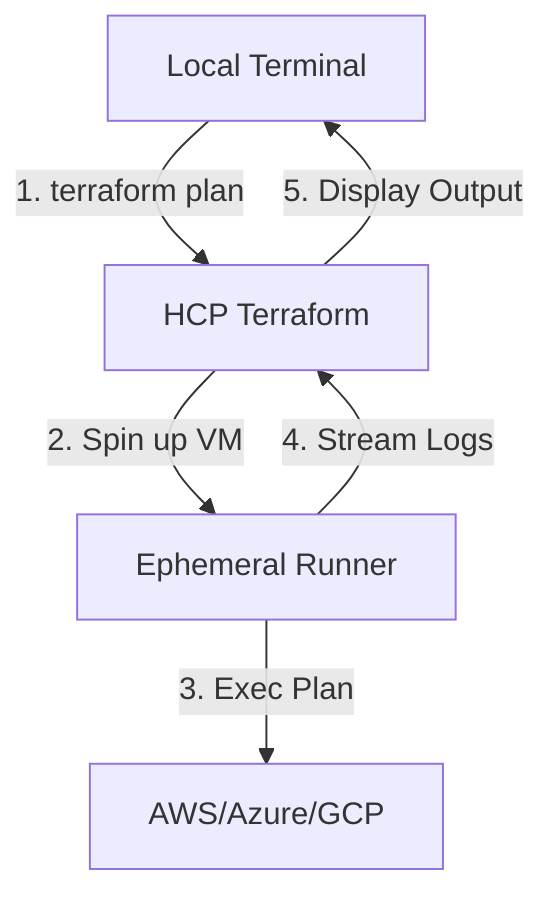

While the VCS-driven workflow is the standard for long-term GitOps, HCP Terraform provides the **CLI** and **API** workflows for maximum flexibility. These enable local development testing, emergency overrides, and full programmatic automation of the infrastructure platform itself.

---

## 💻 1. The CLI Workflow (Remote Execution)

The CLI workflow allows you to run Terraform commands from your local terminal (VS Code, bash, etc.) while offloading the actual execution to the **<font color="#92d050">Cloud Runners</font>**.

### Local Experience, Remote Execution
When you run a command like `terraform plan` on your laptop, the CLI doesn't talk to AWS/Azure directly. Instead:
1.  **Authentication**: The CLI uses the token stored in `~/.terraform.d/credentials.tfrc.json`.
2.  **Upload**: Your local directory (minus files in `.terraformignore`) is compressed and uploaded to TFC.
3.  **Runner Provisioning**: TFC spins up an ephemeral runner with the correct Terraform version.
4.  **Streaming**: The runner executes the plan and **streams the output** back to your terminal in real-time.



### The `cloud` Block vs. `remote` Backend
Modern Terraform uses the `cloud` block, which simplifies the configuration for both state storage and remote execution.
```hcl
terraform {
  cloud {
    organization = "my-awesome-org"
    workspaces {
      name = "app-frontend-dev"
    }
  }
}
```

**Why use this?**
- **Safe Testing**: Test your infrastructure changes against live remote state without committing "fix typo" mess to your Git history.
- **Consistent Execution**: Ensures that even local runs happen in a controlled, standard environment (Linux x64) rather than your varying local OS.

---

## 🤖 2. The API Workflow: Machine Automation

Every feature in the HCP Terraform UI is available via a REST API. This is the foundation for building **<font color="#ffc000">Self-Service Portals</font>** and custom automation.

### The API Upload Lifecycle
Unlike GitOps, where TFC pulls code, the API workflow requires you to **push** code:
1.  **Create Configuration Version**: Create an entry in TFC to receive code.
2.  **Upload Code**: Send a `.tar.gz` archive of your Terraform directory to the provided `upload-url`.
3.  **Trigger Run**: Create a "Run" object referencing that Configuration Version.

### The "Admin-as-Code" Pattern (TFE Provider)
Instead of calling URLs with `curl`, use the official `tfe` provider to manage HCP Terraform using itself!

```hcl
resource "tfe_workspace" "new" {
  name         = "automated-infra"
  organization = "my-org"
  tag_names    = ["prod", "pci-compliant"]
}

resource "tfe_variable" "region" {
  key          = "AWS_REGION"
  value        = "us-east-1"
  category     = "terraform"
  workspace_id = tfe_workspace.new.id
}
```

---

## 🏗️ 3. CI/CD Integration Patterns

When using external CI/CD tools (Jenkins, GitLab CI, GitHub Actions) *without* native TFC VCS integration, the CLI-driven workflow is the standard choice.

- **Authentication**: Inject `TF_TOKEN_app_terraform_io` as a secret environment variable in your CI agent.
- **Workflow**:
    1. `terraform init` (initializes remote backend).
    2. `terraform plan` (triggers remote plan).
    3. `terraform apply` (triggers remote apply).
- **Benefit**: You get the full power of your CI's custom logic (e.g., dynamic environment creation) while maintaining TFC's centralized state, locking, and policy enforcement.

---

## 🏗️ 4. Real-Life Scenarios

### Scenario 1: The "Dirty" Local Config
*   **The Problem**: A developer has custom local plugins and a peculiar Mac M2 architecture that makes their local plans different from the CI server.
*   **The Solution**: By using the **CLI Workflow**, the plan is executed on the TFC Linux runner. It doesn't matter what is installed on the developer's Mac; the plan is generated in the exact environment where it will be applied.
### Scenario 2: The Emergency "Nightly" Takedown
*   **The Problem**: A company spends $2,000/month on Sandboxes that are only used from 9 AM to 5 PM.
*   **The Solution**: A simple Python script running on a cron job calls the **TFC API** to trigger a `destroy` run at 6 PM and a `new-run` at 8 AM. Environment cost is slashed by 60%.
### Scenario 3: Bulk Encryption Upgrade
*   **The Problem**: Security needs to update the encryption key for 50 different AWS regions managed in 50 separate Workspaces.
*   **The Solution**: Instead of 50 manual clicks, an engineer writes a small script using the **HCP Terraform API** to swap the `KMS_KEY_ID` variable across all 50 workspaces in under a minute.

---

## ❓ 5. Interview Questions (Expert Deep Dive)

1.  **Where do local-exec provisioners run in a CLI-driven Remote Run?**
    <details>
    <summary>Show Answer</summary>
    They run on the **Remote Runner** (the VM in HCP Terraform), NOT on your local laptop. You must ensure the runner's environment has any necessary binaries (like `kubectl` or `aws cli`) installed, usually through Custom Runner Images or workspace agents.
    </details>

2.  **What is the purpose of the `.terraformignore` file?**
    <details>
    <summary>Show Answer</summary>
    It functions like `.gitignore`. It prevents specific local files (like large binaries or sensitive `.env` files) from being bundled and uploaded to the HCP Terraform runner during a CLI-driven plan.
    </details>

3.  **How do you authenticate a headless CI/CD server with the TFC API?**
    <details>
    <summary>Show Answer</summary>
    By injecting the `TF_TOKEN_app_terraform_io` environment variable containing a Team or Organization API token. This replaces the interactive `terraform login` flow.
    </details>

4.  **Can you use the "Local" execution mode but still have state in the Cloud?**
    <details>
    <summary>Show Answer</summary>
    Yes. Setting `execution_mode = "local"` means the Terraform binary runs on your laptop, but the state file is securely streamed to and from HCP Terraform. This is useful for using your local cloud credentials while maintaining a single remote source of truth for state.
    </details>

5.  **What is a "Configuration Version" in the API workflow?**
    <details>
    <summary>Show Answer</summary>
    It is the API object that represents a specific upload of your code. You create a configuration version, upload your `.tar.gz` to the provided `upload-url`, and then link a `run` to that version ID.
    </details>

---

## 🧠 6. Knowledge Check (Quiz)

### CLI & Environment
1.  **`terraform login` stores credentials in:**
    - [x] A local JSON file on your computer (`credentials.tfrc.json`).
    - [ ] Your Git repository.
2.  **In remote execution mode, your local environment variables:**
    - [ ] are automatically used by the cloud runner.
    - [x] **Are NOT used**; variables must be defined in the HCP Terraform Workspace.
3.  **The `cloud` block replaces which older block?**
    - [ ] `provider`.
    - [x] `backend "remote"`.
### API & Workflow
4.  **To trigger a run for a specific commit SHA via API, you use:**
    - [x] Configuration Versions.
    - [ ] Direct state injection.
5.  **Which provider manages HCP Terraform resources?**
    - [ ] `aws`.
    - [x] `tfe`.
6.  **Streaming logs in the CLI workflow means:**
    - [x] You see the remote runner's output in your local terminal window.
    - [ ] You have to wait for the run to finish to see the log file.

---

## 📖 7. Summary Checklist

✅ **CLI for Iteration**: Use the `cloud` block for rapid developer testing.
✅ **API for Platforms**: Use the REST API or `tfe` provider to build vending systems.
✅ **Ignore Files**: Always use `.terraformignore` to keep your uploads lightweight.
✅ **Execution Mode**: Choose `remote` for consistency or `local` for complex local-exec needs.
✅ **CI/CD Integration**: Use `TF_TOKEN` env vars instead of static config files for automation.

---
**Module Status**: ✅ Comprehensive Verified
**Last Updated**: 2026-01-08