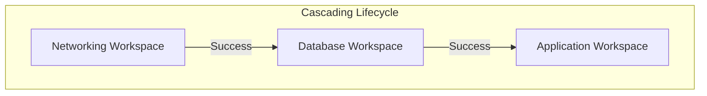

In HCP Terraform, a **Workspace** is significantly more than just a state file. It is a comprehensive **Management Hub** that encapsulates the state history, variable configuration, access controls, and full audit trail for a specific infrastructure environment.

---
## 🏗️ 1. Workspace Models & Project-Based Isolation
A professional HCP Terraform setup relies on the "Micro-Workspace" pattern. Instead of one giant workspace for "Production," you break infrastructure into logical layers.
### Projects: The Multi-Tenant Container
**Projects** serve as folders for workspaces. They allow you to:
- **Group Workspaces**: (e.g., "Payments-App", "Shared-Services").
- **Delegate Permissions**: Assign a team "Admin" rights to a Project, and they automatically inherit those rights for every workspace inside.
- **Isolate Blast Radius**: A policy applied to the "Dev" project won't interfere with the "Prod" project.

| Aspect | CLI Workspace (Local) | HCP Terraform Workspace |
| :--- | :--- | :--- |
| **Logic** | Just a named state file (`default`, `prod`). | A robust entity with VCS links, RBAC, and Audit logs. |
| **Secrets** | Managed in local `.tfvars` or shell. | Centralized, encrypted, and write-only in the UI. |
| **Audit Trail** | Limited to Git history. | Full history of WHO triggered WHAT run and WHEN. |
| **Execution** | Local binary (Divergent environments). | Remote Cloud Runners (Standardized environments). |

---
## 🔄 2. State Versioning: The Infrastructure Time Machine
HCP Terraform automatically preserves every version of your state file. This is crucial for **Auditing** and **Disaster Recovery**.
- **State Comparison**: The UI allows you to compare any two state versions. TFC highlights exactly which attributes changed, assisting in debugging why a resource was recreated.
- **Access Control**: You can restrict who can download the raw JSON state file (which may contain sensitive data) separate from who can trigger a plan.
- **Safety Locking**: TFC ensures that only one "Apply" run can happen at a time per workspace, preventing race conditions and state corruption.
**⚠️ Warning on Rollbacks:**
"Restoring" an old state version does **not** revert the cloud. It only reverts Terraform's *knowledge* of the cloud. To rollback, you must revert the code in Git and run a new Apply.

---
## ⛓️ 3. Run Triggers: Orchestrating the Lifecycle
Infrastructure is rarely a single stack. It is usually a chain of dependencies. HCP Terraform allows you to link workspaces using **Run Triggers**.

**Workflow Example**: 
When the Networking team updates a VPC CIDR and applies it, HCP Terraform automatically detects the success and queues a **Plan** in the Database and Application workspaces. This ensures that the downstream teams know immediately if the base network change breaks their compatibility.

---
## 🚀 4. Real-Life Scenarios

### Scenario 1: The "Ghost" State Recovery
*   **The Incident**: A maintenance script accidentally ran `terraform state rm` on all production resources locally, but didn't run `terraform destroy`. The infrastructure was live, but Terraform thought the state was empty.
*   **The HCP Solution**: The team simply browsed to the **States** tab, found the version from 10 minutes ago, and clicked **"Roll back to this version."**
*   **Outcome**: The state was restored instantly, and the "Micro-Management" nightmare of re-importing resources was avoided.
### Scenario 2: The "Shadow IT" Detection (Drift)
*   **The Incident**: A developer manually added an "Allow 0.0.0.0/0" rule to a production Security Group to fix a bug at 2 AM.
*   **The HCP Solution**: HCP Terraform's **Drift Detection** feature ran a nightly scheduled plan. It notified the security team that the state was out of sync with reality.
*   **Outcome**: The unauthorized rule was identified, and a new run was triggered to revert the security group back to the approved code-defined state.
### Scenario 3: The "State Locking" Deadlock
*   **The Incident**: An automated CI pipeline hung during a `terraform apply` because a runner VM crashed mid-execution. The workspace remained "Locked."
*   **The HCP Solution**: An administrator verified the runner was dead and used the **"Force Unlock"** feature in the UI.
*   **Outcome**: The pipeline was unblocked without having to manually patch binary state logs via the CLI.

---
## ❓ 5. Interview Questions (Expert Deep Dive)
1.  **What happens to the state file if a runner crashes midway through an apply?**
    

    
Show Answer

    HCP Terraform receives partial state updates. Every resource that was successfully finished *before* the crash is recorded in the next state version. The workspace remains "Locked" until an admin manually releases it or the process times out.
    

2.  **How do you migrate state from one HCP Terraform organization to another?**
    

    
Show Answer

    There is no "Move Workspace" button between Orgs. You must:
    1. Create a workspace in the new Org.
    2. Locally run `terraform init -migrate-state` pointing to the new backend configuration.
    3. Manually recreate any variables, variable sets, and permissions in the new Org.
    

3.  **Explain the difference between "Execution Mode" settings.**
    

    
Show Answer

    - **Remote**: All runs happen on HCP Terraform’s infrastructure.
    - **Local**: Runs happen on your laptop, but the state is saved to the Cloud.
    - **Agent**: Runs happen on your private servers (Inside VPC) but are orchestrated by the Cloud.
    

4.  **How do you prevent a Workspace from being accidentally deleted?**
    

    
Show Answer

    HCP Terraform provides a **"Deletion Protection"** toggle in the workspace settings. Additionally, fine-grained RBAC permissions should ensure only Organization Owners or specific "Managers" have the delete permission.
    

5.  **What is a "State Version Output" in the TFC UI?**
    

    
Show Answer

    It is a curated view in the UI that displays only the `output` values defined in your code for that specific state version. This allows non-technical users to find IPs, URLs, or IDs without parsing the raw JSON state file.
    

---

## 🧠 6. Knowledge Check (Quiz)

### Lifecycle & State
1.  **To view the raw JSON of a state file from 3 days ago, you look in:**
    - [ ] Settings.
    - [x] The **States** tab.
2.  **Does "Restoring an old state" delete resources in AWS?**
    - [ ] Yes.
    - [x] **No** (It only changes the state record).
3.  **Workspace labels/tags are used for:**
    - [x] Organizing and filtering large numbers of workspaces.
    - [ ] Deploying code.

### Interactivity & Triggers
4.  **A "Run Trigger" chain is activated by:**
    - [ ] A Plan failure.
    - [x] A successful **Apply** in the source workspace.
5.  **Force Unlocking a workspace is dangerous because:**
    - [x] It can lead to state corruption if a ghost process is still running and writing to state.
    - [ ] It deletes code.
6.  **"Auto-Apply" should generally be disabled for:**
    - [ ] Feature branches.
    - [x] **Production** environments.

---

## 📖 7. Summary & Best Practices
Workspaces are the **atomic unit of management** in the cloud.
**Best Practices:**
- ✅ **Layer your Workspaces**: Separate Network, DB, and App to reduce blast radius.
- ✅ **Enable Notifications**: Use Slack/Email webhooks for "Run Errored" events.
- ✅ **Tag your Workspaces**: Use tags like `prod`, `internal`, or `team-alpha` for easier discovery.
- ✅ **Regular Drift Checks**: Use scheduled runs to identify manual cloud changes.
- ✅ **RBAC strictly**: Not everyone needs "Manager" access; most only need "Read" or "Plan" access.

---
**Module Status**: ✅ Comprehensive Verified
**Last Updated**: 2026-01-08
