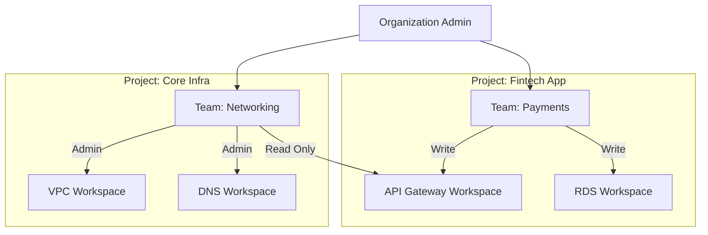

# Governance and RBAC

Scaling Infrastructure as Code from a single developer to a 100+ person engineering organization requires robust governance. HCP Terraform provides enterprise-grade **Role-Based Access Control (RBAC)** and project-based isolation to ensure that teams have exactly the permissions they need—and no more.

---

## 🏗️ 1. The Multi-Tenant Hierarchy

Permissions in HCP Terraform are hierarchical. They flow from the top-level Organization down through Projects to individual Workspaces.

### Key Components:
- **Organizations**: The top-level secure boundary for your company.
- **Projects**: Logical "folders" used to group related workspaces. RBAC is most efficient when applied at the Project level.
- **Teams**: Groups of users mapped to specific roles. **Never assign permissions to individuals**; always assign them to Teams.

---

## 🔐 2. Permission Levels & Granularity

HCP Terraform offers granular control over what a team can do within a workspace. These permissions are **additive**: if a user is in multiple teams with different access levels, they receive the **highest** level of access.

| Level | Capability | Typical User |
| :--- | :--- | :--- |
| **Read** | View plan outputs and state JSON. | Auditors, Junior Developers, Support. |
| **Plan** | Trigger speculative plans but NOT applies. | Developers testing code in PR branches. |
| **Write** | Trigger and approve applies; manage variables. | Tech Leads, SREs. |
| **Admin** | Full control over workspace settings & RBAC. | Platform Engineering Leads. |

### Project-Based Inheritance
By using **Projects**, you can grant a team "Write" access to 50 workspaces at once. This centralizes management and ensures that new workspaces automatically inherit corporate safety standards.

---

## 🏢 3. Enterprise Identity: SSO & SCIM

For large organizations, manual user management is a security risk. HCP Terraform integrates with modern Identity Providers (Okta, Azure AD, PingIdentity).

- **SAML SSO**: Users login using their corporate credentials. TFC session tokens are linked to their active IdP sessions.
- **Team Mapping**: Automatically map Active Directory groups (e.g., `AD-Group-DevOps`) directly to TFC Teams based on SAML assertions.
- **SCIM (Provisioning)**: 
    - **Automated Joiners**: When a user is added to an HR system group, their TFC account is created instantly.
    - **Zero-Latency Revocation**: The moment a user is disabled in the IdP, their TFC access, active sessions, and API tokens are revoked.

---

## 🚀 4. Real-Life Scenarios

### Scenario 1: The "Intern" Safety Net
*   **The Incident**: A new intern was learning Terraform and accidentally ran `terraform destroy` on the production billing workspace.
*   **The Fix**: Implemented **Project Isolation**. Interns are placed in a `Trial` team with "Admin" access to a Sandbox project, but only "Read" access to the Production project.
*   **Outcome**: The intern can learn without risking the company's uptime.

### Scenario 2: The Compliance Audit Trail
*   **The Incident**: A SOC2 audit required proof of **Separation of Duties**. They needed to see that the people writing the firewall code weren't the ones approving its deployment.
*   **The Fix**: Configured a "Security-Ops" team with `Write` (apply) permissions and a "Network-Dev" team with `Plan` permissions.
*   **Outcome**: Every deployment now requires a "double signature" (Git Merge approval + TFC Apply approval).

---

## ❓ 5. Interview Questions (Expert Deep Dive)

1.  **If a user is in two teams, one with "Read" and one with "Write" access to the same workspace, what is their effective permission?**
    

    
Show Answer

    The **highest (most permissive)** assignment wins. In this case, the user will have **Write** access. Permission sets in HCP Terraform are strictly additive.
    

2.  **What is the difference between an "Email Invitation" and "SSO Provisioning"?**
    

    
Show Answer

    Email invitations require manual account creation and confirmation. SSO provisioning (via SAML/SCIM) allows the user to simply click a tile in their dashboard (like Okta) and be instantly authenticated into the Org based on their corporate identity, without ever creating a separate password.
    

3.  **Explain "Team API Tokens" vs. "User API Tokens."**
    

    
Show Answer

    **User Tokens** are tied to an individual person. If that person leaves, the token is invalidated, breaking any automation they built. **Team Tokens** are persistent service accounts tied to the Team entity, making them the standard for CI/CD pipelines (Jenkins, GitHub Actions).
    

4.  **Can you restrict a team to ONLY be able to read state but not sensitive variables?**
    

    
Show Answer

    **Yes**. In the granular permission settings of a workspace, you can specifically disable "Manage Variables" while enabling "Read Runs" and "Read State." This is a common pattern for "State-Only" auditors.
    

5.  **How does "Just-in-Time" (JIT) provisioning work in TFC?**
    

    
Show Answer

    JIT provisioning creates a user's record in HCP Terraform the first time they successfully authenticate via SAML SSO. If Team Mapping is configured, they are also automatically placed into the correct Teams based on their directory group memberships.
    

---

## 🧠 6. Knowledge Check (Quiz)

### Hierarchy & Projects
1.  **The recommended level for assigning team permissions is:**
    - [ ] Workspace.
    - [x] **Project**.
2.  **Adding a workspace to a Project means it:**
    - [x] **Inherits the RBAC settings** of that Project.
    - [ ] Becomes public.
3.  **The highest level in the TFC organizational structure is:**
    - [ ] Project.
    - [x] **Organization**.

### Identity & Teams
4.  **SSO (Single Sign-On) in HCP Terraform primarily uses:**
    - [x] **SAML 2.0**.
    - [ ] Basic Auth.
5.  **Adding a user to the "Owners" team gives them:**
    - [ ] Access to all .tf files.
    - [x] **Full administrative control over the entire Organization**, including billing.
6.  **"Plan Only" access is ideal for:**
    - [x] **Developers testing PRs** who shouldn't have the power to deploy to Prod.
    - [ ] The CEO.

---

## 📖 7. Final Summary Checklist

✅ **Project-First RBAC**: Manage your teams at the Project level, not the Workspace level.
✅ **Least Privilege**: Default developers to "Plan" access; promote to "Write" for seniors only.
✅ **SSO Integration**: Connect Okta/Azure AD to automate the joiner/leaver/mover process.
✅ **SCIM Revocation**: Ensure SCIM is enabled to instantly kill access when a user leaves the company.
✅ **Service Accounts**: Use **Team Tokens** for all CI/CD pipelines to ensure long-term stability.

---
**Module Status**: ✅ Comprehensive Verified
**Last Updated**: 2026-01-08
