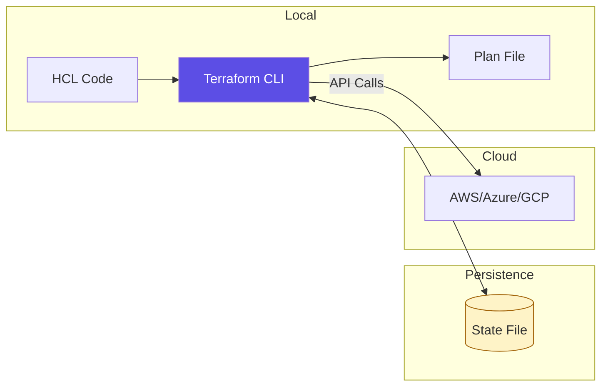

# 🏗️ IaC Foundations & Terraform Architecture

> **"If Terraform is the engine of modern infrastructure, the State File is the flight recorder. Without it, you are just running scripts; with it, you are managing reality."**

---

## 🧠 The Mental Model: The Desired Reality

**The Junior Struggle**: "I wrote a script to create a server, but when I ran it again, it tried to create a *second* server and failed! Why can't it just know the first one is already there?"

**The Engineer Solution**: Use **Declarative State**. You don't tell Terraform *how* to build; you tell it *what* should exist. Terraform then compares your code (The Desired State) against the reality (The Current State) and makes only the necessary changes to bridge the gap.

### 🏗️ The Infrastructure Analogy

Think of Terraform like a **Self-Driving Car**:

| Concept | Manual Car Analogy | Terraform Equivalent |
|:--------|:-------------------|:---------------------|
| **Code (HCL)** | The Destination GPS | `main.tf` |
| **State File** | The Current Location | `terraform.tfstate` |
| **Plan** | The Route Calculation | `terraform plan` |
| **Apply** | Driving to Dest | `terraform apply` |
| **Providers** | The Car's OS (Tesla/Ford) | AWS/Azure/GCP Provider |

---

## 📚 Why This Module Matters for Juniors

**Before this module**, you might think:
- "Terraform is just a fancy shell script"
- "I can just keep my state file on my laptop"
- "Modules are too complex for simple projects"

**After this module**, you'll understand:
- **HCL (HashiCorp Configuration Language)** is the universal language of the cloud.
- **Remote Backends** enable team collaboration without corruption.
- **Providers** decouple your code from specific cloud vendor APIs.
- **The Dependency Graph** allows Terraform to build things in the right order automatically.

**The Difference**: You stop "building" and start **"converging"** infrastructure.

---

## 🎯 Learning Objectives

By the end of this module, you will:

- ✅ **Master the Terraform Workflow**: Init, Plan, Apply, Destroy.
- ✅ **Understand the State Lifecycle**: Refreshing, Storing, and Locking.
- ✅ **Write Robust HCL**: Resources, Data Sources, and Variables.
- ✅ **Implement Remote Backends**: Moving beyond local testing.
- ✅ **Debug Drift**: Identifying changes made outside of Terraform.

---

## 🏗️ Core Architecture: How Terraform Works

Terraform is a binary that talks to Cloud APIs via **Providers**.

---

## 📂 Learning Path

1.  **[01-Fundamentals](./01-fundamentals)**: Providers, Resources, Variables, and the Data flow.
2.  **[02-State-Management](./02-state-management)**: The source of truth. Remote backends and Locking.
3.  **[03-Modules-and-Composition](./03-modules-and-composition)**: Building reusable components.
4.  **[04-Terraform-Cloud-and-GitOps](./04-terraform-cloud-and-gitops)**: Automating the pipeline.

---

## 🛠️ Production Scenarios

### 🛡️ Scenario: The "Orphaned Resource"
**Problem**: An engineer manually deleted a Security Group in the AWS Console.
**The Reality**: Terraform's state file says it still exists.
**The Fix**: Running `terraform apply`. Terraform "refreshes" its knowledge, sees the resource is missing, and immediately recreates it to match your code. This is **Self-Healing Infrastructure**.

### 🛡️ Scenario: The "Friday Afternoon" Mistake
**Problem**: You want to change the production database size, but you're nervous about the impact.
**The Fix**: `terraform plan`. It shows you *exactly* what will happen (e.g., "1 to change, 0 to add, 0 to destroy"). If it says "1 to destroy," you stop and investigate before it's too late.

---

## ❓ Interview Preparation (Terraform)

### 🎯 Core Concepts

1. **Q: What is the purpose of `terraform init`?**
    *   *Answer: It downloads the necessary Provider plugins and initializes the backend where the state file will be stored.*
2. **Q: Why is the state file so sensitive?**
    *   *Answer: It contains a mapping of your code to real IDs. If lost, Terraform cannot manage existing resources. It also often contains sensitive information in plain text.*
3. **Q: `terraform plan` vs `terraform apply`?**
    *   *Answer: Plan is a 'Dry Run' that shows what changes will be made. Apply executes those changes.*
4. **Q: What is a 'Provider' in Terraform?**
    *   *Answer: A plugin that acts as a translator between Terraform HCL and a specific API (like AWS, GitHub, or Kubernetes).*
5. **Q: How do you handle secrets (passwords) in Hataform?**
    *   *Answer: Never hardcode them. Use sensitive variables, environment variables (`TF_VAR_`), or fetch them from a secret manager (HashiCorp Vault / AWS Secrets Manager) via a Data Source.*

---

## 📝 Knowledge Check

1. **Which command detects if reality has drifted from your code?**
    * [ ] a) `terraform init`
    * [x] b) `terraform plan`
    * [ ] c) `terraform destroy`
2. **True or False: Terraform is an Imperative tool.**
    * [ ] a) True
    * [x] b) False (It is Declarative).
3. **What happens if you delete your state file?**
    * [ ] a) The resources are deleted from the cloud.
    * [x] b) Terraform loses track of existing resources and might try to recreate them.
    * [ ] c) Nothing, Terraform will rebuild it from the cloud automatically (Only if you import manually).
4. **Where should you store state for team collaboration?**
    * [ ] a) In the Git repository.
    * [x] b) In a remote backend with locking (S3/GCS/Terraform Cloud).
    * [ ] c) On a shared network drive without locking.

---

## 🔗 Next Steps

Now that you understand the "How," let's dive into the "What." Start with the core building blocks of infrastructure.

**Proceed to**: [Terraform Fundamentals →](readme.md)
