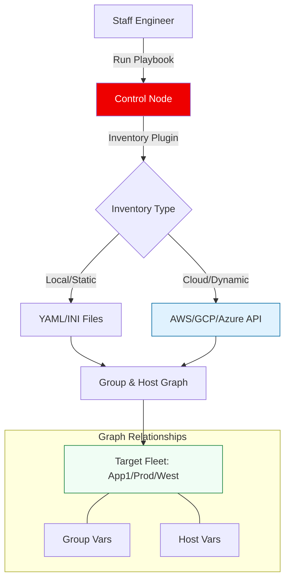

# 🗺️ Inventory Management: Mapping the Infrastructure Graph

> **"If a server exists but isn't in your inventory, it's a security risk. If it's in your inventory but doesn't exist, it's a noise generator. Mastery of the Inventory is mastery of Truth."**

Welcome to the **Inventory Management** module. In the Ansible world, the inventory is more than a list of IP addresses—it is a logical graph of your infrastructure. This module covers the transition from legacy static files to **API-driven Dynamic Discovery** and the hierarchical variable patterns required to manage thousands of nodes across multiple clouds.

---

## 🏗️ The Inventory Architecture

We move from brittle **Static INI** files to **Cloud-Native Plugins**.



---

## 🎭 Real-World DevOps Scenarios

### 🧱 Scenario: The "Black Friday" Autoscaling Gap
**The Incident:** An e-commerce company used a static `hosts.ini` file for their deployment jobs. During a Black Friday sale, AWS Auto Scaling added 20 new web instances to handle the surge.
**The Failure:** The deployment script only ran on the 10 original servers. The 20 new servers were running an unpatched version of the application, leading to 500 errors for 60% of users.
**The Fix:** Mandatory transition to **Dynamic Inventory Plugins**.
**The Result:** Ansible now queries the AWS EC2 API at the start of every job. Whether there are 10 servers or 1,000, Ansible automatically discovers and configures every node tagged with `Environment: Production`.

---

## 💻 DevOps Logic Snippets: "The Dynamic Config"

Always prefer plugins over scripts for modern cloud-native discovery.

```yaml
# 🚀 Standard: inventory_aws_ec2.yml
plugin: aws_ec2
regions:
  - us-east-1
  - us-west-2

# 🧪 Filter: Only target relevant resources
filters:
  tag:Environment: production
  instance-state-name: [running]

# 🏗️ Categorize: Group hosts by their cloud tags automatically
keyed_groups:
  - key: tags.Role
    prefix: role
  - key: placement.region
    prefix: region

# 🛡️ Guard Clause: Use the private IP for SSH inside the VPC
hostnames:
  - private-ip-address
```

---

## 🎙️ Interview Preparation (Inventory)

1.  **"What is the difference between a Static and a Dynamic Inventory?"**
    *   *Answer:* A static inventory is a hardcoded file (INI or YAML). A dynamic inventory uses a plugin or script to query an external source (like AWS, NetBox, or VMware) to get a real-time list of hosts.
2.  **"How do you handle 'Nested Groups' in a YAML inventory?"**
    *   *Answer:* Using the `children:` keyword. For example, a `datacenter` group can have `web` and `db` as children, allowing you to apply global variables to all hosts in that specific datacenter.
3.  **"What is an 'Inventory Plugin' and why is it better than the old 'Inventory Script'?"**
    *   *Answer:* Plugins are newer, faster, and integrated directly into Ansible's core. They handle caching better and use standard YAML configuration files instead of complex Python/Bash scripts.
4.  **"Explain the precedence of 'Group Vars' vs 'Host Vars'."**
    *   *Answer:* **Host Vars** always win. This follows the principle of "Specificity": the more specific the target (a single host), the higher the priority of its variables compared to a broad group.
5.  **"How can you restrict an Ansible run to only a subset of the inventory without changing the file?"**
    *   *Answer:* Using the `-l` or `--limit` flag (e.g., `ansible-playbook site.yml --limit webservers`). This is a critical safety measure for performing rolling updates or troubleshooting single nodes.

---

## 🧠 Knowledge Check

1.  **Which format is preferred for complex Ansible inventories?**
    *   [ ] INI
    *   [x] YAML
    *   [ ] CSV
2.  **What does the `inventory_hostname` variable represent?**
    *   [ ] The IP address of the server.
    *   [x] The name of the host as it appears in the inventory.
    *   [ ] The machine's serial number.
3.  **True or False: A single host can belong to multiple groups simultaneously.**
    *   [x] True
    *   [ ] False
4.  **Which command displays the current inventory structure in JSON format?**
    *   [ ] `ansible list-hosts`
    *   [x] `ansible-inventory --list`
    *   [ ] `cat /etc/ansible/hosts`
5.  **Which keyword is used to include one group's hosts inside another group?**
    *   [ ] `include:`
    *   [ ] `parents:`
    *   [x] `children:`

---

[⬅️ Back to Ansible Index](../readme.md) | [Next: Basic Playbooks](../03-basic-playbooks/readme.md) ➡️

---
## 🧭 Additional Modules
- [01 Static Inventory](01-static-inventory/readme.md)
- [02 Patterns and Targeting](02-patterns-and-targeting/readme.md)
- [03 Inventory Variables](03-inventory-variables/readme.md)
- [04 Dynamic Plugins](04-dynamic-plugins/readme.md)
