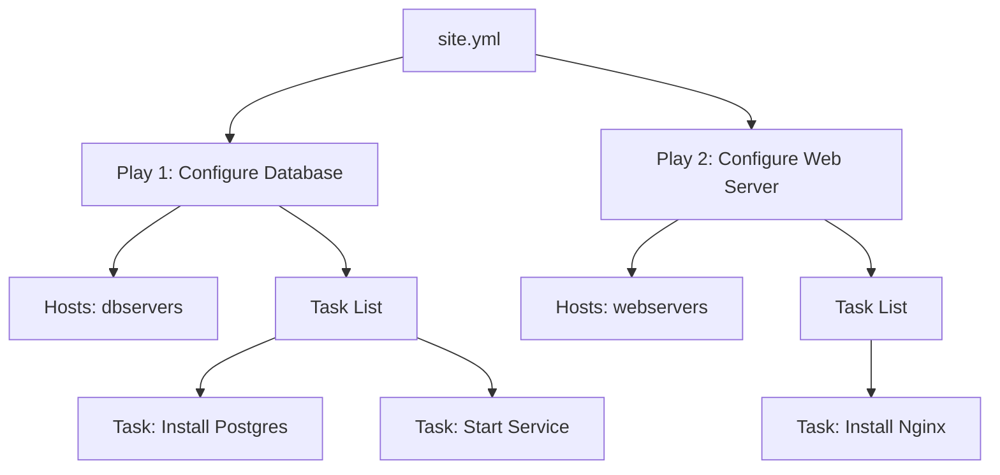

# 1. Playbook Structure

A **Playbook** is a YAML file used to deploy configurations. It is not just a script; it is a **Model** of your desired state.

## Anatomy of a Playbook
A Playbook is a list of **Plays**.
A **Play** maps a group of **Hosts** to a list of **Tasks**.



### The `site.yml` Standard
It is common to have a "Master Playbook" (usually `site.yml`) that orchestrates your entire infrastructure.

```yaml
---
# PLAY 1: Targets DB Servers
- name: Configure Database
  hosts: dbservers
  become: true
  tasks:
    - name: Install Postgres
      apt:
        name: postgresql
        state: present

# PLAY 2: Targets Web Servers
- name: Configure Webservers
  hosts: webservers
  become: true
  tasks:
    - name: Install Nginx
      apt:
        name: nginx
        state: present
```

## Privileges (`become`)
Ansible connects as your SSH user (e.g., `devops`). To install packages, you usually need `root`.
*   `become: true`: Activates privilege escalation (like `sudo`).
*   Can be set at the **Play** level (applies to all tasks) or the **Task** level (applies to one task).

## Real-Life Scenarios

### Scenario: "The Full Stack Deploy"
**Problem**: We had separate scripts for DB, API, and Frontend. Engineers had to run them manually in order.
**Solution**: Created a single `site.yml`.
*   Play 1: DB (Install & Create User).
*   Play 2: API (Install Java & Config).
*   Play 3: Frontend (Install Nginx & Proxy).
*   Result: One command (`ansible-playbook site.yml`) creates the whole stack.

## ❓ Interview Questions

1.  **Can a Playbook have multiple Plays?**
    *   **Answer**: Yes. This is how you target different host groups in the same run.

2.  **What is the difference between `hosts: all` and `hosts: localhost`?**
    *   **Answer**: `all` targets every server in your inventory. `localhost` targets the Control Node itself (no SSH).

## 🧠 Quiz

1.  **A Play maps Hosts to:**
    *   [x] Tasks.
    *   [ ] Modules.

2.  **To run a task as root:**
    *   [x] `become: true`.
    *   [ ] `user: root`.

3.  **If you have 2 Plays for the same host group:**
    *   [x] They run sequentially (First Play finishes, then Second Play starts).
    *   [ ] They run in parallel.