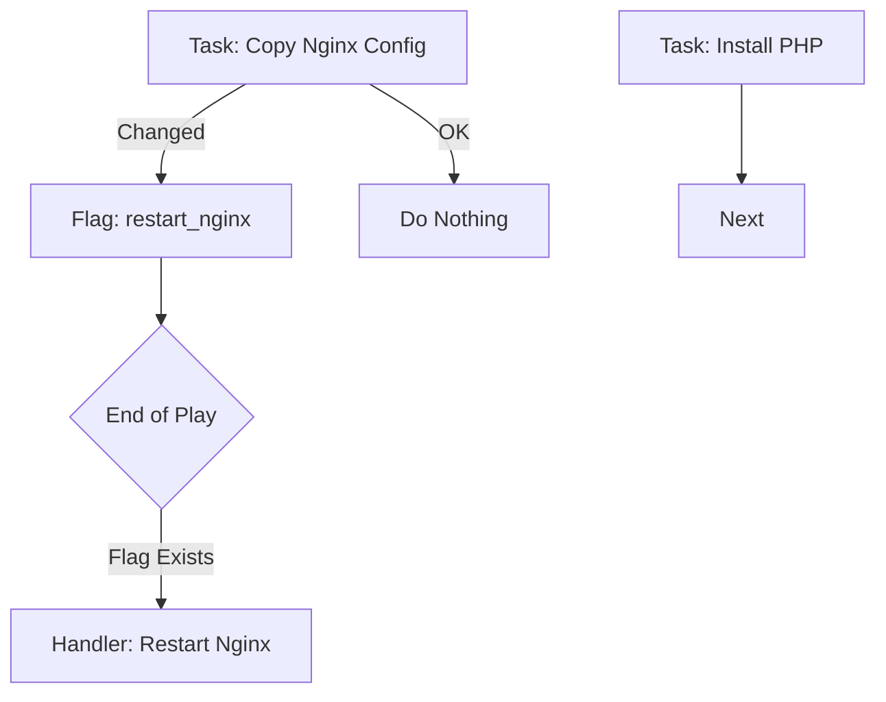

# 3. Task Execution Flow

Ansible executes tasks **Sequentially** (Top to Bottom). It is **Declarative**: you describe the *end state*, not the steps to get there.

## Idempotency
An operation is **Idempotent** if running it multiple times yields the same result.
*   **Bad (Not Idempotent)**: `echo "line" >> file.txt`. Running it twice adds the line twice.
*   **Good (Idempotent)**: `lineinfile` ensuring "line" exists. Running it twice does nothing the second time.

### Status Codes
*   **Green (OK)**: Desired state matches actual state. No Change.
*   **Yellow (Changed)**: Desired state did not match. Ansible fixed it.
*   **Red (Failed)**: Something went wrong. Execution stops.

## Handlers (Event-Driven Tasks)
Handlers are special tasks that run **only if notified**.
Ideal for restarting services when config changes.



```yaml
tasks:
  - name: Copy Config
    copy:
      src: nginx.conf
      dest: /etc/nginx/nginx.conf
    notify: restart_nginx

handlers:
  - name: restart_nginx
    service: name=nginx state=restarted
```

## Real-Life Scenarios

### Scenario: "The Restart Loop"
**Problem**: A script `service nginx restart` ran every time the deployment happened, causing a 10-second downtime.
**Solution**: Moved it to a Handler.
*   Now, Nginx ONLY restarts if the config file actually changed. Zero downtime on routine runs.

## ❓ Interview Questions

1.  **When do Handlers run?**
    *   **Answer**: By default, at the very end of the Play.

2.  **If a task fails before the handler runs, does the handler run?**
    *   **Answer**: No. If the playbook crashes, handlers are skipped. (Unless you set `force_handlers: True`).

## 🧠 Quiz

1.  **If a task result is "Green" (OK):**
    *   [x] It made no changes.
    *   [ ] It successfully changed something.

2.  **Handlers are usually used for:**
    *   [x] Restarting services.
    *   [ ] Installing packages.

3.  **Idempotency means:**
    *   [x] Running twice is safe.
    *   [ ] Running fast.