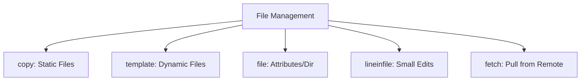

# 01. File Management Modules

Managing files, directories, and their permissions is the most common task in automation. Ansible provides several core modules to handle these needs efficiently and idempotently.

## Core Modules Overview



### 1. `copy` - Static File Transfer
Used to push a local file to the remote system.
```yaml
- name: Copy static config
  copy:
    src: files/nginx.conf
    dest: /etc/nginx/nginx.conf
    owner: root
    group: root
    mode: '0644'
```

### 2. `template` - Dynamic Configuration
Uses the **Jinja2** engine to inject variables into files (usually ending in `.j2`).
```yaml
- name: Deploy dynamic vhost
  template:
    src: templates/vhost.conf.j2
    dest: /etc/nginx/sites-available/{{ site_name }}.conf
```

### 3. `file` - Permissions and Links
Manages file/directory state, owner, group and permissions.
```yaml
- name: Create symlink
  file:
    src: /etc/nginx/sites-available/mysite.conf
    dest: /etc/nginx/sites-enabled/mysite.conf
    state: link
```

### 4. `lineinfile` - Precision Edits
Ensures a specific line is present or absent in a file.
```yaml
- name: Set timezone in PHP config
  lineinfile:
    path: /etc/php/7.4/fpm/php.ini
    regexp: '^date.timezone ='
    line: 'date.timezone = UTC'
```

---

## Real-Life Scenarios

### Scenario 1: "The SSH Hardening"
**Problem**: A security audit required `PermitRootLogin no` across 200 servers. Hand-editing was error-prone.
**Solution**: Used `lineinfile` with a regex to find the parameter regardless of its current value or if it was commented out, ensuring it exists as intended.

### Scenario 2: "Dynamic Nginx Clustering"
**Problem**: Managing 50 Nginx load balancers where each points to a unique set of backend IPs.
**Solution**: Used the `template` module. The backend IPs were stored as variables, and Jinja2 loops generated the correct `upstream` blocks automatically.

### Scenario 3: "Log Collection"
**Problem**: An application crashed, and logs were scattered across 10 nodes.
**Solution**: Used the `fetch` module to pull logs from all nodes into a centralized debugging folder on the Control Node.

---

## ❓ Interview Questions

1. **What is the difference between `copy` and `template`?**
    - `copy` is for verbatim files; `template` allows variable substitution using Jinja2.
2. **How do you ensure a directory is deleted?**
    - Use the `file` module with `state: absent`.
3. **What does `force: no` do in the `copy` module?**
    - It prevents overwriting the file if it already exists on the remote node.

---

## 🧠 Quiz

1. **Which module is used to create a directory?**
    - [x] `file`
    - [ ] `directory`
2. **Valid permission mode format for `file` module:**
    - [x] `'0644'`
    - [ ] `644` (Risky, might be interpreted as decimal)
3. **`fetch` module works in which direction?**
    - [x] Remote to Control Node
    - [ ] Control Node to Remote